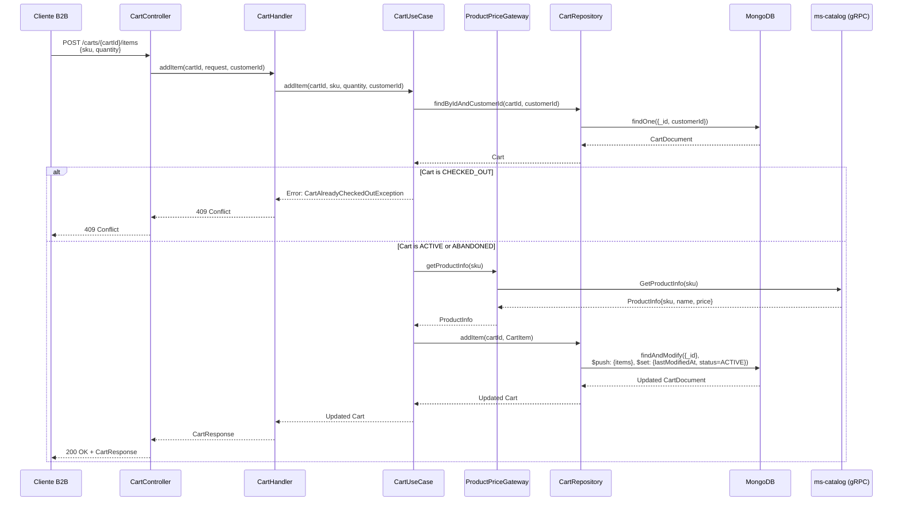
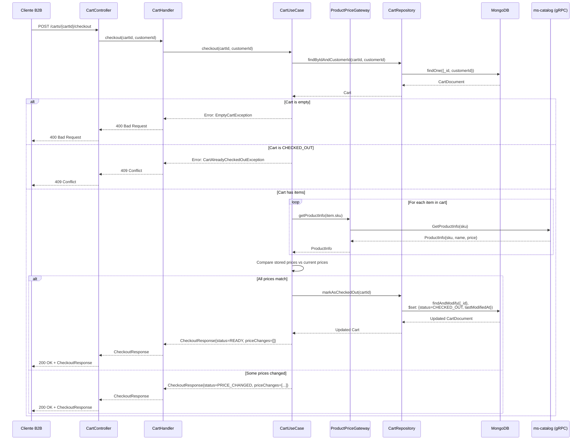
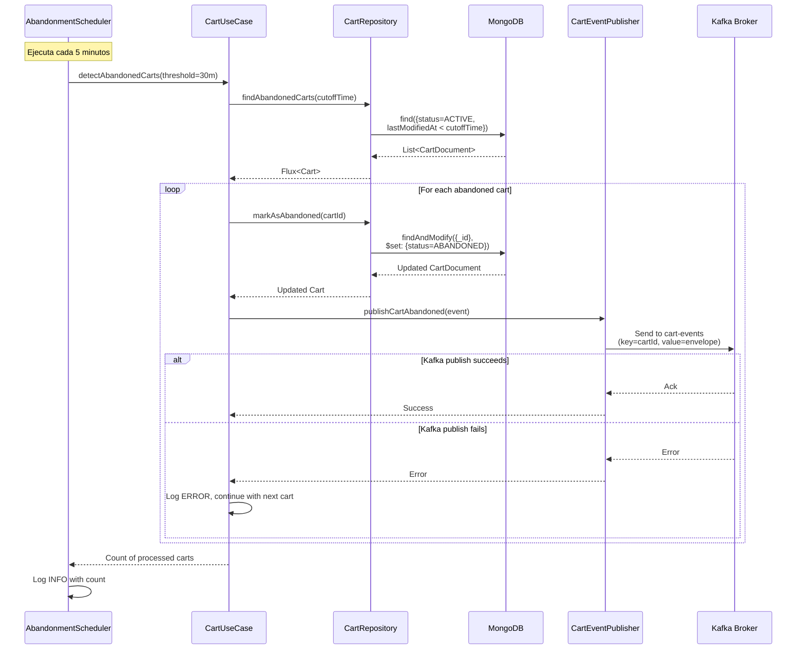

# Documento de Diseño — ms-cart

## Resumen Ejecutivo

El microservicio `ms-cart` gestiona carritos de compra temporales para clientes B2B en la plataforma Arka. Implementa operaciones CRUD sobre carritos almacenados en MongoDB, validación de precios en tiempo real consultando a `ms-catalog` vía gRPC durante el checkout, y detección automática de carritos abandonados mediante un scheduler periódico que publica eventos a Kafka. Este servicio es parte de la Fase 2 de entrega y resuelve el problema de pérdida de ventas por abandono de carritos mediante analítica proactiva.

**Tecnologías clave:**
- MongoDB con Reactive Mongo Drivers para almacenamiento de documentos
- Spring WebFlux para endpoints REST reactivos
- gRPC client para consultar precios a ms-catalog
- Kafka producer (reactor-kafka) para publicar eventos de abandono
- Scheduler con `@Scheduled` para detección automática de abandono

**Decisiones arquitectónicas principales:**
- MongoDB como base de datos (documentos flexibles, mutaciones atómicas con operadores `$push/$pull/$set`)
- NO usar Outbox Pattern (MongoDB garantiza atomicidad de operaciones individuales, eventos de abandono son idempotentes)
- gRPC síncrono para validación de precios en checkout (requisito de negocio: precios actualizados en tiempo real)
- Scheduler periódico con configuración externalizada en YAML (intervalos y umbrales ajustables sin recompilación)

---

## Arquitectura

### Visión General

```mermaid
graph TB
    subgraph "Entry Points"
        REST[CartController<br/>@RestController]
        SCHED[AbandonmentScheduler<br/>@Scheduled]
    end
    
    subgraph "Domain Layer"
        UC[CartUseCase]
        MODEL[Cart Entity<br/>CartItem VO<br/>CartStatus Enum]
        PORTS[CartRepository Port<br/>ProductPriceGateway Port<br/>CartEventPublisher Port]
    end
    
    subgraph "Driven Adapters"
        MONGO[MongoCartAdapter<br/>ReactiveMongoTemplate]
        GRPC[GrpcProductPriceAdapter<br/>CatalogServiceGrpc]
        KAFKA[KafkaCartEventPublisher<br/>KafkaSender]
    end
    
    subgraph "External Systems"
        MONGODB[(MongoDB<br/>carts collection)]
        CATALOG[ms-catalog<br/>gRPC Server]
        KAFKABROKER[Kafka<br/>cart-events topic]
    end

    REST --> UC
    SCHED --> UC
    UC --> PORTS
    PORTS --> MONGO
    PORTS --> GRPC
    PORTS --> KAFKA
    MONGO --> MONGODB
    GRPC --> CATALOG
    KAFKA --> KAFKABROKER
```

### Flujo de Datos Principal

**Flujo 1: Agregar Item al Carrito**
1. Cliente B2B envía `POST /carts/{cartId}/items` con `{sku, quantity}`
2. `CartController` valida request con Bean Validation
3. `CartHandler` invoca `CartUseCase.addItem(cartId, sku, quantity, customerId)`
4. `CartUseCase` consulta precio y nombre del producto a `ProductPriceGateway` (gRPC a ms-catalog)
5. `CartUseCase` agrega item al carrito usando `CartRepository.addItem()` con operador `$push` de MongoDB
6. Si el SKU ya existe, incrementa quantity con operador `$inc` en lugar de duplicar
7. Actualiza `lastModifiedAt` a NOW() con mutación atómica
8. Retorna `Mono<Cart>` con el carrito actualizado

**Flujo 2: Checkout con Validación de Precios**
1. Cliente B2B envía `POST /carts/{cartId}/checkout`
2. `CartUseCase` obtiene el carrito de MongoDB
3. Para cada item del carrito, consulta precio actual a `ProductPriceGateway` (gRPC a ms-catalog)
4. Compara `unitPrice` almacenado vs precio actual retornado por gRPC
5. Si todos los precios coinciden: marca carrito como `CHECKED_OUT` y retorna `CheckoutResponse` con `status=READY`
6. Si hay diferencias de precio: retorna `CheckoutResponse` con `status=PRICE_CHANGED` y lista de cambios, SIN marcar como `CHECKED_OUT`
7. Cliente debe confirmar explícitamente si acepta los nuevos precios

**Flujo 3: Detección de Carritos Abandonados**
1. `AbandonmentScheduler` se ejecuta cada 5 minutos (configurable)
2. Consulta MongoDB: carritos con `status=ACTIVE` y `lastModifiedAt < NOW() - 30 minutos` (umbral configurable)
3. Para cada carrito abandonado:
   - Marca status como `ABANDONED` con actualización atómica
   - Publica evento `CartAbandoned` a Kafka con cartId como partition key
   - Continúa con siguiente carrito si falla publicación (log ERROR, reintento en próximo ciclo)
4. Registra log INFO con cantidad de carritos procesados

---

## Componentes y Interfaces

### Domain Layer

#### Entidades y Value Objects

**Cart (Entity — Record)**
```java
@Builder(toBuilder = true)
public record Cart(
    UUID cartId,
    String customerId,
    List<CartItem> items,
    CartStatus status,
    Instant createdAt,
    Instant lastModifiedAt
) {
    // Compact constructor con validación
    public Cart {
        Objects.requireNonNull(customerId, "customerId cannot be null");
        Objects.requireNonNull(status, "status cannot be null");
        Objects.requireNonNull(createdAt, "createdAt cannot be null");
        Objects.requireNonNull(lastModifiedAt, "lastModifiedAt cannot be null");
        items = items != null ? List.copyOf(items) : List.of();
    }
    
    public boolean isEmpty() {
        return items.isEmpty();
    }
    
    public boolean isCheckedOut() {
        return status == CartStatus.CHECKED_OUT;
    }
    
    public boolean isAbandoned() {
        return status == CartStatus.ABANDONED;
    }
    
    public BigDecimal calculateTotal() {
        return items.stream()
            .map(item -> item.unitPrice().multiply(BigDecimal.valueOf(item.quantity())))
            .reduce(BigDecimal.ZERO, BigDecimal::add);
    }
}
```

**CartItem (Value Object — Record)**
```java
@Builder
public record CartItem(
    String sku,
    String productName,
    int quantity,
    BigDecimal unitPrice,
    Instant addedAt
) {
    public CartItem {
        Objects.requireNonNull(sku, "sku cannot be null");
        Objects.requireNonNull(productName, "productName cannot be null");
        Objects.requireNonNull(unitPrice, "unitPrice cannot be null");
        Objects.requireNonNull(addedAt, "addedAt cannot be null");
        if (quantity <= 0) {
            throw new IllegalArgumentException("quantity must be positive");
        }
        if (unitPrice.compareTo(BigDecimal.ZERO) < 0) {
            throw new IllegalArgumentException("unitPrice cannot be negative");
        }
    }
}
```

**CartStatus (Enum)**
```java
public enum CartStatus {
    ACTIVE,      // Carrito en uso
    ABANDONED,   // Detectado como abandonado por inactividad
    CHECKED_OUT  // Procesado en checkout, inmutable
}
```

#### Ports (Gateway Interfaces)

**CartRepository**
```java
public interface CartRepository {
    Mono<Cart> save(Cart cart);
    Mono<Cart> findById(UUID cartId);
    Mono<Cart> findByIdAndCustomerId(UUID cartId, String customerId);
    Flux<Cart> findByCustomerId(String customerId);
    Flux<Cart> findByCustomerIdAndStatus(String customerId, CartStatus status);
    Mono<Cart> addItem(UUID cartId, CartItem item);
    Mono<Cart> updateItemQuantity(UUID cartId, String sku, int newQuantity);
    Mono<Cart> removeItem(UUID cartId, String sku);
    Mono<Cart> clearItems(UUID cartId);
    Mono<Void> deleteById(UUID cartId);
    Mono<Cart> markAsCheckedOut(UUID cartId);
    Flux<Cart> findAbandonedCarts(Instant threshold);
    Mono<Cart> markAsAbandoned(UUID cartId);
}
```

**ProductPriceGateway**
```java
public interface ProductPriceGateway {
    Mono<ProductInfo> getProductInfo(String sku);
}

@Builder
public record ProductInfo(
    String sku,
    String name,
    BigDecimal price
) {}
```

**CartEventPublisher**
```java
public interface CartEventPublisher {
    Mono<Void> publishCartAbandoned(CartAbandonedEvent event);
}

@Builder
public record CartAbandonedEvent(
    UUID cartId,
    String customerId,
    int itemCount,
    BigDecimal totalAmount,
    Instant abandonedAt,
    Instant lastModifiedAt
) {}
```


#### Use Cases

**CartUseCase**
```java
@RequiredArgsConstructor
public class CartUseCase {
    private final CartRepository cartRepository;
    private final ProductPriceGateway productPriceGateway;
    private final CartEventPublisher cartEventPublisher;
    
    // Requisito 1: Crear carrito vacío
    public Mono<Cart> createCart(String customerId) {
        Cart cart = Cart.builder()
            .cartId(null) // MongoDB generará el ID
            .customerId(customerId)
            .items(List.of())
            .status(CartStatus.ACTIVE)
            .createdAt(Instant.now())
            .lastModifiedAt(Instant.now())
            .build();
        return cartRepository.save(cart);
    }
    
    // Requisito 2: Consultar carrito por ID
    public Mono<Cart> getCart(UUID cartId, String customerId, boolean isAdmin) {
        if (isAdmin) {
            return cartRepository.findById(cartId)
                .switchIfEmpty(Mono.error(new CartNotFoundException(cartId)));
        }
        return cartRepository.findByIdAndCustomerId(cartId, customerId)
            .switchIfEmpty(Mono.error(new CartNotFoundException(cartId)));
    }
    
    // Requisito 3: Agregar item al carrito
    public Mono<Cart> addItem(UUID cartId, String sku, int quantity, String customerId) {
        return cartRepository.findByIdAndCustomerId(cartId, customerId)
            .switchIfEmpty(Mono.error(new CartNotFoundException(cartId)))
            .flatMap(cart -> {
                if (cart.isCheckedOut()) {
                    return Mono.error(new CartAlreadyCheckedOutException(cartId));
                }
                // Si está abandonado, permitir agregar y cambiar a ACTIVE
                return productPriceGateway.getProductInfo(sku)
                    .switchIfEmpty(Mono.error(new ProductNotFoundException(sku)))
                    .flatMap(productInfo -> {
                        CartItem newItem = CartItem.builder()
                            .sku(sku)
                            .productName(productInfo.name())
                            .quantity(quantity)
                            .unitPrice(productInfo.price())
                            .addedAt(Instant.now())
                            .build();
                        return cartRepository.addItem(cartId, newItem);
                    });
            });
    }
    
    // Requisito 4: Eliminar item del carrito
    public Mono<Cart> removeItem(UUID cartId, String sku, String customerId) {
        return cartRepository.findByIdAndCustomerId(cartId, customerId)
            .switchIfEmpty(Mono.error(new CartNotFoundException(cartId)))
            .flatMap(cart -> {
                if (cart.isCheckedOut()) {
                    return Mono.error(new CartAlreadyCheckedOutException(cartId));
                }
                boolean itemExists = cart.items().stream()
                    .anyMatch(item -> item.sku().equals(sku));
                if (!itemExists) {
                    return Mono.error(new CartItemNotFoundException(sku));
                }
                return cartRepository.removeItem(cartId, sku);
            });
    }
    
    // Requisito 5: Actualizar cantidad de item
    public Mono<Cart> updateItemQuantity(UUID cartId, String sku, int newQuantity, String customerId) {
        return cartRepository.findByIdAndCustomerId(cartId, customerId)
            .switchIfEmpty(Mono.error(new CartNotFoundException(cartId)))
            .flatMap(cart -> {
                if (cart.isCheckedOut()) {
                    return Mono.error(new CartAlreadyCheckedOutException(cartId));
                }
                boolean itemExists = cart.items().stream()
                    .anyMatch(item -> item.sku().equals(sku));
                if (!itemExists) {
                    return Mono.error(new CartItemNotFoundException(sku));
                }
                return cartRepository.updateItemQuantity(cartId, sku, newQuantity);
            });
    }
    
    // Requisito 6: Vaciar carrito
    public Mono<Cart> clearCart(UUID cartId, String customerId) {
        return cartRepository.findByIdAndCustomerId(cartId, customerId)
            .switchIfEmpty(Mono.error(new CartNotFoundException(cartId)))
            .flatMap(cart -> {
                if (cart.isCheckedOut()) {
                    return Mono.error(new CartAlreadyCheckedOutException(cartId));
                }
                return cartRepository.clearItems(cartId);
            });
    }
    
    // Requisito 7: Eliminar carrito
    public Mono<Void> deleteCart(UUID cartId, String customerId, boolean isAdmin) {
        Mono<Cart> cartMono = isAdmin
            ? cartRepository.findById(cartId)
            : cartRepository.findByIdAndCustomerId(cartId, customerId);
        
        return cartMono
            .switchIfEmpty(Mono.error(new CartNotFoundException(cartId)))
            .flatMap(cart -> cartRepository.deleteById(cartId));
    }
    
    // Requisito 8: Checkout con validación de precios
    public Mono<CheckoutResponse> checkout(UUID cartId, String customerId) {
        return cartRepository.findByIdAndCustomerId(cartId, customerId)
            .switchIfEmpty(Mono.error(new CartNotFoundException(cartId)))
            .flatMap(cart -> {
                if (cart.isEmpty()) {
                    return Mono.error(new EmptyCartException(cartId));
                }
                if (cart.isCheckedOut()) {
                    return Mono.error(new CartAlreadyCheckedOutException(cartId));
                }
                
                // Consultar precios actuales de todos los items
                return Flux.fromIterable(cart.items())
                    .flatMap(item -> productPriceGateway.getProductInfo(item.sku())
                        .map(productInfo -> new PriceComparison(item, productInfo)))
                    .collectList()
                    .flatMap(comparisons -> buildCheckoutResponse(cart, comparisons));
            });
    }
    
    private Mono<CheckoutResponse> buildCheckoutResponse(Cart cart, List<PriceComparison> comparisons) {
        List<PriceChange> priceChanges = comparisons.stream()
            .filter(comp -> !comp.item().unitPrice().equals(comp.productInfo().price()))
            .map(comp -> new PriceChange(
                comp.item().sku(),
                comp.item().unitPrice(),
                comp.productInfo().price()
            ))
            .toList();
        
        BigDecimal totalAmount = comparisons.stream()
            .map(comp -> comp.productInfo().price().multiply(BigDecimal.valueOf(comp.item().quantity())))
            .reduce(BigDecimal.ZERO, BigDecimal::add);
        
        if (priceChanges.isEmpty()) {
            // Precios coinciden, marcar como CHECKED_OUT
            return cartRepository.markAsCheckedOut(cart.cartId())
                .map(updatedCart -> CheckoutResponse.builder()
                    .cartId(cart.cartId())
                    .priceChanges(List.of())
                    .totalAmount(totalAmount)
                    .status(CheckoutStatus.READY)
                    .build());
        } else {
            // Hay cambios de precio, NO marcar como CHECKED_OUT
            return Mono.just(CheckoutResponse.builder()
                .cartId(cart.cartId())
                .priceChanges(priceChanges)
                .totalAmount(totalAmount)
                .status(CheckoutStatus.PRICE_CHANGED)
                .build());
        }
    }
    
    // Requisito 9: Detectar carritos abandonados
    public Mono<Integer> detectAbandonedCarts(Duration threshold) {
        Instant cutoffTime = Instant.now().minus(threshold);
        return cartRepository.findAbandonedCarts(cutoffTime)
            .flatMap(cart -> markAndPublishAbandonment(cart)
                .onErrorResume(error -> {
                    // Log error pero continuar con siguiente carrito
                    return Mono.empty();
                }))
            .count()
            .map(Long::intValue);
    }
    
    private Mono<Void> markAndPublishAbandonment(Cart cart) {
        return cartRepository.markAsAbandoned(cart.cartId())
            .flatMap(updatedCart -> {
                CartAbandonedEvent event = CartAbandonedEvent.builder()
                    .cartId(updatedCart.cartId())
                    .customerId(updatedCart.customerId())
                    .itemCount(updatedCart.items().size())
                    .totalAmount(updatedCart.calculateTotal())
                    .abandonedAt(Instant.now())
                    .lastModifiedAt(updatedCart.lastModifiedAt())
                    .build();
                return cartEventPublisher.publishCartAbandoned(event);
            });
    }
    
    // Requisito 14: Consultar carritos por customerId
    public Flux<Cart> getCartsByCustomer(String customerId, CartStatus status, boolean isAdmin) {
        if (!isAdmin) {
            // CUSTOMER solo puede ver sus propios carritos
            if (status != null) {
                return cartRepository.findByCustomerIdAndStatus(customerId, status);
            }
            return cartRepository.findByCustomerId(customerId);
        }
        // ADMIN puede ver cualquier customerId
        if (status != null) {
            return cartRepository.findByCustomerIdAndStatus(customerId, status);
        }
        return cartRepository.findByCustomerId(customerId);
    }
}

// Records auxiliares
record PriceComparison(CartItem item, ProductInfo productInfo) {}

@Builder
public record CheckoutResponse(
    UUID cartId,
    List<PriceChange> priceChanges,
    BigDecimal totalAmount,
    CheckoutStatus status
) {}

@Builder
public record PriceChange(
    String sku,
    BigDecimal oldPrice,
    BigDecimal newPrice
) {}

public enum CheckoutStatus {
    READY,          // Sin cambios de precio, listo para crear orden
    PRICE_CHANGED   // Hay cambios de precio, requiere confirmación del cliente
}
```


#### Domain Exceptions

```java
public abstract class DomainException extends RuntimeException {
    public abstract int getHttpStatus();
    public abstract String getCode();
}

public class CartNotFoundException extends DomainException {
    private final UUID cartId;
    
    public CartNotFoundException(UUID cartId) {
        super("Cart not found: " + cartId);
        this.cartId = cartId;
    }
    
    @Override
    public int getHttpStatus() { return 404; }
    
    @Override
    public String getCode() { return "CART_NOT_FOUND"; }
}

public class CartAlreadyCheckedOutException extends DomainException {
    private final UUID cartId;
    
    public CartAlreadyCheckedOutException(UUID cartId) {
        super("Cart already checked out: " + cartId);
        this.cartId = cartId;
    }
    
    @Override
    public int getHttpStatus() { return 409; }
    
    @Override
    public String getCode() { return "CART_ALREADY_CHECKED_OUT"; }
}

public class ProductNotFoundException extends DomainException {
    private final String sku;
    
    public ProductNotFoundException(String sku) {
        super("Product not found: " + sku);
        this.sku = sku;
    }
    
    @Override
    public int getHttpStatus() { return 404; }
    
    @Override
    public String getCode() { return "PRODUCT_NOT_FOUND"; }
}

public class CartItemNotFoundException extends DomainException {
    private final String sku;
    
    public CartItemNotFoundException(String sku) {
        super("Cart item not found: " + sku);
        this.sku = sku;
    }
    
    @Override
    public int getHttpStatus() { return 404; }
    
    @Override
    public String getCode() { return "CART_ITEM_NOT_FOUND"; }
}

public class EmptyCartException extends DomainException {
    private final UUID cartId;
    
    public EmptyCartException(UUID cartId) {
        super("Cannot checkout empty cart: " + cartId);
        this.cartId = cartId;
    }
    
    @Override
    public int getHttpStatus() { return 400; }
    
    @Override
    public String getCode() { return "EMPTY_CART"; }
}

public class CatalogServiceUnavailableException extends DomainException {
    public CatalogServiceUnavailableException(Throwable cause) {
        super("Catalog service is unavailable", cause);
    }
    
    @Override
    public int getHttpStatus() { return 503; }
    
    @Override
    public String getCode() { return "CATALOG_SERVICE_UNAVAILABLE"; }
}
```

---

### Infrastructure Layer

#### Driven Adapters

**MongoCartAdapter (CartRepository Implementation)**

Ubicación: `infrastructure/driven-adapters/mongo-repository/`

```java
@RequiredArgsConstructor
public class MongoCartAdapter implements CartRepository {
    private final ReactiveMongoTemplate mongoTemplate;
    
    @Override
    public Mono<Cart> save(Cart cart) {
        CartDocument doc = CartMapper.toDocument(cart);
        return mongoTemplate.save(doc)
            .map(CartMapper::toDomain);
    }
    
    @Override
    public Mono<Cart> findById(UUID cartId) {
        return mongoTemplate.findById(cartId, CartDocument.class)
            .map(CartMapper::toDomain);
    }
    
    @Override
    public Mono<Cart> findByIdAndCustomerId(UUID cartId, String customerId) {
        Query query = Query.query(
            Criteria.where("_id").is(cartId)
                .and("customerId").is(customerId)
        );
        return mongoTemplate.findOne(query, CartDocument.class)
            .map(CartMapper::toDomain);
    }
    
    @Override
    public Flux<Cart> findByCustomerId(String customerId) {
        Query query = Query.query(Criteria.where("customerId").is(customerId))
            .with(Sort.by(Sort.Direction.DESC, "lastModifiedAt"));
        return mongoTemplate.find(query, CartDocument.class)
            .map(CartMapper::toDomain);
    }
    
    @Override
    public Flux<Cart> findByCustomerIdAndStatus(String customerId, CartStatus status) {
        Query query = Query.query(
            Criteria.where("customerId").is(customerId)
                .and("status").is(status.name())
        ).with(Sort.by(Sort.Direction.DESC, "lastModifiedAt"));
        return mongoTemplate.find(query, CartDocument.class)
            .map(CartMapper::toDomain);
    }
    
    @Override
    public Mono<Cart> addItem(UUID cartId, CartItem item) {
        // Verificar si el SKU ya existe
        Query findQuery = Query.query(
            Criteria.where("_id").is(cartId)
                .and("items.sku").is(item.sku())
        );
        
        return mongoTemplate.exists(findQuery, CartDocument.class)
            .flatMap(exists -> {
                if (exists) {
                    // Incrementar quantity del item existente
                    Query query = Query.query(
                        Criteria.where("_id").is(cartId)
                            .and("items.sku").is(item.sku())
                    );
                    Update update = new Update()
                        .inc("items.$.quantity", item.quantity())
                        .set("lastModifiedAt", Instant.now());
                    return mongoTemplate.findAndModify(
                        query, update, 
                        FindAndModifyOptions.options().returnNew(true),
                        CartDocument.class
                    );
                } else {
                    // Agregar nuevo item
                    Query query = Query.query(Criteria.where("_id").is(cartId));
                    Update update = new Update()
                        .push("items", CartItemDocument.fromDomain(item))
                        .set("lastModifiedAt", Instant.now())
                        .set("status", CartStatus.ACTIVE.name()); // Reactivar si estaba abandonado
                    return mongoTemplate.findAndModify(
                        query, update,
                        FindAndModifyOptions.options().returnNew(true),
                        CartDocument.class
                    );
                }
            })
            .map(CartMapper::toDomain);
    }
    
    @Override
    public Mono<Cart> updateItemQuantity(UUID cartId, String sku, int newQuantity) {
        Query query = Query.query(
            Criteria.where("_id").is(cartId)
                .and("items.sku").is(sku)
        );
        Update update = new Update()
            .set("items.$.quantity", newQuantity)
            .set("lastModifiedAt", Instant.now());
        return mongoTemplate.findAndModify(
            query, update,
            FindAndModifyOptions.options().returnNew(true),
            CartDocument.class
        ).map(CartMapper::toDomain);
    }
    
    @Override
    public Mono<Cart> removeItem(UUID cartId, String sku) {
        Query query = Query.query(Criteria.where("_id").is(cartId));
        Update update = new Update()
            .pull("items", Query.query(Criteria.where("sku").is(sku)))
            .set("lastModifiedAt", Instant.now());
        return mongoTemplate.findAndModify(
            query, update,
            FindAndModifyOptions.options().returnNew(true),
            CartDocument.class
        ).map(CartMapper::toDomain);
    }
    
    @Override
    public Mono<Cart> clearItems(UUID cartId) {
        Query query = Query.query(Criteria.where("_id").is(cartId));
        Update update = new Update()
            .set("items", List.of())
            .set("lastModifiedAt", Instant.now());
        return mongoTemplate.findAndModify(
            query, update,
            FindAndModifyOptions.options().returnNew(true),
            CartDocument.class
        ).map(CartMapper::toDomain);
    }
    
    @Override
    public Mono<Void> deleteById(UUID cartId) {
        Query query = Query.query(Criteria.where("_id").is(cartId));
        return mongoTemplate.remove(query, CartDocument.class)
            .then();
    }
    
    @Override
    public Mono<Cart> markAsCheckedOut(UUID cartId) {
        Query query = Query.query(Criteria.where("_id").is(cartId));
        Update update = new Update()
            .set("status", CartStatus.CHECKED_OUT.name())
            .set("lastModifiedAt", Instant.now());
        return mongoTemplate.findAndModify(
            query, update,
            FindAndModifyOptions.options().returnNew(true),
            CartDocument.class
        ).map(CartMapper::toDomain);
    }
    
    @Override
    public Flux<Cart> findAbandonedCarts(Instant threshold) {
        Query query = Query.query(
            Criteria.where("status").is(CartStatus.ACTIVE.name())
                .and("lastModifiedAt").lt(threshold)
        );
        return mongoTemplate.find(query, CartDocument.class)
            .map(CartMapper::toDomain);
    }
    
    @Override
    public Mono<Cart> markAsAbandoned(UUID cartId) {
        Query query = Query.query(Criteria.where("_id").is(cartId));
        Update update = new Update()
            .set("status", CartStatus.ABANDONED.name());
        return mongoTemplate.findAndModify(
            query, update,
            FindAndModifyOptions.options().returnNew(true),
            CartDocument.class
        ).map(CartMapper::toDomain);
    }
}
```


**CartDocument (MongoDB DTO)**

```java
@Document(collection = "carts")
@Data
@Builder
public class CartDocument {
    @Id
    private UUID id;
    private String customerId;
    private List<CartItemDocument> items;
    private String status;
    private Instant createdAt;
    private Instant lastModifiedAt;
}

@Data
@Builder
public class CartItemDocument {
    private String sku;
    private String productName;
    private int quantity;
    private BigDecimal unitPrice;
    private Instant addedAt;
    
    public static CartItemDocument fromDomain(CartItem item) {
        return CartItemDocument.builder()
            .sku(item.sku())
            .productName(item.productName())
            .quantity(item.quantity())
            .unitPrice(item.unitPrice())
            .addedAt(item.addedAt())
            .build();
    }
}
```

**CartMapper**

```java
@NoArgsConstructor(access = AccessLevel.PRIVATE)
public final class CartMapper {
    
    public static CartDocument toDocument(Cart cart) {
        return CartDocument.builder()
            .id(cart.cartId())
            .customerId(cart.customerId())
            .items(cart.items().stream()
                .map(CartItemDocument::fromDomain)
                .toList())
            .status(cart.status().name())
            .createdAt(cart.createdAt())
            .lastModifiedAt(cart.lastModifiedAt())
            .build();
    }
    
    public static Cart toDomain(CartDocument doc) {
        return Cart.builder()
            .cartId(doc.getId())
            .customerId(doc.getCustomerId())
            .items(doc.getItems().stream()
                .map(CartMapper::toCartItem)
                .toList())
            .status(CartStatus.valueOf(doc.getStatus()))
            .createdAt(doc.getCreatedAt())
            .lastModifiedAt(doc.getLastModifiedAt())
            .build();
    }
    
    private static CartItem toCartItem(CartItemDocument doc) {
        return CartItem.builder()
            .sku(doc.getSku())
            .productName(doc.getProductName())
            .quantity(doc.getQuantity())
            .unitPrice(doc.getUnitPrice())
            .addedAt(doc.getAddedAt())
            .build();
    }
}
```

**GrpcProductPriceAdapter (ProductPriceGateway Implementation)**

Ubicación: `infrastructure/driven-adapters/grpc-client/`

```java
@RequiredArgsConstructor
public class GrpcProductPriceAdapter implements ProductPriceGateway {
    private final CatalogServiceGrpc.CatalogServiceStub catalogStub;
    
    @Override
    public Mono<ProductInfo> getProductInfo(String sku) {
        GetProductInfoRequest request = GetProductInfoRequest.newBuilder()
            .setSku(sku)
            .build();
        
        return Mono.create(sink -> {
            catalogStub.getProductInfo(request, new StreamObserver<GetProductInfoResponse>() {
                @Override
                public void onNext(GetProductInfoResponse response) {
                    ProductInfo info = ProductInfo.builder()
                        .sku(response.getSku())
                        .name(response.getName())
                        .price(new BigDecimal(response.getPrice()))
                        .build();
                    sink.success(info);
                }
                
                @Override
                public void onError(Throwable t) {
                    if (t instanceof StatusRuntimeException sre) {
                        if (sre.getStatus().getCode() == Status.Code.NOT_FOUND) {
                            sink.error(new ProductNotFoundException(sku));
                        } else {
                            sink.error(new CatalogServiceUnavailableException(t));
                        }
                    } else {
                        sink.error(new CatalogServiceUnavailableException(t));
                    }
                }
                
                @Override
                public void onCompleted() {
                    // No-op, ya se llamó success en onNext
                }
            });
        });
    }
}
```

**KafkaCartEventPublisher (CartEventPublisher Implementation)**

Ubicación: `infrastructure/driven-adapters/kafka-producer/`

```java
@RequiredArgsConstructor
public class KafkaCartEventPublisher implements CartEventPublisher {
    private final KafkaSender<String, String> kafkaSender;
    private final ObjectMapper objectMapper;
    private final String topic = "cart-events";
    
    @Override
    public Mono<Void> publishCartAbandoned(CartAbandonedEvent event) {
        return Mono.defer(() -> {
            try {
                DomainEventEnvelope envelope = DomainEventEnvelope.builder()
                    .eventId(UUID.randomUUID())
                    .eventType("CartAbandoned")
                    .timestamp(Instant.now())
                    .source("ms-cart")
                    .correlationId(event.cartId().toString())
                    .payload(objectMapper.writeValueAsString(event))
                    .build();
                
                String key = event.cartId().toString();
                String value = objectMapper.writeValueAsString(envelope);
                
                SenderRecord<String, String, String> record = SenderRecord.create(
                    new ProducerRecord<>(topic, key, value),
                    key
                );
                
                return kafkaSender.send(Mono.just(record))
                    .then();
            } catch (JsonProcessingException e) {
                return Mono.error(new RuntimeException("Failed to serialize event", e));
            }
        });
    }
}

@Builder
record DomainEventEnvelope(
    UUID eventId,
    String eventType,
    Instant timestamp,
    String source,
    String correlationId,
    String payload
) {}
```

**KafkaProducerConfig**

```java
@Configuration
public class KafkaProducerConfig {
    
    @Bean
    public KafkaSender<String, String> kafkaSender(
        @Value("${spring.kafka.bootstrap-servers}") String bootstrapServers
    ) {
        Map<String, Object> props = new HashMap<>();
        props.put(ProducerConfig.BOOTSTRAP_SERVERS_CONFIG, bootstrapServers);
        props.put(ProducerConfig.KEY_SERIALIZER_CLASS_CONFIG, StringSerializer.class);
        props.put(ProducerConfig.VALUE_SERIALIZER_CLASS_CONFIG, StringSerializer.class);
        props.put(ProducerConfig.ACKS_CONFIG, "all");
        props.put(ProducerConfig.RETRIES_CONFIG, 3);
        props.put(ProducerConfig.ENABLE_IDEMPOTENCE_CONFIG, true);
        
        SenderOptions<String, String> senderOptions = SenderOptions.create(props);
        return KafkaSender.create(senderOptions);
    }
}
```

#### Entry Points

**CartController**

Ubicación: `infrastructure/entry-points/reactive-web/`

```java
@RestController
@RequestMapping("/api/v1/carts")
@RequiredArgsConstructor
@Tag(name = "Cart", description = "Cart management API")
public class CartController {
    private final CartHandler cartHandler;
    
    @PostMapping
    @Operation(summary = "Create empty cart")
    public Mono<ResponseEntity<CartResponse>> createCart(
        @RequestHeader("X-User-Email") String customerId
    ) {
        return cartHandler.createCart(customerId);
    }
    
    @GetMapping("/{cartId}")
    @Operation(summary = "Get cart by ID")
    public Mono<ResponseEntity<CartResponse>> getCart(
        @PathVariable UUID cartId,
        @RequestHeader("X-User-Email") String customerId,
        @RequestHeader(value = "X-User-Role", defaultValue = "CUSTOMER") String role
    ) {
        return cartHandler.getCart(cartId, customerId, role);
    }
    
    @GetMapping
    @Operation(summary = "Get carts by customer ID")
    public Flux<CartResponse> getCartsByCustomer(
        @RequestParam String customerId,
        @RequestParam(required = false) CartStatus status,
        @RequestHeader("X-User-Email") String requestingUser,
        @RequestHeader(value = "X-User-Role", defaultValue = "CUSTOMER") String role
    ) {
        return cartHandler.getCartsByCustomer(customerId, status, requestingUser, role);
    }
    
    @PostMapping("/{cartId}/items")
    @Operation(summary = "Add item to cart")
    public Mono<ResponseEntity<CartResponse>> addItem(
        @PathVariable UUID cartId,
        @Valid @RequestBody AddItemRequest request,
        @RequestHeader("X-User-Email") String customerId
    ) {
        return cartHandler.addItem(cartId, request, customerId);
    }
    
    @PutMapping("/{cartId}/items/{sku}")
    @Operation(summary = "Update item quantity")
    public Mono<ResponseEntity<CartResponse>> updateItemQuantity(
        @PathVariable UUID cartId,
        @PathVariable String sku,
        @Valid @RequestBody UpdateQuantityRequest request,
        @RequestHeader("X-User-Email") String customerId
    ) {
        return cartHandler.updateItemQuantity(cartId, sku, request, customerId);
    }
    
    @DeleteMapping("/{cartId}/items/{sku}")
    @Operation(summary = "Remove item from cart")
    public Mono<ResponseEntity<CartResponse>> removeItem(
        @PathVariable UUID cartId,
        @PathVariable String sku,
        @RequestHeader("X-User-Email") String customerId
    ) {
        return cartHandler.removeItem(cartId, sku, customerId);
    }
    
    @DeleteMapping("/{cartId}/items")
    @Operation(summary = "Clear all items from cart")
    public Mono<ResponseEntity<CartResponse>> clearCart(
        @PathVariable UUID cartId,
        @RequestHeader("X-User-Email") String customerId
    ) {
        return cartHandler.clearCart(cartId, customerId);
    }
    
    @DeleteMapping("/{cartId}")
    @Operation(summary = "Delete cart")
    public Mono<ResponseEntity<Void>> deleteCart(
        @PathVariable UUID cartId,
        @RequestHeader("X-User-Email") String customerId,
        @RequestHeader(value = "X-User-Role", defaultValue = "CUSTOMER") String role
    ) {
        return cartHandler.deleteCart(cartId, customerId, role);
    }
    
    @PostMapping("/{cartId}/checkout")
    @Operation(summary = "Checkout cart with price validation")
    public Mono<ResponseEntity<CheckoutResponse>> checkout(
        @PathVariable UUID cartId,
        @RequestHeader("X-User-Email") String customerId
    ) {
        return cartHandler.checkout(cartId, customerId);
    }
}
```


**CartHandler**

```java
@Component
@RequiredArgsConstructor
public class CartHandler {
    private final CartUseCase cartUseCase;
    
    public Mono<ResponseEntity<CartResponse>> createCart(String customerId) {
        return cartUseCase.createCart(customerId)
            .map(CartDtoMapper::toResponse)
            .map(response -> ResponseEntity.status(201).body(response));
    }
    
    public Mono<ResponseEntity<CartResponse>> getCart(UUID cartId, String customerId, String role) {
        boolean isAdmin = "ADMIN".equals(role);
        return cartUseCase.getCart(cartId, customerId, isAdmin)
            .map(CartDtoMapper::toResponse)
            .map(ResponseEntity::ok);
    }
    
    public Flux<CartResponse> getCartsByCustomer(String customerId, CartStatus status, 
                                                   String requestingUser, String role) {
        boolean isAdmin = "ADMIN".equals(role);
        // CUSTOMER solo puede ver sus propios carritos
        if (!isAdmin && !customerId.equals(requestingUser)) {
            return Flux.error(new ForbiddenException("Cannot access other customer's carts"));
        }
        return cartUseCase.getCartsByCustomer(customerId, status, isAdmin)
            .map(CartDtoMapper::toResponse);
    }
    
    public Mono<ResponseEntity<CartResponse>> addItem(UUID cartId, AddItemRequest request, String customerId) {
        return cartUseCase.addItem(cartId, request.sku(), request.quantity(), customerId)
            .map(CartDtoMapper::toResponse)
            .map(ResponseEntity::ok);
    }
    
    public Mono<ResponseEntity<CartResponse>> updateItemQuantity(UUID cartId, String sku, 
                                                                   UpdateQuantityRequest request, String customerId) {
        return cartUseCase.updateItemQuantity(cartId, sku, request.quantity(), customerId)
            .map(CartDtoMapper::toResponse)
            .map(ResponseEntity::ok);
    }
    
    public Mono<ResponseEntity<CartResponse>> removeItem(UUID cartId, String sku, String customerId) {
        return cartUseCase.removeItem(cartId, sku, customerId)
            .map(CartDtoMapper::toResponse)
            .map(ResponseEntity::ok);
    }
    
    public Mono<ResponseEntity<CartResponse>> clearCart(UUID cartId, String customerId) {
        return cartUseCase.clearCart(cartId, customerId)
            .map(CartDtoMapper::toResponse)
            .map(ResponseEntity::ok);
    }
    
    public Mono<ResponseEntity<Void>> deleteCart(UUID cartId, String customerId, String role) {
        boolean isAdmin = "ADMIN".equals(role);
        return cartUseCase.deleteCart(cartId, customerId, isAdmin)
            .then(Mono.just(ResponseEntity.noContent().<Void>build()));
    }
    
    public Mono<ResponseEntity<CheckoutResponse>> checkout(UUID cartId, String customerId) {
        return cartUseCase.checkout(cartId, customerId)
            .map(ResponseEntity::ok);
    }
}
```

**DTOs**

```java
@Builder
public record CartResponse(
    UUID cartId,
    String customerId,
    List<CartItemResponse> items,
    String status,
    Instant createdAt,
    Instant lastModifiedAt
) {}

@Builder
public record CartItemResponse(
    String sku,
    String productName,
    int quantity,
    BigDecimal unitPrice,
    Instant addedAt
) {}

public record AddItemRequest(
    @NotBlank String sku,
    @Positive int quantity
) {}

public record UpdateQuantityRequest(
    @Positive int quantity
) {}
```

**CartDtoMapper**

```java
@NoArgsConstructor(access = AccessLevel.PRIVATE)
public final class CartDtoMapper {
    
    public static CartResponse toResponse(Cart cart) {
        return CartResponse.builder()
            .cartId(cart.cartId())
            .customerId(cart.customerId())
            .items(cart.items().stream()
                .map(CartDtoMapper::toItemResponse)
                .toList())
            .status(cart.status().name())
            .createdAt(cart.createdAt())
            .lastModifiedAt(cart.lastModifiedAt())
            .build();
    }
    
    private static CartItemResponse toItemResponse(CartItem item) {
        return CartItemResponse.builder()
            .sku(item.sku())
            .productName(item.productName())
            .quantity(item.quantity())
            .unitPrice(item.unitPrice())
            .addedAt(item.addedAt())
            .build();
    }
}
```

**AbandonmentScheduler**

Ubicación: `infrastructure/entry-points/scheduler/`

```java
@Component
@RequiredArgsConstructor
@Slf4j
public class AbandonmentScheduler {
    private final CartUseCase cartUseCase;
    private final AbandonmentConfig config;
    
    @Scheduled(fixedDelayString = "${cart.abandonment.check-interval}")
    public void detectAbandonedCarts() {
        log.info("Starting abandoned cart detection");
        
        cartUseCase.detectAbandonedCarts(config.getThreshold())
            .doOnSuccess(count -> log.info("Processed {} abandoned carts", count))
            .doOnError(error -> log.error("Error detecting abandoned carts", error))
            .subscribe();
    }
}
```

**AbandonmentConfig**

```java
@Configuration
@ConfigurationProperties(prefix = "cart.abandonment")
@Validated
@Data
public class AbandonmentConfig {
    @NotNull
    private Duration checkInterval;
    
    @NotNull
    private Duration threshold;
}
```

**GlobalExceptionHandler**

```java
@ControllerAdvice
@Slf4j
public class GlobalExceptionHandler {
    
    @ExceptionHandler(DomainException.class)
    public ResponseEntity<ErrorResponse> handleDomainException(DomainException ex) {
        log.warn("Domain exception: {}", ex.getMessage());
        ErrorResponse error = new ErrorResponse(ex.getCode(), ex.getMessage());
        return ResponseEntity.status(ex.getHttpStatus()).body(error);
    }
    
    @ExceptionHandler(WebExchangeBindException.class)
    public ResponseEntity<ErrorResponse> handleValidationException(WebExchangeBindException ex) {
        String message = ex.getBindingResult().getFieldErrors().stream()
            .map(error -> error.getField() + ": " + error.getDefaultMessage())
            .collect(Collectors.joining(", "));
        ErrorResponse error = new ErrorResponse("VALIDATION_ERROR", message);
        return ResponseEntity.badRequest().body(error);
    }
    
    @ExceptionHandler(Exception.class)
    public ResponseEntity<ErrorResponse> handleGenericException(Exception ex) {
        log.error("Unexpected error", ex);
        ErrorResponse error = new ErrorResponse("INTERNAL_ERROR", "An unexpected error occurred");
        return ResponseEntity.status(500).body(error);
    }
}

public record ErrorResponse(String code, String message) {}
```

---

## Modelo de Datos

### MongoDB Schema

**Collection: carts**

```json
{
  "_id": "UUID",
  "customerId": "string (email)",
  "items": [
    {
      "sku": "string",
      "productName": "string",
      "quantity": "int",
      "unitPrice": "decimal",
      "addedAt": "ISODate"
    }
  ],
  "status": "ACTIVE | ABANDONED | CHECKED_OUT",
  "createdAt": "ISODate",
  "lastModifiedAt": "ISODate"
}
```

**Índices**

```javascript
// Índice compuesto para consultas por customerId y status
db.carts.createIndex({ "customerId": 1, "status": 1 })

// Índice compuesto para scheduler de abandono
db.carts.createIndex({ "status": 1, "lastModifiedAt": 1 })
```

**Implementación de Índices**

```java
@Configuration
@RequiredArgsConstructor
public class MongoIndexConfig {
    private final ReactiveMongoTemplate mongoTemplate;
    
    @Bean
    public CommandLineRunner createIndexes() {
        return args -> {
            // Índice para consultas por customerId y status
            Index customerStatusIndex = new Index()
                .on("customerId", Sort.Direction.ASC)
                .on("status", Sort.Direction.ASC)
                .named("idx_customer_status");
            
            mongoTemplate.indexOps(CartDocument.class)
                .ensureIndex(customerStatusIndex)
                .doOnSuccess(name -> log.info("Created index: {}", name))
                .subscribe();
            
            // Índice para scheduler de abandono
            Index abandonmentIndex = new Index()
                .on("status", Sort.Direction.ASC)
                .on("lastModifiedAt", Sort.Direction.ASC)
                .named("idx_status_lastmodified");
            
            mongoTemplate.indexOps(CartDocument.class)
                .ensureIndex(abandonmentIndex)
                .doOnSuccess(name -> log.info("Created index: {}", name))
                .subscribe();
        };
    }
}
```

### Kafka Event Schema

**Topic: cart-events**

**Partition Key:** cartId (UUID string)

**Event Envelope:**
```json
{
  "eventId": "UUID",
  "eventType": "CartAbandoned",
  "timestamp": "ISODate",
  "source": "ms-cart",
  "correlationId": "UUID (cartId)",
  "payload": "{...}"
}
```

**CartAbandoned Payload:**
```json
{
  "cartId": "UUID",
  "customerId": "string (email)",
  "itemCount": "int",
  "totalAmount": "decimal",
  "abandonedAt": "ISODate",
  "lastModifiedAt": "ISODate"
}
```

---

## Manejo de Errores

### Estrategia de Manejo de Errores

**Capa de Dominio:**
- Excepciones de dominio extendiendo `DomainException` con código HTTP y código de error
- Validaciones en compact constructors de records (null checks, invariantes)
- Operadores reactivos para propagación de errores (`switchIfEmpty`, `onErrorResume`)

**Capa de Infraestructura:**
- `GlobalExceptionHandler` con `@ControllerAdvice` traduce excepciones a respuestas HTTP estandarizadas
- Manejo específico de errores gRPC (NOT_FOUND → ProductNotFoundException, otros → CatalogServiceUnavailableException)
- Manejo de errores de Kafka con log ERROR y reintento en próximo ciclo del scheduler

**Capa de Entry Points:**
- Bean Validation en DTOs (`@NotBlank`, `@Positive`)
- `WebExchangeBindException` traducido a 400 Bad Request con mensajes descriptivos

### Códigos de Error

| Código HTTP | Código de Error                | Descripción                                      |
| ----------- | ------------------------------ | ------------------------------------------------ |
| 400         | VALIDATION_ERROR               | Error de validación en request                   |
| 400         | EMPTY_CART                     | Intento de checkout con carrito vacío            |
| 403         | FORBIDDEN                      | Acceso denegado a recurso de otro cliente        |
| 404         | CART_NOT_FOUND                 | Carrito no encontrado                            |
| 404         | PRODUCT_NOT_FOUND              | Producto no encontrado en ms-catalog             |
| 404         | CART_ITEM_NOT_FOUND            | Item no encontrado en el carrito                 |
| 409         | CART_ALREADY_CHECKED_OUT       | Intento de modificar carrito ya procesado        |
| 500         | INTERNAL_ERROR                 | Error inesperado del servidor                    |
| 503         | CATALOG_SERVICE_UNAVAILABLE    | Servicio de catálogo no disponible               |

### Escenarios de Error Específicos

**Error en gRPC a ms-catalog:**
- Timeout: Retornar 503 Service Unavailable
- NOT_FOUND: Retornar 404 Product Not Found
- Otros errores gRPC: Retornar 503 Service Unavailable

**Error en publicación a Kafka:**
- Log ERROR con cartId y excepción
- Mantener status del carrito como ACTIVE (no marcar como ABANDONED)
- Reintento automático en próximo ciclo del scheduler (5 minutos después)

**Error en operaciones MongoDB:**
- Errores de conexión: Propagados como 500 Internal Error
- Documentos no encontrados: Traducidos a 404 Not Found
- Violaciones de índices únicos: No aplica (MongoDB permite múltiples carritos por customerId)

---

## Estrategia de Testing

### Unit Tests (JUnit 5 + Mockito)

**CartUseCase Tests:**
- Crear carrito vacío con customerId válido
- Agregar item consultando precio a ProductPriceGateway mock
- Incrementar quantity cuando SKU ya existe en carrito
- Rechazar agregar item a carrito CHECKED_OUT (409)
- Permitir agregar item a carrito ABANDONED y cambiar status a ACTIVE
- Eliminar item existente del carrito
- Rechazar eliminar item de carrito CHECKED_OUT (409)
- Rechazar eliminar item inexistente (404)
- Actualizar quantity de item existente
- Rechazar actualizar quantity de item inexistente (404)
- Vaciar carrito (clear items)
- Eliminar carrito por ID
- Checkout con precios coincidentes → marcar como CHECKED_OUT
- Checkout con precios diferentes → retornar PRICE_CHANGED sin marcar como CHECKED_OUT
- Rechazar checkout de carrito vacío (400)
- Rechazar checkout de carrito ya CHECKED_OUT (409)
- Detectar carritos abandonados por umbral de tiempo
- Publicar evento CartAbandoned para cada carrito detectado
- Continuar procesando carritos si falla publicación de uno

**MongoCartAdapter Tests:**
- Guardar carrito nuevo en MongoDB
- Buscar carrito por ID
- Buscar carrito por ID y customerId
- Agregar item nuevo con operador $push
- Incrementar quantity de item existente con operador $inc
- Actualizar quantity con operador $set y filtro posicional
- Eliminar item con operador $pull
- Vaciar items con operador $set
- Marcar carrito como CHECKED_OUT
- Marcar carrito como ABANDONED
- Consultar carritos abandonados por umbral

**GrpcProductPriceAdapter Tests:**
- Consultar precio de producto existente
- Manejar NOT_FOUND de gRPC → ProductNotFoundException
- Manejar otros errores gRPC → CatalogServiceUnavailableException

**KafkaCartEventPublisher Tests:**
- Publicar evento CartAbandoned con sobre estándar
- Usar cartId como partition key
- Serializar payload correctamente

### Integration Tests

**MongoDB Integration Tests:**
- Usar Testcontainers con MongoDB
- Verificar creación de índices al inicio
- Probar operaciones atómicas ($push, $pull, $inc, $set)
- Verificar consultas con índices (customerId+status, status+lastModifiedAt)

**gRPC Integration Tests:**
- Usar gRPC in-process server mock
- Simular respuestas exitosas de ms-catalog
- Simular errores NOT_FOUND y UNAVAILABLE

**Kafka Integration Tests:**
- Usar Testcontainers con Kafka
- Verificar publicación de eventos a topic cart-events
- Verificar partition key igual a cartId
- Verificar estructura de sobre estándar

**End-to-End Tests:**
- Crear carrito → agregar items → checkout exitoso
- Crear carrito → agregar items → cambio de precio en checkout
- Crear carrito → abandonar (simular tiempo) → verificar evento publicado

### Reactive Testing (StepVerifier)

- Verificar publishers de CartUseCase con `StepVerifier`
- Verificar manejo de errores con `expectError()`
- Verificar secuencias de eventos con `expectNext()` y `verifyComplete()`

### BlockHound

- Detectar llamadas bloqueantes en WebFlux
- Configurar allowances para gRPC stub (blocking por naturaleza, ejecutado en boundedElastic)

---

## Configuración

### application.yaml

```yaml
spring:
  application:
    name: ms-cart
  profiles:
    active: ${SPRING_PROFILES_ACTIVE:local}
  mongodb:
    uri: ${MONGODB_URI}
  kafka:
    bootstrap-servers: ${KAFKA_BOOTSTRAP_SERVERS}

server:
  port: ${SERVER_PORT:8084}

cart:
  abandonment:
    check-interval: ${CART_ABANDONMENT_CHECK_INTERVAL}
    threshold: ${CART_ABANDONMENT_THRESHOLD}

grpc:
  catalog:
    host: ${GRPC_CATALOG_HOST}
    port: ${GRPC_CATALOG_PORT}

springdoc:
  api-docs:
    path: /api-docs
  swagger-ui:
    path: /swagger-ui.html
    enabled: true
```

### application-local.yaml

```yaml
spring:
  mongodb:
    uri: mongodb://localhost:27017/cart_db?uuidRepresentation=standard

  kafka:
    bootstrap-servers: localhost:9092

server:
  port: 8084

cart:
  abandonment:
    check-interval: 5m
    threshold: 30m

grpc:
  catalog:
    host: localhost
    port: 9090
```

### application-docker.yaml

```yaml
spring:
  mongodb:
    uri: mongodb://mongodb:27017/cart_db?uuidRepresentation=standard

  kafka:
    bootstrap-servers: kafka:9092

server:
  port: 8084

cart:
  abandonment:
    check-interval: 5m
    threshold: 30m

grpc:
  catalog:
    host: ms-catalog
    port: 9090
```

### Dockerfile

```dockerfile
FROM amazoncorretto:21-alpine

RUN addgroup -S appgroup && adduser -S appuser -G appgroup

WORKDIR /app

COPY applications/app-service/build/libs/*.jar app.jar

RUN chown -R appuser:appgroup /app

USER appuser

EXPOSE 8084

ENTRYPOINT ["java", "-jar", "app.jar"]
```

---

## Decisiones de Diseño

### ¿Por qué NO usar Outbox Pattern?

**Decisión:** No implementar Transactional Outbox Pattern para eventos de abandono.

**Justificación:**
1. **Atomicidad de MongoDB:** Las operaciones de actualización de status a ABANDONED son atómicas por naturaleza en MongoDB
2. **Idempotencia natural:** El scheduler consulta carritos ACTIVE con lastModifiedAt antiguo. Si falla la publicación, el carrito permanece ACTIVE y será reintentado en el próximo ciclo
3. **Tolerancia a pérdida:** Los eventos de abandono son analíticos, no transaccionales. La pérdida ocasional de un evento no compromete la integridad del sistema
4. **Simplicidad:** Evitar la complejidad de un relay periódico y tabla outbox_events para un caso de uso no crítico
5. **Reintento automático:** El scheduler periódico (cada 5 minutos) actúa como mecanismo de reintento natural

**Trade-off aceptado:** Posible pérdida de eventos de abandono en caso de fallo de Kafka, compensado por reintento automático en próximo ciclo.

### ¿Por qué gRPC síncrono para validación de precios?

**Decisión:** Usar gRPC síncrono (no Kafka) para consultar precios a ms-catalog durante agregar item y checkout.

**Justificación:**
1. **Requisito de negocio:** El cliente debe ver el precio actual en tiempo real al agregar items
2. **Validación crítica:** El checkout requiere comparación de precios antes de crear la orden
3. **Latencia aceptable:** gRPC tiene latencia <50ms en red interna, aceptable para UX
4. **Consistencia fuerte:** Kafka eventual consistency no es apropiada para validación de precios en checkout

**Alternativa descartada:** Cache de precios en Redis (riesgo de precios desactualizados en checkout).

### ¿Por qué permitir múltiples carritos ACTIVE por cliente?

**Decisión:** Un cliente B2B puede tener múltiples carritos ACTIVE simultáneamente.

**Justificación:**
1. **Flexibilidad B2B:** Clientes pueden estar preparando múltiples órdenes para diferentes proyectos o sucursales
2. **No hay restricción de negocio:** Los requirements no especifican límite de carritos por cliente
3. **Simplicidad:** No requiere lógica de "carrito actual" ni migración de items entre carritos

**Trade-off:** Posible confusión del cliente si tiene muchos carritos. Mitigado por endpoint GET /carts?customerId={id} que lista todos sus carritos ordenados por lastModifiedAt.

### ¿Por qué usar operadores atómicos de MongoDB en lugar de read-modify-write?

**Decisión:** Usar operadores `$push`, `$pull`, `$inc`, `$set` con `findAndModify` en lugar de leer el documento, modificarlo en memoria y guardarlo.

**Justificación:**
1. **Atomicidad:** Los operadores de MongoDB garantizan atomicidad sin necesidad de transacciones
2. **Concurrencia:** Evita race conditions cuando múltiples requests modifican el mismo carrito simultáneamente
3. **Performance:** Reduce latencia al evitar round-trip de lectura + escritura
4. **Idempotencia:** Operaciones como `$inc` son idempotentes por naturaleza

**Ejemplo de race condition evitado:**
- Request A lee carrito con item SKU-123 quantity=5
- Request B lee carrito con item SKU-123 quantity=5
- Request A incrementa quantity a 7 y guarda
- Request B incrementa quantity a 6 y guarda (sobrescribe cambio de A)
- **Resultado incorrecto:** quantity=6 en lugar de 7

Con `$inc`:
- Request A ejecuta `$inc: { "items.$.quantity": 2 }`
- Request B ejecuta `$inc: { "items.$.quantity": 1 }`
- **Resultado correcto:** quantity=8 (5+2+1)

---

## Diagramas de Secuencia

### Agregar Item al Carrito




### Checkout con Validación de Precios



### Detección de Carritos Abandonados



---

## Dependencias Gradle

### build.gradle

```gradle
plugins {
    id 'java'
    id 'org.springframework.boot' version '4.0.3'
    id 'io.spring.dependency-management' version '1.1.7'
    id 'com.google.protobuf' version '0.9.4'
}

group = 'com.arka'
version = '1.0.0'
sourceCompatibility = '21'

configurations {
    compileOnly {
        extendsFrom annotationProcessor
    }
}

repositories {
    mavenCentral()
}

dependencies {
    // Spring Boot WebFlux
    implementation 'org.springframework.boot:spring-boot-starter-webflux'
    implementation 'org.springframework.boot:spring-boot-starter-validation'
    
    // MongoDB Reactive
    implementation 'org.springframework.boot:spring-boot-starter-data-mongodb-reactive'
    
    // Kafka Reactive
    implementation 'io.projectreactor.kafka:reactor-kafka:1.3.25'
    
    // gRPC
    implementation 'net.devh:grpc-client-spring-boot-starter:3.1.0.RELEASE'
    implementation 'io.grpc:grpc-protobuf:1.68.1'
    implementation 'io.grpc:grpc-stub:1.68.1'
    
    // Protobuf
    implementation 'com.google.protobuf:protobuf-java:4.28.3'
    
    // OpenAPI Documentation
    implementation 'org.springdoc:springdoc-openapi-starter-webflux-ui:3.0.2'
    
    // Lombok
    compileOnly 'org.projectlombok:lombok:1.18.42'
    annotationProcessor 'org.projectlombok:lombok:1.18.42'
    
    // Testing
    testImplementation 'org.springframework.boot:spring-boot-starter-test'
    testImplementation 'io.projectreactor:reactor-test'
    testImplementation 'org.testcontainers:mongodb:1.20.4'
    testImplementation 'org.testcontainers:kafka:1.20.4'
    testImplementation 'io.projectreactor.tools:blockhound-junit-platform:1.0.16.RELEASE'
}

protobuf {
    protoc {
        artifact = 'com.google.protobuf:protoc:4.28.3'
    }
    plugins {
        grpc {
            artifact = 'io.grpc:protoc-gen-grpc-java:1.68.1'
        }
    }
    generateProtoTasks {
        all()*.plugins {
            grpc {}
        }
    }
}

tasks.named('test') {
    useJUnitPlatform()
}
```

### main.gradle

```gradle
compileJava {
    options.compilerArgs << '-parameters'
}
```

---

## Endpoints API

### Resumen de Endpoints

| Método | Ruta                          | Descripción                          | Auth       |
| ------ | ----------------------------- | ------------------------------------ | ---------- |
| POST   | /api/v1/carts                 | Crear carrito vacío                  | CUSTOMER   |
| GET    | /api/v1/carts/{cartId}        | Obtener carrito por ID               | CUSTOMER/ADMIN |
| GET    | /api/v1/carts                 | Listar carritos por customerId       | CUSTOMER/ADMIN |
| POST   | /api/v1/carts/{cartId}/items  | Agregar item al carrito              | CUSTOMER   |
| PUT    | /api/v1/carts/{cartId}/items/{sku} | Actualizar cantidad de item    | CUSTOMER   |
| DELETE | /api/v1/carts/{cartId}/items/{sku} | Eliminar item del carrito      | CUSTOMER   |
| DELETE | /api/v1/carts/{cartId}/items  | Vaciar carrito                       | CUSTOMER   |
| DELETE | /api/v1/carts/{cartId}        | Eliminar carrito                     | CUSTOMER/ADMIN |
| POST   | /api/v1/carts/{cartId}/checkout | Checkout con validación de precios | CUSTOMER   |

### Ejemplos de Request/Response

**POST /api/v1/carts**

Request:
```http
POST /api/v1/carts HTTP/1.1
X-User-Email: tienda@example.com
```

Response (201 Created):
```json
{
  "cartId": "550e8400-e29b-41d4-a716-446655440000",
  "customerId": "tienda@example.com",
  "items": [],
  "status": "ACTIVE",
  "createdAt": "2024-01-15T10:30:00Z",
  "lastModifiedAt": "2024-01-15T10:30:00Z"
}
```

**POST /api/v1/carts/{cartId}/items**

Request:
```http
POST /api/v1/carts/550e8400-e29b-41d4-a716-446655440000/items HTTP/1.1
X-User-Email: tienda@example.com
Content-Type: application/json

{
  "sku": "MOUSE-001",
  "quantity": 10
}
```

Response (200 OK):
```json
{
  "cartId": "550e8400-e29b-41d4-a716-446655440000",
  "customerId": "tienda@example.com",
  "items": [
    {
      "sku": "MOUSE-001",
      "productName": "Mouse Inalámbrico Logitech",
      "quantity": 10,
      "unitPrice": 45000.00,
      "addedAt": "2024-01-15T10:35:00Z"
    }
  ],
  "status": "ACTIVE",
  "createdAt": "2024-01-15T10:30:00Z",
  "lastModifiedAt": "2024-01-15T10:35:00Z"
}
```

**POST /api/v1/carts/{cartId}/checkout**

Request:
```http
POST /api/v1/carts/550e8400-e29b-41d4-a716-446655440000/checkout HTTP/1.1
X-User-Email: tienda@example.com
```

Response (200 OK) - Sin cambios de precio:
```json
{
  "cartId": "550e8400-e29b-41d4-a716-446655440000",
  "priceChanges": [],
  "totalAmount": 450000.00,
  "status": "READY"
}
```

Response (200 OK) - Con cambios de precio:
```json
{
  "cartId": "550e8400-e29b-41d4-a716-446655440000",
  "priceChanges": [
    {
      "sku": "MOUSE-001",
      "oldPrice": 45000.00,
      "newPrice": 42000.00
    }
  ],
  "totalAmount": 420000.00,
  "status": "PRICE_CHANGED"
}
```

**GET /api/v1/carts?customerId={id}&status={status}**

Request:
```http
GET /api/v1/carts?customerId=tienda@example.com&status=ACTIVE HTTP/1.1
X-User-Email: tienda@example.com
X-User-Role: CUSTOMER
```

Response (200 OK):
```json
[
  {
    "cartId": "550e8400-e29b-41d4-a716-446655440000",
    "customerId": "tienda@example.com",
    "items": [
      {
        "sku": "MOUSE-001",
        "productName": "Mouse Inalámbrico Logitech",
        "quantity": 10,
        "unitPrice": 45000.00,
        "addedAt": "2024-01-15T10:35:00Z"
      }
    ],
    "status": "ACTIVE",
    "createdAt": "2024-01-15T10:30:00Z",
    "lastModifiedAt": "2024-01-15T10:35:00Z"
  }
]
```

---

## Trazabilidad de Requisitos

| Requisito | Componentes Involucrados | Validación |
|-----------|-------------------------|------------|
| 1. Crear carrito vacío | CartUseCase.createCart, MongoCartAdapter.save | Unit test + Integration test |
| 2. Consultar carrito por ID | CartUseCase.getCart, MongoCartAdapter.findByIdAndCustomerId | Unit test + Integration test |
| 3. Agregar item al carrito | CartUseCase.addItem, GrpcProductPriceAdapter, MongoCartAdapter.addItem | Unit test + Integration test + gRPC mock |
| 4. Eliminar item del carrito | CartUseCase.removeItem, MongoCartAdapter.removeItem | Unit test + Integration test |
| 5. Actualizar cantidad de item | CartUseCase.updateItemQuantity, MongoCartAdapter.updateItemQuantity | Unit test + Integration test |
| 6. Vaciar carrito | CartUseCase.clearCart, MongoCartAdapter.clearItems | Unit test + Integration test |
| 7. Eliminar carrito | CartUseCase.deleteCart, MongoCartAdapter.deleteById | Unit test + Integration test |
| 8. Checkout con validación de precios | CartUseCase.checkout, GrpcProductPriceAdapter, MongoCartAdapter.markAsCheckedOut | Unit test + Integration test + E2E test |
| 9. Detectar carritos abandonados | AbandonmentScheduler, CartUseCase.detectAbandonedCarts, KafkaCartEventPublisher | Unit test + Integration test + Kafka mock |
| 10. Publicación de eventos a Kafka | KafkaCartEventPublisher, KafkaProducerConfig | Unit test + Integration test con Testcontainers |
| 11. Índices MongoDB | MongoIndexConfig | Integration test verificando índices creados |
| 12. Manejo centralizado de errores | GlobalExceptionHandler | Unit test con diferentes excepciones |
| 13. Configuración externalizada | AbandonmentConfig, application.yaml | Unit test verificando carga de propiedades |
| 14. Consultar carritos por customerId | CartUseCase.getCartsByCustomer, MongoCartAdapter.findByCustomerIdAndStatus | Unit test + Integration test |

---

## Notas de Implementación

### Generación de Módulos con Scaffold Plugin

**IMPORTANTE:** Todos los módulos deben generarse usando el Bancolombia Scaffold Plugin. NO crear módulos manualmente.

```bash
cd ms-cart

# Generar modelo Cart
./gradlew generateModel --name=Cart

# Generar UseCase
./gradlew generateUseCase --name=CartUseCase

# Generar driven adapter MongoDB
./gradlew generateDrivenAdapter --type=mongodb

# Generar driven adapter gRPC client (manual, tipo generic)
./gradlew generateDrivenAdapter --type=generic --name=grpc-client

# Generar driven adapter Kafka producer (manual, tipo generic)
./gradlew generateDrivenAdapter --type=generic --name=kafka-producer

# Generar entry point WebFlux
./gradlew generateEntryPoint --type=webflux

# Generar entry point Scheduler (manual, tipo generic)
./gradlew generateEntryPoint --type=generic --name=scheduler

# Validar estructura
./gradlew validateStructure
```

### Configuración de MongoDB UUID Representation

**CRÍTICO:** Agregar `uuidRepresentation=standard` en la URI de MongoDB para compatibilidad con UUID de Java.

```yaml
spring:
  mongodb:
    uri: mongodb://localhost:27017/cart_db?uuidRepresentation=standard
```

### Configuración de gRPC Client

Usar `grpc-client-spring-boot-starter` de `net.devh` para configuración automática de stubs reactivos.

```yaml
grpc:
  client:
    catalog:
      address: static://${GRPC_CATALOG_HOST}:${GRPC_CATALOG_PORT}
      negotiationType: PLAINTEXT
```

### Scheduler con Configuración Externalizada

**IMPORTANTE:** NO usar defaults inline en `@Scheduled`. Fallar al inicio si falta configuración.

```java
@Scheduled(fixedDelayString = "${cart.abandonment.check-interval}")
```

### Operadores Atómicos de MongoDB

Siempre usar `findAndModify` con `FindAndModifyOptions.options().returnNew(true)` para obtener el documento actualizado en una sola operación.

```java
Update update = new Update()
    .push("items", item)
    .set("lastModifiedAt", Instant.now());

return mongoTemplate.findAndModify(
    query, update,
    FindAndModifyOptions.options().returnNew(true),
    CartDocument.class
);
```

---

## Conclusión

Este diseño implementa un servicio de gestión de carritos de compra B2B con las siguientes características clave:

1. **Almacenamiento flexible:** MongoDB con operadores atómicos para mutaciones concurrentes seguras
2. **Validación en tiempo real:** gRPC a ms-catalog para precios actualizados durante agregar item y checkout
3. **Detección proactiva:** Scheduler periódico para identificar carritos abandonados y publicar eventos analíticos
4. **Arquitectura limpia:** Separación clara entre dominio, casos de uso e infraestructura
5. **Testing comprehensivo:** Unit tests, integration tests con Testcontainers, y E2E tests
6. **Configuración externalizada:** Intervalos y umbrales ajustables sin recompilación

El servicio está diseñado para ser parte de la Fase 2 de Arka, integrándose con ms-catalog vía gRPC y publicando eventos a Kafka para que ms-notifications pueda enviar recordatorios de carritos abandonados.
