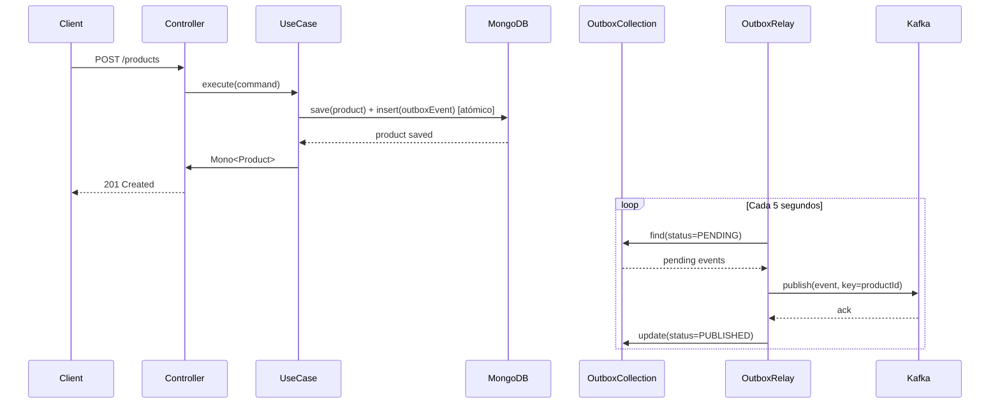
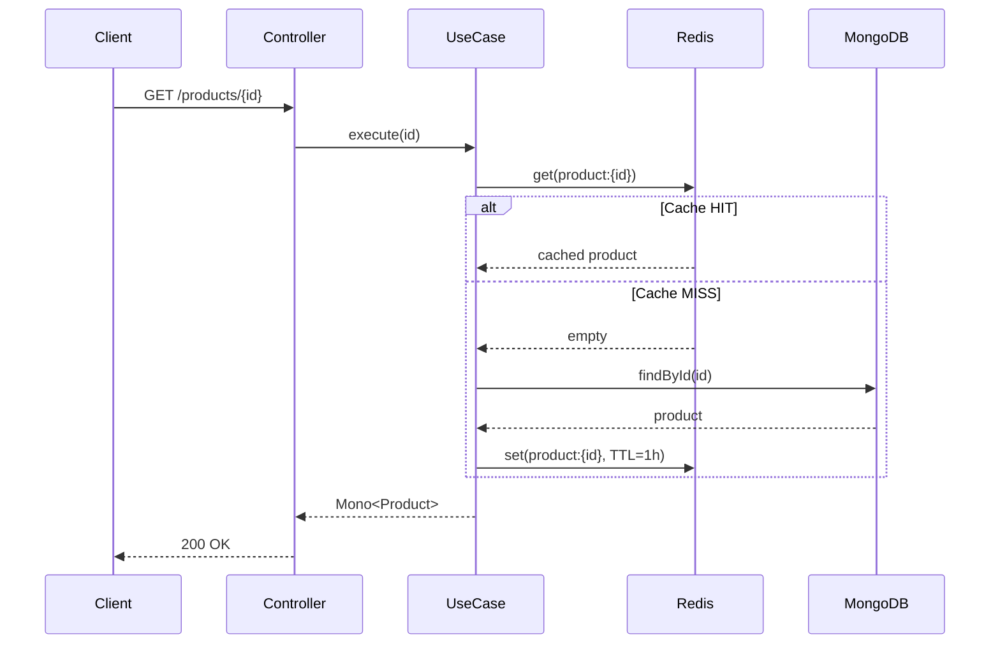

# Documento de Diseño — ms-catalog

## Visión General

`ms-catalog` es el microservicio dueño del Bounded Context **Catálogo Maestro de Productos** dentro de la plataforma B2B Arka. Gestiona el ciclo de vida completo de productos y categorías, almacena reseñas como subdocumentos anidados en MongoDB, publica eventos de dominio a Kafka mediante el Outbox Pattern, y optimiza lecturas con Cache-Aside en Redis (TTL 1h).

El servicio es 100% reactivo (Spring WebFlux + Project Reactor), usa MongoDB como almacenamiento primario con drivers reactivos, y sigue estrictamente la Clean Architecture del Scaffold Bancolombia 4.2.0.

### Decisiones de Diseño Clave

1. **Records como estándar**: Todas las entidades, VOs, comandos, eventos y DTOs son `record` con `@Builder(toBuilder = true)`.
2. **Outbox Pattern con MongoDB**: Los eventos de dominio se insertan atómicamente en la colección `outbox_events` junto con la operación de negocio. Un relay asíncrono (poll cada 5s) los publica a Kafka.
3. **Cache-Aside con Redis**: Lecturas individuales y paginadas pasan primero por Redis. En caso de miss, se consulta MongoDB y se almacena con TTL 1h. Las escrituras invalidan caché.
4. **Soft Delete**: Los productos no se eliminan físicamente; se marcan `active = false` y se excluyen de listados para CUSTOMER.
5. **Reseñas anidadas**: Las reseñas son subdocumentos dentro del documento de producto en MongoDB, no una colección separada.
6. **Sin MapStruct**: Mappers manuales con métodos estáticos y `@Builder`.

---

## Arquitectura

### Diagrama de Componentes (Clean Architecture)

```mermaid
graph TB
    subgraph "Entry Points (infrastructure/entry-points)"
        PC[ProductController]
        CC[CategoryController]
        RC[ReviewController]
        GEH[GlobalExceptionHandler]
    end

    subgraph "Use Cases (domain/usecase)"
        CPU[CreateProductUseCase]
        GPU[GetProductUseCase]
        LPU[ListProductsUseCase]
        UPU[UpdateProductUseCase]
        DPU[DeactivateProductUseCase]
        CCU[CreateCategoryUseCase]
        LCU[ListCategoriesUseCase]
        ARU[AddReviewUseCase]
    end

    subgraph "Domain Model (domain/model)"
        P[Product]
        C[Category]
        R[Review]
        OE[OutboxEvent]
        PR[ProductRepository port]
        CR[CategoryRepository port]
        OER[OutboxEventRepository port]
        CacheP[ProductCachePort]
    end

    subgraph "Driven Adapters (infrastructure/driven-adapters)"
        MPA[MongoProductAdapter]
        MCA[MongoCategoryAdapter]
        MOA[MongoOutboxAdapter]
        RCA[RedisCacheAdapter]
        KRA[KafkaOutboxRelay]
    end

    subgraph "External Systems"
        MongoDB[(MongoDB - catalog_db)]
        Redis[(Redis)]
        Kafka[Apache Kafka - product-events]
    end

    PC --> CPU & GPU & LPU & UPU & DPU
    CC --> CCU & LCU
    RC --> ARU

    CPU --> PR & CR & OER & CacheP
    GPU --> PR & CacheP
    LPU --> PR & CacheP
    UPU --> PR & OER & CacheP
    DPU --> PR & OER & CacheP
    CCU --> CR
    LCU --> CR
    ARU --> PR

    MPA -.-> PR
    MCA -.-> CR
    MOA -.-> OER
    RCA -.-> CacheP

    MPA --> MongoDB
    MCA --> MongoDB
    MOA --> MongoDB
    RCA --> Redis
    KRA --> Kafka & MOA
```



### Flujo de Escritura con Outbox Pattern



### Flujo de Lectura con Cache-Aside



---

## Componentes e Interfaces

### Capa de Dominio — Modelo (`domain/model`)

#### Ports (Gateway Interfaces)

```java
// com.arka.model.product.gateways.ProductRepository
public interface ProductRepository {
    Mono<Product> save(Product product);
    Mono<Product> findById(String id);
    Mono<Product> findBySku(String sku);
    Flux<Product> findAllActive(int page, int size);
    Mono<Product> update(Product product);
    Mono<Product> deactivate(String id);
    Mono<Product> addReview(String productId, Review review);
}

// com.arka.model.category.gateways.CategoryRepository
public interface CategoryRepository {
    Mono<Category> save(Category category);
    Mono<Category> findById(String id);
    Mono<Category> findByName(String name);
    Flux<Category> findAll();
}

// com.arka.model.outbox.gateways.OutboxEventRepository
public interface OutboxEventRepository {
    Mono<OutboxEvent> save(OutboxEvent event);
    Flux<OutboxEvent> findPending();
    Mono<Void> markAsPublished(String eventId);
}

// com.arka.model.product.gateways.ProductCachePort
public interface ProductCachePort {
    Mono<Product> get(String key);
    Mono<Void> put(String key, Product product);
    Mono<Void> evict(String key);
    Mono<Void> evictProductListCache();
}
```

### Capa de Dominio — Casos de Uso (`domain/usecase`)

| Caso de Uso | Responsabilidad | Ports Usados |
|---|---|---|
| `CreateProductUseCase` | Valida unicidad de SKU, verifica existencia de categoría, persiste producto + outbox event, invalida caché de lista | `ProductRepository`, `CategoryRepository`, `OutboxEventRepository`, `ProductCachePort` |
| `GetProductUseCase` | Consulta producto por ID con Cache-Aside | `ProductRepository`, `ProductCachePort` |
| `ListProductsUseCase` | Lista productos activos paginados con Cache-Aside | `ProductRepository`, `ProductCachePort` |
| `UpdateProductUseCase` | Actualiza producto, emite ProductUpdated + PriceChanged si aplica, invalida caché | `ProductRepository`, `OutboxEventRepository`, `ProductCachePort` |
| `DeactivateProductUseCase` | Soft delete (active=false), emite ProductUpdated, invalida caché | `ProductRepository`, `OutboxEventRepository`, `ProductCachePort` |
| `CreateCategoryUseCase` | Valida unicidad de nombre, persiste categoría | `CategoryRepository` |
| `ListCategoriesUseCase` | Lista todas las categorías | `CategoryRepository` |
| `AddReviewUseCase` | Valida existencia de producto, agrega reseña como subdocumento | `ProductRepository` |

### Capa de Infraestructura — Entry Points

#### DTOs de Request

```java
// CreateProductRequest
@Builder(toBuilder = true)
public record CreateProductRequest(
    @NotBlank String sku,
    @NotBlank String name,
    String description,
    @NotNull @Positive BigDecimal price,
    @NotBlank String categoryId
) {}

// UpdateProductRequest
@Builder(toBuilder = true)
public record UpdateProductRequest(
    @NotBlank String name,
    String description,
    @NotNull @Positive BigDecimal price,
    @NotBlank String categoryId
) {}

// CreateCategoryRequest
@Builder(toBuilder = true)
public record CreateCategoryRequest(
    @NotBlank String name,
    String description
) {}

// AddReviewRequest
@Builder(toBuilder = true)
public record AddReviewRequest(
    @NotBlank String userId,
    @NotNull @Min(1) @Max(5) Integer rating,
    @NotBlank String comment
) {}
```

#### DTOs de Response

```java
// ProductResponse
@Builder(toBuilder = true)
public record ProductResponse(
    String id,
    String sku,
    String name,
    String description,
    BigDecimal price,
    CategoryResponse category,
    boolean active,
    List<ReviewResponse> reviews,
    Instant createdAt,
    Instant updatedAt
) {}

// CategoryResponse
@Builder(toBuilder = true)
public record CategoryResponse(
    String id,
    String name,
    String description,
    Instant createdAt
) {}

// ReviewResponse
@Builder(toBuilder = true)
public record ReviewResponse(
    String userId,
    int rating,
    String comment,
    Instant createdAt
) {}

// ErrorResponse
public record ErrorResponse(String code, String message) {}
```

#### Controladores REST

| Controlador | Endpoints | Retorno |
|---|---|---|
| `ProductController` | `POST /products`, `GET /products`, `GET /products/{id}`, `PUT /products/{id}`, `DELETE /products/{id}` | `Mono<ProductResponse>`, `Flux<ProductResponse>` |
| `CategoryController` | `POST /categories`, `GET /categories` | `Mono<CategoryResponse>`, `Flux<CategoryResponse>` |
| `ReviewController` | `POST /products/{id}/reviews` | `Mono<ProductResponse>` |
| `GlobalExceptionHandler` | `@ControllerAdvice` — mapea excepciones a `ErrorResponse` | `Mono<ResponseEntity<ErrorResponse>>` |

### Capa de Infraestructura — Driven Adapters

| Adapter | Implementa | Tecnología |
|---|---|---|
| `MongoProductAdapter` | `ProductRepository` | ReactiveMongoTemplate |
| `MongoCategoryAdapter` | `CategoryRepository` | ReactiveMongoTemplate |
| `MongoOutboxAdapter` | `OutboxEventRepository` | ReactiveMongoTemplate |
| `RedisCacheAdapter` | `ProductCachePort` | ReactiveRedisTemplate |
| `KafkaOutboxRelay` | Scheduled relay (cada 5s) | ReactiveKafkaProducer |

### Excepciones de Dominio

```java
// Jerarquía de excepciones
public abstract class DomainException extends RuntimeException {
    public abstract int getHttpStatus();
    public abstract String getCode();
}

public class ProductNotFoundException extends DomainException { /* 404 */ }
public class DuplicateSkuException extends DomainException { /* 409 */ }
public class CategoryNotFoundException extends DomainException { /* 400 */ }
public class DuplicateCategoryException extends DomainException { /* 409 */ }
public class InvalidReviewException extends DomainException { /* 400 */ }
```

---

## Modelos de Datos

### Entidades de Dominio (Records)

```java
// com.arka.model.product.Product
@Builder(toBuilder = true)
public record Product(
    String id,
    String sku,
    String name,
    String description,
    BigDecimal price,
    CategoryRef category,
    boolean active,
    List<Review> reviews,
    Instant createdAt,
    Instant updatedAt
) {
    public Product {
        Objects.requireNonNull(sku, "sku is required");
        Objects.requireNonNull(name, "name is required");
        Objects.requireNonNull(price, "price is required");
        if (price.compareTo(BigDecimal.ZERO) <= 0)
            throw new IllegalArgumentException("Price must be positive");
        reviews = reviews != null ? List.copyOf(reviews) : List.of();
        active = true; // default en compact constructor solo para creación
    }
}

// com.arka.model.product.CategoryRef (Value Object embebido en Product)
@Builder(toBuilder = true)
public record CategoryRef(String id, String name) {
    public CategoryRef {
        Objects.requireNonNull(id, "category id is required");
        Objects.requireNonNull(name, "category name is required");
    }
}

// com.arka.model.product.Review (Value Object embebido en Product)
@Builder(toBuilder = true)
public record Review(
    String userId,
    int rating,
    String comment,
    Instant createdAt
) {
    public Review {
        Objects.requireNonNull(userId, "userId is required");
        if (rating < 1 || rating > 5)
            throw new IllegalArgumentException("Rating must be between 1 and 5");
        Objects.requireNonNull(comment, "comment is required");
        createdAt = createdAt != null ? createdAt : Instant.now();
    }
}

// com.arka.model.category.Category
@Builder(toBuilder = true)
public record Category(
    String id,
    String name,
    String description,
    Instant createdAt
) {
    public Category {
        Objects.requireNonNull(name, "name is required");
    }
}
```

### Eventos de Dominio (Records)

```java
// com.arka.model.outbox.OutboxEvent
@Builder(toBuilder = true)
public record OutboxEvent(
    String id,
    String eventId,
    String eventType,
    String topic,
    String payload,
    String partitionKey,
    OutboxStatus status,
    Instant createdAt
) {
    public OutboxEvent {
        eventId = eventId != null ? eventId : UUID.randomUUID().toString();
        status = status != null ? status : OutboxStatus.PENDING;
        createdAt = createdAt != null ? createdAt : Instant.now();
        topic = topic != null ? topic : "product-events";
    }
}

public enum OutboxStatus { PENDING, PUBLISHED }
```

#### Sobre Estándar de Eventos Kafka

```java
// Envelope publicado al tópico product-events
@Builder(toBuilder = true)
public record DomainEventEnvelope(
    String eventId,        // UUID
    String eventType,      // ProductCreated | ProductUpdated | PriceChanged
    Instant timestamp,
    String source,         // "ms-catalog"
    String correlationId,
    Object payload
) {}

// Payloads específicos
@Builder(toBuilder = true)
public record ProductCreatedPayload(
    String productId, String sku, String name,
    BigDecimal price, String categoryId, int initialStock
) {}

@Builder(toBuilder = true)
public record ProductUpdatedPayload(
    String productId, String sku, String name,
    BigDecimal price, String categoryId, boolean active
) {}

@Builder(toBuilder = true)
public record PriceChangedPayload(
    String productId, String sku,
    BigDecimal oldPrice, BigDecimal newPrice
) {}
```

### Esquema MongoDB

#### Colección: `products`

```json
{
  "_id": "ObjectId",
  "sku": "GPU-RTX4090-001",
  "name": "NVIDIA RTX 4090",
  "description": "GPU de alto rendimiento",
  "price": { "$numberDecimal": "8500000.00" },
  "category": { "id": "cat-001", "name": "GPUs" },
  "active": true,
  "reviews": [
    {
      "userId": "user-123",
      "rating": 5,
      "comment": "Excelente producto",
      "createdAt": "2025-01-15T10:30:00Z"
    }
  ],
  "createdAt": "2025-01-01T00:00:00Z",
  "updatedAt": "2025-01-15T10:30:00Z"
}
```

Índices: `{ sku: 1 }` (unique), `{ "category.id": 1 }`, `{ active: 1 }`

#### Colección: `categories`

```json
{
  "_id": "ObjectId",
  "name": "GPUs",
  "description": "Tarjetas gráficas",
  "createdAt": "2025-01-01T00:00:00Z"
}
```

Índices: `{ name: 1 }` (unique)

#### Colección: `outbox_events`

```json
{
  "_id": "ObjectId",
  "eventId": "uuid-v4",
  "eventType": "ProductCreated",
  "topic": "product-events",
  "payload": "{ ... serialized JSON ... }",
  "partitionKey": "product-id-123",
  "status": "PENDING",
  "createdAt": "2025-01-01T00:00:00Z"
}
```

Índices: `{ status: 1, createdAt: 1 }` (para el relay), `{ eventId: 1 }` (unique)

### Estrategia de Claves de Caché Redis

| Patrón de Clave | Descripción | TTL |
|---|---|---|
| `product:{id}` | Producto individual por ID | 1 hora |
| `products:page:{page}:size:{size}` | Lista paginada de productos activos | 1 hora |

Invalidación: Toda operación de escritura (crear, actualizar, desactivar) invalida `product:{id}` y todas las claves `products:page:*`.

---

## Propiedades de Correctitud

*Una propiedad es una característica o comportamiento que debe mantenerse verdadero en todas las ejecuciones válidas de un sistema — esencialmente, una declaración formal sobre lo que el sistema debe hacer. Las propiedades sirven como puente entre especificaciones legibles por humanos y garantías de correctitud verificables por máquina.*

### Propiedad 1: Round trip de creación de producto

*Para cualquier* datos válidos de producto (SKU único, nombre no vacío, precio positivo, categoría existente), crear el producto y luego consultarlo por ID debe retornar un producto con los mismos valores de SKU, nombre, precio y categoría.

**Valida: Requisitos 1.1, 2.2**

### Propiedad 2: Validación rechaza entrada inválida

*Para cualquier* solicitud de creación o actualización de producto donde falte al menos uno de los campos obligatorios (nombre, precio, SKU, categoría) o donde el precio sea menor o igual a cero, el sistema debe rechazar la solicitud sin modificar el estado del catálogo.

**Valida: Requisitos 1.2, 1.3, 3.3**

### Propiedad 3: Unicidad de SKU

*Para cualquier* producto existente en el catálogo, intentar crear otro producto con el mismo SKU debe resultar en un rechazo con error de conflicto, y el catálogo debe mantener exactamente un producto con ese SKU.

**Valida: Requisitos 1.4**

### Propiedad 4: Operaciones de escritura producen eventos outbox

*Para cualquier* operación de escritura exitosa (crear, actualizar o desactivar producto), debe existir al menos un evento en la colección `outbox_events` con el `eventType` correspondiente (ProductCreated, ProductUpdated) y con `status = PENDING`, insertado atómicamente con la operación de negocio.

**Valida: Requisitos 1.5, 3.4, 4.3, 7.1**

### Propiedad 5: Completitud del sobre y payload de eventos

*Para cualquier* evento de dominio generado por el catálogo, el sobre debe contener todos los campos requeridos (eventId como UUID, eventType, timestamp, source = "ms-catalog", correlationId, payload), el topic debe ser "product-events", la partition key debe ser el productId, y el eventType debe ser uno de: ProductCreated, ProductUpdated o PriceChanged. Además, el payload debe contener todos los campos requeridos para su tipo específico.

**Valida: Requisitos 1.6, 7.2, 7.3, 7.6**

### Propiedad 6: Escrituras invalidan caché

*Para cualquier* operación de escritura exitosa (crear, actualizar o desactivar producto), las entradas de caché del producto individual y de las listas paginadas deben ser invalidadas en Redis.

**Valida: Requisitos 1.7, 3.6, 4.4, 8.2**

### Propiedad 7: Round trip de Cache-Aside

*Para cualquier* producto existente en MongoDB, la primera consulta (cache miss) debe almacenar el resultado en Redis con TTL de 1 hora, y una consulta subsiguiente (cache hit) debe retornar el mismo producto desde Redis sin consultar MongoDB.

**Valida: Requisitos 2.4, 2.5, 2.6, 8.1, 8.5**

### Propiedad 8: Listado retorna solo productos activos

*Para cualquier* conjunto de productos en el catálogo (mezcla de activos e inactivos), el endpoint de listado debe retornar exclusivamente productos con `active = true`. Ningún producto con `active = false` debe aparecer en los resultados.

**Valida: Requisitos 2.1, 4.5**

### Propiedad 9: Actualización preserva producto y refleja cambios

*Para cualquier* producto existente y datos de actualización válidos, la actualización debe retornar un producto con los nuevos valores aplicados, el mismo ID, y un `updatedAt` posterior o igual al original.

**Valida: Requisitos 3.1**

### Propiedad 10: Cambio de precio emite evento PriceChanged adicional

*Para cualquier* actualización de producto donde el nuevo precio difiera del precio actual, el sistema debe insertar un evento adicional de tipo PriceChanged en `outbox_events` que contenga el precio anterior y el nuevo precio, además del evento ProductUpdated estándar.

**Valida: Requisitos 3.5**

### Propiedad 11: Soft delete preserva documento con active=false

*Para cualquier* producto activo que se desactiva, el documento debe seguir existiendo en MongoDB con `active = false`. El producto no debe ser eliminado físicamente de la base de datos.

**Valida: Requisitos 4.1**

### Propiedad 12: Unicidad de nombre de categoría

*Para cualquier* categoría existente en el catálogo, intentar crear otra categoría con el mismo nombre debe resultar en un rechazo con error de conflicto. Además, cualquier solicitud de creación de categoría sin nombre debe ser rechazada.

**Valida: Requisitos 5.2, 5.3**

### Propiedad 13: Creación de producto con categoría inexistente es rechazada

*Para cualquier* solicitud de creación de producto que referencia un `categoryId` que no existe en la colección de categorías, el sistema debe rechazar la solicitud sin crear el producto.

**Valida: Requisitos 5.5**

### Propiedad 14: Agregar reseña incrementa lista y asigna createdAt

*Para cualquier* producto existente y reseña válida (userId, rating 1-5, comment), agregar la reseña debe incrementar la lista de reseñas del producto en exactamente uno, y la reseña agregada debe tener un `createdAt` no nulo asignado automáticamente.

**Valida: Requisitos 6.1, 6.5**

### Propiedad 15: Datos de reseña inválidos son rechazados

*Para cualquier* solicitud de reseña donde falte userId, comment, o donde el rating esté fuera del rango 1-5, el sistema debe rechazar la solicitud sin modificar el producto.

**Valida: Requisitos 6.2, 6.3**

### Propiedad 16: Transición de estado del relay outbox

*Para cualquier* evento en `outbox_events` con `status = PENDING`, si el relay lo publica exitosamente a Kafka, el status debe transicionar a `PUBLISHED`. Si la publicación falla, el evento debe permanecer con `status = PENDING` para reintento en el siguiente ciclo.

**Valida: Requisitos 7.4, 7.5**

### Propiedad 17: Fallback a MongoDB cuando Redis no está disponible

*Para cualquier* consulta de producto cuando Redis no está disponible, el sistema debe continuar operando consultando directamente a MongoDB y retornar el resultado correcto.

**Valida: Requisitos 8.4**

### Propiedad 18: Respuestas de error tienen estructura y HTTP status correctos

*Para cualquier* excepción (validación, dominio o inesperada), la respuesta debe contener un `ErrorResponse` con los campos `code` y `message`, el código HTTP debe corresponder al tipo de excepción (400 para validación, código específico para DomainException, 500 para inesperadas), y las excepciones inesperadas no deben exponer detalles internos en el mensaje.

**Valida: Requisitos 9.2, 9.3, 9.4, 9.5**

---

## Manejo de Errores

### Jerarquía de Excepciones de Dominio

```
DomainException (abstract)
├── ProductNotFoundException      → HTTP 404, code: PRODUCT_NOT_FOUND
├── DuplicateSkuException         → HTTP 409, code: DUPLICATE_SKU
├── CategoryNotFoundException     → HTTP 400, code: CATEGORY_NOT_FOUND
├── DuplicateCategoryException    → HTTP 409, code: DUPLICATE_CATEGORY
└── InvalidReviewException        → HTTP 400, code: INVALID_REVIEW
```

### GlobalExceptionHandler (`@ControllerAdvice`)

| Tipo de Excepción | HTTP Status | Código de Error | Comportamiento |
|---|---|---|---|
| `WebExchangeBindException` (Bean Validation) | 400 | `VALIDATION_ERROR` | Retorna campos inválidos en el mensaje |
| `DomainException` (subclases) | Según subclase | Según subclase | Retorna `ErrorResponse(code, message)` |
| `Exception` (inesperada) | 500 | `INTERNAL_ERROR` | Log ERROR, mensaje genérico sin detalles internos |

### Errores en Cadenas Reactivas

- `switchIfEmpty(Mono.error(new ProductNotFoundException(id)))` para entidades no encontradas
- `onErrorResume()` para fallback de Redis (log WARN, continuar con MongoDB)
- Nunca `try/catch` alrededor de publishers reactivos

### Resiliencia de Redis

Cuando Redis no está disponible, el `RedisCacheAdapter` debe:
1. Capturar la excepción de conexión con `onErrorResume()`
2. Registrar un log de nivel WARN con el detalle del error
3. Retornar `Mono.empty()` para que el UseCase continúe con MongoDB
4. No propagar la excepción al cliente

---

## Estrategia de Testing

### Enfoque Dual: Tests Unitarios + Tests Basados en Propiedades

El testing de `ms-catalog` combina dos enfoques complementarios:

1. **Tests unitarios** (JUnit 5 + Mockito + StepVerifier): Verifican ejemplos específicos, edge cases y condiciones de error.
2. **Tests basados en propiedades** (jqwik): Verifican propiedades universales con entradas generadas aleatoriamente, garantizando correctitud para todo el espacio de inputs.

### Librería de Property-Based Testing

**jqwik** (https://jqwik.net/) — librería PBT nativa para JUnit 5 en Java. Se integra directamente con el test runner de JUnit sin configuración adicional.

```groovy
// build.gradle del módulo de test
testImplementation 'net.jqwik:jqwik:1.9.2'
```

### Configuración de Tests de Propiedades

- Mínimo **100 iteraciones** por test de propiedad (`@Property(tries = 100)`)
- Cada test de propiedad debe referenciar la propiedad del documento de diseño mediante un tag en comentario
- Formato del tag: `// Feature: ms-catalog, Property {N}: {título de la propiedad}`

### Tests Unitarios (JUnit 5 + Mockito + StepVerifier)

Los tests unitarios se enfocan en:

- **Ejemplos específicos**: Crear un producto con datos concretos y verificar el resultado
- **Edge cases**: IDs inexistentes (404), SKU duplicado (409), categoría inexistente (400), rating fuera de rango
- **Integración entre componentes**: Verificar que el UseCase invoca correctamente los ports
- **Condiciones de error**: Redis caído, MongoDB timeout, excepciones inesperadas
- **Cadenas reactivas**: Usar `StepVerifier` para verificar publishers `Mono`/`Flux`

### Tests de Propiedades (jqwik)

Cada propiedad de correctitud del documento de diseño se implementa como un **único test de propiedad** con jqwik:

| Propiedad | Test | Generadores |
|---|---|---|
| P1: Round trip creación | Generar productos válidos aleatorios, crear y consultar | SKU, nombre, precio positivo, categoría |
| P2: Validación rechaza inválidos | Generar requests con campos faltantes o precio ≤ 0 | Strings vacíos/null, BigDecimal ≤ 0 |
| P3: Unicidad SKU | Generar pares de productos con mismo SKU | SKU fijo, datos variables |
| P4: Escrituras producen outbox | Generar operaciones de escritura aleatorias | Crear/actualizar/desactivar |
| P5: Completitud de eventos | Generar eventos y verificar campos | Todos los tipos de evento |
| P6: Escrituras invalidan caché | Generar escrituras y verificar invalidación | Crear/actualizar/desactivar |
| P7: Cache-Aside round trip | Generar productos, simular miss→hit | Productos aleatorios |
| P8: Listado solo activos | Generar mezcla activos/inactivos | Booleanos aleatorios para active |
| P9: Actualización refleja cambios | Generar updates válidos | Nuevos valores aleatorios |
| P10: PriceChanged en cambio de precio | Generar updates con precio diferente | Pares de precios distintos |
| P11: Soft delete preserva documento | Generar productos y desactivar | Productos aleatorios |
| P12: Unicidad nombre categoría | Generar pares con mismo nombre | Nombre fijo, datos variables |
| P13: Categoría inexistente rechazada | Generar categoryIds no existentes | UUIDs aleatorios |
| P14: Reseña incrementa lista | Generar reseñas válidas | userId, rating 1-5, comment |
| P15: Reseña inválida rechazada | Generar reseñas con datos inválidos | Rating fuera de rango, campos null |
| P16: Transición outbox relay | Generar eventos PENDING, simular éxito/fallo | Eventos aleatorios |
| P17: Fallback Redis→MongoDB | Generar consultas con Redis caído | Productos aleatorios |
| P18: Estructura ErrorResponse | Generar excepciones de distintos tipos | DomainException, validation, unexpected |

### Herramientas Adicionales

- **StepVerifier** (`reactor-test`): Verificación de publishers reactivos en todos los tests
- **BlockHound**: Detección de llamadas bloqueantes en tests de servicios WebFlux
- **ArchUnit**: Validación de dependencias entre capas de Clean Architecture
