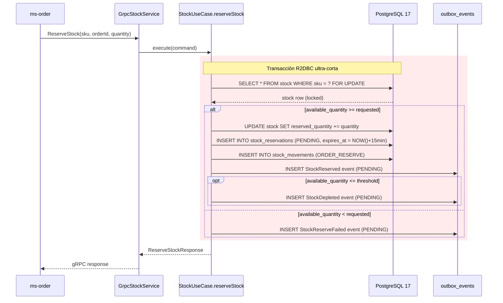
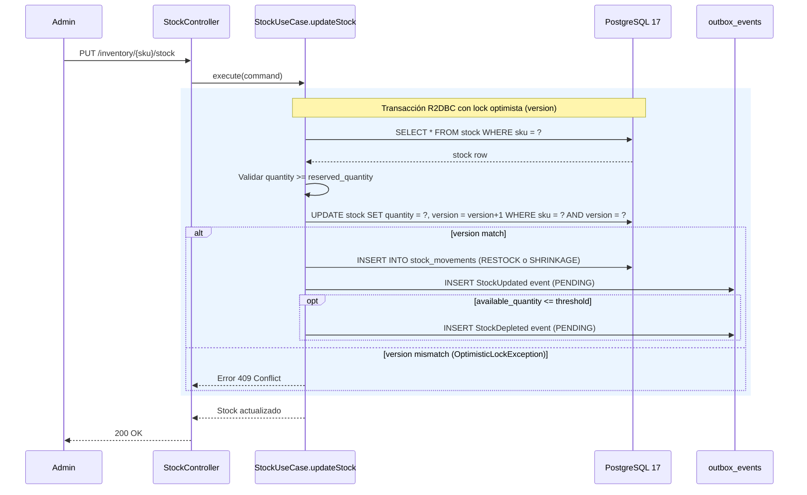
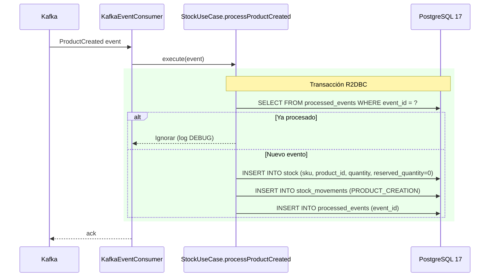
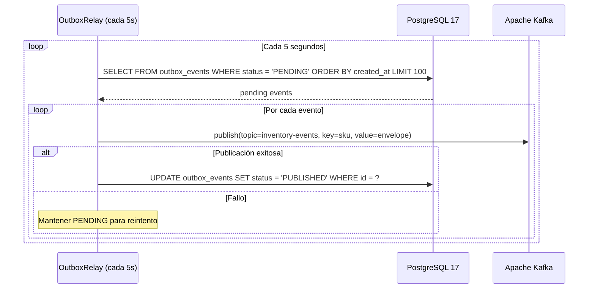
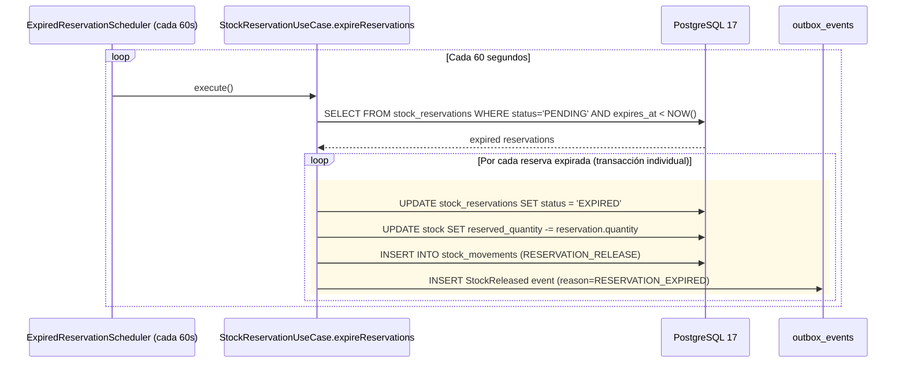

# Documento de Diseño — ms-inventory

## Visión General

`ms-inventory` es el microservicio dueño del Bounded Context **Disponibilidad Física y Reservas** dentro de la plataforma B2B Arka. Su misión crítica es prevenir la sobreventa (problema #1 de Arka) mediante lock pesimista (`SELECT ... FOR UPDATE`) en PostgreSQL 17, gestionar reservas temporales con expiración de 15 minutos, mantener trazabilidad completa de movimientos de stock, y publicar eventos de dominio al tópico `inventory-events` de Kafka mediante el Transactional Outbox Pattern.

El servicio es 100% reactivo (Spring WebFlux + Project Reactor), usa PostgreSQL 17 con R2DBC como almacenamiento, expone endpoints REST para administración y consulta, un servidor gRPC para reserva síncrona de stock desde `ms-order`, y consume eventos de Kafka (`ProductCreated`, `OrderCancelled`).

### Decisiones de Diseño Clave

1. **Lock Pesimista para reservas**: `SELECT ... FOR UPDATE` en transacciones R2DBC ultra-cortas garantiza atomicidad y previene race conditions en la reserva de stock. Se usa exclusivamente en el flujo gRPC de reserva.
2. **Lock Optimista para ajustes manuales**: El campo `version` (BIGINT) previene actualizaciones perdidas en el endpoint `PUT /inventory/{sku}/stock` mediante versionado optimista.
3. **Transactional Outbox Pattern**: Los eventos de dominio se insertan en la tabla `outbox_events` dentro de la misma transacción R2DBC que la escritura de negocio, garantizada por `TransactionalGateway` (ver §D.1 de patrones-y-estandares-codigo.md). Un relay asíncrono (poll configurable desde YAML) los publica a Kafka.
4. **`TransactionalGateway` en UseCases (no `@Transactional`)**: Los UseCases que modifican múltiples tablas arman el pipeline reactivo con su lógica de negocio y lo delegan a `TransactionalGateway.executeInTransaction()`. En infraestructura, `R2dbcTransactionalAdapter` implementa este port usando `TransactionalOperator` de Spring. El dominio no importa dependencias de Spring. Rollback automático ante cualquier `onError`. Los driven adapters NO manejan transacciones — la transacción la define el UseCase vía el gateway.
5. **Idempotencia en consumidores**: La tabla `processed_events` con `event_id` como PK garantiza procesamiento exactamente-una-vez de eventos Kafka.
6. **Columna generada `available_quantity`**: Calculada como `quantity - reserved_quantity` a nivel de PostgreSQL, eliminando inconsistencias entre campos.
7. **CHECK constraints como última defensa**: `quantity >= 0` y `reserved_quantity >= 0` a nivel de BD previenen estados inválidos incluso ante bugs de aplicación.
8. **Records como estándar**: Todas las entidades, VOs, comandos, eventos y DTOs son `record` con `@Builder(toBuilder = true)`.
9. **Sin MapStruct**: Mappers manuales con métodos estáticos y `@Builder`.
10. **Schedulers externalizados**: Los intervalos de `KafkaOutboxRelay` y `ExpiredReservationScheduler` se configuran desde `application.yaml` sin defaults inline en la anotación `@Scheduled` (ver §D.6 de patrones-y-estandares-codigo.md).
11. **Documentación API con Springdoc/OpenAPI**: Swagger UI disponible en `/swagger-ui.html`, especificación JSON en `/api-docs`. Anotaciones `@Tag`, `@Operation` y `@ApiResponse` en el controlador REST (ver §D.2 de patrones-y-estandares-codigo.md).

---

## Arquitectura

### Diagrama de Componentes (Clean Architecture)

```mermaid
graph TB
    subgraph "Entry Points (infrastructure/entry-points)"
        SC[StockController - REST]
        GS[GrpcStockService - gRPC]
        KC[KafkaEventConsumer]
        GEH[GlobalExceptionHandler]
    end

    subgraph "Use Cases (domain/usecase)"
        SU[StockUseCase]
        SRU[StockReservationUseCase]
        ORU[OutboxRelayUseCase]
    end

    subgraph "Domain Model (domain/model)"
        S[Stock]
        SR[StockReservation]
        SM[StockMovement]
        OE[OutboxEvent]
        MT[MovementType - enum]
        RS[ReservationStatus - enum]
        SP[StockRepository port]
        SRP[StockReservationRepository port]
        SMP[StockMovementRepository port]
        OEP[OutboxEventRepository port]
        PEP[ProcessedEventRepository port]
    end

    subgraph "Driven Adapters (infrastructure/driven-adapters)"
        R2S[R2dbcStockAdapter]
        R2SR[R2dbcStockReservationAdapter]
        R2SM[R2dbcStockMovementAdapter]
        R2OE[R2dbcOutboxAdapter]
        R2PE[R2dbcProcessedEventAdapter]
        KOR[KafkaOutboxRelay]
        ERS[ExpiredReservationScheduler]
    end

    subgraph "External Systems"
        PG[(PostgreSQL 17 - db_inventory)]
        Kafka[Apache Kafka]
    end

    SC --> SU
    GS --> SU
    KC --> SU & SRU

    SU --> SP & SMP & OEP & SRP & PEP
    SRU --> SRP & SP & SMP & OEP & PEP
    ORU --> OEP

    R2S -.-> SP
    R2SR -.-> SRP
    R2SM -.-> SMP
    R2OE -.-> OEP
    R2PE -.-> PEP

    R2S & R2SR & R2SM & R2OE & R2PE --> PG
    KOR --> Kafka & ORU
    ERS --> SRU
    KC --> Kafka
```



### Flujo de Reserva de Stock (gRPC — Camino Crítico)



### Flujo de Actualización Manual de Stock (REST)



### Flujo de Consumo de Eventos Kafka (Idempotente)



### Flujo del Outbox Relay



### Flujo de Expiración de Reservas



---

## Componentes e Interfaces

### Capa de Dominio — Modelo (`domain/model`)

#### Ports (Gateway Interfaces)

```java
// com.arka.model.stock.gateways.StockRepository
public interface StockRepository {
    Mono<Stock> findBySku(String sku);
    Mono<Stock> findBySkuForUpdate(String sku); // SELECT ... FOR UPDATE
    Mono<Stock> save(Stock stock);
    Mono<Stock> updateQuantity(String sku, int newQuantity, long expectedVersion);
    Mono<Stock> updateReservedQuantity(String sku, int newReservedQuantity);
}

// com.arka.model.reservation.gateways.StockReservationRepository
public interface StockReservationRepository {
    Mono<StockReservation> save(StockReservation reservation);
    Mono<StockReservation> findBySkuAndOrderIdAndStatus(String sku, UUID orderId, ReservationStatus status);
    Flux<StockReservation> findExpiredPending(Instant now);
    Mono<StockReservation> updateStatus(UUID id, ReservationStatus status);
}

// com.arka.model.movement.gateways.StockMovementRepository
public interface StockMovementRepository {
    Mono<StockMovement> save(StockMovement movement);
    Flux<StockMovement> findBySkuOrderByCreatedAtDesc(String sku, int page, int size);
}

// com.arka.model.outbox.gateways.OutboxEventRepository
public interface OutboxEventRepository {
    Mono<OutboxEvent> save(OutboxEvent event);
    Flux<OutboxEvent> findPending(int limit);
    Mono<Void> markAsPublished(UUID id);
}

// com.arka.model.processedevent.gateways.ProcessedEventRepository
public interface ProcessedEventRepository {
    Mono<Boolean> exists(UUID eventId);
    Mono<Void> save(UUID eventId);
}
```

### Capa de Dominio — Casos de Uso (`domain/usecase`)

> **Convención:** Un UseCase por entidad de dominio principal, con múltiples métodos públicos que cubren toda la lógica de negocio de esa entidad. No se usa el patrón de un solo método `execute()` por operación.
>
> **Transaccionalidad:** Los métodos que modifican múltiples tablas arman el pipeline reactivo y lo delegan a `TransactionalGateway.executeInTransaction()` (port de dominio). En infraestructura, `R2dbcTransactionalAdapter` implementa el gateway con `TransactionalOperator`. El dominio no importa Spring. Rollback automático ante `onError`. Los métodos de solo lectura no necesitan transacción explícita.

| UseCase                   | Método                            | Transacción                     | Responsabilidad                                                                                                                                                                                                                                    | Ports Usados                                                                                                                                            |
| ------------------------- | --------------------------------- | ------------------------------- | -------------------------------------------------------------------------------------------------------------------------------------------------------------------------------------------------------------------------------------------------- | ------------------------------------------------------------------------------------------------------------------------------------------------------- |
| `StockUseCase`            | `getBySku(sku)`                   | No (Caso A)                     | Consulta stock por SKU, lanza `StockNotFoundException` si no existe                                                                                                                                                                                | `StockRepository`                                                                                                                                       |
| `StockUseCase`            | `getHistory(sku, page, size)`     | No (Caso A)                     | Lista movimientos paginados por SKU ordenados por fecha desc                                                                                                                                                                                       | `StockMovementRepository`                                                                                                                               |
| `StockUseCase`            | `updateStock(sku, qty, reason)`   | **TransactionalGateway (B)**    | Actualiza quantity con lock optimista (version), registra movimiento RESTOCK o SHRINKAGE, emite StockUpdated + StockDepleted si aplica. Todo en una transacción R2DBC.                                                                             | `StockRepository`, `StockMovementRepository`, `OutboxEventRepository`, `TransactionalGateway`                                                           |
| `StockUseCase`            | `reserveStock(sku, orderId, qty)` | **TransactionalGateway (B)**    | Lock pesimista, verifica disponibilidad, crea reserva PENDING con TTL 15min, registra movimiento ORDER_RESERVE, emite StockReserved/StockReserveFailed + StockDepleted. Idempotente por (sku, orderId). Todo en una transacción R2DBC ultra-corta. | `StockRepository`, `StockReservationRepository`, `StockMovementRepository`, `OutboxEventRepository`, `TransactionalGateway`                             |
| `StockUseCase`            | `processProductCreated(...)`      | **TransactionalGateway (B)**    | Verifica idempotencia, crea registro de stock inicial, registra movimiento PRODUCT_CREATION, guarda eventId en processed_events. Todo en una transacción R2DBC.                                                                                    | `StockRepository`, `StockMovementRepository`, `ProcessedEventRepository`, `TransactionalGateway`                                                        |
| `StockReservationUseCase` | `expireReservations()`            | No (cada reserva individual sí) | Busca reservas PENDING expiradas. Cada reserva se procesa en su propia transacción vía `TransactionalGateway` para aislamiento de fallos.                                                                                                          | `StockReservationRepository`, `StockRepository`, `StockMovementRepository`, `OutboxEventRepository`, `TransactionalGateway`                             |
| `StockReservationUseCase` | `processOrderCancelled(...)`      | **TransactionalGateway (B)**    | Verifica idempotencia, libera reserva PENDING, decrementa reserved_quantity, registra movimiento RESERVATION_RELEASE, emite StockReleased, guarda eventId. Todo en una transacción R2DBC.                                                          | `StockReservationRepository`, `StockRepository`, `StockMovementRepository`, `OutboxEventRepository`, `ProcessedEventRepository`, `TransactionalGateway` |
| `OutboxRelayUseCase`      | `fetchPendingEvents()`            | No (Caso A)                     | Consulta eventos PENDING del outbox (batch configurable desde YAML)                                                                                                                                                                                | `OutboxEventRepository`                                                                                                                                 |
| `OutboxRelayUseCase`      | `markAsPublished(event)`          | No (Caso A)                     | Marca un evento como PUBLISHED tras publicación exitosa a Kafka. Operación de un solo port.                                                                                                                                                        | `OutboxEventRepository`                                                                                                                                 |

### Capa de Infraestructura — Entry Points

#### DTOs de Request

```java
// UpdateStockRequest
@Builder(toBuilder = true)
public record UpdateStockRequest(
    @NotNull @PositiveOrZero Integer quantity,
    String reason
) {}
```

#### DTOs de Response

```java
// StockResponse
@Builder(toBuilder = true)
public record StockResponse(
    UUID id,
    String sku,
    UUID productId,
    int quantity,
    int reservedQuantity,
    int availableQuantity,
    long version,
    Instant updatedAt
) {}

// StockMovementResponse
@Builder(toBuilder = true)
public record StockMovementResponse(
    UUID id,
    String sku,
    String movementType,
    int quantityChange,
    int previousQuantity,
    int newQuantity,
    UUID referenceId,
    String reason,
    Instant createdAt
) {}

// ReserveStockResponse (gRPC mapped)
@Builder(toBuilder = true)
public record ReserveStockResult(
    boolean success,
    UUID reservationId,
    int availableQuantity,
    String reason
) {}

// ErrorResponse
public record ErrorResponse(String code, String message) {}
```

#### Controlador REST y Handler

> **Patrón Controller → Handler → UseCase (ver §4.2 de patrones-y-estandares-codigo.md):** El `StockController` es thin — solo anotaciones HTTP, validación y delegación al `StockHandler`. El `StockHandler` (`@Component`) orquesta la llamada al UseCase, el mapeo vía `StockMapper`/`StockMovementMapper` y el wrapping en `ResponseEntity`. Los endpoints de recurso único retornan `Mono<ResponseEntity<T>>`; los endpoints de colección retornan `Flux<T>` directamente para streaming reactivo (sin `collectList()`).

| Componente               | Responsabilidad                                                                      | Retorno                                                              |
| ------------------------ | ------------------------------------------------------------------------------------ | -------------------------------------------------------------------- |
| `StockController`        | `PUT /inventory/{sku}/stock`, `GET /inventory/{sku}`, `GET /inventory/{sku}/history` | Delega a `StockHandler`                                              |
| `StockHandler`           | Orquestación: UseCase → Mapper → `ResponseEntity` / `Flux`                          | `Mono<ResponseEntity<StockResponse>>`, `Flux<StockMovementResponse>` |
| `GlobalExceptionHandler` | `@ControllerAdvice` — mapea excepciones a `ErrorResponse`                            | `Mono<ResponseEntity<ErrorResponse>>`                                |

#### Servicio gRPC

```protobuf
syntax = "proto3";
package com.arka.inventory;

service InventoryService {
  rpc ReserveStock (ReserveStockRequest) returns (ReserveStockResponse);
}

message ReserveStockRequest {
  string sku = 1;
  string order_id = 2;
  int32 quantity = 3;
}

message ReserveStockResponse {
  bool success = 1;
  string reservation_id = 2;
  int32 available_quantity = 3;
  string reason = 4;
}
```

#### Consumidor Kafka

| Consumer             | Tópico           | Eventos Procesados                                                            |
| -------------------- | ---------------- | ----------------------------------------------------------------------------- |
| `KafkaEventConsumer` | `product-events` | `ProductCreated` → delega a `StockUseCase.processProductCreated()`            |
| `KafkaEventConsumer` | `order-events`   | `OrderCancelled` → delega a `StockReservationUseCase.processOrderCancelled()` |

Filtra por `eventType` del sobre estándar. Ignora tipos desconocidos con log WARN.

### Capa de Infraestructura — Driven Adapters

| Adapter                        | Implementa                   | Tecnología                                                                                                                    |
| ------------------------------ | ---------------------------- | ----------------------------------------------------------------------------------------------------------------------------- |
| `R2dbcStockAdapter`            | `StockRepository`            | R2DBC DatabaseClient (sin transacción propia — la transacción la controla `TransactionalGateway` vía `TransactionalOperator`) |
| `R2dbcStockReservationAdapter` | `StockReservationRepository` | R2DBC DatabaseClient                                                                                                          |
| `R2dbcStockMovementAdapter`    | `StockMovementRepository`    | R2DBC DatabaseClient                                                                                                          |
| `R2dbcOutboxAdapter`           | `OutboxEventRepository`      | R2DBC DatabaseClient                                                                                                          |
| `R2dbcProcessedEventAdapter`   | `ProcessedEventRepository`   | R2DBC DatabaseClient                                                                                                          |
| `KafkaOutboxRelay`             | Scheduled relay              | ReactiveKafkaProducer, `@Scheduled(fixedDelayString = "${scheduler.outbox-relay.interval}")`                                  |
| `ExpiredReservationScheduler`  | Scheduled job                | `@Scheduled(fixedDelayString = "${scheduler.expired-reservations.interval}")` → `StockReservationUseCase`                     |

### Excepciones de Dominio

```java
// Jerarquía de excepciones
public abstract class DomainException extends RuntimeException {
    public abstract int getHttpStatus();
    public abstract String getCode();
}

public class StockNotFoundException extends DomainException { /* 404, STOCK_NOT_FOUND */ }
public class InsufficientStockException extends DomainException { /* 409, INSUFFICIENT_STOCK */ }
public class InvalidStockQuantityException extends DomainException { /* 409, INVALID_STOCK_QUANTITY */ }
public class OptimisticLockException extends DomainException { /* 409, CONCURRENT_MODIFICATION */ }
public class StockConstraintViolationException extends DomainException { /* 409, STOCK_CONSTRAINT_VIOLATION */ }
public class ExcessiveReleaseException extends DomainException { /* 409, EXCESSIVE_RELEASE */ }
```

---

## Modelos de Datos

### Entidades de Dominio (Records)

```java
// com.arka.model.stock.Stock
@Builder(toBuilder = true)
public record Stock(
    UUID id,
    String sku,
    UUID productId,
    int quantity,
    int reservedQuantity,
    int availableQuantity,  // generado: quantity - reservedQuantity
    int depletionThreshold, // umbral por producto, default 10
    Instant updatedAt,
    long version
) {
    public static final int DEFAULT_DEPLETION_THRESHOLD = 10;

    public Stock {
        Objects.requireNonNull(sku, "sku is required");
        Objects.requireNonNull(productId, "productId is required");
        if (quantity < 0) throw new IllegalArgumentException("quantity must be >= 0");
        if (reservedQuantity < 0) throw new IllegalArgumentException("reservedQuantity must be >= 0");
        if (reservedQuantity > quantity)
            throw new IllegalArgumentException("reservedQuantity cannot exceed quantity");
        if (depletionThreshold < 0) throw new IllegalArgumentException("depletionThreshold must be >= 0");
        availableQuantity = quantity - reservedQuantity;
        depletionThreshold = depletionThreshold > 0 ? depletionThreshold : DEFAULT_DEPLETION_THRESHOLD;
        version = version > 0 ? version : 1;
    }

    // Métodos de consulta
    public boolean canReserve(int requestedQuantity) { return availableQuantity >= requestedQuantity; }
    public boolean isBelowThreshold() { return availableQuantity <= depletionThreshold; }

    // Mutaciones encapsuladas — devuelven nueva instancia inmutable con validaciones de dominio
    public Stock increaseBy(int amount) {
        if (amount <= 0) throw new InvalidStockQuantityException(sku, amount, "must be > 0");
        return this.toBuilder().quantity(this.quantity + amount).updatedAt(Instant.now()).build();
    }

    public Stock decreaseBy(int amount) {
        if (amount <= 0) throw new InvalidStockQuantityException(sku, amount, "must be > 0");
        if (amount > availableQuantity) throw new InsufficientStockException(sku, amount, availableQuantity);
        return this.toBuilder().quantity(this.quantity - amount).updatedAt(Instant.now()).build();
    }

    public Stock setQuantity(int newQuantity) {
        if (newQuantity < 0) throw new InvalidStockQuantityException(sku, newQuantity, "must be >= 0");
        if (newQuantity < reservedQuantity)
            throw new InvalidStockQuantityException(sku, newQuantity, reservedQuantity);
        return this.toBuilder().quantity(newQuantity).updatedAt(Instant.now()).build();
    }

    public Stock reserve(int amount) {
        if (amount <= 0) throw new InvalidStockQuantityException(sku, amount, "must be > 0");
        if (amount > availableQuantity) throw new InsufficientStockException(sku, amount, availableQuantity);
        return this.toBuilder().reservedQuantity(this.reservedQuantity + amount).updatedAt(Instant.now()).build();
    }

    public Stock releaseReservation(int amount) {
        if (amount <= 0) throw new InvalidStockQuantityException(sku, amount, "must be > 0");
        if (amount > reservedQuantity)
            throw new ExcessiveReleaseException(sku, amount, reservedQuantity);
        return this.toBuilder().reservedQuantity(this.reservedQuantity - amount).updatedAt(Instant.now()).build();
    }
}

// com.arka.model.reservation.StockReservation
@Builder(toBuilder = true)
public record StockReservation(
    UUID id,
    String sku,
    UUID orderId,
    int quantity,
    ReservationStatus status,
    Instant createdAt,
    Instant expiresAt
) {
    public StockReservation {
        Objects.requireNonNull(sku, "sku is required");
        Objects.requireNonNull(orderId, "orderId is required");
        if (quantity <= 0) throw new IllegalArgumentException("quantity must be > 0");
        status = status != null ? status : ReservationStatus.PENDING;
        createdAt = createdAt != null ? createdAt : Instant.now();
        expiresAt = expiresAt != null ? expiresAt : Instant.now().plus(Duration.ofMinutes(15));
    }

    // Métodos de consulta
    public boolean isExpired(Instant now) { return status == PENDING && now.isAfter(expiresAt); }
    public boolean isPending() { return status == PENDING; }

    // Transiciones de estado encapsuladas — validan que el estado actual sea PENDING
    public StockReservation expire() { assertPending("expire"); return toBuilder().status(EXPIRED).build(); }
    public StockReservation release() { assertPending("release"); return toBuilder().status(RELEASED).build(); }
    public StockReservation confirm() { assertPending("confirm"); return toBuilder().status(CONFIRMED).build(); }

    private void assertPending(String operation) {
        if (status != PENDING) throw new IllegalStateException(
            "Cannot " + operation + " reservation " + id + " for SKU: " + sku + ". Current status: " + status);
    }
}

// com.arka.model.reservation.ReservationStatus
public enum ReservationStatus { PENDING, CONFIRMED, EXPIRED, RELEASED }

// com.arka.model.stockmovement.StockMovement
@Builder(toBuilder = true)
public record StockMovement(
    UUID id,
    String sku,
    MovementType movementType,
    int quantityChange,
    int previousQuantity,
    int newQuantity,
    UUID orderId,
    String reason,
    Instant createdAt
) {
    public StockMovement {
        Objects.requireNonNull(sku, "sku is required");
        Objects.requireNonNull(movementType, "movementType is required");
        if (previousQuantity < 0) throw new IllegalArgumentException("previousQuantity must be >= 0");
        if (newQuantity < 0) throw new IllegalArgumentException("newQuantity must be >= 0");
        if (newQuantity != previousQuantity + quantityChange)
            throw new IllegalArgumentException("Inconsistent movement: previousQuantity + quantityChange != newQuantity");
        createdAt = createdAt != null ? createdAt : Instant.now();
    }

    // Métodos de consulta
    public boolean isStockIncrease() { return quantityChange > 0; }
    public boolean isStockDecrease() { return quantityChange < 0; }

    // Factory methods para creación semántica con validación implícita
    public static StockMovement restock(String sku, int prevQty, int newQty, String reason) { /* ... */ }
    public static StockMovement shrinkage(String sku, int prevQty, int newQty, String reason) { /* ... */ }
    public static StockMovement orderReserve(String sku, int qty, int prevAvailable, UUID orderId) { /* ... */ }
    public static StockMovement reservationRelease(String sku, int qty, int prevAvailable, UUID orderId, String reason) { /* ... */ }
    public static StockMovement productCreation(String sku, int initialStock) { /* ... */ }
}

// com.arka.model.movement.MovementType
public enum MovementType {
    RESTOCK, SHRINKAGE, ORDER_RESERVE, ORDER_CONFIRM, RESERVATION_RELEASE, PRODUCT_CREATION
}
```

### Eventos de Dominio (Records)

```java
// com.arka.model.outboxevent.OutboxEvent
@Builder(toBuilder = true)
public record OutboxEvent(
    UUID id,
    EventType eventType,
    String payload,       // JSON serializado en JSONB
    String partitionKey,  // SKU como Kafka partition key
    OutboxStatus status,
    Instant createdAt
) {
    public OutboxEvent {
        Objects.requireNonNull(eventType, "eventType is required");
        Objects.requireNonNull(payload, "payload is required");
        Objects.requireNonNull(partitionKey, "partitionKey is required");
        id = id != null ? id : UUID.randomUUID();
        status = status != null ? status : OutboxStatus.PENDING;
        createdAt = createdAt != null ? createdAt : Instant.now();
    }

    // Métodos de consulta
    public boolean isPending() { return status == OutboxStatus.PENDING; }
    public boolean isPublished() { return status == OutboxStatus.PUBLISHED; }

    // Transición de estado encapsulada
    public OutboxEvent markAsPublished() {
        if (status != OutboxStatus.PENDING) throw new IllegalStateException(
            "Cannot publish outbox event " + id + ". Current status: " + status);
        return toBuilder().status(OutboxStatus.PUBLISHED).build();
    }
}

// com.arka.model.outboxevent.EventType
public enum EventType {
    STOCK_RESERVED, STOCK_RESERVE_FAILED, STOCK_RELEASED, STOCK_UPDATED, STOCK_DEPLETED
}

// com.arka.model.outboxevent.OutboxStatus
public enum OutboxStatus { PENDING, PUBLISHED }
```

#### Sobre Estándar de Eventos Kafka

```java
// Envelope publicado al tópico inventory-events
@Builder(toBuilder = true)
public record DomainEventEnvelope(
    String eventId,        // UUID
    String eventType,      // StockReserved | StockReserveFailed | StockReleased | StockUpdated | StockDepleted
    Instant timestamp,
    String source,         // "ms-inventory"
    String correlationId,
    Object payload
) {}

// Payloads específicos
@Builder(toBuilder = true)
public record StockReservedPayload(
    String sku, UUID orderId, int quantity, UUID reservationId
) {}

@Builder(toBuilder = true)
public record StockReserveFailedPayload(
    String sku, UUID orderId, int requestedQuantity, int availableQuantity, String reason
) {}

@Builder(toBuilder = true)
public record StockReleasedPayload(
    String sku, UUID orderId, int quantity, String reason
) {}

@Builder(toBuilder = true)
public record StockUpdatedPayload(
    String sku, int previousQuantity, int newQuantity, String movementType
) {}

@Builder(toBuilder = true)
public record StockDepletedPayload(
    String sku, int currentQuantity, int threshold
) {}
```

### Esquema PostgreSQL 17

#### Tabla: `stock`

```sql
CREATE TABLE stock (
    id                  UUID PRIMARY KEY DEFAULT gen_random_uuid(),
    sku                 VARCHAR(50) UNIQUE NOT NULL,
    product_id          UUID NOT NULL,
    quantity            INTEGER NOT NULL CHECK (quantity >= 0),
    reserved_quantity   INTEGER NOT NULL DEFAULT 0 CHECK (reserved_quantity >= 0),
    available_quantity  INTEGER GENERATED ALWAYS AS (quantity - reserved_quantity) STORED,
    depletion_threshold INTEGER NOT NULL DEFAULT 10 CHECK (depletion_threshold >= 0),
    updated_at          TIMESTAMP WITH TIME ZONE DEFAULT NOW(),
    version             BIGINT NOT NULL DEFAULT 1,
    CONSTRAINT chk_reserved_not_exceeds_quantity CHECK (reserved_quantity <= quantity)
);

CREATE INDEX idx_stock_sku ON stock(sku);
```

#### Tabla: `stock_reservations`

```sql
CREATE TABLE stock_reservations (
    id          UUID PRIMARY KEY DEFAULT gen_random_uuid(),
    sku         VARCHAR(50) NOT NULL,
    order_id    UUID NOT NULL,
    quantity    INTEGER NOT NULL CHECK (quantity > 0),
    status      reservation_status NOT NULL DEFAULT 'PENDING',
    created_at  TIMESTAMP WITH TIME ZONE NOT NULL DEFAULT NOW(),
    expires_at  TIMESTAMP WITH TIME ZONE NOT NULL
);

CREATE INDEX idx_reservations_status_expires ON stock_reservations(status, expires_at);
CREATE INDEX idx_reservations_sku_order ON stock_reservations(sku, order_id, status);
```

#### Tabla: `stock_movements`

```sql
CREATE TABLE stock_movements (
    id                UUID PRIMARY KEY DEFAULT gen_random_uuid(),
    sku               VARCHAR(50) NOT NULL,
    movement_type     movement_type NOT NULL,
    quantity_change   INTEGER NOT NULL,
    previous_quantity INTEGER NOT NULL CHECK (previous_quantity >= 0),
    new_quantity      INTEGER NOT NULL CHECK (new_quantity >= 0),
    order_id          UUID,
    reason            TEXT,
    created_at        TIMESTAMP WITH TIME ZONE DEFAULT NOW()
);

CREATE INDEX idx_movements_sku_created ON stock_movements(sku, created_at DESC);
```

#### Tabla: `outbox_events`

```sql
CREATE TABLE outbox_events (
    id            UUID PRIMARY KEY DEFAULT gen_random_uuid(),
    event_type    event_type NOT NULL,
    payload       JSONB NOT NULL,
    partition_key VARCHAR(50),
    status        outbox_status NOT NULL DEFAULT 'PENDING',
    created_at    TIMESTAMP WITH TIME ZONE DEFAULT NOW()
);

CREATE INDEX idx_outbox_status_created ON outbox_events(status, created_at);
```

#### Tabla: `processed_events`

```sql
CREATE TABLE processed_events (
    event_id     UUID PRIMARY KEY,
    processed_at TIMESTAMP WITH TIME ZONE DEFAULT NOW()
);
```

---

## Propiedades de Correctitud

_Una propiedad es una característica o comportamiento que debe mantenerse verdadero en todas las ejecuciones válidas de un sistema — esencialmente, una declaración formal sobre lo que el sistema debe hacer. Las propiedades sirven como puente entre especificaciones legibles por humanos y garantías de correctitud verificables por máquina._

### Propiedad 1: Round trip de actualización de stock

_Para cualquier_ SKU existente y cantidad válida (entero no negativo), actualizar el stock mediante `PUT /inventory/{sku}/stock` y luego consultarlo mediante `GET /inventory/{sku}` debe retornar un Stock con la nueva cantidad, el mismo SKU, y un `available_quantity` igual a `quantity - reserved_quantity`.

**Valida: Requisitos 1.1, 2.1**

### Propiedad 2: Validación rechaza entrada inválida

_Para cualquier_ solicitud de actualización de stock donde el campo `quantity` sea nulo o un entero negativo, el sistema debe rechazar la solicitud con código HTTP 400 sin modificar el estado del stock.

**Valida: Requisitos 1.2**

### Propiedad 3: Invariante de stock no negativo

_Para cualquier_ registro de stock y cualquier operación (actualización manual, reserva, liberación, creación), los campos `quantity` y `reserved_quantity` deben ser siempre >= 0, y `available_quantity` debe ser siempre igual a `quantity - reserved_quantity`. Si una operación intentara violar esta invariante, debe ser rechazada con código HTTP 409.

**Valida: Requisitos 1.3, 10.1, 10.2, 10.3, 10.4, 10.5**

### Propiedad 4: Operaciones producen movimientos correctos

_Para cualquier_ operación exitosa que modifique el stock (actualización manual, reserva, liberación por expiración, liberación por cancelación, creación por ProductCreated), debe existir un registro en `stock_movements` con el `movement_type` correspondiente (RESTOCK, SHRINKAGE, ORDER_RESERVE, RESERVATION_RELEASE, PRODUCT_CREATION), `previous_quantity` y `new_quantity` correctos, y `reference_id` cuando aplique.

**Valida: Requisitos 1.5, 4.6, 5.3, 6.3, 7.2**

### Propiedad 5: Operaciones producen eventos outbox correctos

_Para cualquier_ operación exitosa que modifique el stock, debe existir al menos un evento en `outbox_events` con el `event_type` correspondiente (StockUpdated, StockReserved, StockReserveFailed, StockReleased), `status = PENDING`, y partition key igual al SKU. El tópico destino (`inventory-events`) es fijo y lo determina el relay al publicar, no el record `OutboxEvent`.

**Valida: Requisitos 1.6, 4.7, 4.8, 5.4, 7.3, 8.3**

### Propiedad 6: StockDepleted se emite al alcanzar umbral crítico

_Para cualquier_ operación que resulte en un `available_quantity` menor o igual al umbral crítico configurado, debe existir un evento adicional de tipo `StockDepleted` en `outbox_events` con el SKU, la cantidad actual y el umbral en su payload. Si el `available_quantity` resultante es mayor al umbral, no debe emitirse `StockDepleted`.

**Valida: Requisitos 1.7, 4.10**

### Propiedad 7: Lock optimista previene actualizaciones perdidas

_Para cualquier_ par de actualizaciones concurrentes al mismo SKU con la misma versión, exactamente una debe tener éxito y la otra debe fallar con código HTTP 409 (Conflict). La versión del stock debe incrementarse en exactamente 1 tras cada actualización exitosa.

**Valida: Requisitos 1.8**

### Propiedad 8: Consulta de stock retorna campos completos

_Para cualquier_ SKU existente, la consulta `GET /inventory/{sku}` debe retornar un StockResponse con todos los campos requeridos: id, sku, productId, quantity, reservedQuantity, availableQuantity, version y updatedAt, todos no nulos.

**Valida: Requisitos 2.1**

### Propiedad 9: Historial retorna movimientos ordenados descendentemente

_Para cualquier_ SKU con movimientos de stock, la consulta `GET /inventory/{sku}/history` debe retornar los movimientos ordenados por `created_at` descendente. Para cada par consecutivo de movimientos en la respuesta, el `created_at` del primero debe ser mayor o igual al del segundo.

**Valida: Requisitos 3.1**

### Propiedad 10: Movimientos contienen todos los campos requeridos

_Para cualquier_ movimiento de stock generado por el sistema, el registro debe contener los campos: id (UUID no nulo), sku (no vacío), movement_type (uno de los tipos válidos), quantity_change (entero), previous_quantity (entero >= 0), new_quantity (entero >= 0), y created_at (no nulo).

**Valida: Requisitos 3.4**

### Propiedad 11: Reserva exitosa cuando stock suficiente

_Para cualquier_ SKU con `available_quantity >= quantity` solicitada, la operación `ReserveStock` debe tener éxito, incrementar `reserved_quantity` en exactamente la cantidad solicitada, crear una reserva con status PENDING y `expires_at` aproximadamente 15 minutos en el futuro, y retornar un `ReserveStockResponse` con `success = true` y un `reservationId` válido.

**Valida: Requisitos 4.2, 4.3**

### Propiedad 12: Reserva fallida no modifica stock

_Para cualquier_ SKU con `available_quantity < quantity` solicitada, la operación `ReserveStock` debe retornar `success = false` con la cantidad disponible actual y una razón descriptiva, sin modificar `quantity` ni `reserved_quantity` del stock.

**Valida: Requisitos 4.4**

### Propiedad 13: Reserva duplicada es idempotente

_Para cualquier_ par (sku, orderId) donde ya existe una reserva con status PENDING, una segunda solicitud `ReserveStock` con los mismos parámetros debe retornar `success = true` con el mismo `reservationId` existente, sin crear una reserva adicional ni modificar el `reserved_quantity` del stock.

**Valida: Requisitos 4.5**

### Propiedad 14: Reservas expiradas se liberan correctamente

_Para cualquier_ reserva con status PENDING cuyo `expires_at` es anterior a la fecha actual, el job de expiración debe cambiar su status a EXPIRED, decrementar `reserved_quantity` del stock en exactamente la cantidad de la reserva, y el `available_quantity` resultante debe incrementarse en la misma cantidad.

**Valida: Requisitos 5.2**

### Propiedad 15: ProductCreated crea stock con valores iniciales correctos

_Para cualquier_ evento ProductCreated válido con un SKU nuevo, el sistema debe crear un registro de stock con `quantity = initialStock`, `reserved_quantity = 0`, `available_quantity = initialStock`, y el `product_id` del evento.

**Valida: Requisitos 6.1**

### Propiedad 16: Idempotencia de consumidores Kafka

_Para cualquier_ evento Kafka (ProductCreated u OrderCancelled) procesado exitosamente, si el mismo evento (mismo eventId) se recibe una segunda vez, el sistema debe ignorarlo sin ejecutar lógica de negocio, sin modificar el stock, sin crear movimientos adicionales, y sin emitir eventos outbox adicionales.

**Valida: Requisitos 6.4, 6.5, 7.5, 7.6, 9.1, 9.2**

### Propiedad 17: OrderCancelled libera reserva pendiente

_Para cualquier_ evento OrderCancelled con un orderId que tiene una reserva PENDING asociada, el sistema debe cambiar el status de la reserva a RELEASED, decrementar `reserved_quantity` del stock en la cantidad de la reserva, y emitir un evento StockReleased con razón "ORDER_CANCELLED".

**Valida: Requisitos 7.2, 7.3**

### Propiedad 18: Completitud del sobre y payload de eventos

_Para cualquier_ evento de dominio generado por ms-inventory, el sobre debe contener todos los campos requeridos (eventId como UUID, eventType, timestamp, source = "ms-inventory", correlationId, payload). El eventType debe ser uno de: StockReserved, StockReserveFailed, StockReleased, StockUpdated o StockDepleted. El payload debe contener todos los campos requeridos para su tipo específico según la especificación de cada evento.

**Valida: Requisitos 8.2, 8.7, 8.8, 8.9, 8.10, 8.11, 8.12**

### Propiedad 19: Transición de estado del relay outbox

_Para cualquier_ evento en `outbox_events` con `status = PENDING`, si el relay lo publica exitosamente a Kafka, el status debe transicionar a `PUBLISHED`. Si la publicación falla, el evento debe permanecer con `status = PENDING` para reintento en el siguiente ciclo.

**Valida: Requisitos 8.5, 8.6**

### Propiedad 20: Respuestas de error tienen estructura y HTTP status correctos

_Para cualquier_ excepción (validación, dominio o inesperada), la respuesta debe contener un `ErrorResponse` con los campos `code` (no vacío) y `message` (no vacío). El código HTTP debe corresponder al tipo de excepción: 400 para validación, código específico para DomainException (404, 409), y 500 para inesperadas. Las respuestas 500 no deben exponer detalles internos (stack trace, nombres de clase) en el mensaje.

**Valida: Requisitos 11.2, 11.3, 11.4, 11.5, 11.6**

---

## Manejo de Errores

### Jerarquía de Excepciones de Dominio

```text
DomainException (abstract)
├── StockNotFoundException              → HTTP 404, code: STOCK_NOT_FOUND
├── InsufficientStockException          → HTTP 409, code: INSUFFICIENT_STOCK
├── InvalidStockQuantityException       → HTTP 409, code: INVALID_STOCK_QUANTITY
├── OptimisticLockException             → HTTP 409, code: CONCURRENT_MODIFICATION
├── StockConstraintViolationException   → HTTP 409, code: STOCK_CONSTRAINT_VIOLATION
└── ExcessiveReleaseException           → HTTP 409, code: EXCESSIVE_RELEASE
```

### GlobalExceptionHandler (`@ControllerAdvice`)

| Tipo de Excepción                                       | HTTP Status    | Código de Error              | Comportamiento                                                 |
| ------------------------------------------------------- | -------------- | ---------------------------- | -------------------------------------------------------------- |
| `WebExchangeBindException` (Bean Validation)            | 400            | `VALIDATION_ERROR`           | Retorna campos inválidos en el mensaje                         |
| `DomainException` (subclases)                           | Según subclase | Según subclase               | Retorna `ErrorResponse(code, message)`                         |
| `DataIntegrityViolationException` (CHECK constraint BD) | 409            | `STOCK_CONSTRAINT_VIOLATION` | Traduce error de constraint PostgreSQL a respuesta descriptiva |
| `Exception` (inesperada)                                | 500            | `INTERNAL_ERROR`             | Log ERROR, mensaje genérico sin detalles internos              |

### Errores en Cadenas Reactivas

- `switchIfEmpty(Mono.error(new StockNotFoundException(sku)))` para stock no encontrado
- `onErrorMap(DataIntegrityViolationException.class, e -> new StockConstraintViolationException(...))` para traducir errores de constraint PostgreSQL
- `onErrorResume()` para manejo de errores en el relay outbox (log WARN, mantener PENDING)
- Nunca `try/catch` alrededor de publishers reactivos

### Errores en gRPC

El `GrpcStockService` traduce excepciones de dominio a códigos de estado gRPC:

| Excepción de Dominio         | gRPC Status Code      |
| ---------------------------- | --------------------- |
| `StockNotFoundException`     | `NOT_FOUND`           |
| `InsufficientStockException` | `FAILED_PRECONDITION` |
| `Exception` (inesperada)     | `INTERNAL`            |

Para reservas fallidas por stock insuficiente, no se lanza excepción — se retorna un `ReserveStockResponse` con `success = false` y la razón descriptiva.

### Errores en Consumidores Kafka

- Eventos con `eventId` duplicado: ignorar silenciosamente (log DEBUG)
- Eventos con `eventType` desconocido: ignorar con log WARN
- Errores de procesamiento: log ERROR + retry con backoff exponencial (3 reintentos)
- Errores irrecuperables: enviar a Dead Letter Topic (DLT)

---

## Estrategia de Testing

### Enfoque Dual: Tests Unitarios + Tests Basados en Propiedades

El testing de `ms-inventory` combina dos enfoques complementarios:

1. **Tests unitarios** (JUnit 5 + Mockito + StepVerifier): Verifican ejemplos específicos, edge cases y condiciones de error.
2. **Tests basados en propiedades** (jqwik): Verifican propiedades universales con entradas generadas aleatoriamente, garantizando correctitud para todo el espacio de inputs.

### Librería de Property-Based Testing

**jqwik** — librería PBT nativa para JUnit 5 en Java. Se integra directamente con el test runner de JUnit sin configuración adicional.

```groovy
// build.gradle del módulo de test
testImplementation 'net.jqwik:jqwik:1.9.2'
```

### Configuración de Tests de Propiedades

- Mínimo **100 iteraciones** por test de propiedad (`@Property(tries = 100)`)
- Cada test de propiedad debe referenciar la propiedad del documento de diseño mediante un tag en comentario
- Formato del tag: `// Feature: ms-inventory, Property {N}: {título de la propiedad}`
- Cada propiedad de correctitud se implementa como un **único** test de propiedad con jqwik

### Tests Unitarios (JUnit 5 + Mockito + StepVerifier)

Los tests unitarios se enfocan en:

- **Ejemplos específicos**: Reservar stock con datos concretos y verificar el resultado
- **Edge cases**: SKU inexistente (404), SKU duplicado en ProductCreated (ignorar), OrderCancelled sin reserva PENDING (ignorar), eventId duplicado (idempotencia)
- **Integración entre componentes**: Verificar que cada UseCase invoca correctamente los ports
- **Condiciones de error**: Constraint violation de BD, optimistic lock failure, errores inesperados
- **Cadenas reactivas**: Usar `StepVerifier` para verificar publishers `Mono`/`Flux`

### Tests de Propiedades (jqwik)

Cada propiedad de correctitud del documento de diseño se implementa como un **único test de propiedad** con jqwik:

| Propiedad                              | Test                                                        | Generadores                             |
| -------------------------------------- | ----------------------------------------------------------- | --------------------------------------- |
| P1: Round trip actualización           | Generar stocks y cantidades válidas, actualizar y consultar | SKU, quantity >= 0                      |
| P2: Validación rechaza inválidos       | Generar requests con quantity null o negativo               | Integers negativos, null                |
| P3: Invariante stock no negativo       | Generar operaciones que intentan violar constraints         | Quantities que resultan en negativos    |
| P4: Operaciones producen movimientos   | Generar operaciones exitosas, verificar movimientos         | Todos los tipos de operación            |
| P5: Operaciones producen outbox events | Generar operaciones exitosas, verificar outbox              | Todos los tipos de operación            |
| P6: StockDepleted en umbral            | Generar stocks con quantities cerca del umbral              | Quantities, thresholds aleatorios       |
| P7: Lock optimista                     | Generar actualizaciones concurrentes con misma version      | Pares de updates al mismo SKU           |
| P8: Consulta campos completos          | Generar stocks, consultar y verificar campos                | Stocks aleatorios                       |
| P9: Historial ordenado desc            | Generar movimientos con timestamps variados                 | Timestamps aleatorios                   |
| P10: Movimientos campos completos      | Generar movimientos y verificar campos requeridos           | Movimientos aleatorios                  |
| P11: Reserva exitosa                   | Generar stocks con disponibilidad suficiente                | Quantities <= available                 |
| P12: Reserva fallida no modifica       | Generar stocks con disponibilidad insuficiente              | Quantities > available                  |
| P13: Reserva duplicada idempotente     | Generar reservas duplicadas (mismo sku+orderId)             | Pares sku/orderId                       |
| P14: Expiración libera reservas        | Generar reservas con expires_at en el pasado                | Timestamps pasados                      |
| P15: ProductCreated crea stock         | Generar eventos ProductCreated válidos                      | SKU, productId, initialStock            |
| P16: Idempotencia consumidores         | Generar eventos y procesarlos dos veces                     | Eventos con eventId fijo                |
| P17: OrderCancelled libera reserva     | Generar cancellations con reservas PENDING                  | OrderIds con reservas                   |
| P18: Completitud eventos               | Generar eventos de todos los tipos, verificar estructura    | Todos los tipos de evento               |
| P19: Transición outbox relay           | Generar eventos PENDING, simular éxito/fallo                | Eventos aleatorios                      |
| P20: Estructura ErrorResponse          | Generar excepciones de distintos tipos                      | DomainException, validation, unexpected |

### Herramientas Adicionales

- **StepVerifier** (`reactor-test`): Verificación de publishers reactivos en todos los tests
- **BlockHound**: Detección de llamadas bloqueantes en tests de servicios WebFlux
- **ArchUnit**: Validación de dependencias entre capas de Clean Architecture
