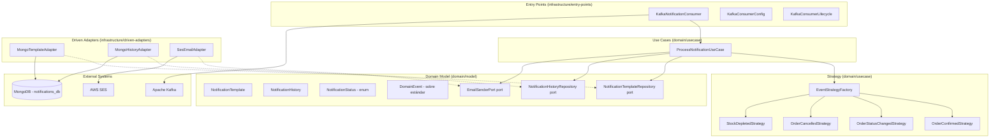
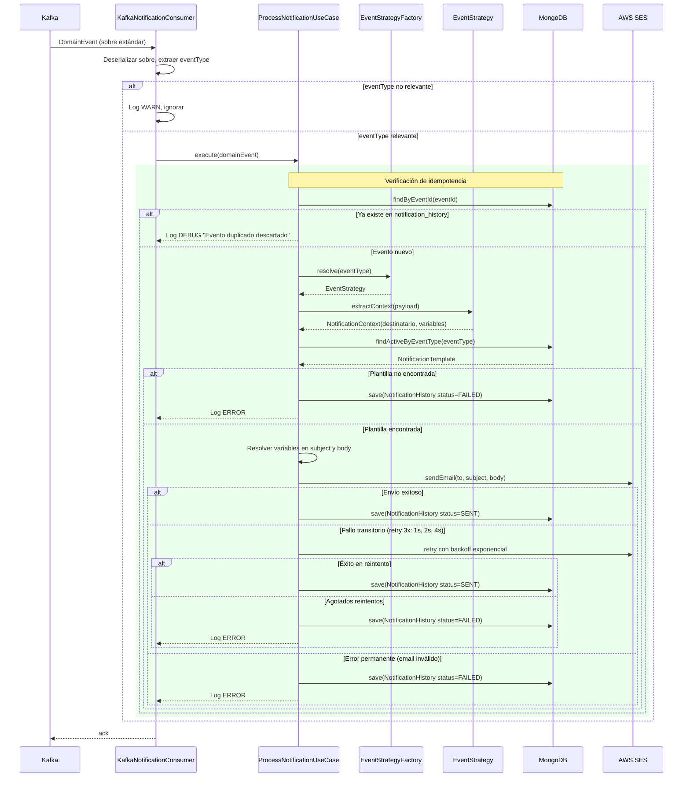

# Documento de Diseño — ms-notifications

## Visión General

`ms-notifications` es el motor pasivo de notificaciones transaccionales del ecosistema B2B Arka. Su responsabilidad exclusiva es consumir eventos de dominio desde Apache Kafka, resolver plantillas de email almacenadas en MongoDB, y enviar correos electrónicos transaccionales mediante AWS SES. El servicio **no expone endpoints REST** — opera de forma puramente event-driven como consumidor "Catch-All".

### Decisiones de Diseño Clave

1. **Puramente event-driven**: Sin endpoints REST. El único entry-point es el consumidor Kafka suscrito a `order-events` e `inventory-events` (Fase 1).
2. **Idempotencia por eventId**: La colección `notification_history` tiene un índice único sobre `eventId`. Antes de procesar, se verifica existencia; si ya existe, se descarta el evento.
3. **Strategy + Factory para procesamiento de eventos**: Cada `eventType` relevante tiene una estrategia dedicada que extrae campos del payload y determina el destinatario. Agregar un nuevo tipo de evento requiere solo una nueva estrategia + plantilla en MongoDB.
4. **Motor de plantillas con sustitución `{{variable}}`**: Componente de dominio que resuelve variables en subject y bodyTemplate. Variables faltantes se reemplazan por cadena vacía con log WARN.
5. **SDK bloqueante de SES envuelto en `Schedulers.boundedElastic()`**: `Mono.fromCallable(...).subscribeOn(Schedulers.boundedElastic())` descarga la llamada bloqueante a un thread pool dedicado sin bloquear el EventLoop de Netty.
6. **Backoff exponencial (3 reintentos: 1s, 2s, 4s)**: Reintentos solo para errores transitorios (timeout, throttling, HTTP 5xx). Errores permanentes (email inválido) registran FAILED sin reintentar.
7. **TTL Index de 90 días**: `expireAfterSeconds: 7776000` sobre `createdAt` en `notification_history` para limpieza automática.
8. **Records como estándar**: Todas las entidades, VOs, comandos y DTOs son `record` con `@Builder(toBuilder = true)`.
9. **Kafka con `KafkaReceiver` de reactor-kafka directo (§B.12)**: `ReactiveKafkaConsumerTemplate` fue eliminado en spring-kafka 4.0 (Spring Boot 4.0.3). Se usa `KafkaReceiver` directamente con `KafkaConsumerConfig` (beans por tópico) y `KafkaConsumerLifecycle` (`ApplicationReadyEvent`). Reutilizar implementación de `ms-inventory/infrastructure/entry-points/kafka-consumer/`.
10. **Reutilización de implementaciones probadas**: El consumidor Kafka DEBE reutilizar la implementación ya probada de `ms-inventory` (3 archivos: `KafkaConsumerConfig`, `KafkaConsumerLifecycle`, `KafkaEventConsumer`), adaptando solo tópicos, consumer group y routing por eventType.
11. **Spring Profiles (local/docker)**: 3 archivos YAML (`application.yaml`, `application-local.yaml`, `application-docker.yaml`) para cambio automático entre MongoDB/Kafka local y contenedores (§B.10).

---

## Arquitectura

### Diagrama de Componentes (Clean Architecture)



### Flujo Principal de Procesamiento de Notificación



---

## Componentes e Interfaces

### Capa de Dominio — Modelo (`domain/model`)

#### Entidades

```java
// com.arka.model.template.NotificationTemplate
@Builder(toBuilder = true)
public record NotificationTemplate(
    String id,
    String eventType,       // índice único
    String subject,         // "Pedido {{orderId}} confirmado"
    String bodyTemplate,    // HTML con {{variable}}
    boolean active,
    Instant createdAt
) {
    public NotificationTemplate {
        Objects.requireNonNull(eventType, "eventType is required");
        Objects.requireNonNull(subject, "subject is required");
        Objects.requireNonNull(bodyTemplate, "bodyTemplate is required");
        createdAt = createdAt != null ? createdAt : Instant.now();
    }
}

// com.arka.model.history.NotificationHistory
@Builder(toBuilder = true)
public record NotificationHistory(
    String id,
    String eventId,         // índice único (idempotencia)
    String eventType,
    String orderId,
    String customerEmail,
    NotificationStatus status,
    Instant processedAt,
    Instant createdAt
) {
    public NotificationHistory {
        Objects.requireNonNull(eventId, "eventId is required");
        Objects.requireNonNull(eventType, "eventType is required");
        Objects.requireNonNull(status, "status is required");
        createdAt = createdAt != null ? createdAt : Instant.now();
        processedAt = processedAt != null ? processedAt : Instant.now();
    }
}

// com.arka.model.history.NotificationStatus
public enum NotificationStatus { SENT, FAILED }
```

#### Ports (Gateway Interfaces)

```java
// com.arka.model.template.gateways.NotificationTemplateRepository
public interface NotificationTemplateRepository {
    Mono<NotificationTemplate> findActiveByEventType(String eventType);
}

// com.arka.model.history.gateways.NotificationHistoryRepository
public interface NotificationHistoryRepository {
    Mono<Boolean> existsByEventId(String eventId);
    Mono<NotificationHistory> save(NotificationHistory history);
}

// com.arka.model.email.gateways.EmailSenderPort
public interface EmailSenderPort {
    Mono<Void> sendEmail(String to, String subject, String htmlBody);
}
```

#### Value Objects y Comandos

```java
// com.arka.model.notification.NotificationContext
// Resultado de la estrategia: contiene destinatario y variables para la plantilla
@Builder(toBuilder = true)
public record NotificationContext(
    String recipientEmail,
    String orderId,
    Map<String, String> templateVariables
) {
    public NotificationContext {
        Objects.requireNonNull(recipientEmail, "recipientEmail is required");
        Objects.requireNonNull(templateVariables, "templateVariables is required");
    }
}

// com.arka.model.notification.DomainEvent (sobre estándar deserializado)
@Builder(toBuilder = true)
public record DomainEvent(
    String eventId,
    String eventType,
    Instant timestamp,
    String source,
    String correlationId,
    Map<String, Object> payload
) {
    public DomainEvent {
        Objects.requireNonNull(eventId, "eventId is required");
        Objects.requireNonNull(eventType, "eventType is required");
    }
}
```

### Capa de Dominio — Casos de Uso (`domain/usecase`)

#### ProcessNotificationUseCase

Caso de uso principal que orquesta el flujo completo: idempotencia → estrategia → plantilla → sustitución → envío → historial.

```java
// com.arka.usecase.ProcessNotificationUseCase
@RequiredArgsConstructor
public class ProcessNotificationUseCase {
    private final NotificationHistoryRepository historyRepository;
    private final NotificationTemplateRepository templateRepository;
    private final EmailSenderPort emailSenderPort;
    private final EventStrategyFactory strategyFactory;
    private final TemplateEngine templateEngine;

    public Mono<Void> execute(DomainEvent event) {
        return historyRepository.existsByEventId(event.eventId())
            .flatMap(exists -> {
                if (exists) {
                    log.debug("Evento duplicado descartado: {}", event.eventId());
                    return Mono.empty();
                }
                return processEvent(event);
            });
    }
}
```

#### EventStrategy (Interfaz funcional)

```java
// com.arka.usecase.strategy.EventStrategy
@FunctionalInterface
public interface EventStrategy {
    NotificationContext extractContext(Map<String, Object> payload);
}
```

#### EventStrategyFactory

```java
// com.arka.usecase.strategy.EventStrategyFactory
public class EventStrategyFactory {
    private final Map<String, Supplier<EventStrategy>> registry;

    public EventStrategyFactory(Map<String, Supplier<EventStrategy>> registry) {
        this.registry = Map.copyOf(registry);
    }

    public Optional<EventStrategy> resolve(String eventType) {
        return Optional.ofNullable(registry.get(eventType))
            .map(Supplier::get);
    }
}
```

**Nota:** `Optional` es válido aquí porque `resolve()` es un método utilitario puro sin I/O que no participa en cadenas reactivas (ver §1.1 de patrones-y-estandares-codigo.md).

#### TemplateEngine (Motor de Plantillas)

```java
// com.arka.usecase.TemplateEngine
public class TemplateEngine {

    /**
     * Sustituye cada {{variable}} en el texto por el valor correspondiente
     * del mapa. Si la variable no existe en el mapa, la reemplaza por
     * cadena vacía y registra log WARN.
     */
    public String resolve(String template, Map<String, String> variables) {
        // Regex: \{\{(\w+)\}\}
        // Para cada match, buscar en variables. Si no existe → "" + log WARN
    }
}
```

#### Estrategias de Procesamiento (Fase 1)

| Estrategia                    | eventType            | Campos extraídos del payload                                          | Destinatario                     |
| ----------------------------- | -------------------- | --------------------------------------------------------------------- | -------------------------------- |
| `OrderConfirmedStrategy`      | `OrderConfirmed`     | orderId, customerId, customerEmail, items (sku, quantity, unitPrice), totalAmount | customerEmail del payload        |
| `OrderStatusChangedStrategy`  | `OrderStatusChanged` | orderId, previousStatus, newStatus, customerEmail                     | customerEmail del payload        |
| `OrderCancelledStrategy`      | `OrderCancelled`     | orderId, customerId, customerEmail, reason                            | customerEmail del payload        |
| `StockDepletedStrategy`       | `StockDepleted`      | sku, productName, currentQuantity, threshold                          | Email admin (propiedad Spring Boot) |

### Capa de Infraestructura — Entry Points

#### KafkaNotificationConsumer

```java
// Consumidor Kafka suscrito a order-events e inventory-events
// Consumer group: notification-service-group
// Usa KafkaReceiver de reactor-kafka directamente (§B.12)
// Arquitectura: KafkaConsumerConfig (beans KafkaReceiver por tópico)
//             + KafkaConsumerLifecycle (ApplicationReadyEvent → startConsuming())
//             + KafkaNotificationConsumer (switch eventType, per-msg ack)
// REUTILIZAR los 3 archivos de ms-inventory/infrastructure/entry-points/kafka-consumer/
// Filtra por eventType relevante, delega a ProcessNotificationUseCase
// eventTypes relevantes Fase 1: OrderConfirmed, OrderStatusChanged,
//                                OrderCancelled, StockDepleted
// eventTypes desconocidos: log WARN, ignorar (tolerancia a evolución)
```

| Consumer                     | Tópicos                                  | Eventos Procesados                                                    | Tecnología |
| ---------------------------- | ---------------------------------------- | --------------------------------------------------------------------- | --------- |
| `KafkaNotificationConsumer`  | `order-events`, `inventory-events`       | OrderConfirmed, OrderStatusChanged, OrderCancelled, StockDepleted     | `KafkaReceiver` (reactor-kafka §B.12) |

### Capa de Infraestructura — Driven Adapters

| Adapter                | Implementa                       | Tecnología                                                                 |
| ---------------------- | -------------------------------- | -------------------------------------------------------------------------- |
| `MongoTemplateAdapter` | `NotificationTemplateRepository` | Reactive MongoDB Driver                                                    |
| `MongoHistoryAdapter`  | `NotificationHistoryRepository`  | Reactive MongoDB Driver                                                    |
| `SesEmailAdapter`      | `EmailSenderPort`                | AWS SES SDK (bloqueante) envuelto con `Mono.fromCallable(...).subscribeOn(Schedulers.boundedElastic())` |

#### SesEmailAdapter — Detalle

```java
// com.arka.ses.SesEmailAdapter
@RequiredArgsConstructor
public class SesEmailAdapter implements EmailSenderPort {
    private final SesClient sesClient;  // SDK bloqueante
    private final String fromAddress;   // Configurable via Spring Boot properties

    @Override
    public Mono<Void> sendEmail(String to, String subject, String htmlBody) {
        return Mono.fromCallable(() -> {
            SendEmailRequest request = SendEmailRequest.builder()
                .source(fromAddress)
                .destination(d -> d.toAddresses(to))
                .message(m -> m
                    .subject(s -> s.data(subject))
                    .body(b -> b.html(c -> c.data(htmlBody))))
                .build();
            sesClient.sendEmail(request);
            return null;
        }).subscribeOn(Schedulers.boundedElastic()).then();
    }
}
```

### Excepciones de Dominio

```java
public abstract class DomainException extends RuntimeException {
    public abstract String getCode();
}

public class TemplateNotFoundException extends DomainException {
    // code: TEMPLATE_NOT_FOUND
}

public class EmailSendException extends DomainException {
    // code: EMAIL_SEND_FAILED
    private final boolean transient; // true = reintentar, false = permanente
}
```

---

## Modelos de Datos

### Colección: `templates`

```json
{
  "_id": ObjectId,
  "eventType": "OrderConfirmed",       // índice único
  "subject": "Pedido {{orderId}} - Confirmación",
  "bodyTemplate": "<html>...{{orderId}}...{{totalAmount}}...</html>",
  "active": true,
  "createdAt": ISODate("2025-01-01T00:00:00Z")
}
```

**Índices:**

```javascript
db.templates.createIndex({ "eventType": 1 }, { unique: true });
```

**Plantillas iniciales (Fase 1):**

| eventType            | subject                                          | Variables en bodyTemplate                                    |
| -------------------- | ------------------------------------------------ | ------------------------------------------------------------ |
| `OrderConfirmed`     | `Pedido {{orderId}} - Confirmación`              | orderId, customerId, items (sku, quantity, unitPrice), totalAmount |
| `OrderStatusChanged` | `Pedido {{orderId}} - Estado: {{newStatus}}`     | orderId, previousStatus, newStatus                           |
| `OrderCancelled`     | `Pedido {{orderId}} - Cancelado`                 | orderId, reason                                              |
| `StockDepleted`      | `Alerta Stock Bajo - SKU {{sku}}`                | sku, productName, currentQuantity, threshold                 |

### Colección: `notification_history`

```json
{
  "_id": ObjectId,
  "eventId": "550e8400-e29b-41d4-a716-446655440000",  // índice único
  "eventType": "OrderConfirmed",
  "orderId": "ORD-2025-001",
  "customerEmail": "[email]",
  "status": "SENT",
  "processedAt": ISODate("2025-01-15T10:30:00Z"),
  "createdAt": ISODate("2025-01-15T10:30:00Z")
}
```

**Índices:**

```javascript
// Índice único para idempotencia
db.notification_history.createIndex({ "eventId": 1 }, { unique: true });

// TTL Index — limpieza automática a 90 días
db.notification_history.createIndex(
  { "createdAt": 1 },
  { expireAfterSeconds: 7776000 }
);
```

### Configuración de Spring Boot (application.yml)

```yaml
spring:
  kafka:
    consumer:
      group-id: notification-service-group
      auto-offset-reset: earliest
      key-deserializer: org.apache.kafka.common.serialization.StringDeserializer
      value-deserializer: org.apache.kafka.common.serialization.StringDeserializer
    topics:
      order-events: order-events
      inventory-events: inventory-events
  data:
    mongodb:
      database: notifications_db

notification:
  from-address: ${SES_FROM_ADDRESS:noreply@arka.com}
  admin-email: ${ADMIN_EMAIL:admin@arka.com}
  retry:
    max-attempts: 3
    base-interval-seconds: 1
    multiplier: 2
```

---

## Propiedades de Correctitud

_Una propiedad es una característica o comportamiento que debe mantenerse verdadero en todas las ejecuciones válidas de un sistema — esencialmente, una declaración formal sobre lo que el sistema debe hacer. Las propiedades sirven como puente entre especificaciones legibles por humanos y garantías de correctitud verificables por máquina._

### Propiedad 1: Idempotencia — eventos duplicados no generan envío

_Para cualquier_ evento de dominio válido con un eventId que ya existe en `notification_history`, al procesarlo nuevamente el sistema no debe enviar ningún correo electrónico, no debe crear un nuevo registro en `notification_history`, y el estado del sistema debe permanecer idéntico al estado previo al segundo procesamiento.

**Valida: Requisitos 1.3, 1.4, 1.5, 8.4**

### Propiedad 2: Filtrado de eventos desconocidos

_Para cualquier_ evento de dominio cuyo `eventType` no pertenezca al conjunto relevante de Fase 1 (`OrderConfirmed`, `OrderStatusChanged`, `OrderCancelled`, `StockDepleted`), el sistema debe ignorar el evento sin enviar correo, sin crear registro en `notification_history`, y sin lanzar excepción.

**Valida: Requisitos 1.6, 1.7**

### Propiedad 3: Round-trip del motor de plantillas

_Para cualquier_ plantilla con N variables `{{variable}}` y un mapa de variables que contenga valores para todas ellas, el resultado de la sustitución no debe contener ningún marcador `{{...}}` y debe contener cada uno de los valores del mapa. Si una variable de la plantilla no tiene valor en el mapa, debe ser reemplazada por cadena vacía.

**Valida: Requisitos 2.4, 2.5, 2.6**

### Propiedad 4: Estrategia extrae campos correctos por tipo de evento

_Para cualquier_ evento de dominio con un `eventType` relevante y un payload válido, la estrategia correspondiente debe extraer todos los campos requeridos en un `NotificationContext` con `recipientEmail` no vacío y `templateVariables` conteniendo todas las claves esperadas para ese tipo de evento (OrderConfirmed: orderId, customerId, customerEmail, items, totalAmount; OrderStatusChanged: orderId, previousStatus, newStatus; OrderCancelled: orderId, reason; StockDepleted: sku, productName, currentQuantity, threshold).

**Valida: Requisitos 4.1, 5.1, 6.1, 7.1**

### Propiedad 5: Email resuelto contiene todas las variables requeridas

_Para cualquier_ tipo de evento relevante con plantilla activa y payload completo, el subject y bodyTemplate resueltos deben contener los valores de todas las variables especificadas para ese tipo de evento. No debe quedar ningún marcador `{{...}}` sin resolver en el resultado final.

**Valida: Requisitos 4.4, 5.4, 6.4, 7.4**

### Propiedad 6: Email enviado al destinatario correcto

_Para cualquier_ evento de tipo OrderConfirmed, OrderStatusChanged u OrderCancelled, el correo debe enviarse al `customerEmail` extraído del payload. _Para cualquier_ evento de tipo StockDepleted, el correo debe enviarse a la dirección de email del Administrador configurada en las propiedades de Spring Boot.

**Valida: Requisitos 3.2, 4.3, 5.3, 6.3, 7.3**

### Propiedad 7: Historial de notificación completo y correcto

_Para cualquier_ evento procesado (exitoso o fallido), debe existir un registro en `notification_history` con todos los campos requeridos no nulos: eventId (igual al del evento), eventType, status (SENT o FAILED), processedAt y createdAt. Si el envío fue exitoso, status debe ser SENT. Si falló tras agotar reintentos o por error permanente, status debe ser FAILED.

**Valida: Requisitos 3.3, 3.5, 8.1**

### Propiedad 8: Reintentos con backoff exponencial para errores transitorios

_Para cualquier_ fallo transitorio del Servicio_SES (timeout, throttling, HTTP 5xx), el sistema debe reintentar el envío hasta un máximo de 3 veces. Si el envío tiene éxito en cualquier reintento, el historial debe registrarse con status SENT. Si falla tras agotar los 3 reintentos, el historial debe registrarse con status FAILED.

**Valida: Requisitos 3.4, 9.1, 9.2, 9.3, 9.4**

### Propiedad 9: Errores permanentes no generan reintentos

_Para cualquier_ error permanente del Servicio_SES (dirección de email inválida, cuenta SES no verificada), el sistema debe registrar inmediatamente el historial con status FAILED sin ejecutar reintentos. El número total de invocaciones al Servicio_SES debe ser exactamente 1.

**Valida: Requisitos 9.5**

### Propiedad 10: Búsqueda de plantilla activa por eventType

_Para cualquier_ eventType relevante, el sistema debe buscar una plantilla con `active = true` y el `eventType` correspondiente. Si no existe plantilla activa, el sistema debe registrar el historial con status FAILED sin intentar enviar correo.

**Valida: Requisitos 2.2, 2.3**

---

## Manejo de Errores

### Excepciones de Dominio

```text
DomainException (abstract)
├── TemplateNotFoundException       → code: TEMPLATE_NOT_FOUND
└── EmailSendException              → code: EMAIL_SEND_FAILED
    ├── transient = true            → reintentar con backoff
    └── transient = false           → registrar FAILED inmediatamente
```

### Errores en el Consumidor Kafka

| Escenario                                    | Comportamiento                                                                 |
| -------------------------------------------- | ------------------------------------------------------------------------------ |
| eventType desconocido                        | Ignorar, log WARN con eventType recibido                                       |
| eventId duplicado (ya en notification_history) | Ignorar, log DEBUG "Evento duplicado descartado: {eventId}"                   |
| Excepción de clave duplicada en MongoDB      | Capturar `DuplicateKeyException`, tratar como duplicado, no propagar           |
| Plantilla no encontrada                      | Log ERROR, registrar historial FAILED, no propagar excepción                   |
| Error transitorio de SES                     | Retry con backoff exponencial (1s, 2s, 4s), máximo 3 reintentos               |
| Error permanente de SES                      | Registrar historial FAILED inmediatamente, log ERROR                           |
| Error de deserialización del sobre           | Log ERROR, ignorar evento (no se puede extraer eventId para idempotencia)      |
| Error inesperado                             | Log ERROR, registrar historial FAILED si es posible                            |

### Errores en Cadenas Reactivas

```java
// Idempotencia — verificar existencia antes de procesar
historyRepository.existsByEventId(event.eventId())
    .flatMap(exists -> exists ? Mono.empty() : processEvent(event));

// Plantilla no encontrada
templateRepository.findActiveByEventType(eventType)
    .switchIfEmpty(Mono.defer(() -> {
        log.error("Plantilla no encontrada para eventType: {}", eventType);
        return saveFailedHistory(event).then(Mono.empty());
    }));

// Retry con backoff exponencial para errores transitorios de SES
emailSenderPort.sendEmail(to, subject, body)
    .retryWhen(Retry.backoff(3, Duration.ofSeconds(1))
        .multiplier(2)
        .filter(EmailSendException::isTransient));

// Captura de DuplicateKeyException en MongoDB
historyRepository.save(history)
    .onErrorResume(DuplicateKeyException.class, e -> {
        log.debug("Evento duplicado descartado por constraint: {}", history.eventId());
        return Mono.empty();
    });
```

### Clasificación de Errores de SES

| Tipo de Error SES                        | Clasificación | Acción                          |
| ---------------------------------------- | ------------- | ------------------------------- |
| `SdkClientException` (timeout de red)    | Transitorio   | Reintentar con backoff          |
| `SesException` con HTTP 429 (throttling) | Transitorio   | Reintentar con backoff          |
| `SesException` con HTTP 5xx              | Transitorio   | Reintentar con backoff          |
| `MessageRejectedException`               | Permanente    | FAILED sin reintentar           |
| `MailFromDomainNotVerifiedException`      | Permanente    | FAILED sin reintentar           |

---

## Estrategia de Testing

### Enfoque Dual: Tests Unitarios + Tests Basados en Propiedades

El testing de `ms-notifications` combina dos enfoques complementarios:

1. **Tests unitarios** (JUnit 5 + Mockito + StepVerifier): Verifican ejemplos específicos, edge cases y condiciones de error.
2. **Tests basados en propiedades** (jqwik): Verifican propiedades universales con entradas generadas aleatoriamente, garantizando correctitud para todo el espacio de inputs.

### Librería de Property-Based Testing

**jqwik** — librería PBT nativa para JUnit 5 en Java. Se integra directamente con el test runner de JUnit sin configuración adicional.

```groovy
// build.gradle del módulo de test
testImplementation 'net.jqwik:jqwik:1.9.2'
```

### Configuración de Tests de Propiedades

- Mínimo **100 iteraciones** por test de propiedad (`@Property(tries = 100)`)
- Cada test de propiedad debe referenciar la propiedad del documento de diseño mediante un tag en comentario
- Formato del tag: `// Feature: ms-notifications, Property {N}: {título de la propiedad}`
- Cada propiedad de correctitud se implementa como un **único** test de propiedad con jqwik

### Tests Unitarios (JUnit 5 + Mockito + StepVerifier)

Los tests unitarios se enfocan en:

- **Ejemplos específicos**: Procesar un evento OrderConfirmed con datos concretos y verificar que se envía el correo correcto
- **Edge cases**: eventType desconocido (ignorar), plantilla inactiva (FAILED), variable faltante en payload (cadena vacía), eventId duplicado (ignorar), DuplicateKeyException de MongoDB (capturar)
- **Condiciones de error**: SES timeout, SES throttling, email inválido, plantilla no encontrada
- **Cadenas reactivas**: Usar `StepVerifier` para verificar publishers `Mono`/`Flux`

### Tests de Propiedades (jqwik)

Cada propiedad de correctitud del documento de diseño se implementa como un **único test de propiedad** con jqwik:

| Propiedad                                  | Test                                                                  | Generadores                                          |
| ------------------------------------------ | --------------------------------------------------------------------- | ---------------------------------------------------- |
| P1: Idempotencia                           | Generar eventos, procesarlos dos veces, verificar sin duplicados      | eventId, eventType aleatorios del conjunto relevante  |
| P2: Filtrado de eventos desconocidos       | Generar eventTypes fuera del conjunto relevante                       | Strings aleatorios excluyendo los 4 tipos relevantes |
| P3: Round-trip motor de plantillas         | Generar plantillas con N variables y mapas completos/parciales        | Templates con {{var}}, mapas de variables             |
| P4: Estrategia extrae campos correctos     | Generar payloads válidos por tipo de evento                           | Payloads con campos requeridos por eventType          |
| P5: Email resuelto contiene variables      | Generar eventos con plantilla y payload, verificar resultado          | Plantillas + payloads completos                      |
| P6: Email al destinatario correcto         | Generar eventos de todos los tipos, verificar destinatario            | Emails aleatorios, eventTypes                        |
| P7: Historial completo y correcto          | Generar eventos exitosos y fallidos, verificar campos del historial   | Eventos con resultados variados                      |
| P8: Reintentos para errores transitorios   | Generar fallos transitorios, verificar número de reintentos y status  | Errores transitorios simulados                       |
| P9: Errores permanentes sin reintentos     | Generar errores permanentes, verificar 1 sola invocación y FAILED    | Errores permanentes simulados                        |
| P10: Búsqueda de plantilla activa          | Generar eventTypes con/sin plantilla activa, verificar comportamiento | eventTypes, estados de plantilla (active/inactive)   |

### Herramientas Adicionales

- **StepVerifier** (`reactor-test`): Verificación de publishers reactivos en todos los tests
- **BlockHound**: Detección de llamadas bloqueantes en tests de servicios WebFlux (especialmente crítico para validar que SES se ejecuta en `boundedElastic()`)
- **ArchUnit**: Validación de dependencias entre capas de Clean Architecture
