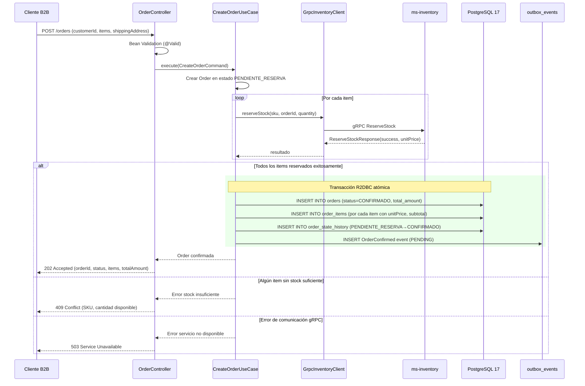
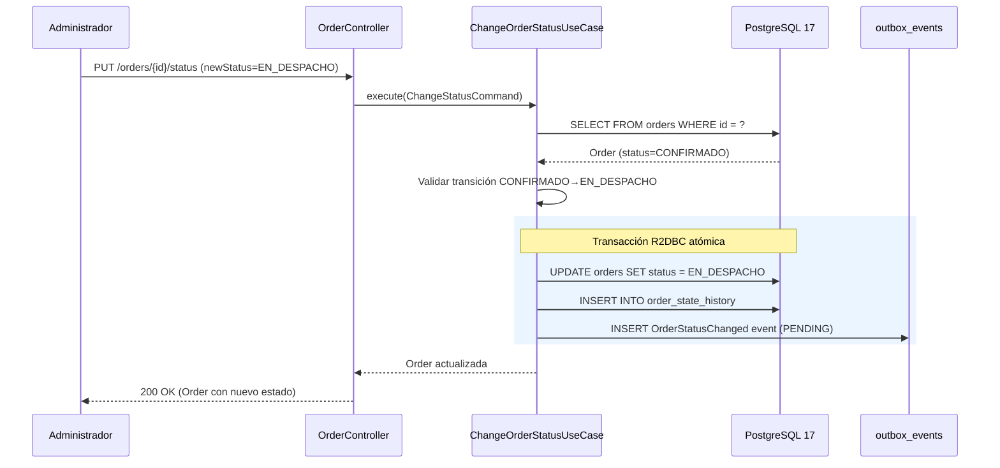
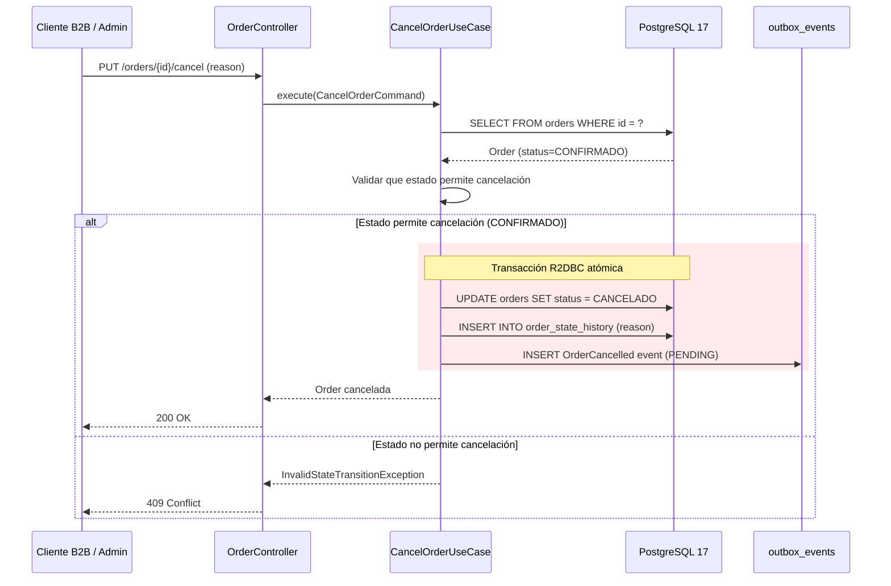
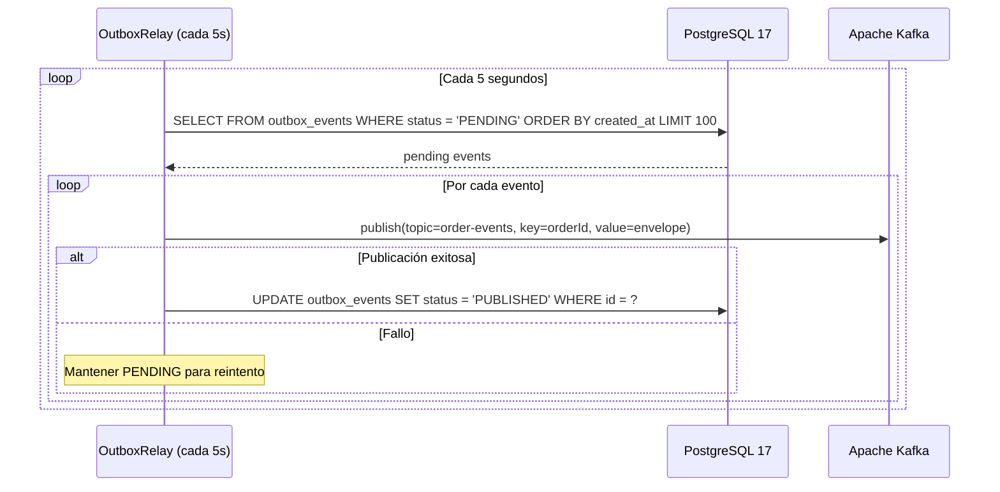
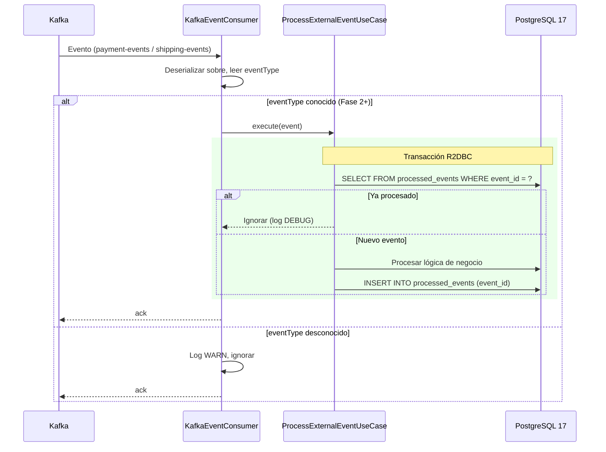
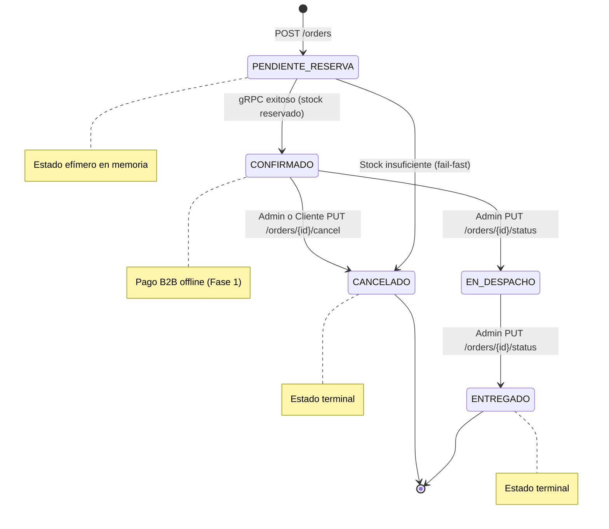

# Documento de Diseño — ms-order

## Visión General

`ms-order` es el microservicio dueño del Bounded Context **Gestión de Pedidos** y orquestador pasivo de la Saga Secuencial dentro de la plataforma B2B Arka. Su misión es gestionar el ciclo de vida completo de las órdenes de compra: creación con múltiples productos, validación síncrona de stock vía gRPC contra `ms-inventory`, máquina de estados del pedido (sealed interface con pattern matching en Java 21), auditoría de transiciones y publicación de eventos de dominio al tópico `order-events` de Kafka mediante el Transactional Outbox Pattern. Cubre la HU4 (Registrar una orden de compra) de la Fase 1 (MVP).

En Fase 1, el pago se gestiona como proceso externo B2B (facturación diferida a 30-60 días), por lo que las órdenes con stock reservado transicionan automáticamente a CONFIRMADO. La respuesta al cliente es `202 Accepted` dado que los procesos asíncronos posteriores (notificaciones, eventos) aún están en cola.

### Decisiones de Diseño Clave

1. **Sealed interface para estados**: `OrderStatus` modela los estados como sealed interface con records, habilitando pattern matching exhaustivo en compile-time (Java 21). Extensible para Fase 2 (`PendingPayment`) sin modificar estados existentes.
2. **Máquina de estados en dominio**: Las transiciones válidas se validan a nivel de dominio, no en infraestructura. Transiciones inválidas lanzan `InvalidStateTransitionException`.
3. **gRPC client fail-fast**: La reserva de stock es síncrona vía gRPC. Si `ms-inventory` rechaza o no responde, la orden no se persiste (fail-fast sin ensuciar Kafka).
4. **Transactional Outbox Pattern**: Los eventos de dominio se insertan en `outbox_events` dentro de la misma transacción R2DBC que la escritura de negocio. Un relay asíncrono (poll cada 5s) los publica a Kafka.
5. **Idempotencia en consumidores**: La tabla `processed_events` con `event_id` como PK garantiza procesamiento exactamente-una-vez de eventos Kafka.
6. **Columna generada `subtotal`**: En `order_items`, calculada como `quantity * unit_price` a nivel de PostgreSQL, eliminando inconsistencias.
7. **Records como estándar**: Todas las entidades, VOs, comandos, eventos y DTOs son `record` con `@Builder(toBuilder = true)`.
8. **Sin MapStruct**: Mappers manuales con métodos estáticos y `@Builder`.
9. **RBAC por header**: El rol y la identidad del usuario se propagan desde el API Gateway vía headers `X-User-Email` y `X-User-Role`. Los endpoints validan acceso según rol (CUSTOMER, ADMIN).
10. **Patrón Controller → Handler → UseCase (§4.2)**: El `OrderController` es thin (solo HTTP concerns), el `OrderHandler` (`@Component`) orquesta UseCase + mapeo + `ResponseEntity`/`Flux`. Reutilizar patrón de `ms-inventory` (`StockController` → `StockHandler` → `StockUseCase`).
11. **Reutilización de implementaciones probadas**: Para patrones transversales (Outbox Relay, Kafka Producer/Consumer, ProcessedEvents, GlobalExceptionHandler, Controller→Handler), se DEBE reutilizar la implementación ya probada de `ms-inventory` adaptando solo lo específico del dominio.
12. **IMPORTANTE (§B.12):** `ReactiveKafkaConsumerTemplate` fue eliminado en spring-kafka 4.0 (Spring Boot 4.0.3). El consumidor Kafka usa `KafkaReceiver` de reactor-kafka directamente, con `KafkaConsumerConfig` (beans por tópico) y `KafkaConsumerLifecycle` (`ApplicationReadyEvent`).

---

## Arquitectura

### Diagrama de Componentes (Clean Architecture)

```mermaid
graph TB
    subgraph "Entry Points (infrastructure/entry-points)"
        OC[OrderController - REST]
        OH[OrderHandler]
        KC[KafkaEventConsumer]
        KCC[KafkaConsumerConfig]
        KCL[KafkaConsumerLifecycle]
        GEH[GlobalExceptionHandler]
    end

    subgraph "Use Cases (domain/usecase)"
        COU[CreateOrderUseCase]
        GOU[GetOrderUseCase]
        LOU[ListOrdersUseCase]
        CSOU[ChangeOrderStatusUseCase]
        CAOU[CancelOrderUseCase]
        PEU[ProcessExternalEventUseCase]
    end

    subgraph "Domain Model (domain/model)"
        O[Order]
        OI[OrderItem]
        OS[OrderStatus - sealed interface]
        OSH[OrderStateHistory]
        OE[OutboxEvent]
        OR[OrderRepository port]
        OIR[OrderItemRepository port]
        OSHR[OrderStateHistoryRepository port]
        OER[OutboxEventRepository port]
        PER[ProcessedEventRepository port]
        IC[InventoryClient port]
    end

    subgraph "Driven Adapters (infrastructure/driven-adapters)"
        R2O[R2dbcOrderAdapter]
        R2OI[R2dbcOrderItemAdapter]
        R2OSH[R2dbcOrderStateHistoryAdapter]
        R2OE[R2dbcOutboxAdapter]
        R2PE[R2dbcProcessedEventAdapter]
        GIC[GrpcInventoryClient]
        KOR[KafkaOutboxRelay]
    end

    subgraph "External Systems"
        PG[(PostgreSQL 17 - order_db)]
        Kafka[Apache Kafka]
        INV[ms-inventory - gRPC]
    end

    OC --> OH
    OH --> COU & GOU & LOU & CSOU & CAOU
    KC --> PEU

    COU --> OR & OIR & OSHR & OER & IC
    GOU --> OR & OIR
    LOU --> OR
    CSOU --> OR & OSHR & OER
    CAOU --> OR & OSHR & OER
    PEU --> OR & OSHR & OER & PER

    R2O -.-> OR
    R2OI -.-> OIR
    R2OSH -.-> OSHR
    R2OE -.-> OER
    R2PE -.-> PER
    GIC -.-> IC

    R2O & R2OI & R2OSH & R2OE & R2PE --> PG
    KOR --> Kafka & R2OE
    GIC --> INV
    KC --> Kafka
```



### Flujo de Creación de Orden (Camino Crítico — Happy Path)



### Flujo de Cambio de Estado (Despacho / Entrega)



### Flujo de Cancelación de Orden



### Flujo del Outbox Relay



### Flujo de Consumo de Eventos Kafka (Idempotente — Extensibilidad Fase 2+)



### Diagrama de Máquina de Estados



---

## Componentes e Interfaces

### Capa de Dominio — Modelo (`domain/model`)

#### Ports (Gateway Interfaces)

```java
// com.arka.model.order.gateways.OrderRepository
public interface OrderRepository {
    Mono<Order> save(Order order);
    Mono<Order> findById(UUID id);
    Mono<Order> updateStatus(UUID id, String newStatus);
    Flux<Order> findByFilters(String status, UUID customerId, int page, int size);
}

// com.arka.model.order.gateways.OrderItemRepository
public interface OrderItemRepository {
    Flux<OrderItem> saveAll(List<OrderItem> items);
    Flux<OrderItem> findByOrderId(UUID orderId);
}

// com.arka.model.order.gateways.OrderStateHistoryRepository
public interface OrderStateHistoryRepository {
    Mono<OrderStateHistory> save(OrderStateHistory history);
    Flux<OrderStateHistory> findByOrderId(UUID orderId);
}

// com.arka.model.outbox.gateways.OutboxEventRepository
public interface OutboxEventRepository {
    Mono<OutboxEvent> save(OutboxEvent event);
    Flux<OutboxEvent> findPending(int limit);
    Mono<Void> markAsPublished(UUID id);
}

// com.arka.model.processedevent.gateways.ProcessedEventRepository
public interface ProcessedEventRepository {
    Mono<Boolean> exists(UUID eventId);
    Mono<Void> save(UUID eventId);
}

// com.arka.model.order.gateways.InventoryClient
public interface InventoryClient {
    Mono<ReserveStockResult> reserveStock(String sku, UUID orderId, int quantity);
}
```

### Capa de Dominio — Casos de Uso (`domain/usecase`)

| Caso de Uso                    | Responsabilidad                                                                                                                                                                                                                                                | Ports Usados                                                                                                |
| ------------------------------ | -------------------------------------------------------------------------------------------------------------------------------------------------------------------------------------------------------------------------------------------------------------- | ----------------------------------------------------------------------------------------------------------- |
| `CreateOrderUseCase`           | Valida items, invoca gRPC por cada item para reservar stock, persiste Order con estado CONFIRMADO, items con precios, historial PENDIENTE_RESERVA→CONFIRMADO, y evento OrderConfirmed en outbox. Todo en una transacción R2DBC.                                 | `OrderRepository`, `OrderItemRepository`, `OrderStateHistoryRepository`, `OutboxEventRepository`, `InventoryClient` |
| `GetOrderUseCase`              | Consulta orden por ID con sus items. Valida acceso: CUSTOMER solo ve sus propias órdenes.                                                                                                                                                                      | `OrderRepository`, `OrderItemRepository`                                                                    |
| `ListOrdersUseCase`            | Lista órdenes paginadas con filtros por status y customerId. CUSTOMER ve solo sus órdenes (filtro automático).                                                                                                                                                  | `OrderRepository`                                                                                           |
| `ChangeOrderStatusUseCase`     | Valida transición de estado (CONFIRMADO→EN_DESPACHO, EN_DESPACHO→ENTREGADO), actualiza orden, registra historial y emite OrderStatusChanged en outbox. Solo ADMIN.                                                                                              | `OrderRepository`, `OrderStateHistoryRepository`, `OutboxEventRepository`                                   |
| `CancelOrderUseCase`           | Valida que la orden esté en estado cancelable (CONFIRMADO), transiciona a CANCELADO con reason, registra historial y emite OrderCancelled en outbox. CUSTOMER y ADMIN (CUSTOMER solo sus propias órdenes).                                                       | `OrderRepository`, `OrderStateHistoryRepository`, `OutboxEventRepository`                                   |
| `ProcessExternalEventUseCase`  | Verifica idempotencia (processed_events), procesa eventos de payment-events y shipping-events (Fase 2+). Infraestructura base lista para extensión.                                                                                                             | `OrderRepository`, `OrderStateHistoryRepository`, `OutboxEventRepository`, `ProcessedEventRepository`       |

### Capa de Infraestructura — Entry Points

#### DTOs de Request

```java
// CreateOrderRequest
@Builder(toBuilder = true)
public record CreateOrderRequest(
    @NotNull UUID customerId,
    @NotBlank String customerEmail,
    @NotBlank String shippingAddress,
    @NotEmpty List<@Valid OrderItemRequest> items,
    String notes
) {}

// OrderItemRequest
@Builder(toBuilder = true)
public record OrderItemRequest(
    @NotNull UUID productId,
    @NotBlank String sku,
    @NotNull @Positive Integer quantity
) {}

// ChangeStatusRequest
@Builder(toBuilder = true)
public record ChangeStatusRequest(
    @NotBlank String newStatus
) {}

// CancelOrderRequest
@Builder(toBuilder = true)
public record CancelOrderRequest(
    @NotBlank String reason
) {}
```

#### DTOs de Response

```java
// OrderResponse
@Builder(toBuilder = true)
public record OrderResponse(
    UUID orderId,
    UUID customerId,
    String status,
    BigDecimal totalAmount,
    String customerEmail,
    String shippingAddress,
    String notes,
    List<OrderItemResponse> items,
    Instant createdAt
) {}

// OrderItemResponse
@Builder(toBuilder = true)
public record OrderItemResponse(
    UUID id,
    UUID productId,
    String sku,
    String productName,
    int quantity,
    BigDecimal unitPrice,
    BigDecimal subtotal
) {}

// OrderSummaryResponse (para listados)
@Builder(toBuilder = true)
public record OrderSummaryResponse(
    UUID orderId,
    UUID customerId,
    String status,
    BigDecimal totalAmount,
    Instant createdAt
) {}

// ErrorResponse
public record ErrorResponse(String code, String message) {}
```

#### Controlador REST

| Endpoint                       | Método | Rol Requerido    | Retorno                                | Descripción                                |
| ------------------------------ | ------ | ---------------- | -------------------------------------- | ------------------------------------------ |
| `POST /orders`                 | POST   | CUSTOMER         | `Mono<OrderResponse>` (202 Accepted)   | Crear orden de compra                      |
| `GET /orders/{id}`             | GET    | CUSTOMER, ADMIN  | `Mono<OrderResponse>` (200 OK)         | Consultar detalle de orden                 |
| `GET /orders`                  | GET    | CUSTOMER, ADMIN  | `Flux<OrderSummaryResponse>` (200 OK)  | Listar órdenes con filtros                 |
| `PUT /orders/{id}/status`      | PUT    | ADMIN            | `Mono<OrderResponse>` (200 OK)         | Cambiar estado (despacho, entrega)         |
| `PUT /orders/{id}/cancel`      | PUT    | CUSTOMER, ADMIN  | `Mono<OrderResponse>` (200 OK)         | Cancelar orden                             |

#### Consumidor Kafka

> **Arquitectura (§B.12):** `ReactiveKafkaConsumerTemplate` fue eliminado en spring-kafka 4.0. Se usa `KafkaReceiver` de reactor-kafka directamente. Reutilizar los 3 archivos de `ms-inventory/infrastructure/entry-points/kafka-consumer/`: `KafkaConsumerConfig` (beans `KafkaReceiver` por tópico), `KafkaConsumerLifecycle` (`ApplicationReadyEvent` → `startConsuming()`), `KafkaEventConsumer` (switch eventType, per-msg acknowledge, retry backoff).

| Consumer             | Tópicos Suscritos                      | Consumer Group        | Eventos Procesados (Fase 2+)                                | Tecnología |
| -------------------- | -------------------------------------- | --------------------- | ----------------------------------------------------------- | ---------- |
| `KafkaEventConsumer` | `payment-events`, `shipping-events`    | `order-service-group` | `PaymentProcessed`, `PaymentFailed`, `ShippingDispatched`   | `KafkaReceiver` (reactor-kafka §B.12) |

Filtra por `eventType` del sobre estándar. Ignora tipos desconocidos con log WARN. En Fase 1, la infraestructura base está lista pero no procesa eventos activamente.

### Capa de Infraestructura — Driven Adapters

| Adapter                          | Implementa                     | Tecnología                              |
| -------------------------------- | ------------------------------ | --------------------------------------- |
| `R2dbcOrderAdapter`              | `OrderRepository`              | R2DBC DatabaseClient / `@Transactional` |
| `R2dbcOrderItemAdapter`          | `OrderItemRepository`          | R2DBC DatabaseClient                    |
| `R2dbcOrderStateHistoryAdapter`  | `OrderStateHistoryRepository`  | R2DBC DatabaseClient                    |
| `R2dbcOutboxAdapter`             | `OutboxEventRepository`        | R2DBC DatabaseClient                    |
| `R2dbcProcessedEventAdapter`     | `ProcessedEventRepository`     | R2DBC DatabaseClient                    |
| `GrpcInventoryClient`            | `InventoryClient`              | gRPC Stub (Protobuf)                    |
| `KafkaOutboxRelay`               | Scheduled relay (cada 5s)      | `KafkaSender` de `reactor-kafka` (§B.11) |

### Excepciones de Dominio

```java
// Jerarquía de excepciones
public abstract class DomainException extends RuntimeException {
    public abstract int getHttpStatus();
    public abstract String getCode();
}

public class OrderNotFoundException extends DomainException { /* 404, ORDER_NOT_FOUND */ }
public class InvalidStateTransitionException extends DomainException { /* 409, INVALID_STATE_TRANSITION */ }
public class InsufficientStockException extends DomainException { /* 409, INSUFFICIENT_STOCK */ }
public class InventoryServiceUnavailableException extends DomainException { /* 503, INVENTORY_UNAVAILABLE */ }
public class AccessDeniedException extends DomainException { /* 403, ACCESS_DENIED */ }
public class InvalidOrderStatusException extends DomainException { /* 400, INVALID_ORDER_STATUS */ }
```

---

## Modelos de Datos

### Entidades de Dominio (Records)

```java
// com.arka.model.order.Order
@Builder(toBuilder = true)
public record Order(
    UUID id,
    UUID customerId,
    String status,
    BigDecimal totalAmount,
    String customerEmail,
    String shippingAddress,
    String notes,
    Instant createdAt,
    Instant updatedAt
) {
    public Order {
        Objects.requireNonNull(customerId, "customerId is required");
        Objects.requireNonNull(customerEmail, "customerEmail is required");
        Objects.requireNonNull(shippingAddress, "shippingAddress is required");
        status = status != null ? status : "PENDIENTE_RESERVA";
        createdAt = createdAt != null ? createdAt : Instant.now();
        updatedAt = updatedAt != null ? updatedAt : Instant.now();
    }
}
```

```java
// com.arka.model.order.OrderItem
@Builder(toBuilder = true)
public record OrderItem(
    UUID id,
    UUID orderId,
    UUID productId,
    String sku,
    String productName,
    int quantity,
    BigDecimal unitPrice,
    BigDecimal subtotal  // generado: quantity * unitPrice
) {
    public OrderItem {
        Objects.requireNonNull(productId, "productId is required");
        Objects.requireNonNull(sku, "sku is required");
        if (quantity <= 0) throw new IllegalArgumentException("quantity must be > 0");
        subtotal = unitPrice != null
            ? unitPrice.multiply(BigDecimal.valueOf(quantity))
            : BigDecimal.ZERO;
    }
}

// com.arka.model.order.OrderStatus — Sealed Interface (Java 21)
public sealed interface OrderStatus permits
        OrderStatus.PendingReserve,
        OrderStatus.Confirmed,
        OrderStatus.InShipment,
        OrderStatus.Delivered,
        OrderStatus.Cancelled {

    String value();

    record PendingReserve() implements OrderStatus {
        public String value() { return "PENDIENTE_RESERVA"; }
    }
    record Confirmed(Instant confirmedAt) implements OrderStatus {
        public String value() { return "CONFIRMADO"; }
    }
    record InShipment(Instant dispatchedAt) implements OrderStatus {
        public String value() { return "EN_DESPACHO"; }
    }
    record Delivered(Instant deliveredAt) implements OrderStatus {
        public String value() { return "ENTREGADO"; }
    }
    record Cancelled(String reason, Instant cancelledAt) implements OrderStatus {
        public String value() { return "CANCELADO"; }
    }
}
```

```java
// com.arka.model.order.OrderStateTransition — Validador de transiciones
public final class OrderStateTransition {
    private OrderStateTransition() {}

    private static final Map<String, Set<String>> VALID_TRANSITIONS = Map.of(
        "PENDIENTE_RESERVA", Set.of("CONFIRMADO", "CANCELADO"),
        "CONFIRMADO", Set.of("EN_DESPACHO", "CANCELADO"),
        "EN_DESPACHO", Set.of("ENTREGADO")
    );

    private static final Set<String> TERMINAL_STATES = Set.of("ENTREGADO", "CANCELADO");

    public static boolean isValidTransition(String from, String to) {
        return VALID_TRANSITIONS.getOrDefault(from, Set.of()).contains(to);
    }

    public static boolean isTerminal(String status) {
        return TERMINAL_STATES.contains(status);
    }
}

// com.arka.model.order.OrderStateHistory
@Builder(toBuilder = true)
public record OrderStateHistory(
    UUID id,
    UUID orderId,
    String previousStatus,
    String newStatus,
    UUID changedBy,
    String reason,
    Instant createdAt
) {
    public OrderStateHistory {
        Objects.requireNonNull(orderId, "orderId is required");
        Objects.requireNonNull(newStatus, "newStatus is required");
        createdAt = createdAt != null ? createdAt : Instant.now();
    }
}
```

```java
// com.arka.model.order.ReserveStockResult — Resultado de gRPC
@Builder(toBuilder = true)
public record ReserveStockResult(
    boolean success,
    UUID reservationId,
    int availableQuantity,
    BigDecimal unitPrice,
    String reason
) {}
```

### Eventos de Dominio (Records)

```java
// com.arka.model.outbox.OutboxEvent
@Builder(toBuilder = true)
public record OutboxEvent(
    UUID id,
    EventType eventType,
    String topic,
    String partitionKey,  // orderId
    String payload,       // JSON serializado
    OutboxStatus status,
    Instant createdAt
) {
    public OutboxEvent {
        Objects.requireNonNull(eventType, "eventType is required");
        Objects.requireNonNull(payload, "payload is required");
        Objects.requireNonNull(partitionKey, "partitionKey is required");
        // id is nullable — DB generates UUID via DEFAULT gen_random_uuid()
        status = status != null ? status : OutboxStatus.PENDING;
        topic = topic != null ? topic : "order-events";
        createdAt = createdAt != null ? createdAt : Instant.now();
    }

    public boolean isPending() { return status == OutboxStatus.PENDING; }
    public boolean isPublished() { return status == OutboxStatus.PUBLISHED; }
    public OutboxEvent markAsPublished() {
        if (status != OutboxStatus.PENDING) {
            throw new IllegalStateException("Cannot publish event " + id + ". Current: " + status);
        }
        return this.toBuilder().status(OutboxStatus.PUBLISHED).build();
    }
}

// com.arka.model.outbox.OutboxStatus
public enum OutboxStatus { PENDING, PUBLISHED }

// com.arka.model.outbox.EventType
public enum EventType {
    ORDER_CREATED,
    ORDER_CONFIRMED,
    ORDER_STATUS_CHANGED,
    ORDER_CANCELLED
}
```

#### Sobre Estándar de Eventos Kafka

```java
// Envelope publicado al tópico order-events
@Builder(toBuilder = true)
public record DomainEventEnvelope(
    String eventId,        // UUID
    String eventType,      // OrderCreated | OrderConfirmed | OrderStatusChanged | OrderCancelled
    Instant timestamp,
    String source,         // "ms-order"
    String correlationId,
    Object payload
) {
    public static final String MS_SOURCE = "ms-order";

    public DomainEventEnvelope {
        Objects.requireNonNull(eventId, "eventId is required");
        Objects.requireNonNull(eventType, "eventType is required");
        Objects.requireNonNull(payload, "payload is required");
        timestamp = timestamp != null ? timestamp : Instant.now();
        source = source != null ? source : MS_SOURCE;
    }
}

// Payloads específicos
@Builder(toBuilder = true)
public record OrderConfirmedPayload(
    UUID orderId,
    UUID customerId,
    String customerEmail,
    List<OrderItemPayload> items,
    BigDecimal totalAmount
) {}

@Builder(toBuilder = true)
public record OrderStatusChangedPayload(
    UUID orderId,
    String previousStatus,
    String newStatus,
    String customerEmail
) {}

@Builder(toBuilder = true)
public record OrderCancelledPayload(
    UUID orderId,
    UUID customerId,
    String customerEmail,
    String reason
) {}

@Builder(toBuilder = true)
public record OrderItemPayload(
    String sku,
    int quantity,
    BigDecimal unitPrice
) {}
```

### Esquema PostgreSQL 17 (order_db)

#### Tabla: `orders`

```sql
CREATE TABLE orders (
    id                UUID PRIMARY KEY DEFAULT gen_random_uuid(),
    customer_id       UUID NOT NULL,
    status            VARCHAR(30) NOT NULL DEFAULT 'PENDIENTE_RESERVA',
    total_amount      DECIMAL(12,2) NOT NULL,
    customer_email    VARCHAR(255) NOT NULL,
    shipping_address  TEXT NOT NULL,
    notes             TEXT,
    created_at        TIMESTAMP WITH TIME ZONE DEFAULT NOW(),
    updated_at        TIMESTAMP WITH TIME ZONE DEFAULT NOW()
);

CREATE INDEX idx_orders_customer_id ON orders(customer_id);
CREATE INDEX idx_orders_status ON orders(status);
CREATE INDEX idx_orders_created_at ON orders(created_at DESC);
CREATE INDEX idx_orders_customer_status ON orders(customer_id, status);
```

#### Tabla: `order_items`

```sql
CREATE TABLE order_items (
    id            UUID PRIMARY KEY DEFAULT gen_random_uuid(),
    order_id      UUID NOT NULL REFERENCES orders(id),
    product_id    UUID NOT NULL,
    sku           VARCHAR(100) NOT NULL,
    product_name  VARCHAR(255),
    quantity      INTEGER NOT NULL CHECK (quantity > 0),
    unit_price    DECIMAL(12,2) NOT NULL,
    subtotal      DECIMAL(12,2) GENERATED ALWAYS AS (quantity * unit_price) STORED
);

CREATE INDEX idx_order_items_order_id ON order_items(order_id);
```

#### Tabla: `order_state_history`

```sql
CREATE TABLE order_state_history (
    id              UUID PRIMARY KEY DEFAULT gen_random_uuid(),
    order_id        UUID NOT NULL REFERENCES orders(id),
    previous_status VARCHAR(30),
    new_status      VARCHAR(30) NOT NULL,
    changed_by      UUID,
    reason          TEXT,
    created_at      TIMESTAMP WITH TIME ZONE DEFAULT NOW()
);

CREATE INDEX idx_state_history_order_id ON order_state_history(order_id);
```

#### Tabla: `outbox_events`

```sql
CREATE TABLE outbox_events (
    id             UUID PRIMARY KEY DEFAULT gen_random_uuid(),
    event_type     VARCHAR(50) NOT NULL,
    topic          VARCHAR(100) NOT NULL DEFAULT 'order-events',
    partition_key  VARCHAR(100) NOT NULL,
    payload        JSONB NOT NULL,
    status         VARCHAR(20) NOT NULL DEFAULT 'PENDING',
    created_at     TIMESTAMP WITH TIME ZONE DEFAULT NOW()
);

CREATE INDEX idx_outbox_status_created ON outbox_events(status, created_at);
```

#### Tabla: `processed_events`

```sql
CREATE TABLE processed_events (
    event_id     UUID PRIMARY KEY,
    processed_at TIMESTAMP WITH TIME ZONE DEFAULT NOW()
);
```

---

## Propiedades de Correctitud

_Una propiedad es una característica o comportamiento que debe mantenerse verdadero en todas las ejecuciones válidas de un sistema — esencialmente, una declaración formal sobre lo que el sistema debe hacer. Las propiedades sirven como puente entre especificaciones legibles por humanos y garantías de correctitud verificables por máquina._

### Propiedad 1: Validación rechaza entrada inválida

_Para cualquier_ solicitud de creación de orden donde algún campo requerido (customerId, customerEmail, shippingAddress, items) sea nulo, vacío o inválido (items vacío, quantity <= 0), el sistema debe rechazar la solicitud con código HTTP 400 sin invocar gRPC ni persistir datos.

**Valida: Requisitos 1.1, 1.8, 10.2**

### Propiedad 2: Creación exitosa produce todos los artefactos correctos

_Para cualquier_ solicitud de creación de orden válida donde ms-inventory confirma la reserva de todos los items vía gRPC, el sistema debe persistir: (a) una Orden con estado CONFIRMADO, (b) un OrderItem por cada item con unitPrice y subtotal correctos, (c) un registro en order_state_history con transición PENDIENTE_RESERVA→CONFIRMADO, y (d) un evento OrderConfirmed en outbox_events con payload conteniendo orderId, customerId, customerEmail, items (sku, quantity, unitPrice) y totalAmount.

**Valida: Requisitos 1.2, 1.3, 1.7, 7.9, 9.1, 9.2**

### Propiedad 3: Stock insuficiente aborta sin persistir

_Para cualquier_ solicitud de creación de orden donde ms-inventory rechaza la reserva de algún item por stock insuficiente, el sistema debe retornar código HTTP 409 con el detalle de todos los items rechazados (SKU y cantidad disponible), sin persistir la Orden, sin crear items, sin registrar historial y sin emitir eventos outbox.

**Valida: Requisitos 1.4, 9.3, 9.6**

### Propiedad 4: Invariante de total_amount

_Para cualquier_ orden creada exitosamente con N items, el campo `total_amount` de la orden debe ser exactamente igual a la suma de `quantity * unit_price` de cada item. Esta invariante debe mantenerse independientemente de la cantidad de items, los precios unitarios o las cantidades.

**Valida: Requisitos 1.5**

### Propiedad 5: Respuestas contienen todos los campos requeridos

_Para cualquier_ orden consultada exitosamente (creación con 202 o consulta con 200), la respuesta debe contener todos los campos requeridos: orderId (UUID no nulo), customerId, status (valor válido), totalAmount, shippingAddress, items (lista no vacía con productId, sku, quantity, unitPrice, subtotal por cada item) y createdAt.

**Valida: Requisitos 1.6, 2.1**

### Propiedad 6: Error de comunicación gRPC retorna 503

_Para cualquier_ solicitud de creación de orden donde el Cliente_gRPC no puede establecer conexión con ms-inventory (timeout, conexión rechazada, error de red), el sistema debe retornar código HTTP 503 sin persistir la Orden ni emitir eventos.

**Valida: Requisitos 1.9, 9.4, 10.4**

### Propiedad 7: Máquina de estados acepta solo transiciones válidas

_Para cualquier_ par de estados (from, to), la transición debe ser aceptada si y solo si pertenece al conjunto de transiciones válidas: {PENDIENTE_RESERVA→CONFIRMADO, PENDIENTE_RESERVA→CANCELADO, CONFIRMADO→EN_DESPACHO, CONFIRMADO→CANCELADO, EN_DESPACHO→ENTREGADO}. Cualquier transición fuera de este conjunto debe ser rechazada con código HTTP 409. ENTREGADO y CANCELADO son estados terminales sin transiciones de salida.

**Valida: Requisitos 4.2, 4.3, 4.4, 5.1, 5.2, 5.3, 5.4, 6.1, 6.2, 10.3**

### Propiedad 8: Transiciones válidas producen historial de auditoría completo

_Para cualquier_ transición de estado exitosa, debe existir un registro en `order_state_history` con: orderId correcto, previous_status igual al estado anterior, new_status igual al nuevo estado, changed_by con el userId del actor, y created_at no nulo. Si la transición incluye un reason (cancelación), el reason debe estar presente tanto en el historial como en el payload del evento de dominio correspondiente.

**Valida: Requisitos 4.5, 6.7**

### Propiedad 9: Transiciones válidas producen eventos outbox correctos

_Para cualquier_ transición de estado exitosa, debe existir un evento en `outbox_events` con: eventType correspondiente al tipo de transición (OrderConfirmed, OrderStatusChanged, OrderCancelled), status = PENDING, topic = "order-events", partition_key = orderId, y payload conteniendo todos los campos requeridos para su tipo específico. El sobre del evento debe incluir eventId (UUID), eventType, timestamp, source = "ms-order" y correlationId.

**Valida: Requisitos 4.6, 5.6, 6.5, 7.2, 7.3, 7.8, 7.9, 7.10, 7.11**

### Propiedad 10: Control de acceso para Cliente_B2B

_Para cualquier_ orden y cualquier Cliente_B2B cuyo customerId no coincida con el customerId de la orden, las operaciones de consulta (GET /orders/{id}) y cancelación (PUT /orders/{id}/cancel) deben retornar código HTTP 403 (Forbidden) sin modificar el estado de la orden.

**Valida: Requisitos 2.4, 6.4, 10.8**

### Propiedad 11: Listado de órdenes ordenado y filtrado correctamente

_Para cualquier_ conjunto de órdenes y cualquier combinación de filtros (status, customerId), el listado debe: (a) retornar solo órdenes que coincidan con todos los filtros aplicados, (b) estar ordenado por created_at descendente (para cada par consecutivo, el primero tiene created_at >= segundo), y (c) cuando el usuario es CUSTOMER, filtrar automáticamente por su customerId ignorando el parámetro customerId proporcionado.

**Valida: Requisitos 3.1, 3.2, 3.3, 3.4**

### Propiedad 12: Transición de estado del relay outbox

_Para cualquier_ evento en `outbox_events` con `status = PENDING`, si el relay lo publica exitosamente a Kafka, el status debe transicionar a `PUBLISHED`. Si la publicación falla, el evento debe permanecer con `status = PENDING` para reintento en el siguiente ciclo.

**Valida: Requisitos 7.5, 7.6**

### Propiedad 13: Eventos con eventType desconocido son ignorados

_Para cualquier_ evento recibido de Kafka con un eventType que no corresponde a un tipo procesable por ms-order, el sistema debe ignorar el evento sin lanzar excepciones, sin modificar el estado de ninguna orden y sin insertar registros en processed_events.

**Valida: Requisitos 8.2**

### Propiedad 14: Idempotencia en consumo de eventos

_Para cualquier_ evento Kafka procesado exitosamente (eventId registrado en processed_events), si el mismo evento (mismo eventId) se recibe una segunda vez, el sistema debe descartarlo sin ejecutar lógica de negocio, sin modificar órdenes, sin crear historial adicional y sin emitir eventos outbox adicionales.

**Valida: Requisitos 8.4**

### Propiedad 15: Respuestas de error tienen estructura correcta

_Para cualquier_ excepción (validación, dominio o inesperada), la respuesta debe contener un `ErrorResponse` con los campos `code` (no vacío) y `message` (no vacío). El código HTTP debe corresponder al tipo: 400 para validación, 403 para acceso denegado, 404 para no encontrado, 409 para transición inválida/stock insuficiente, 503 para servicio no disponible, y 500 para inesperadas. Las respuestas 500 no deben exponer detalles internos (stack trace, nombres de clase).

**Valida: Requisitos 10.5, 10.6**

---

## Manejo de Errores

### Jerarquía de Excepciones de Dominio

```text
DomainException (abstract)
├── OrderNotFoundException                  → HTTP 404, code: ORDER_NOT_FOUND
├── InvalidStateTransitionException         → HTTP 409, code: INVALID_STATE_TRANSITION
├── InsufficientStockException              → HTTP 409, code: INSUFFICIENT_STOCK
├── InventoryServiceUnavailableException    → HTTP 503, code: INVENTORY_UNAVAILABLE
├── AccessDeniedException                   → HTTP 403, code: ACCESS_DENIED
└── InvalidOrderStatusException             → HTTP 400, code: INVALID_ORDER_STATUS
```

### GlobalExceptionHandler (`@ControllerAdvice`)

| Tipo de Excepción                            | HTTP Status    | Código de Error              | Comportamiento                                                 |
| -------------------------------------------- | -------------- | ---------------------------- | -------------------------------------------------------------- |
| `WebExchangeBindException` (Bean Validation) | 400            | `VALIDATION_ERROR`           | Retorna campos inválidos en el mensaje                         |
| `InvalidOrderStatusException`                | 400            | `INVALID_ORDER_STATUS`       | Status proporcionado no es válido                              |
| `AccessDeniedException`                      | 403            | `ACCESS_DENIED`              | Cliente intenta acceder a orden ajena                          |
| `OrderNotFoundException`                     | 404            | `ORDER_NOT_FOUND`            | Orden no existe                                                |
| `InvalidStateTransitionException`            | 409            | `INVALID_STATE_TRANSITION`   | Transición de estado no permitida                              |
| `InsufficientStockException`                 | 409            | `INSUFFICIENT_STOCK`         | Stock insuficiente (detalle de SKUs)                           |
| `InventoryServiceUnavailableException`       | 503            | `INVENTORY_UNAVAILABLE`      | ms-inventory no responde                                       |
| `Exception` (inesperada)                     | 500            | `INTERNAL_ERROR`             | Log ERROR, mensaje genérico sin detalles internos              |

### Errores en Cadenas Reactivas

- `switchIfEmpty(Mono.error(new OrderNotFoundException(orderId)))` para orden no encontrada
- `onErrorResume(StatusRuntimeException.class, e -> Mono.error(new InventoryServiceUnavailableException(...)))` para errores gRPC
- `onErrorResume()` para manejo de errores en el relay outbox (log WARN, mantener PENDING)
- Nunca `try/catch` alrededor de publishers reactivos

### Errores en gRPC Client

El `GrpcInventoryClient` traduce respuestas y errores gRPC a tipos de dominio:

| Respuesta gRPC                    | Acción en ms-order                                                    |
| --------------------------------- | --------------------------------------------------------------------- |
| `success = true`                  | Continuar flujo, extraer unitPrice y reservationId                    |
| `success = false` (stock insuf.)  | Acumular fallo, reportar todos los items fallidos al final            |
| `UNAVAILABLE` / timeout           | Lanzar `InventoryServiceUnavailableException`                         |
| Error inesperado                  | Lanzar `InventoryServiceUnavailableException` con detalle en log      |

### Errores en Consumidores Kafka

- Eventos con `eventId` duplicado: ignorar silenciosamente (log DEBUG)
- Eventos con `eventType` desconocido: ignorar con log WARN
- Errores de procesamiento: log ERROR + retry con backoff exponencial (3 reintentos)
- Errores irrecuperables: enviar a Dead Letter Topic (DLT)

---

## Estrategia de Testing

### Enfoque Dual: Tests Unitarios + Tests Basados en Propiedades

El testing de `ms-order` combina dos enfoques complementarios:

1. **Tests unitarios** (JUnit 5 + Mockito + StepVerifier): Verifican ejemplos específicos, edge cases y condiciones de error.
2. **Tests basados en propiedades** (jqwik): Verifican propiedades universales con entradas generadas aleatoriamente, garantizando correctitud para todo el espacio de inputs.

### Librería de Property-Based Testing

**jqwik** — librería PBT nativa para JUnit 5 en Java. Se integra directamente con el test runner de JUnit sin configuración adicional.

```groovy
// build.gradle del módulo de test
testImplementation 'net.jqwik:jqwik:1.9.2'
```

### Configuración de Tests de Propiedades

- Mínimo **100 iteraciones** por test de propiedad (`@Property(tries = 100)`)
- Cada test de propiedad debe referenciar la propiedad del documento de diseño mediante un tag en comentario
- Formato del tag: `// Feature: ms-order, Property {N}: {título de la propiedad}`
- Cada propiedad de correctitud se implementa como un **único** test de propiedad con jqwik

### Tests Unitarios (JUnit 5 + Mockito + StepVerifier)

Los tests unitarios se enfocan en:

- **Ejemplos específicos**: Crear orden con datos concretos, consultar orden existente, cambiar estado con datos fijos
- **Edge cases**: Orden no encontrada (404), items vacíos (400), status inválido en filtro (400), cancelar orden ya cancelada (409), eventId duplicado (idempotencia)
- **Integración entre componentes**: Verificar que cada UseCase invoca correctamente los ports y el gRPC client
- **Condiciones de error**: gRPC timeout, gRPC connection refused, stock parcialmente insuficiente
- **Cadenas reactivas**: Usar `StepVerifier` para verificar publishers `Mono`/`Flux`

### Tests de Propiedades (jqwik)

Cada propiedad de correctitud del documento de diseño se implementa como un **único test de propiedad** con jqwik:

| Propiedad                                    | Test                                                                  | Generadores                                          |
| -------------------------------------------- | --------------------------------------------------------------------- | ---------------------------------------------------- |
| P1: Validación rechaza inválidos             | Generar requests con campos nulos/vacíos/inválidos                    | Strings vacíos, nulls, quantities <= 0, items vacíos |
| P2: Creación exitosa produce artefactos      | Generar órdenes válidas con gRPC exitoso, verificar todos artefactos  | Items aleatorios, precios, cantidades                |
| P3: Stock insuficiente aborta sin persistir  | Generar órdenes donde gRPC falla, verificar no-persistencia           | Items con stock insuficiente aleatorio               |
| P4: Invariante total_amount                  | Generar items con precios y cantidades, verificar suma                | BigDecimals positivos, quantities positivos          |
| P5: Respuestas campos completos              | Generar órdenes, consultar y verificar campos                         | Órdenes aleatorias                                   |
| P6: gRPC error → 503                         | Simular errores gRPC variados, verificar 503                         | Tipos de error gRPC aleatorios                       |
| P7: Máquina de estados                       | Generar pares (from, to), verificar aceptación/rechazo               | Todos los pares de estados posibles                  |
| P8: Historial de auditoría                   | Generar transiciones válidas, verificar historial                     | Transiciones válidas aleatorias                      |
| P9: Eventos outbox correctos                 | Generar transiciones válidas, verificar eventos                       | Transiciones válidas con datos aleatorios            |
| P10: Control de acceso CUSTOMER              | Generar órdenes y customers distintos, verificar 403                  | Pares (orderId, customerId) no coincidentes          |
| P11: Listado ordenado y filtrado             | Generar órdenes con timestamps y estados variados, verificar orden    | Timestamps, estados, customerIds aleatorios          |
| P12: Transición outbox relay                 | Generar eventos PENDING, simular éxito/fallo                         | Eventos aleatorios                                   |
| P13: Eventos desconocidos ignorados          | Generar eventos con eventTypes aleatorios no reconocidos              | Strings aleatorios como eventType                    |
| P14: Idempotencia consumo                    | Generar eventos y procesarlos dos veces                               | Eventos con eventId fijo                             |
| P15: Estructura ErrorResponse                | Generar excepciones de distintos tipos                                | DomainException, validation, unexpected              |

### Herramientas Adicionales

- **StepVerifier** (`reactor-test`): Verificación de publishers reactivos en todos los tests
- **BlockHound**: Detección de llamadas bloqueantes en tests de servicios WebFlux
- **ArchUnit**: Validación de dependencias entre capas de Clean Architecture
