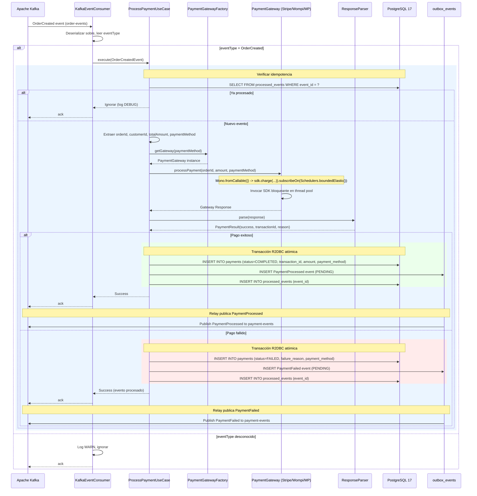
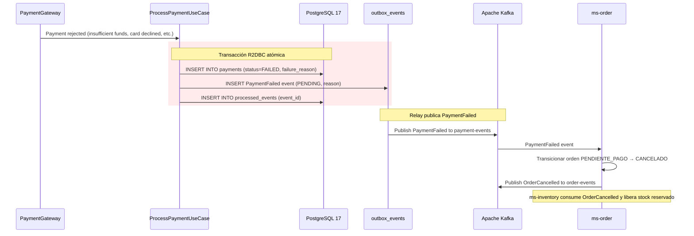
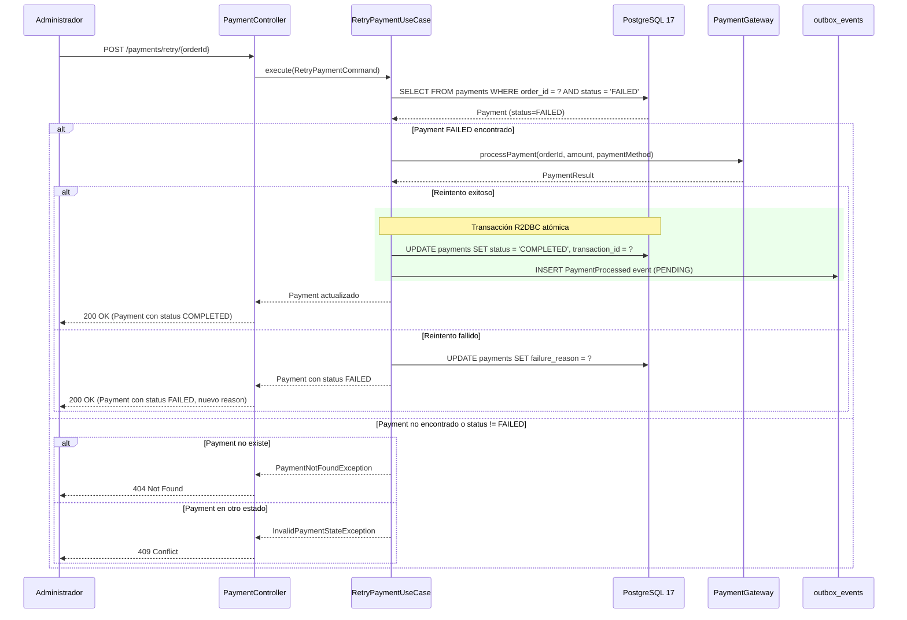
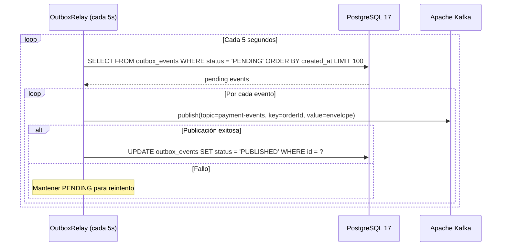
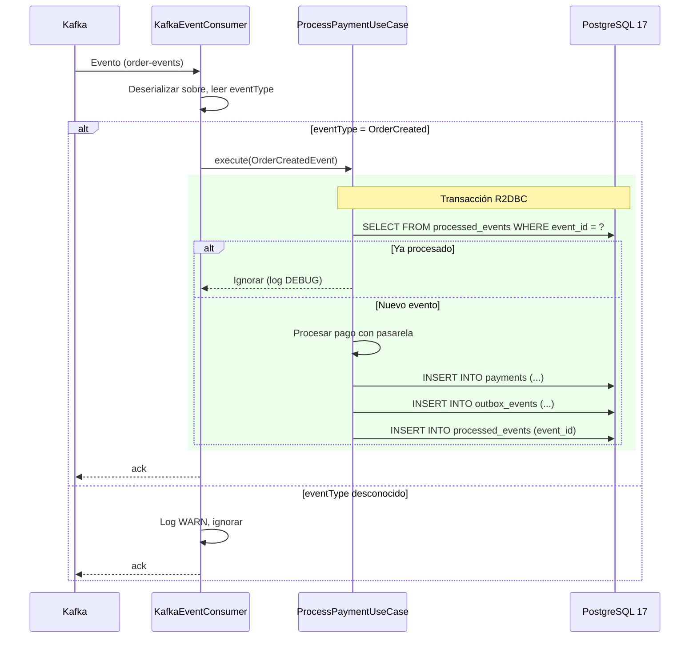
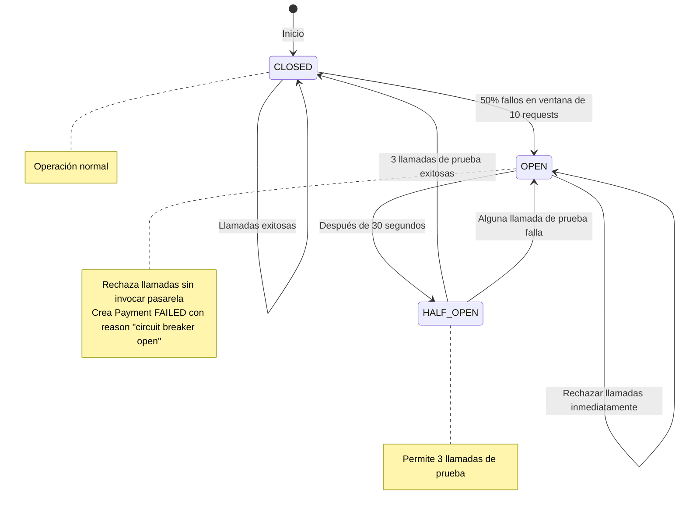

# Documento de Diseño — ms-payment

## Visión General

`ms-payment` es el microservicio dueño del Bounded Context **Procesamiento de Pagos B2B** dentro de la plataforma Arka. Su misión es actuar como Anti-Corruption Layer (ACL) para integrar múltiples pasarelas de pago externas (Stripe, Wompi, MercadoPago), aislar el dominio de las particularidades de los SDKs externos, y garantizar idempotencia rigurosa para prevenir cobros duplicados. Este servicio es un componente crítico de la Saga Secuencial orquestada por `ms-order` en la Fase 2 del proyecto. Consume eventos `OrderCreated` del tópico `order-events`, procesa pagos con la pasarela seleccionada según el `paymentMethod` especificado, y publica eventos `PaymentProcessed` o `PaymentFailed` al tópico `payment-events` mediante el Transactional Outbox Pattern.

Implementa patrones de resiliencia (Circuit Breaker, Bulkhead, Retry) con Resilience4j para manejar fallos de pasarelas externas, utiliza PostgreSQL 17 con R2DBC para persistencia reactiva, y aísla los SDKs bloqueantes de las pasarelas con `Schedulers.boundedElastic()` para no bloquear el EventLoop de Netty. Las credenciales de las pasarelas se gestionan mediante AWS Secrets Manager (LocalStack en desarrollo). El servicio expone endpoints REST administrativos para consultar pagos, listar transacciones con filtros y reintentar pagos fallidos manualmente.

### Decisiones de Diseño Clave

1. **ACL con Strategy + Factory**: El patrón Strategy permite seleccionar en runtime la implementación de `PaymentGateway` según el `paymentMethod` (stripe, wompi, mercadopago). El Factory encapsula la lógica de creación de instancias. Esto aísla el dominio de las particularidades de cada SDK externo.

2. **SDKs bloqueantes aislados**: Todos los SDKs de pasarelas (Stripe, Wompi, MercadoPago) son bloqueantes. Se envuelven con `Mono.fromCallable(() -> sdk.charge(...)).subscribeOn(Schedulers.boundedElastic())` para ejecutarlos en un pool de threads dedicado sin bloquear el EventLoop de Netty.

3. **Resilience4j para resiliencia**: Cada pasarela tiene su propio Circuit Breaker (50% threshold, 30s open), Retry Policy (backoff exponencial 2s/4s/8s, máximo 3 reintentos) y Bulkhead (10 llamadas concurrentes). Esto previene cascadas de fallos y aísla recursos.

4. **Idempotencia rigurosa en múltiples niveles**:
   - **Nivel 1 (Kafka)**: Tabla `processed_events` con `event_id` como PK garantiza procesamiento exactamente-una-vez de eventos Kafka.
   - **Nivel 2 (BD)**: Constraint `UNIQUE` en `transaction_id` previene cobros duplicados si la pasarela retorna el mismo ID.
   - **Nivel 3 (Aplicación)**: Validación de unicidad de `transaction_id` antes de INSERT como primera línea de defensa.

5. **Parsers con round-trip property**: Cada pasarela tiene un `Parser` (extrae `Transaction_ID` y estado de la respuesta) y un `Pretty_Printer` (formatea `PaymentResult` de vuelta al formato de la pasarela). La propiedad de round-trip garantiza que `parse(prettyPrint(x)) == x` para todo `PaymentResult` válido.

6. **AWS Secrets Manager**: Las credenciales de las pasarelas (`api-key` por pasarela) se almacenan en AWS Secrets Manager y se recuperan al iniciar la aplicación. LocalStack simula Secrets Manager en el perfil `local`. Las credenciales se cachean en memoria para evitar llamadas repetidas.

7. **Sealed interface para PaymentStatus**: `PaymentStatus` modela los estados como sealed interface con records: `Pending`, `Completed`, `Failed`. Habilita pattern matching exhaustivo en compile-time (Java 21).

8. **Enum para PaymentMethod**: `PaymentMethod` es un enum con valores `STRIPE`, `WOMPI`, `MERCADOPAGO`. Facilita validación y selección de pasarela.

9. **Records como estándar**: Todas las entidades, VOs, comandos, eventos y DTOs son `record` con `@Builder(toBuilder = true)`.

10. **Transactional Outbox Pattern**: Los eventos de dominio se insertan en `outbox_events` dentro de la misma transacción R2DBC que la escritura del `Payment`. Un relay asíncrono (poll cada 5s) los publica a Kafka usando `orderId` como partition key para garantizar orden causal por orden.

11. **Reutilización de patrones de ms-inventory**: Para patrones transversales (Outbox Relay, Kafka Producer/Consumer, ProcessedEvents, GlobalExceptionHandler), se DEBE reutilizar la implementación ya probada de `ms-inventory` adaptando solo lo específico del dominio (entidades, tópicos, payloads, `MS_SOURCE`).

12. **IMPORTANTE (§B.12):** `ReactiveKafkaConsumerTemplate` fue eliminado en spring-kafka 4.0 (Spring Boot 4.0.3). El consumidor Kafka usa `KafkaReceiver` de reactor-kafka directamente, con `KafkaConsumerConfig` (beans por tópico) y `KafkaConsumerLifecycle` (`ApplicationReadyEvent`).

13. **Timeout de 30 segundos**: Cada llamada a pasarela tiene un timeout de 30 segundos mediante el operador `timeout()` de Reactor. Si se excede, se crea un `Payment` con status `FAILED` y `failure_reason` indicando timeout.

---

## Arquitectura

### Diagrama de Componentes (Clean Architecture)

```mermaid
graph TB
    subgraph "Entry Points (infrastructure/entry-points)"
        PC[PaymentController - REST]
        PH[PaymentHandler]
        KC[KafkaEventConsumer]
        KCC[KafkaConsumerConfig]
        KCL[KafkaConsumerLifecycle]
        GEH[GlobalExceptionHandler]
    end

    subgraph "Use Cases (domain/usecase)"
        PPU[ProcessPaymentUseCase]
        GPU[GetPaymentUseCase]
        LPU[ListPaymentsUseCase]
        RPU[RetryPaymentUseCase]
        PEU[ProcessExternalEventUseCase]
    end

    subgraph "Domain Model (domain/model)"
        P[Payment]
        PS[PaymentStatus - sealed interface]
        PM[PaymentMethod - enum]
        PR[PaymentResult]
        OE[OutboxEvent]
        PE[ProcessedEvent]
        PREP[PaymentRepository port]
        OER[OutboxEventRepository port]
        PER[ProcessedEventRepository port]
        PG[PaymentGateway port]
        PGF[PaymentGatewayFactory port]
        SM[SecretsManager port]
    end

    subgraph "Driven Adapters (infrastructure/driven-adapters)"
        R2P[R2dbcPaymentAdapter]
        R2OE[R2dbcOutboxAdapter]
        R2PE[R2dbcProcessedEventAdapter]
        SPG[StripePaymentGateway]
        WPG[WompiPaymentGateway]
        MPG[MercadoPagoPaymentGateway]
        PGFI[PaymentGatewayFactoryImpl]
        AWSSM[AwsSecretsManagerAdapter]
        KOR[KafkaOutboxRelay]
    end

    subgraph "External Systems"
        PG_DB[(PostgreSQL 17 - payment_db)]
        Kafka[Apache Kafka]
        Stripe[Stripe API]
        Wompi[Wompi API]
        MercadoPago[MercadoPago API]
        AWS[AWS Secrets Manager / LocalStack]
    end

    PC --> PH
    PH --> GPU & LPU & RPU
    KC --> PEU

    PPU --> PREP & OER & PG & PGF
    GPU --> PREP
    LPU --> PREP
    RPU --> PREP & OER & PG & PGF
    PEU --> PREP & OER & PER

    R2P -.-> PREP
    R2OE -.-> OER
    R2PE -.-> PER
    SPG & WPG & MPG -.-> PG
    PGFI -.-> PGF
    AWSSM -.-> SM

    R2P & R2OE & R2PE --> PG_DB
    KOR --> Kafka & R2OE
    SPG --> Stripe
    WPG --> Wompi
    MPG --> MercadoPago
    AWSSM --> AWS
    KC --> Kafka
```




### Flujo de Procesamiento de Pago (Happy Path)



### Flujo de Pago Fallido con Compensación



### Flujo de Reintento Manual



### Flujo del Outbox Relay



### Flujo de Consumo de Eventos Kafka (Idempotente)



### Flujo de Circuit Breaker



---

## Componentes e Interfaces

### Capa de Dominio — Modelo (`domain/model`)

#### Ports (Gateway Interfaces)

```java
// com.arka.model.payment.gateways.PaymentRepository
public interface PaymentRepository {
    Mono<Payment> save(Payment payment);
    Mono<Payment> findByOrderId(UUID orderId);
    Mono<Payment> updateStatus(UUID orderId, String newStatus, String transactionId);
    Flux<Payment> findByFilters(String status, String paymentMethod, int page, int size);
}

// com.arka.model.outbox.gateways.OutboxEventRepository
public interface OutboxEventRepository {
    Mono<OutboxEvent> save(OutboxEvent event);
    Flux<OutboxEvent> findPending(int limit);
    Mono<Void> markAsPublished(UUID id);
}

// com.arka.model.processedevent.gateways.ProcessedEventRepository
public interface ProcessedEventRepository {
    Mono<Boolean> exists(UUID eventId);
    Mono<Void> save(UUID eventId);
}

// com.arka.model.payment.gateways.PaymentGateway
public interface PaymentGateway {
    Mono<PaymentResult> processPayment(UUID orderId, BigDecimal amount, String currency);
    PaymentMethod supportedMethod();
}

// com.arka.model.payment.gateways.PaymentGatewayFactory
public interface PaymentGatewayFactory {
    PaymentGateway getGateway(PaymentMethod method);
}

// com.arka.model.secrets.gateways.SecretsManager
public interface SecretsManager {
    Mono<String> getSecret(String secretName);
}
```

### Capa de Dominio — Casos de Uso (`domain/usecase`)

| Caso de Uso                    | Responsabilidad                                                                                                                                                                                                                 | Ports Usados                                                                                                        |
| ------------------------------ | ------------------------------------------------------------------------------------------------------------------------------------------------------------------------------------------------------------------------------- | ------------------------------------------------------------------------------------------------------------------- |
| `ProcessPaymentUseCase`        | Verifica idempotencia (processed_events), extrae datos del evento OrderCreated, selecciona pasarela vía Factory, invoca `PaymentGateway.processPayment()`, parsea respuesta, persiste Payment con status COMPLETED o FAILED, inserta evento PaymentProcessed o PaymentFailed en outbox, y registra eventId en processed_events. Todo en una transacción R2DBC. | `PaymentRepository`, `OutboxEventRepository`, `ProcessedEventRepository`, `PaymentGateway`, `PaymentGatewayFactory` |
| `GetPaymentUseCase`            | Consulta pago por orderId. Solo ADMIN.                                                                                                                                                                                          | `PaymentRepository`                                                                                                 |
| `ListPaymentsUseCase`          | Lista pagos paginados con filtros por status y paymentMethod. Solo ADMIN.                                                                                                                                                       | `PaymentRepository`                                                                                                 |
| `RetryPaymentUseCase`          | Busca Payment con status FAILED por orderId, reintenta procesamiento con la misma pasarela y monto, actualiza status a COMPLETED (si exitoso) o mantiene FAILED (si falla), inserta evento PaymentProcessed solo si exitoso. Solo ADMIN. | `PaymentRepository`, `OutboxEventRepository`, `PaymentGateway`, `PaymentGatewayFactory`                             |
| `ProcessExternalEventUseCase`  | Procesa eventos externos (actualmente solo OrderCreated). Delega a ProcessPaymentUseCase.                                                                                                                                       | `ProcessPaymentUseCase`                                                                                             |

### Capa de Infraestructura — Entry Points

#### DTOs de Request

```java
// RetryPaymentRequest (body vacío, orderId en path)
@Builder(toBuilder = true)
public record RetryPaymentRequest() {}
```

#### DTOs de Response

```java
// PaymentResponse
@Builder(toBuilder = true)
public record PaymentResponse(
    UUID id,
    UUID orderId,
    String transactionId,
    String paymentMethod,
    BigDecimal amount,
    String currency,
    String status,
    String failureReason,
    Instant createdAt,
    Instant updatedAt
) {}

// PaymentSummaryResponse (para listados)
@Builder(toBuilder = true)
public record PaymentSummaryResponse(
    UUID id,
    UUID orderId,
    String paymentMethod,
    BigDecimal amount,
    String status,
    Instant createdAt
) {}

// ErrorResponse
public record ErrorResponse(String code, String message) {}
```

#### Controlador REST

| Endpoint                         | Método | Rol Requerido | Retorno                                  | Descripción                        |
| -------------------------------- | ------ | ------------- | ---------------------------------------- | ---------------------------------- |
| `GET /payments/{orderId}`        | GET    | ADMIN         | `Mono<PaymentResponse>` (200 OK)         | Consultar pago por orderId         |
| `GET /payments`                  | GET    | ADMIN         | `Flux<PaymentSummaryResponse>` (200 OK)  | Listar pagos con filtros           |
| `POST /payments/retry/{orderId}` | POST   | ADMIN         | `Mono<PaymentResponse>` (200 OK)         | Reintentar pago fallido manualmente |

#### Consumidor Kafka

> **Arquitectura (§B.12):** `ReactiveKafkaConsumerTemplate` fue eliminado en spring-kafka 4.0. Se usa `KafkaReceiver` de reactor-kafka directamente. Reutilizar los 3 archivos de `ms-inventory/infrastructure/entry-points/kafka-consumer/`: `KafkaConsumerConfig` (beans `KafkaReceiver` por tópico), `KafkaConsumerLifecycle` (`ApplicationReadyEvent` → `startConsuming()`), `KafkaEventConsumer` (switch eventType, per-msg acknowledge, retry backoff).

| Consumer             | Tópicos Suscritos | Consumer Group          | Eventos Procesados | Tecnología                            |
| -------------------- | ----------------- | ----------------------- | ------------------ | ------------------------------------- |
| `KafkaEventConsumer` | `order-events`    | `payment-service-group` | `OrderCreated`     | `KafkaReceiver` (reactor-kafka §B.12) |

Filtra por `eventType` del sobre estándar. Procesa activamente `OrderCreated` (extrae orderId, customerId, totalAmount, paymentMethod). Ignora tipos desconocidos con log WARN.

### Capa de Infraestructura — Driven Adapters

| Adapter                         | Implementa                    | Tecnología                               |
| ------------------------------- | ----------------------------- | ---------------------------------------- |
| `R2dbcPaymentAdapter`           | `PaymentRepository`           | R2DBC DatabaseClient / `@Transactional`  |
| `R2dbcOutboxAdapter`            | `OutboxEventRepository`       | R2DBC DatabaseClient                     |
| `R2dbcProcessedEventAdapter`    | `ProcessedEventRepository`    | R2DBC DatabaseClient                     |
| `StripePaymentGateway`          | `PaymentGateway`              | Stripe SDK + `Schedulers.boundedElastic()` |
| `WompiPaymentGateway`           | `PaymentGateway`              | Wompi SDK + `Schedulers.boundedElastic()` |
| `MercadoPagoPaymentGateway`     | `PaymentGateway`              | MercadoPago SDK + `Schedulers.boundedElastic()` |
| `PaymentGatewayFactoryImpl`     | `PaymentGatewayFactory`       | Strategy + Factory pattern               |
| `AwsSecretsManagerAdapter`      | `SecretsManager`              | AWS SDK / LocalStack                     |
| `KafkaOutboxRelay`              | Scheduled relay (cada 5s)     | `KafkaSender` de `reactor-kafka` (§B.11) |

### Excepciones de Dominio

```java
// Jerarquía de excepciones
public abstract class DomainException extends RuntimeException {
    public abstract int getHttpStatus();
    public abstract String getCode();
}

public class PaymentNotFoundException extends DomainException { /* 404, PAYMENT_NOT_FOUND */ }
public class InvalidPaymentStateException extends DomainException { /* 409, INVALID_PAYMENT_STATE */ }
public class PaymentGatewayUnavailableException extends DomainException { /* 503, GATEWAY_UNAVAILABLE */ }
public class InvalidPaymentMethodException extends DomainException { /* 400, INVALID_PAYMENT_METHOD */ }
public class InvalidPaymentStatusException extends DomainException { /* 400, INVALID_PAYMENT_STATUS */ }
public class DuplicateTransactionException extends DomainException { /* 409, DUPLICATE_TRANSACTION */ }
public class CircuitBreakerOpenException extends DomainException { /* 503, CIRCUIT_BREAKER_OPEN */ }
public class BulkheadFullException extends DomainException { /* 503, BULKHEAD_FULL */ }
```

---

## Modelos de Datos

### Entidades de Dominio (Records)

```java
// com.arka.model.payment.Payment
@Builder(toBuilder = true)
public record Payment(
    UUID id,
    UUID orderId,
    String transactionId,
    PaymentMethod paymentMethod,
    BigDecimal amount,
    String currency,
    PaymentStatus status,
    String failureReason,
    Instant createdAt,
    Instant updatedAt
) {
    public Payment {
        Objects.requireNonNull(orderId, "orderId is required");
        Objects.requireNonNull(paymentMethod, "paymentMethod is required");
        Objects.requireNonNull(amount, "amount is required");
        if (amount.compareTo(BigDecimal.ZERO) <= 0) {
            throw new IllegalArgumentException("amount must be > 0");
        }
        currency = currency != null ? currency : "COP";
        status = status != null ? status : PaymentStatus.PENDING;
        createdAt = createdAt != null ? createdAt : Instant.now();
        updatedAt = updatedAt != null ? updatedAt : Instant.now();
    }
}
```

```java
// com.arka.model.payment.PaymentStatus — Sealed Interface (Java 21)
public sealed interface PaymentStatus permits
        PaymentStatus.Pending,
        PaymentStatus.Completed,
        PaymentStatus.Failed {

    String DEFAULT_STATUS = "PENDING";
    String value();

    static PaymentStatus fromValue(String value) {
        return switch (value) {
            case "PENDING"   -> new Pending();
            case "COMPLETED" -> new Completed();
            case "FAILED"    -> new Failed();
            default -> throw new InvalidPaymentStatusException("Unknown payment status: '" + value + "'");
        };
    }

    record Pending() implements PaymentStatus {
        public String value() { return "PENDING"; }
    }
    record Completed() implements PaymentStatus {
        public String value() { return "COMPLETED"; }
    }
    record Failed() implements PaymentStatus {
        public String value() { return "FAILED"; }
    }
}
```

```java
// com.arka.model.payment.PaymentMethod — Enum
public enum PaymentMethod {
    STRIPE("stripe"),
    WOMPI("wompi"),
    MERCADOPAGO("mercadopago");

    private final String value;
    PaymentMethod(String value) { this.value = value; }
    public String value() { return value; }

    public static PaymentMethod fromValue(String value) {
        return switch (value.toLowerCase()) {
            case "stripe" -> STRIPE;
            case "wompi" -> WOMPI;
            case "mercadopago" -> MERCADOPAGO;
            default -> throw new InvalidPaymentMethodException("Unknown payment method: '" + value + "'");
        };
    }
}
```

```java
// com.arka.model.payment.PaymentResult — Resultado de procesamiento
@Builder(toBuilder = true)
public record PaymentResult(
    boolean success,
    String transactionId,
    String reason
) {
    public PaymentResult {
        if (success && transactionId == null) {
            throw new IllegalArgumentException("transactionId is required for successful payments");
        }
        if (!success && reason == null) {
            throw new IllegalArgumentException("reason is required for failed payments");
        }
    }
}
```

### Eventos de Dominio (Records)

```java
// com.arka.model.outbox.OutboxEvent
@Builder(toBuilder = true)
public record OutboxEvent(
    UUID id,
    EventType eventType,
    String topic,
    String partitionKey,  // orderId
    String payload,       // JSON serializado
    OutboxStatus status,
    Instant createdAt
) {
    public OutboxEvent {
        Objects.requireNonNull(eventType, "eventType is required");
        Objects.requireNonNull(payload, "payload is required");
        Objects.requireNonNull(partitionKey, "partitionKey is required");
        // id is nullable — DB generates UUID via DEFAULT gen_random_uuid()
        status = status != null ? status : OutboxStatus.PENDING;
        topic = topic != null ? topic : "payment-events";
        createdAt = createdAt != null ? createdAt : Instant.now();
    }

    public boolean isPending() { return status == OutboxStatus.PENDING; }
    public boolean isPublished() { return status == OutboxStatus.PUBLISHED; }
    public OutboxEvent markAsPublished() {
        if (status != OutboxStatus.PENDING) {
            throw new IllegalStateException("Cannot publish event " + id + ". Current: " + status);
        }
        return this.toBuilder().status(OutboxStatus.PUBLISHED).build();
    }
}

// com.arka.model.outbox.OutboxStatus
public enum OutboxStatus { PENDING, PUBLISHED }

// com.arka.model.outbox.EventType
public enum EventType {
    PAYMENT_PROCESSED("PaymentProcessed"),
    PAYMENT_FAILED("PaymentFailed");

    private final String value;
    EventType(String value) { this.value = value; }
    public String value() { return value; }
}
```

#### Sobre Estándar de Eventos Kafka

```java
// Envelope publicado al tópico payment-events
@Builder(toBuilder = true)
public record DomainEventEnvelope(
    String eventId,        // UUID
    String eventType,      // PaymentProcessed | PaymentFailed
    Instant timestamp,
    String source,         // "ms-payment"
    String correlationId,
    Object payload
) {
    public static final String MS_SOURCE = "ms-payment";

    public DomainEventEnvelope {
        Objects.requireNonNull(eventId, "eventId is required");
        Objects.requireNonNull(eventType, "eventType is required");
        Objects.requireNonNull(payload, "payload is required");
        timestamp = timestamp != null ? timestamp : Instant.now();
        source = source != null ? source : MS_SOURCE;
    }
}

// Payloads específicos
@Builder(toBuilder = true)
public record PaymentProcessedPayload(
    UUID orderId,
    String transactionId,
    BigDecimal amount,
    String paymentMethod,
    Instant timestamp
) {}

@Builder(toBuilder = true)
public record PaymentFailedPayload(
    UUID orderId,
    String reason,
    String paymentMethod,
    Instant timestamp
) {}
```

### Esquema PostgreSQL 17 (payment_db)

#### Tabla: `payments`

```sql
CREATE TABLE payments (
    id                UUID PRIMARY KEY DEFAULT gen_random_uuid(),
    order_id          UUID NOT NULL,
    transaction_id    VARCHAR(255) UNIQUE NOT NULL,
    payment_method    VARCHAR(50) NOT NULL,
    amount            DECIMAL(12,2) NOT NULL,
    currency          VARCHAR(3) DEFAULT 'COP',
    status            VARCHAR(20) NOT NULL DEFAULT 'PENDING',
    failure_reason    TEXT,
    created_at        TIMESTAMP WITH TIME ZONE DEFAULT NOW(),
    updated_at        TIMESTAMP WITH TIME ZONE DEFAULT NOW()
);

CREATE INDEX idx_payments_order_id ON payments(order_id);
CREATE INDEX idx_payments_status ON payments(status);
CREATE INDEX idx_payments_created_at ON payments(created_at DESC);
CREATE INDEX idx_payments_payment_method ON payments(payment_method);
```

#### Tabla: `outbox_events`

```sql
CREATE TABLE outbox_events (
    id             UUID PRIMARY KEY DEFAULT gen_random_uuid(),
    event_type     VARCHAR(50) NOT NULL,
    topic          VARCHAR(100) NOT NULL DEFAULT 'payment-events',
    partition_key  VARCHAR(100) NOT NULL,
    payload        JSONB NOT NULL,
    status         VARCHAR(20) NOT NULL DEFAULT 'PENDING',
    created_at     TIMESTAMP WITH TIME ZONE DEFAULT NOW()
);

CREATE INDEX idx_outbox_status_created ON outbox_events(status, created_at);
```

#### Tabla: `processed_events`

```sql
CREATE TABLE processed_events (
    event_id     UUID PRIMARY KEY,
    processed_at TIMESTAMP WITH TIME ZONE DEFAULT NOW()
);
```

---

## Propiedades de Correctitud

_Una propiedad es una característica o comportamiento que debe mantenerse verdadero en todas las ejecuciones válidas de un sistema — esencialmente, una declaración formal sobre lo que el sistema debe hacer. Las propiedades sirven como puente entre especificaciones legibles por humanos y garantías de correctitud verificables por máquina._

### Propiedad 1: Parseo de eventos OrderCreated extrae todos los campos

_Para cualquier_ evento OrderCreated válido con payload conteniendo orderId, customerId, totalAmount y paymentMethod, el sistema debe extraer correctamente todos estos campos y utilizarlos para procesar el pago.

**Valida: Requisitos 1.2**

### Propiedad 2: Idempotencia en consumo de eventos Kafka

_Para cualquier_ evento Kafka con un eventId específico, si el evento se procesa exitosamente (eventId registrado en processed_events), entonces cualquier recepción subsiguiente del mismo evento (mismo eventId) debe ser descartada sin ejecutar lógica de negocio, sin modificar pagos, sin crear eventos outbox adicionales y sin registrar el eventId nuevamente.

**Valida: Requisitos 1.3, 1.4, 1.6**

### Propiedad 3: Eventos con eventType desconocido son ignorados

_Para cualquier_ evento recibido de Kafka con un eventType que no corresponde a OrderCreated, el sistema debe ignorar el evento sin lanzar excepciones, sin modificar el estado de ningún pago y sin insertar registros en processed_events.

**Valida: Requisitos 1.5**

### Propiedad 4: Resiliencia del consumidor ante errores

_Para cualquier_ secuencia de eventos donde algunos eventos causan errores de procesamiento (parsing inválido, gateway timeout, etc.), el sistema debe continuar procesando eventos subsiguientes sin detenerse, registrando los errores con nivel ERROR.

**Valida: Requisitos 1.7**

### Propiedad 5: SDKs bloqueantes aislados en thread pool dedicado

_Para cualquier_ pago procesado con cualquier pasarela (Stripe, Wompi, MercadoPago), la invocación del SDK bloqueante debe ejecutarse en un thread pool dedicado (`Schedulers.boundedElastic()`) sin bloquear el EventLoop de Netty.

**Valida: Requisitos 2.1, 2.2, 2.3**

### Propiedad 6: Strategy + Factory selecciona pasarela correcta

_Para cualquier_ paymentMethod válido (STRIPE, WOMPI, MERCADOPAGO), el Factory debe retornar la implementación de PaymentGateway correspondiente que soporte ese método específico.

**Valida: Requisitos 2.4**

### Propiedad 7: Pago exitoso produce todos los artefactos correctos

_Para cualquier_ pago procesado exitosamente por la pasarela, el sistema debe persistir: (a) un Payment con status COMPLETED y transactionId no nulo, (b) un evento PaymentProcessed en outbox_events con payload conteniendo orderId, transactionId, amount, paymentMethod y timestamp, y (c) el eventId en processed_events, todo dentro de la misma transacción R2DBC.

**Valida: Requisitos 2.5, 6.1, 6.8**

### Propiedad 8: Pago fallido produce todos los artefactos correctos

_Para cualquier_ pago rechazado por la pasarela, el sistema debe persistir: (a) un Payment con status FAILED y failureReason no nulo, (b) un evento PaymentFailed en outbox_events con payload conteniendo orderId, reason, paymentMethod y timestamp, y (c) el eventId en processed_events, todo dentro de la misma transacción R2DBC.

**Valida: Requisitos 2.6, 6.1, 6.9**

### Propiedad 9: Idempotencia por transaction_id único

_Para cualquier_ intento de insertar un Payment con un transactionId que ya existe en la tabla payments (violación de constraint UNIQUE), el sistema debe tratar la operación como idempotente, retornar el Payment existente sin crear uno nuevo, y NO insertar un nuevo evento en outbox_events.

**Valida: Requisitos 2.7, 12.2, 12.4**

### Propiedad 10: Timeout de 30 segundos en llamadas a pasarelas

_Para cualquier_ llamada a pasarela que exceda 30 segundos de duración, el sistema debe cancelar la operación mediante el operador `timeout()`, crear un Payment con status FAILED y failureReason indicando timeout, e insertar un evento PaymentFailed en outbox_events.

**Valida: Requisitos 2.8, 2.9**

### Propiedad 11: Circuit Breaker transiciona a OPEN con 50% de fallos

_Para cualquier_ pasarela donde el 50% de las últimas 10 llamadas fallan, el Circuit Breaker debe transicionar al estado OPEN y rechazar llamadas subsiguientes sin invocar la pasarela por 30 segundos, creando Payments con status FAILED y failureReason indicando "circuit breaker open".

**Valida: Requisitos 3.2, 3.3**

### Propiedad 12: Retry Policy con backoff exponencial

_Para cualquier_ llamada a pasarela que falla con error transitorio (timeout, conexión rechazada, error 5xx), el sistema debe reintentar la llamada con backoff exponencial (2s, 4s, 8s) hasta un máximo de 3 reintentos. Si todos los reintentos fallan, debe crear un Payment con status FAILED.

**Valida: Requisitos 4.2, 4.5**

### Propiedad 13: Errores no transitorios no se reintentan

_Para cualquier_ llamada a pasarela que falla con error no transitorio (error 4xx de validación, credenciales inválidas), el sistema debe fallar inmediatamente sin reintentar, creando un Payment con status FAILED.

**Valida: Requisitos 4.6**

### Propiedad 14: Bulkhead rechaza cuando límite alcanzado

_Para cualquier_ pasarela donde el número de llamadas concurrentes alcanza el límite de 10, el sistema debe rechazar llamadas adicionales sin invocar la pasarela hasta que se liberen recursos, creando Payments con status FAILED y failureReason indicando "bulkhead full".

**Valida: Requisitos 5.2, 5.3**

### Propiedad 15: Eventos de dominio siguen sobre estándar

_Para cualquier_ evento de dominio insertado en outbox_events, el payload serializado debe contener un sobre con los campos: eventId (UUID no nulo), eventType (PaymentProcessed o PaymentFailed), timestamp (no nulo), source ("ms-payment"), correlationId y payload (objeto con campos específicos del tipo de evento).

**Valida: Requisitos 6.2**

### Propiedad 16: Eventos publicados usan orderId como partition key

_Para cualquier_ evento de dominio publicado a Kafka, el partition key debe ser el orderId del pago para garantizar orden causal de eventos por orden.

**Valida: Requisitos 6.3**

### Propiedad 17: Transición de estado del relay outbox

_Para cualquier_ evento en outbox_events con status PENDING, si el relay lo publica exitosamente a Kafka, el status debe transicionar a PUBLISHED. Si la publicación falla, el evento debe permanecer con status PENDING para reintento en el siguiente ciclo.

**Valida: Requisitos 6.5, 6.6**

### Propiedad 18: Consulta de pago retorna todos los campos requeridos

_Para cualquier_ pago consultado exitosamente por orderId, la respuesta debe contener todos los campos requeridos: id (UUID no nulo), orderId, transactionId (puede ser nulo si status=PENDING o FAILED), paymentMethod (valor válido), amount, currency, status (valor válido), failureReason (no nulo si status=FAILED), createdAt y updatedAt.

**Valida: Requisitos 7.1**

### Propiedad 19: Pago no encontrado retorna 404

_Para cualquier_ orderId que no existe en la tabla payments, la consulta debe retornar código HTTP 404 con un ErrorResponse descriptivo.

**Valida: Requisitos 7.2**

### Propiedad 20: Control de acceso ADMIN en todos los endpoints

_Para cualquier_ solicitud HTTP a los endpoints de ms-payment (GET /payments/{orderId}, GET /payments, POST /payments/retry/{orderId}) donde el header X-User-Role no es "ADMIN", el sistema debe retornar código HTTP 403 (Forbidden) sin ejecutar la operación.

**Valida: Requisitos 7.3, 8.4, 9.7**

### Propiedad 21: Listado de pagos ordenado y filtrado correctamente

_Para cualquier_ conjunto de pagos y cualquier combinación de filtros (status, paymentMethod), el listado debe: (a) retornar solo pagos que coincidan con todos los filtros aplicados, (b) estar ordenado por created_at descendente (para cada par consecutivo, el primero tiene created_at >= segundo), y (c) incluir paginación correcta (page, size).

**Valida: Requisitos 8.1, 8.2, 8.3**

### Propiedad 22: Validación de parámetros de filtro

_Para cualquier_ solicitud de listado donde el parámetro status contiene un valor que no corresponde a un PaymentStatus válido (PENDING, COMPLETED, FAILED), o el parámetro paymentMethod contiene un valor que no corresponde a un PaymentMethod válido (stripe, wompi, mercadopago), el sistema debe retornar código HTTP 400 con un ErrorResponse indicando los valores válidos.

**Valida: Requisitos 8.5, 8.6**

### Propiedad 23: Reintento manual solo para pagos FAILED

_Para cualquier_ solicitud de reintento donde existe un Payment para el orderId pero su status no es FAILED, el sistema debe retornar código HTTP 409 (Conflict) con un ErrorResponse indicando que solo se pueden reintentar pagos fallidos.

**Valida: Requisitos 9.6**

### Propiedad 24: Reintento exitoso actualiza status y emite evento

_Para cualquier_ reintento manual de un pago FAILED que es procesado exitosamente por la pasarela, el sistema debe: (a) actualizar el status del Payment a COMPLETED, (b) almacenar el nuevo transactionId, (c) insertar un evento PaymentProcessed en outbox_events, todo dentro de la misma transacción R2DBC, y (d) retornar el Payment actualizado con código HTTP 200.

**Valida: Requisitos 9.3, 9.8**

### Propiedad 25: Reintento fallido mantiene status FAILED

_Para cualquier_ reintento manual de un pago FAILED que es rechazado nuevamente por la pasarela, el sistema debe mantener el status del Payment como FAILED, actualizar el failureReason con el nuevo error, NO insertar un nuevo evento en outbox_events, y retornar el Payment con código HTTP 200.

**Valida: Requisitos 9.4**

### Propiedad 26: Credenciales cacheadas en memoria

_Para cualquier_ secuencia de pagos procesados después del inicio de la aplicación, las credenciales de las pasarelas deben ser recuperadas de AWS Secrets Manager exactamente una vez al inicio, y luego reutilizadas desde el cache en memoria para todos los pagos subsiguientes sin llamadas adicionales a Secrets Manager.

**Valida: Requisitos 10.4**

### Propiedad 27: Respuestas de error tienen estructura correcta

_Para cualquier_ excepción (validación, dominio o inesperada), la respuesta debe contener un ErrorResponse con los campos code (no vacío) y message (no vacío). El código HTTP debe corresponder al tipo: 400 para validación, 403 para acceso denegado, 404 para no encontrado, 409 para estado inválido/transacción duplicada, 503 para servicio no disponible/circuit breaker/bulkhead, y 500 para inesperadas. Las respuestas 500 no deben exponer detalles internos (stack trace, nombres de clase).

**Valida: Requisitos 11.2, 11.3, 11.4, 11.5, 11.6**

### Propiedad 28: Round-trip property para parsers

_Para cualquier_ PaymentResult válido generado por un Parser de pasarela, formatear el resultado con el Pretty_Printer correspondiente y luego parsearlo nuevamente debe producir un PaymentResult equivalente al original (mismo success, transactionId y reason).

**Valida: Requisitos 13.6**

### Propiedad 29: Parsers manejan respuestas inválidas

_Para cualquier_ respuesta de pasarela con formato inválido (JSON malformado, campos faltantes, tipos incorrectos), el Parser debe retornar un PaymentResult con success=false y failureReason indicando error de parseo, sin lanzar excepciones no controladas.

**Valida: Requisitos 13.4**

### Propiedad 30: CorrelationId propagado en MDC

_Para cualquier_ evento Kafka procesado con un correlationId en el sobre estándar, el sistema debe extraer el correlationId y propagarlo en el MDC de SLF4J para que todos los logs generados durante el procesamiento del evento incluyan el correlationId.

**Valida: Requisitos 14.1**

### Propiedad 31: CorrelationId generado para requests HTTP sin uno

_Para cualquier_ solicitud HTTP que no incluye un header X-Correlation-Id, el sistema debe generar un nuevo correlationId (UUID) y propagarlo en el MDC para que todos los logs generados durante el procesamiento de la solicitud incluyan el correlationId.

**Valida: Requisitos 14.3**

---

## Manejo de Errores

### Jerarquía de Excepciones de Dominio

```text
DomainException (abstract)
├── PaymentNotFoundException                → HTTP 404, code: PAYMENT_NOT_FOUND
├── InvalidPaymentStateException            → HTTP 409, code: INVALID_PAYMENT_STATE
├── PaymentGatewayUnavailableException      → HTTP 503, code: GATEWAY_UNAVAILABLE
├── InvalidPaymentMethodException           → HTTP 400, code: INVALID_PAYMENT_METHOD
├── InvalidPaymentStatusException           → HTTP 400, code: INVALID_PAYMENT_STATUS
├── DuplicateTransactionException           → HTTP 409, code: DUPLICATE_TRANSACTION
├── CircuitBreakerOpenException             → HTTP 503, code: CIRCUIT_BREAKER_OPEN
└── BulkheadFullException                   → HTTP 503, code: BULKHEAD_FULL
```

### GlobalExceptionHandler (`@ControllerAdvice`)

| Tipo de Excepción                            | HTTP Status | Código de Error            | Comportamiento                                    |
| -------------------------------------------- | ----------- | -------------------------- | ------------------------------------------------- |
| `WebExchangeBindException` (Bean Validation) | 400         | `VALIDATION_ERROR`         | Retorna campos inválidos en el mensaje            |
| `InvalidPaymentMethodException`              | 400         | `INVALID_PAYMENT_METHOD`   | PaymentMethod proporcionado no es válido          |
| `InvalidPaymentStatusException`              | 400         | `INVALID_PAYMENT_STATUS`   | PaymentStatus proporcionado no es válido          |
| `PaymentNotFoundException`                   | 404         | `PAYMENT_NOT_FOUND`        | Pago no existe                                    |
| `InvalidPaymentStateException`               | 409         | `INVALID_PAYMENT_STATE`    | Pago en estado incorrecto para operación          |
| `DuplicateTransactionException`              | 409         | `DUPLICATE_TRANSACTION`    | Transaction_ID ya existe                          |
| `PaymentGatewayUnavailableException`         | 503         | `GATEWAY_UNAVAILABLE`      | Pasarela no responde                              |
| `CircuitBreakerOpenException`                | 503         | `CIRCUIT_BREAKER_OPEN`     | Circuit Breaker abierto                           |
| `BulkheadFullException`                      | 503         | `BULKHEAD_FULL`            | Bulkhead lleno                                    |
| `Exception` (inesperada)                     | 500         | `INTERNAL_ERROR`           | Log ERROR, mensaje genérico sin detalles internos |

### Errores en Cadenas Reactivas

- `switchIfEmpty(Mono.error(new PaymentNotFoundException(orderId)))` para pago no encontrado
- `onErrorResume(GatewayException.class, e -> Mono.error(new PaymentGatewayUnavailableException(...)))` para errores de pasarela
- `onErrorResume()` para manejo de errores en el relay outbox (log WARN, mantener PENDING)
- Nunca `try/catch` alrededor de publishers reactivos

### Errores en PaymentGateway

Cada implementación de `PaymentGateway` traduce respuestas y errores de la pasarela a tipos de dominio:

| Respuesta de Pasarela        | Acción en ms-payment                                               |
| ---------------------------- | ------------------------------------------------------------------ |
| Pago exitoso                 | Retornar `PaymentResult(success=true, transactionId, null)`        |
| Pago rechazado               | Retornar `PaymentResult(success=false, null, reason)`              |
| Timeout / conexión rechazada | Lanzar `PaymentGatewayUnavailableException`                        |
| Error inesperado             | Lanzar `PaymentGatewayUnavailableException` con detalle en log     |

### Errores en Consumidores Kafka

- Eventos con `eventId` duplicado: ignorar silenciosamente (log DEBUG)
- Eventos con `eventType` desconocido: ignorar con log WARN
- Errores de procesamiento: log ERROR + retry con backoff exponencial (3 reintentos)
- Errores irrecuperables: enviar a Dead Letter Topic (DLT)

---

## Estrategia de Testing

### Enfoque Dual: Tests Unitarios + Tests Basados en Propiedades

El testing de `ms-payment` combina dos enfoques complementarios:

1. **Tests unitarios** (JUnit 5 + Mockito + StepVerifier): Verifican ejemplos específicos, edge cases y condiciones de error.
2. **Tests basados en propiedades** (jqwik): Verifican propiedades universales con entradas generadas aleatoriamente, garantizando correctitud para todo el espacio de inputs.

### Librería de Property-Based Testing

**jqwik** — librería PBT nativa para JUnit 5 en Java. Se integra directamente con el test runner de JUnit sin configuración adicional.

```groovy
// build.gradle del módulo de test
testImplementation 'net.jqwik:jqwik:1.9.2'
```

### Configuración de Tests de Propiedades

- Mínimo **100 iteraciones** por test de propiedad (`@Property(tries = 100)`)
- Cada test de propiedad debe referenciar la propiedad del documento de diseño mediante un tag en comentario
- Formato del tag: `// Feature: ms-payment, Property {N}: {título de la propiedad}`
- Cada propiedad de correctitud se implementa como un **único** test de propiedad con jqwik

### Tests Unitarios (JUnit 5 + Mockito + StepVerifier)

Los tests unitarios se enfocan en:

- **Ejemplos específicos**: Procesar pago con Stripe, consultar pago existente, listar pagos con filtros concretos
- **Edge cases**: Pago no encontrado (404), status inválido en filtro (400), reintentar pago COMPLETED (409), eventId duplicado (idempotencia)
- **Integración entre componentes**: Verificar que cada UseCase invoca correctamente los ports y las pasarelas
- **Condiciones de error**: Gateway timeout, Circuit Breaker OPEN, Bulkhead full, constraint UNIQUE violation
- **Cadenas reactivas**: Usar `StepVerifier` para verificar publishers `Mono`/`Flux`

### Tests de Propiedades (jqwik)

Cada propiedad de correctitud del documento de diseño se implementa como un **único test de propiedad** con jqwik:

| Propiedad                                   | Test                                                                 | Generadores                                          |
| ------------------------------------------- | -------------------------------------------------------------------- | ---------------------------------------------------- |
| P1: Parseo OrderCreated extrae campos       | Generar eventos OrderCreated con payloads variados                   | UUIDs, BigDecimals, PaymentMethods aleatorios        |
| P2: Idempotencia consumo Kafka              | Generar eventos, procesar dos veces, verificar idempotencia          | Eventos con eventId fijo                             |
| P3: Eventos desconocidos ignorados          | Generar eventos con eventTypes aleatorios no reconocidos             | Strings aleatorios como eventType                    |
| P4: Resiliencia ante errores                | Generar secuencias con eventos válidos e inválidos mezclados         | Mix de eventos válidos y con errores                 |
| P5: SDKs aislados en thread pool            | Generar pagos, verificar no bloqueo de EventLoop                     | Pagos con diferentes pasarelas                       |
| P6: Factory selecciona pasarela correcta    | Generar PaymentMethods, verificar gateway correcto                   | Todos los PaymentMethods                             |
| P7: Pago exitoso produce artefactos         | Generar pagos exitosos, verificar Payment + evento + processed       | Pagos con transactionIds aleatorios                  |
| P8: Pago fallido produce artefactos         | Generar pagos fallidos, verificar Payment + evento + processed       | Pagos con reasons aleatorios                         |
| P9: Idempotencia por transaction_id         | Generar pagos con transaction_ids duplicados                         | Transaction_ids repetidos                            |
| P10: Timeout de 30 segundos                 | Simular delays, verificar timeout                                    | Delays mayores a 30s                                 |
| P11: Circuit Breaker OPEN con 50% fallos    | Generar secuencias con 50% fallos, verificar estado OPEN             | Secuencias de éxitos/fallos                          |
| P12: Retry con backoff exponencial          | Generar fallos transitorios, verificar reintentos                    | Errores transitorios aleatorios                      |
| P13: Errores no transitorios no se reintentan | Generar errores 4xx, verificar no retry                            | Errores 4xx aleatorios                               |
| P14: Bulkhead rechaza cuando límite alcanzado | Simular carga concurrente, verificar rechazo                       | Llamadas concurrentes > 10                           |
| P15: Eventos siguen sobre estándar          | Generar eventos, verificar estructura del sobre                      | Eventos con payloads variados                        |
| P16: Partition key es orderId               | Generar eventos, verificar partition key                             | Eventos con orderIds aleatorios                      |
| P17: Transición outbox relay                | Generar eventos PENDING, simular éxito/fallo                         | Eventos aleatorios                                   |
| P18: Consulta retorna campos completos      | Generar pagos, consultar y verificar campos                          | Pagos aleatorios                                     |
| P19: Pago no encontrado → 404               | Generar orderIds no existentes, verificar 404                        | UUIDs aleatorios no existentes                       |
| P20: Control de acceso ADMIN                | Generar requests con roles no-ADMIN, verificar 403                   | Roles aleatorios != ADMIN                            |
| P21: Listado ordenado y filtrado            | Generar pagos con timestamps y estados variados, verificar orden     | Timestamps, statuses, methods aleatorios             |
| P22: Validación parámetros filtro           | Generar valores inválidos para status/method, verificar 400          | Strings aleatorios inválidos                         |
| P23: Reintento solo para FAILED             | Generar pagos en estados != FAILED, verificar 409                    | Pagos en PENDING, COMPLETED                          |
| P24: Reintento exitoso actualiza y emite    | Generar reintentos exitosos, verificar actualización + evento        | Pagos FAILED con retry exitoso                       |
| P25: Reintento fallido mantiene FAILED      | Generar reintentos fallidos, verificar status FAILED                 | Pagos FAILED con retry fallido                       |
| P26: Credenciales cacheadas                 | Generar secuencia de pagos, verificar fetch único                    | Múltiples pagos consecutivos                         |
| P27: Estructura ErrorResponse               | Generar excepciones de distintos tipos                               | DomainException, validation, unexpected              |
| P28: Round-trip parsers                     | Generar PaymentResults, aplicar prettyPrint + parse                  | PaymentResults aleatorios                            |
| P29: Parsers manejan respuestas inválidas   | Generar respuestas con formato inválido                              | JSON malformado, campos faltantes                    |
| P30: CorrelationId propagado en MDC         | Generar eventos con correlationIds, verificar MDC                    | Eventos con correlationIds aleatorios                |
| P31: CorrelationId generado para HTTP       | Generar requests sin correlationId, verificar generación             | Requests sin header X-Correlation-Id                 |

### Herramientas Adicionales

- **StepVerifier** (`reactor-test`): Verificación de publishers reactivos en todos los tests
- **BlockHound**: Detección de llamadas bloqueantes en tests de servicios WebFlux
- **ArchUnit**: Validación de dependencias entre capas de Clean Architecture
- **Resilience4j Test**: Utilidades para testing de Circuit Breaker, Retry y Bulkhead

