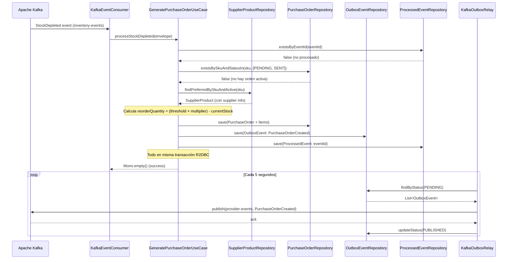
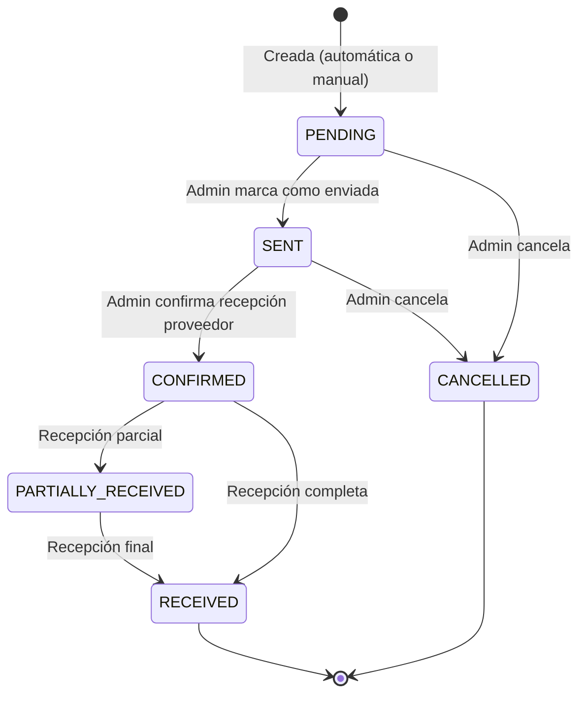

# Design Document — ms-provider

## Overview

`ms-provider` es el microservicio dueño del Bounded Context **Proveedores B2B (Abastecimiento)** dentro de la plataforma Arka. Su misión es actuar como Anti-Corruption Layer (ACL) para integrar múltiples proveedores externos, automatizar la generación de órdenes de compra cuando el stock cae bajo umbrales definidos, y gestionar el ciclo de vida completo del reabastecimiento. Este servicio es el componente principal de la Fase 4 del proyecto.

Consume eventos `StockDepleted` del tópico `inventory-events` (producidos por ms-inventory), busca el proveedor preferido para el SKU afectado, genera una orden de compra con cantidad óptima calculada, y publica eventos `PurchaseOrderCreated` al tópico `provider-events` mediante el Transactional Outbox Pattern. El administrador gestiona proveedores y órdenes de compra vía REST. La notificación al proveedor se delega a ms-notifications que consume `PurchaseOrderSent` del tópico `provider-events`. El ciclo se cierra cuando el admin recibe la mercancía y actualiza stock manualmente en ms-inventory.

### Key Design Decisions

1. **ACL para proveedores externos**: El patrón ACL aísla el dominio de las particularidades de comunicación con cada proveedor. En Fase 4, la comunicación es vía email (delegada a ms-notifications). En fases futuras puede evolucionar a integración directa con APIs de proveedores (EDI, Ariba, etc.) sin impactar el dominio.

2. **Duplicación prevenida por estado**: Antes de crear una nueva PurchaseOrder para un SKU, se verifica que no exista una orden en estado PENDING o SENT para el mismo SKU. Esto previene órdenes duplicadas ante múltiples eventos `StockDepleted` consecutivos.

3. **Cálculo de cantidad de reabastecimiento**: `reorderQuantity = (threshold × reorderMultiplier) - currentStock`. El multiplicador por defecto es 2 (se pide el doble del umbral menos lo que queda). Es configurable por relación proveedor-producto.

4. **Máquina de estados para PurchaseOrder**: PENDING → SENT → CONFIRMED → RECEIVED (o PARTIALLY_RECEIVED → RECEIVED). Cancelable desde PENDING o SENT. Transiciones inválidas retornan 422.

5. **Outbox Pattern reutilizado de ms-inventory**: Para consistencia del ecosistema, se copia y adapta el patrón Outbox (Relay, Producer, ProcessedEvents, GlobalExceptionHandler) de ms-inventory. Solo cambia: source = "ms-provider", topic = "provider-events", eventTypes = ["PurchaseOrderCreated", "PurchaseOrderSent"].

6. **KafkaReceiver (reactor-kafka)**: `ReactiveKafkaConsumerTemplate` fue eliminado en spring-kafka 4.0. Se usa `KafkaReceiver` de reactor-kafka directamente con `KafkaConsumerConfig` (bean por tópico) y `KafkaConsumerLifecycle` (ApplicationReadyEvent). Patrón copiado de ms-inventory.

7. **EventType con value() explícito**: Siguiendo el patrón canónico de ms-order (y el estándar post-alineamiento del Bloque A de pending-improvements.md), el enum EventType usa campo `private final String value` con método `value()`:
   ```java
   public enum EventType {
       PURCHASE_ORDER_CREATED("PurchaseOrderCreated"),
       PURCHASE_ORDER_SENT("PurchaseOrderSent");
       
       private final String value;
       // constructor + getter
   }
   ```

8. **Dos eventos de dominio**: 
   - `PurchaseOrderCreated`: publicado al crear la orden (automática o manual). Consumido por ms-reporter y ms-notifications.
   - `PurchaseOrderSent`: publicado al marcar como SENT. Trigger para ms-notifications envíe email al proveedor.

9. **Soft-delete para proveedores**: Los proveedores no se eliminan físicamente. Se marcan como `active = false`. Las búsquedas de proveedor preferido solo consideran proveedores activos.

10. **Records como estándar**: Todas las entidades, VOs, comandos, eventos y DTOs son `record` con `@Builder(toBuilder = true)` vía Lombok.

11. **R2DBC con PostgreSQL 17**: Persistencia reactiva. Transacciones gestionadas con `@Transactional` de Spring o `TransactionalOperator` para composición reactiva.

12. **Paginación offset**: Endpoints de listado usan paginación offset (page/size) con respuesta envuelta en `PageResponse<T>` consistente con ms-inventory.

---

## Architecture

### Component Diagram (Clean Architecture)

```mermaid
graph TB
    subgraph "Entry Points (infrastructure/entry-points)"
        SUC[SupplierController - REST]
        SUH[SupplierHandler]
        POC[PurchaseOrderController - REST]
        POH[PurchaseOrderHandler]
        KC[KafkaEventConsumer]
        KCC[KafkaConsumerConfig]
        KCL[KafkaConsumerLifecycle]
        GEH[GlobalExceptionHandler]
    end

    subgraph "Use Cases (domain/usecase)"
        GPU[GeneratePurchaseOrderUseCase]
        CSU[CreateSupplierUseCase]
        GSU[GetSupplierUseCase]
        LSU[ListSuppliersUseCase]
        USU[UpdateSupplierUseCase]
        DSU[DeactivateSupplierUseCase]
        ASP[AssignSupplierProductUseCase]
        LPO[ListPurchaseOrdersUseCase]
        GPO[GetPurchaseOrderUseCase]
        TPO[TransitionPurchaseOrderUseCase]
        CPO[CreateManualPurchaseOrderUseCase]
        ORU[OutboxRelayUseCase]
    end

    subgraph "Domain Model (domain/model)"
        S[Supplier]
        SP[SupplierProduct]
        PO[PurchaseOrder]
        POI[PurchaseOrderItem]
        POS[PurchaseOrderStatus - enum]
        ET[EventType - enum with value]
        OE[OutboxEvent]
        PE[ProcessedEvent]
        SR[SupplierRepository - port]
        SPR[SupplierProductRepository - port]
        POR[PurchaseOrderRepository - port]
        OER[OutboxEventRepository - port]
        PER[ProcessedEventRepository - port]
    end

    subgraph "Driven Adapters (infrastructure/driven-adapters)"
        R2S[R2dbcSupplierAdapter]
        R2SP[R2dbcSupplierProductAdapter]
        R2PO[R2dbcPurchaseOrderAdapter]
        R2OE[R2dbcOutboxAdapter]
        R2PE[R2dbcProcessedEventAdapter]
        KOR[KafkaOutboxRelay]
    end

    subgraph "External Systems"
        PG[(PostgreSQL 17 - provider_db)]
        Kafka[Apache Kafka]
    end

    SUC --> SUH
    POC --> POH
    SUH --> CSU & GSU & LSU & USU & DSU & ASP
    POH --> LPO & GPO & TPO & CPO
    KC --> GPU

    GPU --> SR & SPR & POR & OER & PER
    CSU --> SR
    GSU --> SR & SPR
    LSU --> SR
    USU --> SR
    DSU --> SR
    ASP --> SPR
    LPO --> POR
    GPO --> POR
    TPO --> POR & OER
    CPO --> POR & SPR & OER
    ORU --> OER

    R2S -.-> SR
    R2SP -.-> SPR
    R2PO -.-> POR
    R2OE -.-> OER
    R2PE -.-> PER

    R2S & R2SP & R2PO & R2OE & R2PE --> PG
    KOR --> Kafka & R2OE
    KC --> Kafka
```



### Flujo de Generación Automática de Orden de Compra (Happy Path)



### Máquina de Estados — PurchaseOrder



---

## Database Schema

```sql
-- suppliers table
CREATE TABLE IF NOT EXISTS suppliers (
    id UUID PRIMARY KEY DEFAULT gen_random_uuid(),
    name VARCHAR(200) NOT NULL,
    email VARCHAR(200) NOT NULL UNIQUE,
    phone VARCHAR(50),
    address TEXT,
    country VARCHAR(3) NOT NULL DEFAULT 'CO',
    active BOOLEAN NOT NULL DEFAULT true,
    created_at TIMESTAMP NOT NULL DEFAULT NOW(),
    updated_at TIMESTAMP NOT NULL DEFAULT NOW()
);

CREATE INDEX IF NOT EXISTS idx_suppliers_email ON suppliers(email);
CREATE INDEX IF NOT EXISTS idx_suppliers_active ON suppliers(active);

-- supplier_products table (many-to-many with pricing)
CREATE TABLE IF NOT EXISTS supplier_products (
    id UUID PRIMARY KEY DEFAULT gen_random_uuid(),
    supplier_id UUID NOT NULL REFERENCES suppliers(id),
    sku VARCHAR(50) NOT NULL,
    supplier_sku VARCHAR(100),
    unit_price NUMERIC(12,2) NOT NULL,
    lead_time_days INTEGER NOT NULL DEFAULT 7,
    reorder_multiplier NUMERIC(4,2) NOT NULL DEFAULT 2.0,
    preferred BOOLEAN NOT NULL DEFAULT false,
    created_at TIMESTAMP NOT NULL DEFAULT NOW(),

    CONSTRAINT uq_supplier_sku UNIQUE (supplier_id, sku)
);

CREATE INDEX IF NOT EXISTS idx_supplier_products_sku ON supplier_products(sku);
CREATE INDEX IF NOT EXISTS idx_supplier_products_preferred ON supplier_products(sku, preferred) WHERE preferred = true;

-- purchase_orders table
CREATE TABLE IF NOT EXISTS purchase_orders (
    id UUID PRIMARY KEY DEFAULT gen_random_uuid(),
    supplier_id UUID NOT NULL REFERENCES suppliers(id),
    status VARCHAR(30) NOT NULL DEFAULT 'PENDING',
    total_amount NUMERIC(14,2) NOT NULL,
    notes TEXT,
    created_at TIMESTAMP NOT NULL DEFAULT NOW(),
    updated_at TIMESTAMP NOT NULL DEFAULT NOW(),
    sent_at TIMESTAMP,
    confirmed_at TIMESTAMP,
    received_at TIMESTAMP,

    CONSTRAINT chk_po_status CHECK (status IN ('PENDING', 'SENT', 'CONFIRMED', 'PARTIALLY_RECEIVED', 'RECEIVED', 'CANCELLED'))
);

CREATE INDEX IF NOT EXISTS idx_purchase_orders_supplier ON purchase_orders(supplier_id);
CREATE INDEX IF NOT EXISTS idx_purchase_orders_status ON purchase_orders(status);
CREATE INDEX IF NOT EXISTS idx_purchase_orders_created ON purchase_orders(created_at DESC);

-- purchase_order_items table
CREATE TABLE IF NOT EXISTS purchase_order_items (
    id UUID PRIMARY KEY DEFAULT gen_random_uuid(),
    purchase_order_id UUID NOT NULL REFERENCES purchase_orders(id),
    sku VARCHAR(50) NOT NULL,
    product_name VARCHAR(200),
    quantity INTEGER NOT NULL,
    unit_price NUMERIC(12,2) NOT NULL,
    subtotal NUMERIC(14,2) NOT NULL,

    CONSTRAINT chk_quantity_positive CHECK (quantity > 0)
);

CREATE INDEX IF NOT EXISTS idx_poi_purchase_order ON purchase_order_items(purchase_order_id);
CREATE INDEX IF NOT EXISTS idx_poi_sku ON purchase_order_items(sku);

-- outbox_events table
CREATE TABLE IF NOT EXISTS outbox_events (
    id UUID PRIMARY KEY DEFAULT gen_random_uuid(),
    event_type VARCHAR(50) NOT NULL,
    topic VARCHAR(100) NOT NULL DEFAULT 'provider-events',
    partition_key VARCHAR(100) NOT NULL,
    payload JSONB NOT NULL,
    status VARCHAR(20) NOT NULL DEFAULT 'PENDING',
    created_at TIMESTAMP NOT NULL DEFAULT NOW(),

    CONSTRAINT chk_outbox_status CHECK (status IN ('PENDING', 'PUBLISHED'))
);

CREATE INDEX IF NOT EXISTS idx_outbox_status_created ON outbox_events(status, created_at) WHERE status = 'PENDING';

-- processed_events table
CREATE TABLE IF NOT EXISTS processed_events (
    event_id UUID PRIMARY KEY,
    processed_at TIMESTAMP NOT NULL DEFAULT NOW()
);

CREATE INDEX IF NOT EXISTS idx_processed_events_processed_at ON processed_events(processed_at);
```

---

## API Endpoints

### Suppliers

| Method | Path | Description | Role |
|--------|------|-------------|------|
| POST | `/api/v1/suppliers` | Registrar proveedor | ADMIN |
| GET | `/api/v1/suppliers` | Listar proveedores (paginado) | ADMIN |
| GET | `/api/v1/suppliers/{supplierId}` | Detalle de proveedor con productos | ADMIN |
| PUT | `/api/v1/suppliers/{supplierId}` | Actualizar proveedor | ADMIN |
| DELETE | `/api/v1/suppliers/{supplierId}` | Desactivar proveedor (soft-delete) | ADMIN |
| POST | `/api/v1/suppliers/{supplierId}/products` | Asignar SKU a proveedor | ADMIN |
| DELETE | `/api/v1/suppliers/{supplierId}/products/{sku}` | Desasignar SKU | ADMIN |

### Purchase Orders

| Method | Path | Description | Role |
|--------|------|-------------|------|
| GET | `/api/v1/purchase-orders` | Listar órdenes (filtros + paginación) | ADMIN |
| GET | `/api/v1/purchase-orders/{id}` | Detalle de orden con items | ADMIN |
| POST | `/api/v1/purchase-orders` | Crear orden manual | ADMIN |
| PUT | `/api/v1/purchase-orders/{id}/send` | Marcar como SENT | ADMIN |
| PUT | `/api/v1/purchase-orders/{id}/confirm` | Marcar como CONFIRMED | ADMIN |
| PUT | `/api/v1/purchase-orders/{id}/receive` | Marcar como RECEIVED | ADMIN |
| PUT | `/api/v1/purchase-orders/{id}/cancel` | Cancelar orden | ADMIN |

---

## Configuration

### application.yaml (base)

```yaml
spring:
  profiles:
    active: ${SPRING_PROFILES_ACTIVE:local}
  application:
    name: ms-provider
  r2dbc:
    url: r2dbc:postgresql://${DB_HOST:localhost}:${DB_PORT:5436}/${DB_NAME:provider_db}
    username: ${DB_USER:postgres}
    password: ${DB_PASSWORD:postgres}

server:
  port: ${SERVER_PORT:8089}

kafka:
  consumer:
    group-id: provider-service-group
    topics:
      inventory-events: inventory-events
  producer:
    topics:
      provider-events: provider-events

scheduler:
  outbox-relay:
    interval: 5000

springdoc:
  api-docs:
    path: /api-docs
  swagger-ui:
    path: /swagger-ui.html
    enabled: true
```

### application-local.yaml

```yaml
spring:
  kafka:
    bootstrap-servers: localhost:9092

logging:
  level:
    com.arka: DEBUG
    io.r2dbc: DEBUG
```

### application-docker.yaml

```yaml
spring:
  r2dbc:
    url: r2dbc:postgresql://postgres-provider:5432/provider_db
  kafka:
    bootstrap-servers: arka-kafka:9092

logging:
  level:
    com.arka: INFO
```
