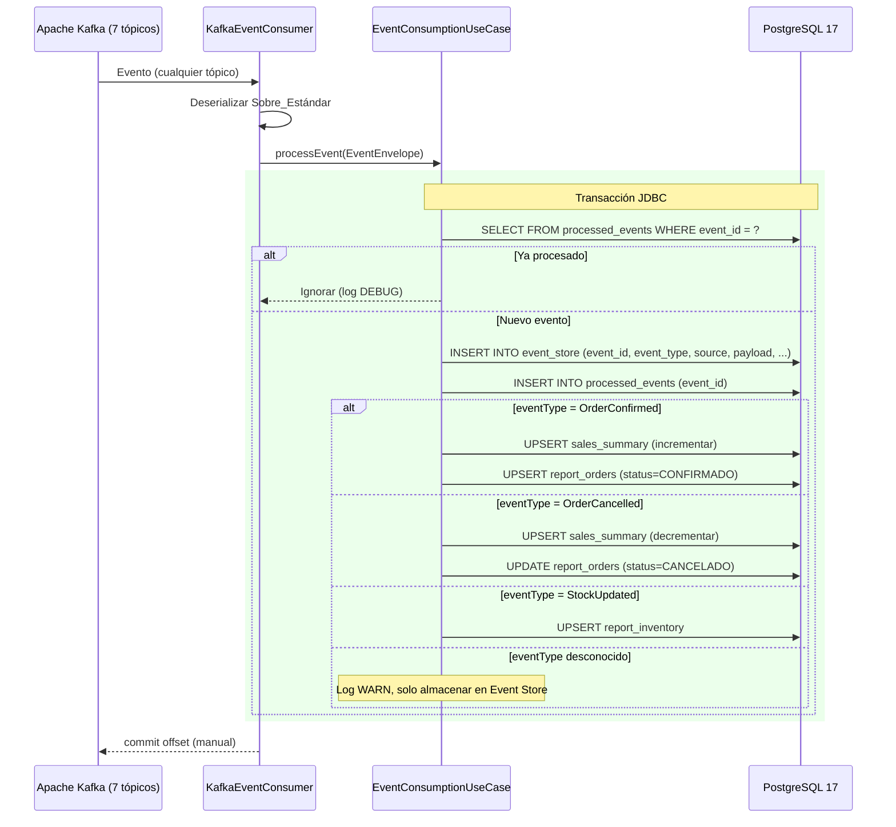
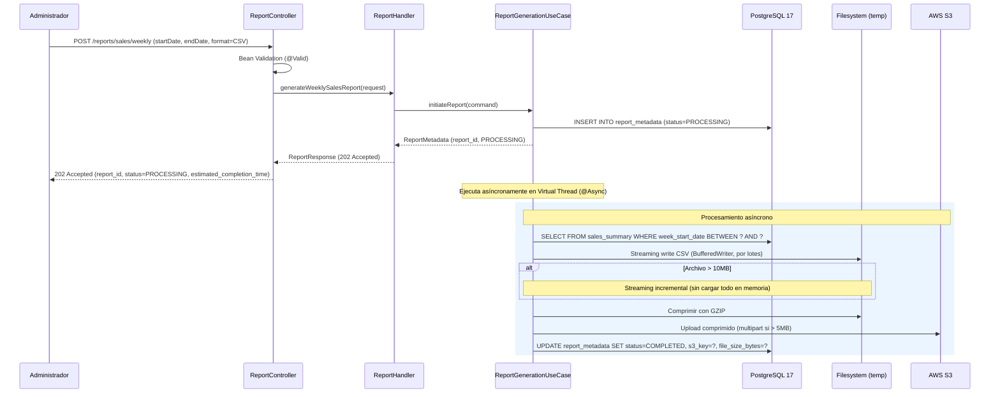
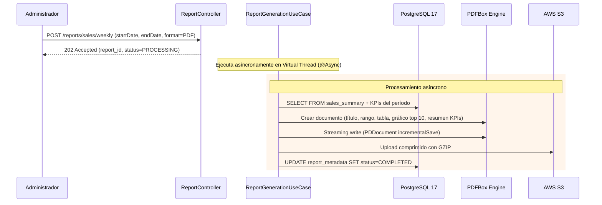
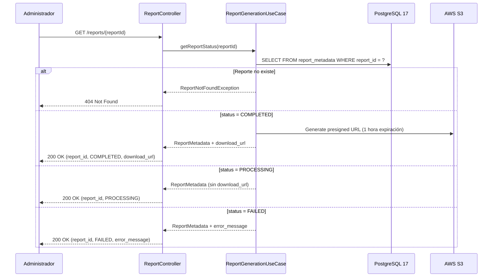
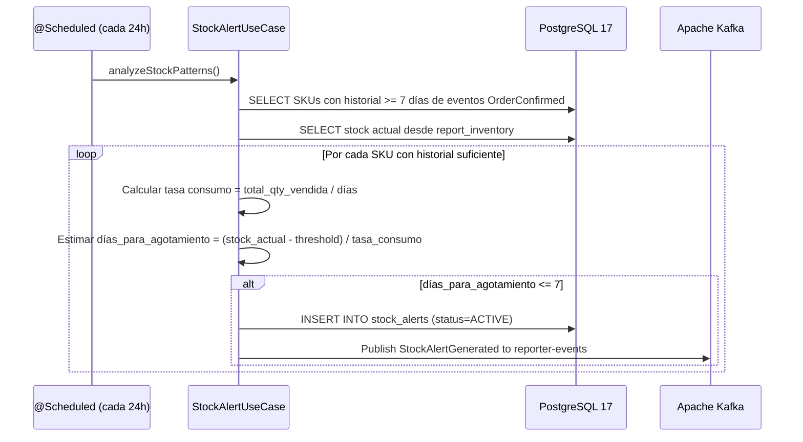
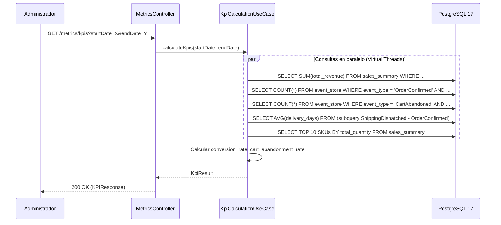
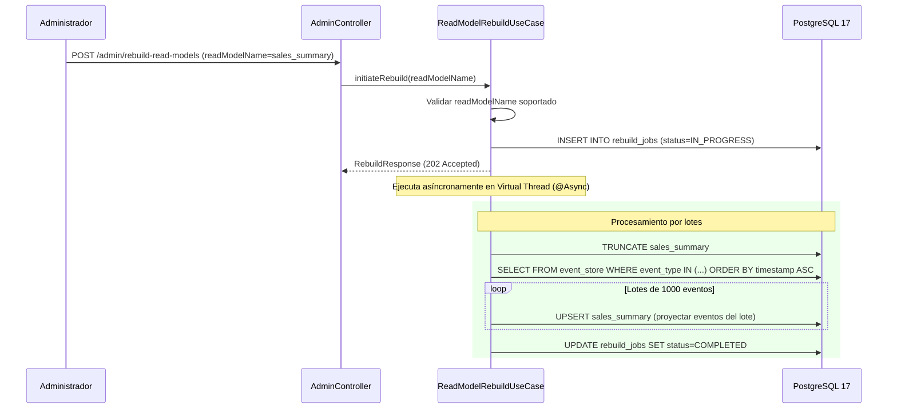
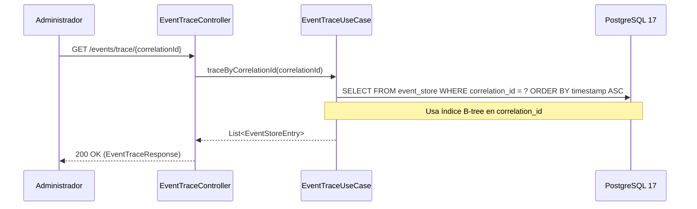

# Documento de Diseño — ms-reporter

## Visión General

`ms-reporter` es el microservicio dueño del Bounded Context **Analítica y Reportes** dentro de la plataforma B2B Arka. Su misión es implementar CQRS y Event Sourcing consumiendo TODOS los eventos de los 7 tópicos Kafka del sistema, almacenarlos inmutablemente en un Event Store PostgreSQL con JSONB e índices GIN, construir Read Models optimizados para analítica de negocio, generar reportes pesados en CSV/PDF (hasta 500MB) con subida a AWS S3, detectar patrones de stock bajo para alertas de reabastecimiento, y calcular KPIs de negocio en tiempo real. Cubre las HU7 (Reportes de ventas semanales) y HU3 (Alertas de stock bajo) de la Fase 3.

Este servicio es el **ÚNICO servicio imperativo** del ecosistema Arka: usa Spring MVC + Virtual Threads (Java 21) en lugar de WebFlux, JDBC en lugar de R2DBC, y retornos síncronos en controladores. La decisión se fundamenta en su naturaleza CPU-bound para procesamiento y generación de reportes pesados de hasta 500MB.

### Decisiones de Diseño Clave

1. **Paradigma imperativo (MVC + Virtual Threads):** `reactive=false` en gradle.properties. Spring MVC con `spring.threads.virtual.enabled=true` para concurrencia masiva sin bloqueo de threads nativos. JDBC estándar para acceso a PostgreSQL.
2. **Event Store inmutable:** Tabla `event_store` con payload JSONB, índice GIN, particionamiento por fecha e índice B-tree en `(event_type, timestamp)` y `correlation_id`. Los eventos NUNCA se modifican ni eliminan.
3. **CQRS puro:** Separación estricta entre escritura (consumo de eventos → Event Store) y lectura (Read Models + reportes). Los Read Models se construyen asincrónicamente a partir de los eventos consumidos.
4. **Read Models como tablas proyectadas:** `sales_summary`, `report_orders`, `report_inventory` se actualizan al momento de procesar cada evento relevante (proyección inline). Opcionalmente se pueden reconstruir desde el Event Store.
5. **Streaming de reportes:** Los reportes se generan con escritura incremental al filesystem temporal, compresión GZIP, y subida streaming a S3. Nunca se carga el dataset completo en memoria.
6. **Procesamiento asíncrono con `@Async` + Virtual Threads:** La generación de reportes pesados se ejecuta en un Virtual Thread separado. El controlador retorna `202 Accepted` inmediatamente.
7. **Kafka consumer imperativo:** Usa `@KafkaListener` (spring-kafka) con commit manual de offsets y transacción JDBC que engloba inserción en Event Store + idempotencia (processed_events) + actualización de Read Models.
8. **Idempotencia en consumidores (reusability.md #3):** La tabla `processed_events` con `event_id` como PK garantiza procesamiento exactamente-una-vez de eventos Kafka. Misma interfaz port que `ms-inventory`, adaptada a JDBC.
9. **Records como estándar (docs/06-patrones-y-estandares.md §2):** Todas las entidades, VOs, comandos y DTOs son `record` con `@Builder(toBuilder = true)`.
10. **Sin MapStruct (docs/06-patrones-y-estandares.md §4):** Mappers manuales con métodos estáticos y `@Builder`.
11. **RBAC por header:** El rol y la identidad del usuario se propagan desde el API Gateway vía headers `X-User-Email` y `X-User-Role`. Todos los endpoints requieren rol ADMIN.
12. **Patrón Controller → Handler → UseCase (reusability.md #7, docs/06-patrones-y-estandares.md §4.2):** El `ReportController` es thin (solo HTTP concerns), el `ReportHandler` (`@Component`) orquesta UseCase + mapeo + `ResponseEntity`. Retornos síncronos en vez de `Mono<ResponseEntity<T>>`.
13. **Job de alertas con `@Scheduled` (docs/06-patrones-y-estandares.md §D.6):** El análisis de stock bajo ejecuta cada 24 horas usando `@Scheduled` con intervalo externalizado en `application.yaml` (sin defaults inline).
14. **Presigned URLs de S3:** Los reportes completados se exponen vía presigned URLs con expiración de 1 hora, nunca se sirve el archivo directamente desde ms-reporter.
15. **Event Envelope alineado al ecosistema (docs/03-kafka-eventos.md):** El Sobre_Estándar consumido y publicado sigue el formato global (`eventId`, `eventType`, `timestamp`, `source`, `correlationId`, `payload`). Para publicar `StockAlertGenerated`, se usa `DomainEventEnvelope` con `MS_SOURCE = "ms-reporter"` (reusability.md #1).
16. **GlobalExceptionHandler (reusability.md #8):** Misma estructura que `ms-inventory`, adaptando `MethodArgumentNotValidException` (MVC) en vez de `WebExchangeBindException` (WebFlux). `ErrorResponse(code, message)` consistente con todo el ecosistema.
17. **Versionado Unificado (reusability.md):** Mismas versiones de librerías que el resto del monorepo. `springdoc-openapi-starter-webmvc-ui:3.0.2` (MVC) en vez de `webflux-ui`.

---

## Arquitectura

### Diagrama de Componentes (Clean Architecture)

```mermaid
graph TB
    subgraph "Entry Points (infrastructure/entry-points)"
        RC[ReportController - REST]
        RH[ReportHandler]
        MC[MetricsController - REST]
        MH[MetricsHandler]
        EC[EventTraceController - REST]
        EH[EventTraceHandler]
        AC[AdminController - REST]
        AH[AdminHandler]
        KC[KafkaEventConsumer]
        GEH[GlobalExceptionHandler]
    end

    subgraph "Use Cases (domain/usecase)"
        ECU[EventConsumptionUseCase]
        RGU[ReportGenerationUseCase]
        KU[KpiCalculationUseCase]
        SAU[StockAlertUseCase]
        ETU[EventTraceUseCase]
        RMU[ReadModelRebuildUseCase]
    end

    subgraph "Domain Model (domain/model)"
        ES[EventStoreEntry]
        RM[ReportMetadata]
        SS[SalesSummary]
        SA[StockAlert]
        KPI[KpiResult]
        ESR[EventStoreRepository port]
        RMR[ReportMetadataRepository port]
        SSR[SalesSummaryRepository port]
        SAR[StockAlertRepository port]
        PER[ProcessedEventRepository port]
        S3P[FileStorageGateway port]
    end

    subgraph "Driven Adapters (infrastructure/driven-adapters)"
        JDBC_ES[JdbcEventStoreAdapter]
        JDBC_RM[JdbcReportMetadataAdapter]
        JDBC_SS[JdbcSalesSummaryAdapter]
        JDBC_SA[JdbcStockAlertAdapter]
        JDBC_PE[JdbcProcessedEventAdapter]
        S3A[S3FileStorageAdapter]
        CSVG[CsvReportGenerator]
        PDFG[PdfReportGenerator]
    end

    subgraph "External Systems"
        PG[(PostgreSQL 17 - db_reporter)]
        Kafka[Apache Kafka - 7 tópicos]
        S3[AWS S3 - reportes]
    end

    RC --> RH
    MC --> MH
    EC --> EH
    AC --> AH
    RH --> RGU
    MH --> KU
    EH --> ETU
    AH --> RMU
    KC --> ECU

    ECU --> ESR & PER & SSR & SAR
    RGU --> SSR & RMR & S3P
    KU --> ESR & SSR
    SAU --> ESR & SAR
    ETU --> ESR
    RMU --> ESR & SSR

    JDBC_ES -.-> ESR
    JDBC_RM -.-> RMR
    JDBC_SS -.-> SSR
    JDBC_SA -.-> SAR
    JDBC_PE -.-> PER
    S3A -.-> S3P

    JDBC_ES & JDBC_RM & JDBC_SS & JDBC_SA & JDBC_PE --> PG
    S3A --> S3
    KC --> Kafka
```



### Flujo de Consumo de Eventos (Event Sourcing — Camino Principal)



### Flujo de Generación de Reporte CSV (Asíncrono)



### Flujo de Generación de Reporte PDF (Asíncrono)



### Flujo de Consulta de Estado de Reporte



### Flujo de Detección de Stock Bajo (Job Periódico)



### Flujo de Cálculo de KPIs



### Flujo de Reconstrucción de Read Models



### Flujo de Consulta de Eventos por CorrelationId



---

## Componentes e Interfaces

### Capa de Dominio — Modelo (`domain/model`)

#### Ports (Gateway Interfaces)

```java
// com.arka.model.eventstore.gateways.EventStoreRepository
public interface EventStoreRepository {
    void save(EventStoreEntry entry);
    List<EventStoreEntry> findByCorrelationId(UUID correlationId);
    List<EventStoreEntry> findByEventTypeAndTimestampRange(String eventType, Instant start, Instant end);
    List<EventStoreEntry> findByEventTypesAndTimestampRange(List<String> eventTypes, Instant start, Instant end);
    long countByEventTypeAndTimestampRange(String eventType, Instant start, Instant end);
    List<EventStoreEntry> findAllOrderedByTimestamp(int batchSize, int offset);
}

// com.arka.model.report.gateways.ReportMetadataRepository
public interface ReportMetadataRepository {
    ReportMetadata save(ReportMetadata metadata);
    Optional<ReportMetadata> findById(UUID reportId);
    ReportMetadata updateStatus(UUID reportId, ReportStatus status, String s3Key, Long fileSizeBytes, String errorMessage);
}

// com.arka.model.sales.gateways.SalesSummaryRepository
public interface SalesSummaryRepository {
    void upsert(SalesSummary summary);
    void decrementSales(String sku, Instant weekStartDate, int quantity, BigDecimal revenue);
    List<SalesSummary> findByWeekRange(LocalDate startDate, LocalDate endDate);
    List<SalesSummary> findTopSellingByWeekRange(LocalDate startDate, LocalDate endDate, int limit);
    void truncate();
}

// com.arka.model.alert.gateways.StockAlertRepository
public interface StockAlertRepository {
    StockAlert save(StockAlert alert);
    Optional<StockAlert> findActiveAlertBySku(String sku);
    void resolveAlert(UUID alertId);
}

// com.arka.model.processedevent.gateways.ProcessedEventRepository
public interface ProcessedEventRepository {
    boolean exists(UUID eventId);
    void save(UUID eventId);
}

// com.arka.model.report.gateways.FileStorageGateway
public interface FileStorageGateway {
    String upload(Path filePath, String s3Key);
    String generatePresignedUrl(String s3Key, Duration expiration);
}

// com.arka.model.event.gateways.EventPublisherGateway
// Publica eventos al tópico reporter-events usando el Sobre_Estándar del ecosistema
public interface EventPublisherGateway {
    void publish(DomainEventEnvelope envelope);
}
```

### Capa de Dominio — Casos de Uso (`domain/usecase`)

| Caso de Uso                 | Responsabilidad                                                                                                                        | Ports Usados                                                        |
| --------------------------- | -------------------------------------------------------------------------------------------------------------------------------------- | ------------------------------------------------------------------- |
| `EventConsumptionUseCase`   | Verificar idempotencia, almacenar evento en Event Store, actualizar Read Models relevantes (sales_summary, report_orders, report_inventory) | `EventStoreRepository`, `ProcessedEventRepository`, `SalesSummaryRepository`, `StockAlertRepository` |
| `ReportGenerationUseCase`   | Iniciar reporte, generar CSV/PDF de forma streaming, comprimir con GZIP, subir a S3, actualizar metadatos                             | `SalesSummaryRepository`, `ReportMetadataRepository`, `FileStorageGateway` |
| `KpiCalculationUseCase`     | Calcular KPIs de negocio en tiempo real para un rango de fechas                                                                        | `EventStoreRepository`, `SalesSummaryRepository`                    |
| `StockAlertUseCase`         | Analizar patrones de consumo, detectar stock bajo, generar alertas y publicar evento StockAlertGenerated al tópico `reporter-events`  | `EventStoreRepository`, `StockAlertRepository`, `EventPublisherGateway` |
| `EventTraceUseCase`         | Consultar eventos por correlationId para rastreo de operaciones distribuidas                                                           | `EventStoreRepository`                                              |
| `ReadModelRebuildUseCase`   | Truncar Read Model y reconstruir reproduciendo eventos en orden cronológico, procesando en lotes de 1000                               | `EventStoreRepository`, `SalesSummaryRepository`                    |

### Capa de Infraestructura — Entry Points

#### DTOs de Request

```java
// GenerateReportRequest
@Builder(toBuilder = true)
public record GenerateReportRequest(
    @NotNull LocalDate startDate,
    @NotNull LocalDate endDate,
    @NotBlank String format  // CSV, PDF
) {}

// RebuildReadModelRequest
@Builder(toBuilder = true)
public record RebuildReadModelRequest(
    @NotBlank String readModelName  // sales_summary, product_performance, customer_orders
) {}

// KpiRequest (query params)
// startDate, endDate como @RequestParam
```

#### DTOs de Response

```java
// ReportResponse
@Builder(toBuilder = true)
public record ReportResponse(
    UUID reportId,
    String reportType,
    String status,       // PROCESSING, COMPLETED, FAILED
    String s3Key,
    Long fileSizeBytes,
    String requestedBy,
    Instant requestedAt,
    Instant completedAt,
    String downloadUrl,  // presigned URL (solo si COMPLETED)
    String errorMessage, // solo si FAILED
    Instant estimatedCompletionTime
) {}

// KPIResponse
@Builder(toBuilder = true)
public record KPIResponse(
    BigDecimal totalRevenue,
    Long totalOrders,
    BigDecimal averageOrderValue,
    BigDecimal conversionRate,
    BigDecimal cartAbandonmentRate,
    BigDecimal averageDeliveryTimeDays,
    List<TopSellingProduct> topSellingProducts
) {}

// TopSellingProduct
@Builder(toBuilder = true)
public record TopSellingProduct(
    String sku,
    String productName,
    int totalQuantity,
    BigDecimal totalRevenue
) {}

// EventTraceResponse
@Builder(toBuilder = true)
public record EventTraceResponse(
    UUID correlationId,
    int totalEvents,
    List<EventEntry> events
) {}

// EventEntry
@Builder(toBuilder = true)
public record EventEntry(
    UUID eventId,
    String eventType,
    Instant timestamp,
    String source,
    String topic,
    Object payload
) {}

// RebuildResponse
@Builder(toBuilder = true)
public record RebuildResponse(
    UUID rebuildId,
    String readModelName,
    String status,  // IN_PROGRESS, COMPLETED, FAILED
    Instant estimatedCompletionTime
) {}

// StockAlertResponse
@Builder(toBuilder = true)
public record StockAlertResponse(
    UUID alertId,
    String sku,
    int currentStock,
    int threshold,
    BigDecimal dailyConsumptionRate,
    int estimatedDaysToDepletion,
    String alertStatus,
    Instant createdAt
) {}

// ErrorResponse
public record ErrorResponse(String code, String message) {}
```

#### Controlador REST

| Endpoint                              | Método | Rol Requerido | Retorno                            | Descripción                              |
| ------------------------------------- | ------ | ------------- | ---------------------------------- | ---------------------------------------- |
| `POST /reports/sales/weekly`          | POST   | ADMIN         | `ReportResponse` (202 Accepted)    | Generar reporte de ventas semanal        |
| `GET /reports/{reportId}`             | GET    | ADMIN         | `ReportResponse` (200 OK)          | Consultar estado de reporte              |
| `GET /metrics/kpis`                   | GET    | ADMIN         | `KPIResponse` (200 OK)             | Consultar KPIs de negocio                |
| `GET /events/trace/{correlationId}`   | GET    | ADMIN         | `EventTraceResponse` (200 OK)      | Rastrear eventos por correlationId       |
| `POST /admin/rebuild-read-models`     | POST   | ADMIN         | `RebuildResponse` (202 Accepted)   | Reconstruir Read Model                   |

#### Consumidor Kafka

| Consumer             | Tópicos Suscritos                                                                                         | Consumer Group           | Eventos Procesados (todos)                                                                                     | Tecnología    |
| -------------------- | --------------------------------------------------------------------------------------------------------- | ------------------------ | -------------------------------------------------------------------------------------------------------------- | ------------- |
| `KafkaEventConsumer` | `product-events`, `inventory-events`, `order-events`, `cart-events`, `payment-events`, `shipping-events`, `provider-events` | `reporter-service-group` | TODOS (almacena en Event Store). Proyecta: OrderConfirmed, OrderCancelled, StockUpdated, CartAbandoned, PriceChanged | `@KafkaListener` (spring-kafka) |

Almacena TODOS los eventos en el Event Store. Proyecta selectivamente a Read Models por `eventType`. Ignora eventos desconocidos con log WARN sin fallar.

### Capa de Infraestructura — Driven Adapters

| Adapter                        | Implementa                   | Tecnología                                   | Referencia reusability.md |
| ------------------------------ | ---------------------------- | -------------------------------------------- | ------------------------- |
| `JdbcEventStoreAdapter`        | `EventStoreRepository`       | JDBC `NamedParameterJdbcTemplate`            | —                         |
| `JdbcReportMetadataAdapter`    | `ReportMetadataRepository`   | JDBC `JdbcTemplate`                          | —                         |
| `JdbcSalesSummaryAdapter`      | `SalesSummaryRepository`     | JDBC `JdbcTemplate` (UPSERT con ON CONFLICT) | —                         |
| `JdbcStockAlertAdapter`        | `StockAlertRepository`       | JDBC `JdbcTemplate`                          | —                         |
| `JdbcProcessedEventAdapter`    | `ProcessedEventRepository`   | JDBC `JdbcTemplate` (INSERT explícito)       | #3 (adaptado a JDBC)      |
| `S3FileStorageAdapter`         | `FileStorageGateway`         | AWS SDK v2 (S3Client, S3Presigner)           | —                         |
| `KafkaEventPublisherAdapter`   | `EventPublisherGateway`      | `KafkaTemplate` (spring-kafka sync)          | #1, #5 (adaptado a sync) |
| `CsvReportGenerator`           | Helper de generación CSV     | OpenCSV / BufferedWriter streaming            | —                         |
| `PdfReportGenerator`           | Helper de generación PDF     | Apache PDFBox                                | —                         |

### Excepciones de Dominio

```java
// Jerarquía de excepciones
public abstract class DomainException extends RuntimeException {
    public abstract int getHttpStatus();
    public abstract String getCode();
}

public class ReportNotFoundException extends DomainException { /* 404, REPORT_NOT_FOUND */ }
public class InvalidDateRangeException extends DomainException { /* 400, INVALID_DATE_RANGE */ }
public class InvalidReadModelException extends DomainException { /* 400, INVALID_READ_MODEL */ }
public class StorageServiceUnavailableException extends DomainException { /* 503, STORAGE_UNAVAILABLE */ }
public class ReportGenerationException extends DomainException { /* 500, REPORT_GENERATION_FAILED */ }
public class AccessDeniedException extends DomainException { /* 403, ACCESS_DENIED */ }
```

---

## Modelos de Datos

### Entidades de Dominio (Records)

```java
// com.arka.model.eventstore.EventStoreEntry
@Builder(toBuilder = true)
public record EventStoreEntry(
    UUID id,
    UUID eventId,
    String eventType,
    Instant timestamp,
    String source,
    UUID correlationId,
    String topic,
    String partitionKey,
    String payload  // JSON string (JSONB en BD)
) {
    public EventStoreEntry {
        Objects.requireNonNull(eventId, "eventId is required");
        Objects.requireNonNull(eventType, "eventType is required");
        Objects.requireNonNull(source, "source is required");
        Objects.requireNonNull(payload, "payload is required");
        timestamp = timestamp != null ? timestamp : Instant.now();
    }
}
```

```java
// com.arka.model.report.ReportMetadata
@Builder(toBuilder = true)
public record ReportMetadata(
    UUID reportId,
    String reportType,     // WEEKLY_SALES_CSV, WEEKLY_SALES_PDF
    ReportStatus status,
    String s3Key,
    Long fileSizeBytes,
    String requestedBy,
    Instant requestedAt,
    Instant completedAt,
    String errorMessage
) {
    public ReportMetadata {
        Objects.requireNonNull(reportType, "reportType is required");
        Objects.requireNonNull(requestedBy, "requestedBy is required");
        status = status != null ? status : ReportStatus.PROCESSING;
        requestedAt = requestedAt != null ? requestedAt : Instant.now();
    }
}

// com.arka.model.report.ReportStatus
public enum ReportStatus { PROCESSING, COMPLETED, FAILED }
```

```java
// com.arka.model.sales.SalesSummary
@Builder(toBuilder = true)
public record SalesSummary(
    String sku,
    String productName,
    String category,
    LocalDate weekStartDate,
    int totalOrders,
    int totalQuantity,
    BigDecimal totalRevenue,
    BigDecimal averageOrderValue,
    Instant lastUpdatedAt
) {
    public SalesSummary {
        Objects.requireNonNull(sku, "sku is required");
        Objects.requireNonNull(weekStartDate, "weekStartDate is required");
        averageOrderValue = (totalOrders > 0)
            ? totalRevenue.divide(BigDecimal.valueOf(totalOrders), 2, RoundingMode.HALF_UP)
            : BigDecimal.ZERO;
        lastUpdatedAt = lastUpdatedAt != null ? lastUpdatedAt : Instant.now();
    }
}
```

```java
// com.arka.model.alert.StockAlert
@Builder(toBuilder = true)
public record StockAlert(
    UUID alertId,
    String sku,
    int currentStock,
    int threshold,
    BigDecimal dailyConsumptionRate,
    int estimatedDaysToDepletion,
    AlertStatus alertStatus,
    Instant createdAt,
    Instant resolvedAt
) {
    public StockAlert {
        Objects.requireNonNull(sku, "sku is required");
        alertStatus = alertStatus != null ? alertStatus : AlertStatus.ACTIVE;
        createdAt = createdAt != null ? createdAt : Instant.now();
    }
}

// com.arka.model.alert.AlertStatus
public enum AlertStatus { ACTIVE, RESOLVED }
```

```java
// com.arka.model.kpi.KpiResult
@Builder(toBuilder = true)
public record KpiResult(
    BigDecimal totalRevenue,
    long totalOrders,
    BigDecimal averageOrderValue,
    BigDecimal conversionRate,
    BigDecimal cartAbandonmentRate,
    BigDecimal averageDeliveryTimeDays,
    List<TopSellingProduct> topSellingProducts
) {}

// com.arka.model.kpi.TopSellingProduct
@Builder(toBuilder = true)
public record TopSellingProduct(
    String sku,
    String productName,
    int totalQuantity,
    BigDecimal totalRevenue
) {}
```

```java
// com.arka.model.rebuild.RebuildJob
@Builder(toBuilder = true)
public record RebuildJob(
    UUID rebuildId,
    String readModelName,
    RebuildStatus status,
    Instant startedAt,
    Instant completedAt,
    String errorMessage
) {
    public RebuildJob {
        Objects.requireNonNull(readModelName, "readModelName is required");
        status = status != null ? status : RebuildStatus.IN_PROGRESS;
        startedAt = startedAt != null ? startedAt : Instant.now();
    }
}

// com.arka.model.rebuild.RebuildStatus
public enum RebuildStatus { IN_PROGRESS, COMPLETED, FAILED }
```

### Sobre Estándar de Eventos Kafka (Consumido)

```java
// Envelope recibido de cualquier tópico Kafka (alineado a docs/03-kafka-eventos.md)
@Builder(toBuilder = true)
public record EventEnvelope(
    String eventId,
    String eventType,
    Instant timestamp,
    String source,
    String correlationId,
    Object payload
) {
    public EventEnvelope {
        Objects.requireNonNull(eventId, "eventId is required");
        Objects.requireNonNull(eventType, "eventType is required");
        Objects.requireNonNull(payload, "payload is required");
    }
}
```

### Sobre Estándar de Eventos Kafka (Publicado — reusability.md #1)

```java
// Envelope publicado al tópico reporter-events (StockAlertGenerated)
// OBLIGATORIO: mismo formato que ms-inventory/ms-order DomainEventEnvelope
@Builder(toBuilder = true)
public record DomainEventEnvelope(
    String eventId,        // UUID
    String eventType,      // StockAlertGenerated
    Instant timestamp,
    String source,         // "ms-reporter"
    String correlationId,
    Object payload
) {
    public static final String MS_SOURCE = "ms-reporter";

    public DomainEventEnvelope {
        Objects.requireNonNull(eventId, "eventId is required");
        Objects.requireNonNull(eventType, "eventType is required");
        Objects.requireNonNull(payload, "payload is required");
        timestamp = timestamp != null ? timestamp : Instant.now();
        source = source != null ? source : MS_SOURCE;
    }
}

// Payload del evento StockAlertGenerated
@Builder(toBuilder = true)
public record StockAlertGeneratedPayload(
    UUID alertId,
    String sku,
    int currentStock,
    int threshold,
    BigDecimal dailyConsumptionRate,
    int estimatedDaysToDepletion
) {}
```

### Esquema PostgreSQL 17 (db_reporter)

#### Tabla: `event_store`

```sql
CREATE TABLE event_store (
    id              UUID           PRIMARY KEY DEFAULT gen_random_uuid(),
    event_id        UUID           NOT NULL UNIQUE,
    event_type      VARCHAR(100)   NOT NULL,
    timestamp       TIMESTAMP WITH TIME ZONE NOT NULL DEFAULT NOW(),
    source          VARCHAR(50)    NOT NULL,
    correlation_id  UUID,
    topic           VARCHAR(100)   NOT NULL,
    partition_key   VARCHAR(100)   NOT NULL,
    payload         JSONB          NOT NULL,
    created_at      TIMESTAMP WITH TIME ZONE DEFAULT NOW()
) PARTITION BY RANGE (timestamp);

-- Particiones mensuales (ejemplo)
CREATE TABLE event_store_2026_01 PARTITION OF event_store
    FOR VALUES FROM ('2026-01-01') TO ('2026-02-01');
CREATE TABLE event_store_2026_02 PARTITION OF event_store
    FOR VALUES FROM ('2026-02-01') TO ('2026-03-01');
-- ... crear particiones mensuales según necesidad

CREATE INDEX idx_event_store_payload_gin ON event_store USING GIN (payload);
CREATE INDEX idx_event_store_type_timestamp ON event_store (event_type, timestamp);
CREATE INDEX idx_event_store_correlation_id ON event_store (correlation_id);
CREATE INDEX idx_event_store_source ON event_store (source);
```

#### Tabla: `sales_summary`

```sql
CREATE TABLE sales_summary (
    sku                VARCHAR(100) NOT NULL,
    product_name       VARCHAR(255),
    category           VARCHAR(100),
    week_start_date    DATE         NOT NULL,
    total_orders       INTEGER      NOT NULL DEFAULT 0,
    total_quantity     INTEGER      NOT NULL DEFAULT 0,
    total_revenue      NUMERIC(15,2) NOT NULL DEFAULT 0,
    average_order_value NUMERIC(15,2) NOT NULL DEFAULT 0,
    last_updated_at    TIMESTAMP WITH TIME ZONE DEFAULT NOW(),
    CONSTRAINT pk_sales_summary PRIMARY KEY (sku, week_start_date)
);

CREATE INDEX idx_sales_summary_week ON sales_summary (week_start_date);
```

#### Tabla: `report_metadata`

```sql
CREATE TABLE report_metadata (
    report_id       UUID         PRIMARY KEY DEFAULT gen_random_uuid(),
    report_type     VARCHAR(50)  NOT NULL,
    status          VARCHAR(20)  NOT NULL DEFAULT 'PROCESSING',
    s3_key          VARCHAR(500),
    file_size_bytes BIGINT,
    requested_by    VARCHAR(255) NOT NULL,
    requested_at    TIMESTAMP WITH TIME ZONE DEFAULT NOW(),
    completed_at    TIMESTAMP WITH TIME ZONE,
    error_message   TEXT
);

CREATE INDEX idx_report_metadata_status ON report_metadata (status);
CREATE INDEX idx_report_metadata_requested_by ON report_metadata (requested_by);
```

#### Tabla: `stock_alerts`

```sql
CREATE TABLE stock_alerts (
    alert_id                  UUID         PRIMARY KEY DEFAULT gen_random_uuid(),
    sku                       VARCHAR(100) NOT NULL,
    current_stock             INTEGER      NOT NULL,
    threshold                 INTEGER      NOT NULL,
    daily_consumption_rate    NUMERIC(10,2) NOT NULL,
    estimated_days_to_depletion INTEGER    NOT NULL,
    alert_status              VARCHAR(20)  NOT NULL DEFAULT 'ACTIVE',
    created_at                TIMESTAMP WITH TIME ZONE DEFAULT NOW(),
    resolved_at               TIMESTAMP WITH TIME ZONE
);

CREATE INDEX idx_stock_alerts_sku ON stock_alerts (sku);
CREATE INDEX idx_stock_alerts_status ON stock_alerts (alert_status);
```

#### Tabla: `rebuild_jobs`

```sql
CREATE TABLE rebuild_jobs (
    rebuild_id      UUID         PRIMARY KEY DEFAULT gen_random_uuid(),
    read_model_name VARCHAR(50)  NOT NULL,
    status          VARCHAR(20)  NOT NULL DEFAULT 'IN_PROGRESS',
    started_at      TIMESTAMP WITH TIME ZONE DEFAULT NOW(),
    completed_at    TIMESTAMP WITH TIME ZONE,
    error_message   TEXT
);
```

#### Tabla: `processed_events`

```sql
CREATE TABLE processed_events (
    event_id     UUID PRIMARY KEY,
    processed_at TIMESTAMP WITH TIME ZONE DEFAULT NOW()
);
```

#### Tabla: `report_orders` (Read Model)

```sql
CREATE TABLE report_orders (
    order_id        UUID           PRIMARY KEY,
    customer_id     VARCHAR(100)   NOT NULL,
    status          VARCHAR(30)    NOT NULL,
    total_amount    NUMERIC(15,2)  NOT NULL DEFAULT 0,
    created_at      TIMESTAMP WITH TIME ZONE,
    updated_at      TIMESTAMP WITH TIME ZONE DEFAULT NOW()
);

CREATE INDEX idx_report_orders_status ON report_orders (status);
CREATE INDEX idx_report_orders_customer ON report_orders (customer_id);
```

#### Tabla: `report_inventory` (Read Model)

```sql
CREATE TABLE report_inventory (
    sku             VARCHAR(100)   PRIMARY KEY,
    current_stock   INTEGER        NOT NULL DEFAULT 0,
    total_reserved  INTEGER        NOT NULL DEFAULT 0,
    last_updated    TIMESTAMP WITH TIME ZONE DEFAULT NOW()
);
```

---

## Propiedades de Correctitud

### Propiedad 1: Idempotencia en consumo de eventos

_Para cualquier_ evento Kafka recibido cuyo `eventId` ya existe en la tabla `processed_events`, el sistema debe descartarlo sin ejecutar lógica de negocio, sin insertar un registro duplicado en el Event Store, sin modificar Read Models y registrando un log de nivel DEBUG.

**Valida: Requisitos 1.2, 1.3, 1.5**

### Propiedad 2: Evento almacenado preserva estructura original

_Para cualquier_ evento consumido exitosamente de cualquiera de los 7 tópicos Kafka, el registro insertado en `event_store` debe contener: `event_id` igual al del sobre, `event_type` igual al eventType del sobre, `payload` JSONB idéntico al payload original sin transformaciones, `source` igual al campo source del sobre, `timestamp` no nulo, y `correlation_id` si estaba presente en el sobre.

**Valida: Requisitos 2.1, 2.6**

### Propiedad 3: Eventos desconocidos se almacenan sin fallar

_Para cualquier_ evento recibido con un `eventType` que no corresponde a un tipo conocido para proyección de Read Models, el sistema debe almacenarlo correctamente en el Event Store, registrar un log WARN, y NO modificar ningún Read Model. El procesamiento debe completarse exitosamente sin lanzar excepciones.

**Valida: Requisitos 1.4**

### Propiedad 4: Read Model sales_summary consistencia con Event Store

_Para cualquier_ secuencia de eventos OrderConfirmed y OrderCancelled procesados en orden cronológico para un SKU y semana dados, el registro correspondiente en `sales_summary` debe reflejar el estado neto: `total_orders` = confirmados - cancelados, `total_quantity` = suma neta de cantidades, `total_revenue` = suma neta de montos, y `average_order_value` = total_revenue / total_orders (o 0 si total_orders = 0).

**Valida: Requisitos 6.1, 6.2, 6.3, 6.4, 6.5, 6.6**

### Propiedad 5: Reporte CSV contiene datos correctos del período

_Para cualquier_ solicitud de reporte CSV con un rango de fechas válido que contiene datos en `sales_summary`, el archivo generado debe contener: (a) una fila de encabezados con las columnas requeridas (sku, product_name, category, total_orders, total_quantity, total_revenue, average_order_value, period), (b) una fila por cada registro en `sales_summary` dentro del rango, y (c) ningún registro fuera del rango de fechas.

**Valida: Requisitos 3.1, 3.2**

### Propiedad 6: Reportes pesados usan streaming sin OOM

_Para cualquier_ reporte con dataset que exceda 10MB de tamaño de salida, el sistema debe generar el archivo usando escritura incremental (streaming) sin almacenar todo el dataset en memoria simultáneamente. El heap usage durante la generación no debe exceder un múltiplo fijo del tamaño del lote de procesamiento.

**Valida: Requisitos 3.3, 4.3**

### Propiedad 7: Reporte completado genera presigned URL válida

_Para cualquier_ reporte con `status = COMPLETED`, la consulta GET /reports/{reportId} debe retornar un `download_url` que sea una presigned URL de S3 válida con expiración de 1 hora. Si el reporte está en `PROCESSING` o `FAILED`, no debe incluir `download_url`.

**Valida: Requisitos 5.2, 5.3, 5.4**

### Propiedad 8: Alertas de stock bajo se generan correctamente

_Para cualquier_ SKU con al menos 7 días de historial de ventas cuya tasa de consumo promedio diaria multiplicada por 7 sea mayor o igual al stock actual menos el threshold, el sistema debe generar una `StockAlert` con `alertStatus = ACTIVE` y publicar un evento `StockAlertGenerated` al tópico `reporter-events`.

**Valida: Requisitos 7.1, 7.2, 7.3, 7.4**

### Propiedad 9: KPIs calculados correctamente para cualquier rango

_Para cualquier_ rango de fechas con datos en el Event Store, los KPIs deben satisfacer: `total_revenue >= 0`, `total_orders >= 0`, `average_order_value = total_revenue / total_orders` (o 0), `conversion_rate + cart_abandonment_rate = 1.0` (cuando hay datos), y `top_selling_products` contenga máximo 10 elementos ordenados por total_quantity descendente.

**Valida: Requisitos 8.1, 8.2, 8.3, 8.4, 8.5, 8.6, 8.7, 8.8**

### Propiedad 10: Reconstrucción de Read Model produce resultado idéntico

_Para cualquier_ secuencia de eventos en el Event Store, una reconstrucción completa del Read Model `sales_summary` debe producir exactamente el mismo estado final que el procesamiento incremental de esos mismos eventos en orden cronológico.

**Valida: Requisitos 9.1, 9.4**

### Propiedad 11: Consulta por correlationId retorna eventos ordenados

_Para cualquier_ correlationId presente en el Event Store con N eventos asociados, la consulta debe retornar exactamente N eventos ordenados por timestamp ascendente, donde cada evento pertenece a la misma transacción distribuida.

**Valida: Requisitos 10.1, 10.2, 10.3, 10.4**

### Propiedad 12: Respuestas de error tienen estructura correcta

_Para cualquier_ excepción (validación, dominio o inesperada), la respuesta debe contener un `ErrorResponse` con los campos `code` (no vacío) y `message` (no vacío). El código HTTP debe corresponder al tipo: 400 para validación, 403 para acceso denegado, 404 para no encontrado, 503 para servicio no disponible, y 500 para inesperadas. Las respuestas 500 no deben exponer detalles internos.

**Valida: Requisitos 11.1, 11.2, 11.3, 11.4, 11.5, 11.6**

### Propiedad 13: Virtual Threads no bloquean threads nativos

_Para cualquier_ operación de generación de reportes o procesamiento de eventos, el sistema debe ejecutar operaciones I/O-bound (JDBC, S3) en Virtual Threads sin bloquear carrier threads nativos del sistema operativo, garantizando alta concurrencia.

**Valida: Requisitos 12.1, 12.4, 12.5**

---

## Manejo de Errores

### Jerarquía de Excepciones de Dominio

```text
DomainException (abstract)
├── ReportNotFoundException                → HTTP 404, code: REPORT_NOT_FOUND
├── InvalidDateRangeException              → HTTP 400, code: INVALID_DATE_RANGE
├── InvalidReadModelException              → HTTP 400, code: INVALID_READ_MODEL
├── StorageServiceUnavailableException     → HTTP 503, code: STORAGE_UNAVAILABLE
├── ReportGenerationException              → HTTP 500, code: REPORT_GENERATION_FAILED
└── AccessDeniedException                  → HTTP 403, code: ACCESS_DENIED
```

### GlobalExceptionHandler (`@ControllerAdvice`)

| Tipo de Excepción                              | HTTP Status | Código de Error            | Comportamiento                                      |
| ---------------------------------------------- | ----------- | -------------------------- | --------------------------------------------------- |
| `MethodArgumentNotValidException` (Validation) | 400         | `VALIDATION_ERROR`         | Retorna campos inválidos en el mensaje              |
| `InvalidDateRangeException`                    | 400         | `INVALID_DATE_RANGE`       | Fecha inicio > fecha fin                            |
| `InvalidReadModelException`                    | 400         | `INVALID_READ_MODEL`       | Read Model solicitado no es soportado               |
| `AccessDeniedException`                        | 403         | `ACCESS_DENIED`            | Usuario no tiene rol ADMIN                          |
| `ReportNotFoundException`                      | 404         | `REPORT_NOT_FOUND`         | Reporte no existe                                   |
| `StorageServiceUnavailableException`           | 503         | `STORAGE_UNAVAILABLE`      | Error de conexión a AWS S3                          |
| `Exception` (inesperada)                       | 500         | `INTERNAL_ERROR`           | Log ERROR, mensaje genérico sin detalles internos   |

### Errores en Procesamiento de Reportes

- Si la generación falla (IOException, error de PDF): actualizar `report_metadata.status = FAILED` con `error_message`
- Si S3 no está disponible: lanzar `StorageServiceUnavailableException` o marcar reporte como FAILED
- Si el archivo excede 500MB: abortar generación y marcar como FAILED con mensaje descriptivo

### Errores en Consumidores Kafka

- Eventos con `eventId` duplicado: ignorar silenciosamente (log DEBUG)
- Eventos con `eventType` desconocido: almacenar en Event Store + log WARN
- Errores de deserialización: log ERROR + skip (no bloquear consumo)
- Errores JDBC transitorios: retry con backoff exponencial (3 reintentos)

---

## Estrategia de Testing

### Enfoque: Tests Unitarios + Tests Basados en Propiedades

El testing de `ms-reporter` combina dos enfoques complementarios:

1. **Tests unitarios** (JUnit 5 + Mockito): Verifican ejemplos específicos, edge cases y condiciones de error. Sin `StepVerifier` (paradigma imperativo).
2. **Tests basados en propiedades** (jqwik): Verifican propiedades universales con entradas generadas aleatoriamente.

### Librería de Property-Based Testing

**jqwik** — librería PBT nativa para JUnit 5 en Java.

```groovy
// build.gradle del módulo de test
testImplementation 'net.jqwik:jqwik:1.9.2'
```

### Configuración de Tests de Propiedades

- Mínimo **100 iteraciones** por test de propiedad (`@Property(tries = 100)`)
- Cada test referencia la propiedad del documento de diseño: `// Feature: ms-reporter, Property {N}: {título}`
- Cada propiedad se implementa como un **único** test jqwik

### Tests Unitarios (JUnit 5 + Mockito)

Los tests unitarios se enfocan en:

- **Ejemplos específicos**: Consumir evento OrderConfirmed, generar reporte con datos fijos, calcular KPIs con valores conocidos
- **Edge cases**: Reporte con rango sin datos (CSV vacío con encabezados), correlationId sin eventos (lista vacía), SKU sin historial suficiente (ignorar)
- **Condiciones de error**: S3 no disponible, fecha inicio > fecha fin, Read Model inválido, reporte no encontrado
- **Integración entre componentes**: Verificar que UseCases invocan correctamente los ports

### Tests de Propiedades (jqwik)

| Propiedad                                    | Test                                                                    | Generadores                                          |
| -------------------------------------------- | ----------------------------------------------------------------------- | ---------------------------------------------------- |
| P1: Idempotencia en consumo                  | Generar eventos, procesarlos dos veces, verificar no-duplicación        | EventEnvelopes con eventIds fijos                    |
| P2: Evento preserva estructura               | Generar eventos aleatorios, verificar campos en Event Store             | EventTypes, payloads JSON aleatorios                 |
| P3: Eventos desconocidos no fallan           | Generar eventos con eventTypes no reconocidos                           | Strings aleatorios como eventType                    |
| P4: Consistencia sales_summary               | Generar secuencias OrderConfirmed/Cancelled, verificar estado neto      | Secuencias de eventos con cantidades aleatorias      |
| P5: CSV contiene datos correctos             | Generar datos de sales_summary, generar CSV, parsear y verificar        | SalesSummary con valores aleatorios                  |
| P6: Streaming no causa OOM                   | Generar datasets grandes, verificar memoria acotada                     | Datasets de tamaño variable                          |
| P7: Presigned URL solo en COMPLETED          | Generar reportes en distintos estados, verificar presencia de URL       | ReportStatus aleatorios                              |
| P8: Alertas de stock correctas               | Generar patrones de consumo, verificar criterio de alerta               | Tasas de consumo y niveles de stock aleatorios       |
| P9: KPIs correctamente calculados            | Generar eventos, verificar fórmulas KPI                                 | Eventos con montos y cantidades aleatorios           |
| P10: Reconstrucción idempotente              | Generar secuencias de eventos, comparar incremental vs reconstrucción   | Secuencias de eventos ordenadas                      |
| P11: Eventos por correlationId ordenados     | Generar eventos con mismo correlationId, verificar orden temporal       | Timestamps aleatorios para un correlationId          |
| P12: ErrorResponse estructura correcta       | Generar excepciones de distintos tipos, verificar campos                | DomainException, validation, unexpected              |
| P13: Virtual Threads no bloquean             | Verificar paralelismo bajo carga                                        | Operaciones concurrentes                             |

### Herramientas Adicionales

- **ArchUnit**: Validación de dependencias entre capas de Clean Architecture
- **Testcontainers** (opcional): Tests de integración con PostgreSQL y LocalStack real
