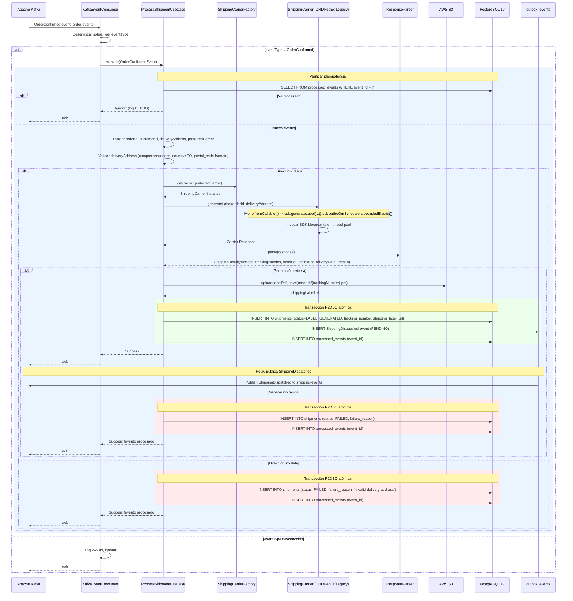
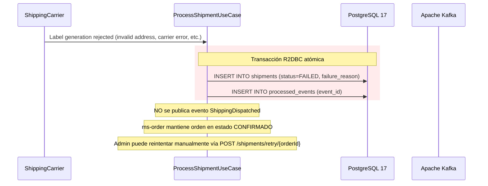
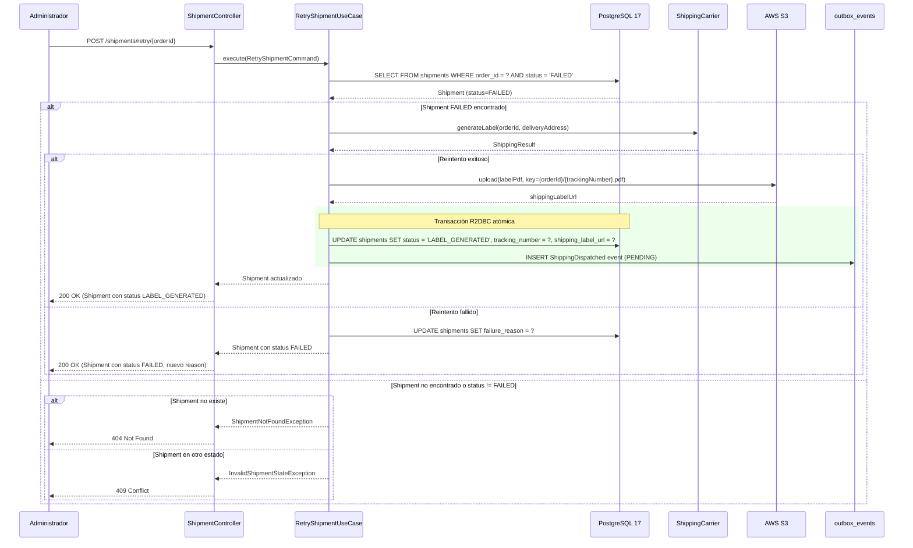
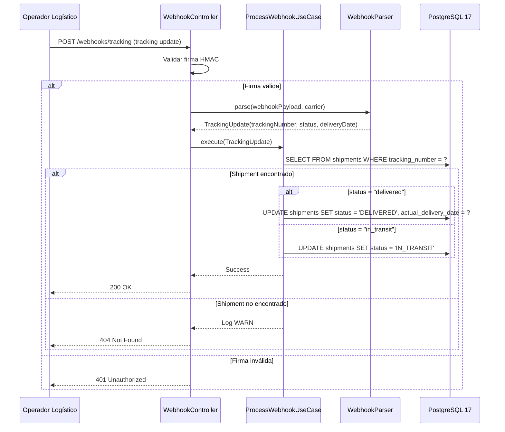
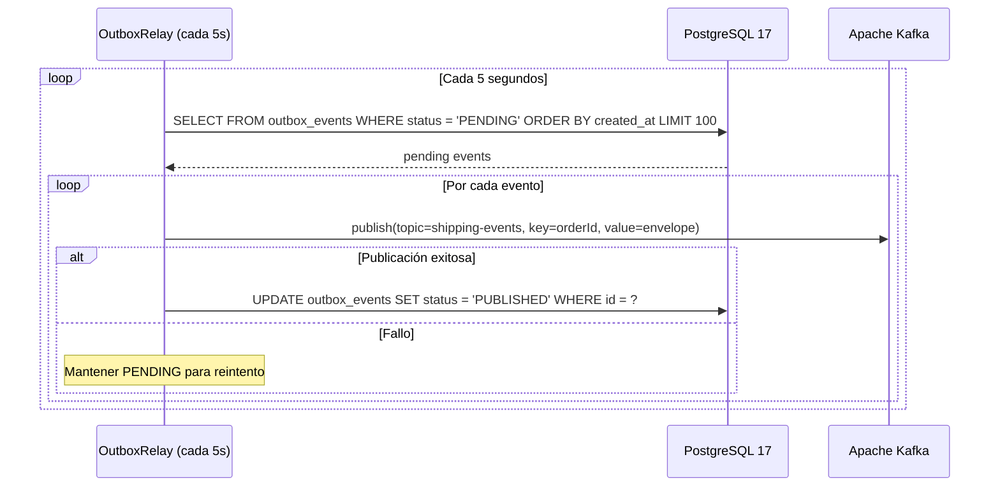
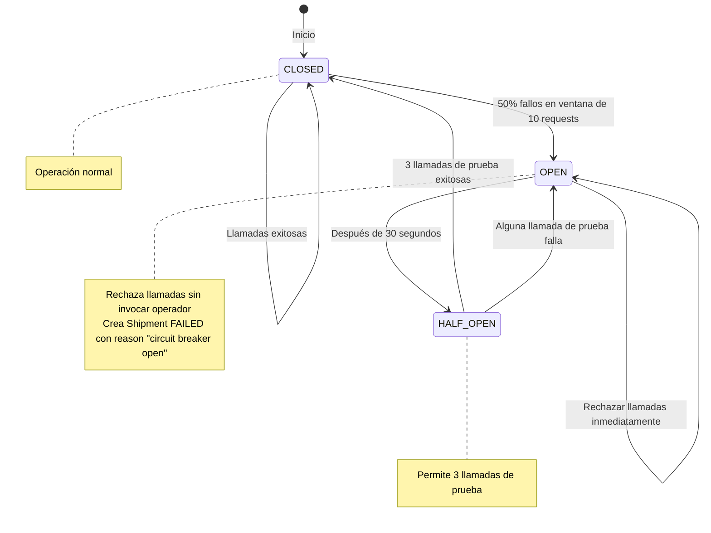

# Design Document — ms-shipping

## Overview

`ms-shipping` es el microservicio dueño del Bounded Context **Logística y Despacho** dentro de la plataforma B2B Arka. Su misión es actuar como Anti-Corruption Layer (ACL) para integrar múltiples operadores logísticos externos (DHL, FedEx) y sistemas legacy de logística, aislar el dominio de las particularidades de los SDKs externos, y gestionar el ciclo de vida completo del despacho de órdenes confirmadas. Este servicio es un componente crítico de la Saga Secuencial orquestada por `ms-order` en la Fase 3 del proyecto. Consume eventos `OrderConfirmed` del tópico `order-events`, genera etiquetas de envío con el operador logístico seleccionado, actualiza el tracking de entregas, y publica eventos `ShippingDispatched` al tópico `shipping-events` mediante el Transactional Outbox Pattern.

Implementa patrones de resiliencia (Circuit Breaker, Bulkhead, Retry) con Resilience4j para manejar fallos de operadores logísticos externos, utiliza PostgreSQL 17 con R2DBC para persistencia reactiva, y aísla los SDKs bloqueantes de los operadores con `Schedulers.boundedElastic()` para no bloquear el EventLoop de Netty. Las credenciales de los operadores se gestionan mediante AWS Secrets Manager (LocalStack en desarrollo). El servicio expone endpoints REST administrativos para consultar envíos, listar despachos con filtros, actualizar estados manualmente y reintentar envíos fallidos. También expone webhooks para recibir actualizaciones de tracking desde los operadores logísticos.

### Key Design Decisions

1. **ACL con Strategy + Factory**: El patrón Strategy permite seleccionar en runtime la implementación de `ShippingCarrier` según el `Carrier` (DHL, FEDEX, LEGACY). El Factory encapsula la lógica de creación de instancias. Esto aísla el dominio de las particularidades de cada SDK externo.

2. **SDKs bloqueantes aislados**: Todos los SDKs de operadores logísticos (DHL, FedEx, Legacy) son bloqueantes. Se envuelven con `Mono.fromCallable(() -> sdk.generateLabel(...)).subscribeOn(Schedulers.boundedElastic())` para ejecutarlos en un pool de threads dedicado sin bloquear el EventLoop de Netty.

3. **Resilience4j para resiliencia**: Cada operador tiene su propio Circuit Breaker (50% threshold, 30s open), Retry Policy (backoff exponencial 2s/4s/8s, máximo 3 reintentos) y Bulkhead (10 llamadas concurrentes). Esto previene cascadas de fallos y aísla recursos.

4. **Idempotencia rigurosa en múltiples niveles**:
   - **Nivel 1 (Kafka)**: Tabla `processed_events` con `event_id` como PK garantiza procesamiento exactamente-una-vez de eventos Kafka.
   - **Nivel 2 (BD)**: Constraint `UNIQUE` en `tracking_number` previene despachos duplicados si el operador retorna el mismo ID.
   - **Nivel 3 (Aplicación)**: Validación de unicidad de `tracking_number` antes de INSERT como primera línea de defensa.

5. **Parsers con round-trip property**: Cada operador tiene un `ResponseParser` (extrae `tracking_number` y estado de la respuesta) y un `Pretty_Printer` (formatea `ShippingResult` de vuelta al formato del operador). La propiedad de round-trip garantiza que `parse(prettyPrint(x)) == x` para todo `ShippingResult` válido.

6. **AWS Secrets Manager**: Las credenciales de los operadores (`api-key` por operador) y los webhook secrets se almacenan en AWS Secrets Manager y se recuperan al iniciar la aplicación. LocalStack simula Secrets Manager en el perfil `local`. Las credenciales se cachean en memoria para evitar llamadas repetidas.

7. **Sealed interface para ShippingStatus**: `ShippingStatus` modela los estados como sealed interface con records: `Pending`, `LabelGenerated`, `InTransit`, `Delivered`, `Failed`. Habilita pattern matching exhaustivo en compile-time (Java 21).

8. **Enum para Carrier**: `Carrier` es un enum con valores `DHL`, `FEDEX`, `LEGACY`. Facilita validación y selección de operador.

9. **Records como estándar**: Todas las entidades, VOs, comandos, eventos y DTOs son `record` con `@Builder(toBuilder = true)`.

10. **Transactional Outbox Pattern**: Los eventos de dominio se insertan en `outbox_events` dentro de la misma transacción R2DBC que la escritura del `Shipment`. Un relay asíncrono (poll cada 5s) los publica a Kafka usando `orderId` como partition key para garantizar orden causal por orden.


11. **Reutilización de patrones de ms-inventory**: Para patrones transversales (Outbox Relay, Kafka Producer/Consumer, ProcessedEvents, GlobalExceptionHandler), se DEBE reutilizar la implementación ya probada de `ms-inventory` adaptando solo lo específico del dominio (entidades, tópicos, payloads, `MS_SOURCE`).

12. **IMPORTANTE (§B.12):** `ReactiveKafkaConsumerTemplate` fue eliminado en spring-kafka 4.0 (Spring Boot 4.0.3). El consumidor Kafka usa `KafkaReceiver` de reactor-kafka directamente, con `KafkaConsumerConfig` (beans por tópico) y `KafkaConsumerLifecycle` (`ApplicationReadyEvent`).

13. **Timeout de 30 segundos**: Cada llamada a operador tiene un timeout de 30 segundos mediante el operador `timeout()` de Reactor. Si se excede, se crea un `Shipment` con status `FAILED` y `failure_reason` indicando timeout.

14. **AWS S3 para etiquetas**: Las etiquetas de envío (PDFs) se suben a AWS S3 en el bucket `arka-shipping-labels` con clave `{orderId}/{trackingNumber}.pdf`. LocalStack simula S3 en el perfil `local`.

15. **Webhooks con validación HMAC**: Los webhooks de operadores se validan mediante firma HMAC usando un secret compartido por operador. Cada operador tiene su propio `WebhookParser` que normaliza el formato específico al modelo de dominio.

16. **Validación de direcciones**: Las direcciones de entrega se validan antes de invocar al operador. Solo se soportan entregas en Colombia (country = "CO"). Códigos postales deben tener formato de 5 dígitos.

---

## Architecture

### Component Diagram (Clean Architecture)

```mermaid
graph TB
    subgraph "Entry Points (infrastructure/entry-points)"
        SC[ShipmentController - REST]
        SH[ShipmentHandler]
        WC[WebhookController]
        KC[KafkaEventConsumer]
        KCC[KafkaConsumerConfig]
        KCL[KafkaConsumerLifecycle]
        GEH[GlobalExceptionHandler]
    end

    subgraph "Use Cases (domain/usecase)"
        PSU[ProcessShipmentUseCase]
        GSU[GetShipmentUseCase]
        LSU[ListShipmentsUseCase]
        USU[UpdateShipmentStatusUseCase]
        RSU[RetryShipmentUseCase]
        PWU[ProcessWebhookUseCase]
    end

    subgraph "Domain Model (domain/model)"
        S[Shipment]
        SS[ShippingStatus - sealed interface]
        C[Carrier - enum]
        SR[ShippingResult]
        DA[DeliveryAddress]
        OE[OutboxEvent]
        PE[ProcessedEvent]
        SREP[ShipmentRepository port]
        OER[OutboxEventRepository port]
        PER[ProcessedEventRepository port]
        SCR[ShippingCarrier port]
        SCF[ShippingCarrierFactory port]
        SM[SecretsManager port]
        S3[S3Storage port]
    end

    subgraph "Driven Adapters (infrastructure/driven-adapters)"
        R2S[R2dbcShipmentAdapter]
        R2OE[R2dbcOutboxAdapter]
        R2PE[R2dbcProcessedEventAdapter]
        DSC[DHLShippingCarrier]
        FSC[FedExShippingCarrier]
        LSC[LegacyShippingCarrier]
        SCFI[ShippingCarrierFactoryImpl]
        AWSSM[AwsSecretsManagerAdapter]
        AWSS3[AwsS3StorageAdapter]
        KOR[KafkaOutboxRelay]
    end

    subgraph "External Systems"
        PG[(PostgreSQL 17 - shipping_db)]
        Kafka[Apache Kafka]
        DHL[DHL API]
        FedEx[FedEx API]
        Legacy[Legacy Logistics System]
        AWS[AWS Secrets Manager / LocalStack]
        S3B[AWS S3 / LocalStack]
    end

    SC --> SH
    WC --> PWU
    SH --> GSU & LSU & USU & RSU
    KC --> PSU

    PSU --> SREP & OER & SCR & SCF & S3 & PER
    GSU --> SREP
    LSU --> SREP
    USU --> SREP
    RSU --> SREP & OER & SCR & SCF & S3
    PWU --> SREP

    R2S -.-> SREP
    R2OE -.-> OER
    R2PE -.-> PER
    DSC & FSC & LSC -.-> SCR
    SCFI -.-> SCF
    AWSSM -.-> SM
    AWSS3 -.-> S3

    R2S & R2OE & R2PE --> PG
    KOR --> Kafka & R2OE
    DSC --> DHL
    FSC --> FedEx
    LSC --> Legacy
    AWSSM --> AWS
    AWSS3 --> S3B
    KC --> Kafka
```




### Flujo de Procesamiento de Envío (Happy Path)




### Flujo de Envío Fallido



### Flujo de Reintento Manual



### Flujo de Webhook de Tracking




### Flujo del Outbox Relay



### Flujo de Circuit Breaker



---

## Components and Interfaces

### Domain Layer — Model (`domain/model`)

#### Ports (Gateway Interfaces)

```java
// com.arka.model.shipment.gateways.ShipmentRepository
public interface ShipmentRepository {
    Mono<Shipment> save(Shipment shipment);
    Mono<Shipment> findByOrderId(UUID orderId);
    Mono<Shipment> findByTrackingNumber(String trackingNumber);
    Mono<Shipment> updateStatus(UUID orderId, String newStatus, Instant actualDeliveryDate);
    Flux<Shipment> findByFilters(String status, String carrier, int page, int size);
}

// com.arka.model.outbox.gateways.OutboxEventRepository
public interface OutboxEventRepository {
    Mono<OutboxEvent> save(OutboxEvent event);
    Flux<OutboxEvent> findPending(int limit);
    Mono<Void> markAsPublished(UUID id);
}

// com.arka.model.processedevent.gateways.ProcessedEventRepository
public interface ProcessedEventRepository {
    Mono<Boolean> exists(UUID eventId);
    Mono<Void> save(UUID eventId);
}

// com.arka.model.shipment.gateways.ShippingCarrier
public interface ShippingCarrier {
    Mono<ShippingResult> generateLabel(UUID orderId, DeliveryAddress address);
    Carrier supportedCarrier();
}

// com.arka.model.shipment.gateways.ShippingCarrierFactory
public interface ShippingCarrierFactory {
    ShippingCarrier getCarrier(Carrier carrier);
}

// com.arka.model.secrets.gateways.SecretsManager
public interface SecretsManager {
    Mono<String> getSecret(String secretName);
}

// com.arka.model.storage.gateways.S3Storage
public interface S3Storage {
    Mono<String> uploadFile(byte[] content, String key, String contentType);
}
```


### Domain Layer — Use Cases (`domain/usecase`)

| Caso de Uso                    | Responsabilidad                                                                                                                                                                                                                 | Ports Usados                                                                                                        |
| ------------------------------ | ------------------------------------------------------------------------------------------------------------------------------------------------------------------------------------------------------------------------------- | ------------------------------------------------------------------------------------------------------------------- |
| `ProcessShipmentUseCase`        | Verifica idempotencia (processed_events), extrae datos del evento OrderConfirmed, valida deliveryAddress, selecciona carrier vía Factory, invoca `ShippingCarrier.generateLabel()`, parsea respuesta, sube etiqueta a S3, persiste Shipment con status LABEL_GENERATED o FAILED, inserta evento ShippingDispatched en outbox (solo si exitoso), y registra eventId en processed_events. Todo en una transacción R2DBC. | `ShipmentRepository`, `OutboxEventRepository`, `ProcessedEventRepository`, `ShippingCarrier`, `ShippingCarrierFactory`, `S3Storage` |
| `GetShipmentUseCase`            | Consulta envío por orderId. ADMIN puede ver todos, CUSTOMER solo sus propios envíos.                                                                                                                                                                                          | `ShipmentRepository`                                                                                                 |
| `ListShipmentsUseCase`          | Lista envíos paginados con filtros por status y carrier. Solo ADMIN.                                                                                                                                                       | `ShipmentRepository`                                                                                                 |
| `UpdateShipmentStatusUseCase`   | Actualiza status de un envío manualmente. Si status=DELIVERED, establece actual_delivery_date. Si status=FAILED, requiere failure_reason. Solo ADMIN. | `ShipmentRepository`                                                                                                 |
| `RetryShipmentUseCase`          | Busca Shipment con status FAILED por orderId, reintenta generación de etiqueta con el mismo carrier y dirección, sube etiqueta a S3, actualiza status a LABEL_GENERATED (si exitoso) o mantiene FAILED (si falla), inserta evento ShippingDispatched solo si exitoso. Solo ADMIN. | `ShipmentRepository`, `OutboxEventRepository`, `ShippingCarrier`, `ShippingCarrierFactory`, `S3Storage`                             |
| `ProcessWebhookUseCase`  | Procesa actualizaciones de tracking desde webhooks de operadores. Busca Shipment por trackingNumber, actualiza status según el estado reportado (IN_TRANSIT, DELIVERED). Establece actual_delivery_date si delivered.                                                                                                                                       | `ShipmentRepository`                                                                                             |

### Infrastructure Layer — Entry Points

#### DTOs de Request

```java
// UpdateShipmentStatusRequest
@Builder(toBuilder = true)
public record UpdateShipmentStatusRequest(
    @NotNull String status,
    String failureReason
) {}

// RetryShipmentRequest (body vacío, orderId en path)
@Builder(toBuilder = true)
public record RetryShipmentRequest() {}

// WebhookTrackingRequest (formato específico por operador, parseado por WebhookParser)
@Builder(toBuilder = true)
public record WebhookTrackingRequest(
    String trackingNumber,
    String status,
    String deliveryDate,
    Map<String, Object> metadata
) {}
```

#### DTOs de Response

```java
// ShipmentResponse
@Builder(toBuilder = true)
public record ShipmentResponse(
    UUID id,
    UUID orderId,
    String carrier,
    String trackingNumber,
    String shippingLabelUrl,
    String status,
    DeliveryAddressDTO deliveryAddress,
    Instant estimatedDeliveryDate,
    Instant actualDeliveryDate,
    String failureReason,
    Instant createdAt,
    Instant updatedAt
) {}

// ShipmentSummaryResponse (para listados)
@Builder(toBuilder = true)
public record ShipmentSummaryResponse(
    UUID id,
    UUID orderId,
    String carrier,
    String trackingNumber,
    String status,
    Instant estimatedDeliveryDate,
    Instant createdAt
) {}

// DeliveryAddressDTO
@Builder(toBuilder = true)
public record DeliveryAddressDTO(
    String street,
    String city,
    String state,
    String postalCode,
    String country
) {}

// ErrorResponse
public record ErrorResponse(String code, String message) {}
```


#### Controlador REST

| Endpoint                         | Método | Rol Requerido | Retorno                                  | Descripción                        |
| -------------------------------- | ------ | ------------- | ---------------------------------------- | ---------------------------------- |
| `GET /shipments/{orderId}`        | GET    | ADMIN, CUSTOMER | `Mono<ShipmentResponse>` (200 OK)         | Consultar envío por orderId. CUSTOMER solo sus propias órdenes         |
| `GET /shipments`                  | GET    | ADMIN         | `Flux<ShipmentSummaryResponse>` (200 OK)  | Listar envíos con filtros (status, carrier)           |
| `PUT /shipments/{orderId}/status` | PUT    | ADMIN         | `Mono<ShipmentResponse>` (200 OK)         | Actualizar estado de envío manualmente |
| `POST /shipments/retry/{orderId}` | POST   | ADMIN         | `Mono<ShipmentResponse>` (200 OK)         | Reintentar envío fallido manualmente |
| `POST /webhooks/tracking`         | POST   | PUBLIC (con HMAC) | `Mono<Void>` (200 OK)                  | Recibir actualizaciones de tracking desde operadores |

#### Consumidor Kafka

> **Arquitectura (§B.12):** `ReactiveKafkaConsumerTemplate` fue eliminado en spring-kafka 4.0. Se usa `KafkaReceiver` de reactor-kafka directamente. Reutilizar los 3 archivos de `ms-inventory/infrastructure/entry-points/kafka-consumer/`: `KafkaConsumerConfig` (beans `KafkaReceiver` por tópico), `KafkaConsumerLifecycle` (`ApplicationReadyEvent` → `startConsuming()`), `KafkaEventConsumer` (switch eventType, per-msg acknowledge, retry backoff).

| Consumer             | Tópicos Suscritos | Consumer Group          | Eventos Procesados | Tecnología                            |
| -------------------- | ----------------- | ----------------------- | ------------------ | ------------------------------------- |
| `KafkaEventConsumer` | `order-events`    | `shipping-service-group` | `OrderConfirmed`     | `KafkaReceiver` (reactor-kafka §B.12) |

Filtra por `eventType` del sobre estándar. Procesa activamente `OrderConfirmed` (extrae orderId, customerId, deliveryAddress, preferredCarrier). Ignora tipos desconocidos con log WARN.

### Infrastructure Layer — Driven Adapters

| Adapter                         | Implementa                    | Tecnología                               |
| ------------------------------- | ----------------------------- | ---------------------------------------- |
| `R2dbcShipmentAdapter`           | `ShipmentRepository`           | R2DBC DatabaseClient / `@Transactional`  |
| `R2dbcOutboxAdapter`            | `OutboxEventRepository`       | R2DBC DatabaseClient                     |
| `R2dbcProcessedEventAdapter`    | `ProcessedEventRepository`    | R2DBC DatabaseClient                     |
| `DHLShippingCarrier`          | `ShippingCarrier`              | DHL SDK + `Schedulers.boundedElastic()` |
| `FedExShippingCarrier`           | `ShippingCarrier`              | FedEx SDK + `Schedulers.boundedElastic()` |
| `LegacyShippingCarrier`     | `ShippingCarrier`              | Legacy System SDK + `Schedulers.boundedElastic()` |
| `ShippingCarrierFactoryImpl`     | `ShippingCarrierFactory`       | Strategy + Factory pattern               |
| `AwsSecretsManagerAdapter`      | `SecretsManager`              | AWS SDK / LocalStack                     |
| `AwsS3StorageAdapter`      | `S3Storage`              | AWS S3 SDK / LocalStack                     |
| `KafkaOutboxRelay`              | Scheduled relay (cada 5s)     | `KafkaSender` de `reactor-kafka` (§B.11) |

### Excepciones de Dominio

```java
// Jerarquía de excepciones
public abstract class DomainException extends RuntimeException {
    public abstract int getHttpStatus();
    public abstract String getCode();
}

public class ShipmentNotFoundException extends DomainException { /* 404, SHIPMENT_NOT_FOUND */ }
public class InvalidShipmentStateException extends DomainException { /* 409, INVALID_SHIPMENT_STATE */ }
public class ShippingCarrierUnavailableException extends DomainException { /* 503, CARRIER_UNAVAILABLE */ }
public class InvalidCarrierException extends DomainException { /* 400, INVALID_CARRIER */ }
public class InvalidShippingStatusException extends DomainException { /* 400, INVALID_SHIPPING_STATUS */ }
public class DuplicateTrackingNumberException extends DomainException { /* 409, DUPLICATE_TRACKING_NUMBER */ }
public class CircuitBreakerOpenException extends DomainException { /* 503, CIRCUIT_BREAKER_OPEN */ }
public class BulkheadFullException extends DomainException { /* 503, BULKHEAD_FULL */ }
public class InvalidDeliveryAddressException extends DomainException { /* 400, INVALID_DELIVERY_ADDRESS */ }
public class S3UploadException extends DomainException { /* 500, S3_UPLOAD_FAILED */ }
public class InvalidWebhookSignatureException extends DomainException { /* 401, INVALID_WEBHOOK_SIGNATURE */ }
```


---

## Data Models

### Domain Entities (Records)

```java
// com.arka.model.shipment.Shipment
@Builder(toBuilder = true)
public record Shipment(
    UUID id,
    UUID orderId,
    String trackingNumber,
    Carrier carrier,
    String shippingLabelUrl,
    ShippingStatus status,
    DeliveryAddress deliveryAddress,
    Instant estimatedDeliveryDate,
    Instant actualDeliveryDate,
    String failureReason,
    Instant createdAt,
    Instant updatedAt
) {
    public Shipment {
        Objects.requireNonNull(orderId, "orderId is required");
        Objects.requireNonNull(carrier, "carrier is required");
        Objects.requireNonNull(deliveryAddress, "deliveryAddress is required");
        status = status != null ? status : ShippingStatus.PENDING;
        createdAt = createdAt != null ? createdAt : Instant.now();
        updatedAt = updatedAt != null ? updatedAt : Instant.now();
    }
    
    public boolean isPending() { return status instanceof ShippingStatus.Pending; }
    public boolean isLabelGenerated() { return status instanceof ShippingStatus.LabelGenerated; }
    public boolean isFailed() { return status instanceof ShippingStatus.Failed; }
    public boolean isDelivered() { return status instanceof ShippingStatus.Delivered; }
}
```

```java
// com.arka.model.shipment.ShippingStatus — Sealed Interface (Java 21)
public sealed interface ShippingStatus permits
        ShippingStatus.Pending,
        ShippingStatus.LabelGenerated,
        ShippingStatus.InTransit,
        ShippingStatus.Delivered,
        ShippingStatus.Failed {

    String DEFAULT_STATUS = "PENDING";
    String value();

    static ShippingStatus fromValue(String value) {
        return switch (value) {
            case "PENDING"   -> new Pending();
            case "LABEL_GENERATED" -> new LabelGenerated();
            case "IN_TRANSIT" -> new InTransit();
            case "DELIVERED" -> new Delivered();
            case "FAILED"    -> new Failed();
            default -> throw new InvalidShippingStatusException("Unknown shipping status: '" + value + "'");
        };
    }

    record Pending() implements ShippingStatus {
        public String value() { return "PENDING"; }
    }
    record LabelGenerated() implements ShippingStatus {
        public String value() { return "LABEL_GENERATED"; }
    }
    record InTransit() implements ShippingStatus {
        public String value() { return "IN_TRANSIT"; }
    }
    record Delivered() implements ShippingStatus {
        public String value() { return "DELIVERED"; }
    }
    record Failed() implements ShippingStatus {
        public String value() { return "FAILED"; }
    }
}
```

```java
// com.arka.model.shipment.Carrier — Enum
public enum Carrier {
    DHL("dhl"),
    FEDEX("fedex"),
    LEGACY("legacy");

    private final String value;
    Carrier(String value) { this.value = value; }
    public String value() { return value; }

    public static Carrier fromValue(String value) {
        return switch (value.toLowerCase()) {
            case "dhl" -> DHL;
            case "fedex" -> FEDEX;
            case "legacy" -> LEGACY;
            default -> throw new InvalidCarrierException("Unknown carrier: '" + value + "'");
        };
    }
}
```

```java
// com.arka.model.shipment.ShippingResult — Resultado de procesamiento
@Builder(toBuilder = true)
public record ShippingResult(
    boolean success,
    String trackingNumber,
    byte[] labelPdf,
    Instant estimatedDeliveryDate,
    String reason
) {
    public ShippingResult {
        if (success && trackingNumber == null) {
            throw new IllegalArgumentException("trackingNumber is required for successful shipments");
        }
        if (success && labelPdf == null) {
            throw new IllegalArgumentException("labelPdf is required for successful shipments");
        }
        if (!success && reason == null) {
            throw new IllegalArgumentException("reason is required for failed shipments");
        }
    }
}
```

```java
// com.arka.model.shipment.DeliveryAddress — Value Object
@Builder(toBuilder = true)
public record DeliveryAddress(
    String street,
    String city,
    String state,
    String postalCode,
    String country
) {
    public DeliveryAddress {
        Objects.requireNonNull(street, "street is required");
        Objects.requireNonNull(city, "city is required");
        Objects.requireNonNull(state, "state is required");
        Objects.requireNonNull(postalCode, "postalCode is required");
        Objects.requireNonNull(country, "country is required");
        
        if (!country.equals("CO")) {
            throw new InvalidDeliveryAddressException("Delivery outside Colombia not supported. Country: " + country);
        }
        
        if (!postalCode.matches("\\d{5}")) {
            throw new InvalidDeliveryAddressException("Invalid postal code format. Expected 5 digits, got: " + postalCode);
        }
    }
}
```


### Domain Events (Records)

```java
// com.arka.model.outbox.OutboxEvent
@Builder(toBuilder = true)
public record OutboxEvent(
    UUID id,
    EventType eventType,
    String topic,
    String partitionKey,  // orderId
    String payload,       // JSON serializado
    OutboxStatus status,
    Instant createdAt
) {
    public OutboxEvent {
        Objects.requireNonNull(eventType, "eventType is required");
        Objects.requireNonNull(payload, "payload is required");
        Objects.requireNonNull(partitionKey, "partitionKey is required");
        // id is nullable — DB generates UUID via DEFAULT gen_random_uuid()
        status = status != null ? status : OutboxStatus.PENDING;
        topic = topic != null ? topic : "shipping-events";
        createdAt = createdAt != null ? createdAt : Instant.now();
    }

    public boolean isPending() { return status == OutboxStatus.PENDING; }
    public boolean isPublished() { return status == OutboxStatus.PUBLISHED; }
    public OutboxEvent markAsPublished() {
        if (status != OutboxStatus.PENDING) {
            throw new IllegalStateException("Cannot publish event " + id + ". Current: " + status);
        }
        return this.toBuilder().status(OutboxStatus.PUBLISHED).build();
    }
}

// com.arka.model.outbox.OutboxStatus
public enum OutboxStatus { PENDING, PUBLISHED }

// com.arka.model.outbox.EventType
public enum EventType {
    SHIPPING_DISPATCHED("ShippingDispatched");

    private final String value;
    EventType(String value) { this.value = value; }
    public String value() { return value; }
}
```

#### Sobre Estándar de Eventos Kafka

```java
// Envelope publicado al tópico shipping-events
@Builder(toBuilder = true)
public record DomainEventEnvelope(
    String eventId,        // UUID
    String eventType,      // ShippingDispatched
    Instant timestamp,
    String source,         // "ms-shipping"
    String correlationId,
    Object payload
) {
    public static final String MS_SOURCE = "ms-shipping";

    public DomainEventEnvelope {
        Objects.requireNonNull(eventType, "eventType is required");
        Objects.requireNonNull(payload, "payload is required");
        eventId = eventId != null ? eventId : UUID.randomUUID().toString();
        timestamp = timestamp != null ? timestamp : Instant.now();
        source = source != null ? source : MS_SOURCE;
        correlationId = correlationId != null ? correlationId : UUID.randomUUID().toString();
    }
}
```

#### Payloads de Eventos

```java
// ShippingDispatchedPayload
@Builder(toBuilder = true)
public record ShippingDispatchedPayload(
    UUID orderId,
    String trackingNumber,
    String carrier,
    Instant estimatedDeliveryDate,
    String shippingLabelUrl,
    Instant timestamp
) {}
```

---

## Esquema de Base de Datos

### Tabla `shipments`

```sql
CREATE TABLE shipments (
    id UUID PRIMARY KEY DEFAULT gen_random_uuid(),
    order_id UUID NOT NULL,
    tracking_number VARCHAR(100) UNIQUE,  -- UNIQUE constraint para idempotencia
    carrier VARCHAR(20) NOT NULL,         -- DHL, FEDEX, LEGACY
    shipping_label_url TEXT,
    status VARCHAR(20) NOT NULL DEFAULT 'PENDING',  -- PENDING, LABEL_GENERATED, IN_TRANSIT, DELIVERED, FAILED
    delivery_address JSONB NOT NULL,      -- {street, city, state, postalCode, country}
    estimated_delivery_date TIMESTAMP,
    actual_delivery_date TIMESTAMP,
    failure_reason TEXT,
    created_at TIMESTAMP NOT NULL DEFAULT NOW(),
    updated_at TIMESTAMP NOT NULL DEFAULT NOW(),
    
    CONSTRAINT chk_status CHECK (status IN ('PENDING', 'LABEL_GENERATED', 'IN_TRANSIT', 'DELIVERED', 'FAILED')),
    CONSTRAINT chk_carrier CHECK (carrier IN ('DHL', 'FEDEX', 'LEGACY'))
);

CREATE INDEX idx_shipments_order_id ON shipments(order_id);
CREATE INDEX idx_shipments_tracking_number ON shipments(tracking_number);
CREATE INDEX idx_shipments_status ON shipments(status);
CREATE INDEX idx_shipments_carrier ON shipments(carrier);
CREATE INDEX idx_shipments_created_at ON shipments(created_at DESC);
```


### Tabla `outbox_events`

```sql
CREATE TABLE outbox_events (
    id UUID PRIMARY KEY DEFAULT gen_random_uuid(),
    event_type VARCHAR(50) NOT NULL,      -- ShippingDispatched
    topic VARCHAR(100) NOT NULL DEFAULT 'shipping-events',
    partition_key VARCHAR(100) NOT NULL,  -- orderId
    payload JSONB NOT NULL,
    status VARCHAR(20) NOT NULL DEFAULT 'PENDING',  -- PENDING, PUBLISHED
    created_at TIMESTAMP NOT NULL DEFAULT NOW(),
    
    CONSTRAINT chk_outbox_status CHECK (status IN ('PENDING', 'PUBLISHED'))
);

CREATE INDEX idx_outbox_status_created ON outbox_events(status, created_at) WHERE status = 'PENDING';
```

### Tabla `processed_events`

```sql
CREATE TABLE processed_events (
    event_id UUID PRIMARY KEY,
    processed_at TIMESTAMP NOT NULL DEFAULT NOW()
);

CREATE INDEX idx_processed_events_processed_at ON processed_events(processed_at);
```

---

## Configuración de Resilience4j

### Circuit Breaker (por operador)

```yaml
resilience4j:
  circuitbreaker:
    instances:
      dhl-carrier:
        failure-rate-threshold: 50
        minimum-number-of-calls: 10
        wait-duration-in-open-state: 30s
        permitted-number-of-calls-in-half-open-state: 3
        sliding-window-type: COUNT_BASED
        sliding-window-size: 10
        register-health-indicator: true
      fedex-carrier:
        failure-rate-threshold: 50
        minimum-number-of-calls: 10
        wait-duration-in-open-state: 30s
        permitted-number-of-calls-in-half-open-state: 3
        sliding-window-type: COUNT_BASED
        sliding-window-size: 10
        register-health-indicator: true
      legacy-carrier:
        failure-rate-threshold: 50
        minimum-number-of-calls: 10
        wait-duration-in-open-state: 30s
        permitted-number-of-calls-in-half-open-state: 3
        sliding-window-type: COUNT_BASED
        sliding-window-size: 10
        register-health-indicator: true
```

### Retry (por operador)

```yaml
resilience4j:
  retry:
    instances:
      dhl-carrier:
        max-attempts: 3
        wait-duration: 2s
        exponential-backoff-multiplier: 2
        retry-exceptions:
          - java.net.SocketTimeoutException
          - java.net.ConnectException
          - org.springframework.web.reactive.function.client.WebClientRequestException
        ignore-exceptions:
          - com.arka.model.shipment.InvalidDeliveryAddressException
      fedex-carrier:
        max-attempts: 3
        wait-duration: 2s
        exponential-backoff-multiplier: 2
        retry-exceptions:
          - java.net.SocketTimeoutException
          - java.net.ConnectException
          - org.springframework.web.reactive.function.client.WebClientRequestException
        ignore-exceptions:
          - com.arka.model.shipment.InvalidDeliveryAddressException
      legacy-carrier:
        max-attempts: 3
        wait-duration: 2s
        exponential-backoff-multiplier: 2
        retry-exceptions:
          - java.net.SocketTimeoutException
          - java.net.ConnectException
          - org.springframework.web.reactive.function.client.WebClientRequestException
        ignore-exceptions:
          - com.arka.model.shipment.InvalidDeliveryAddressException
```

### Bulkhead (por operador)

```yaml
resilience4j:
  bulkhead:
    instances:
      dhl-carrier:
        max-concurrent-calls: 10
        max-wait-duration: 0
      fedex-carrier:
        max-concurrent-calls: 10
        max-wait-duration: 0
      legacy-carrier:
        max-concurrent-calls: 10
        max-wait-duration: 0
```


---

## Configuración de Spring Profiles

### `application.yaml` (común)

```yaml
spring:
  application:
    name: ms-shipping
  r2dbc:
    url: r2dbc:postgresql://${DB_HOST:localhost}:${DB_PORT:5435}/${DB_NAME:shipping_db}
    username: ${DB_USER:postgres}
    password: ${DB_PASSWORD:postgres}
  kafka:
    bootstrap-servers: ${KAFKA_BOOTSTRAP_SERVERS:localhost:9092}
    consumer:
      group-id: shipping-service-group
      auto-offset-reset: earliest
      enable-auto-commit: false
    producer:
      acks: all
      retries: 3
      properties:
        enable.idempotence: true

server:
  port: ${SERVER_PORT:8085}

shipping:
  carriers:
    dhl:
      api-key: ${aws.secretsmanager:/shipping/dhl/api-key}
      webhook-secret: ${aws.secretsmanager:/shipping/dhl/webhook-secret}
    fedex:
      api-key: ${aws.secretsmanager:/shipping/fedex/api-key}
      webhook-secret: ${aws.secretsmanager:/shipping/fedex/webhook-secret}
    legacy:
      api-key: ${aws.secretsmanager:/shipping/legacy/api-key}
      webhook-secret: ${aws.secretsmanager:/shipping/legacy/webhook-secret}
  s3:
    bucket-name: arka-shipping-labels
    region: us-east-1
  timeout:
    carrier-call: 30s

scheduler:
  outbox-relay:
    interval: 5000  # 5 segundos

springdoc:
  api-docs:
    path: /api-docs
  swagger-ui:
    path: /swagger-ui.html
    enabled: true
```

### `application-local.yaml`

```yaml
spring:
  r2dbc:
    url: r2dbc:postgresql://localhost:5435/shipping_db
  kafka:
    bootstrap-servers: localhost:9092

aws:
  endpoint: http://localhost:4566  # LocalStack
  region: us-east-1
  access-key-id: test
  secret-access-key: test

logging:
  level:
    com.arka: DEBUG
    io.r2dbc: DEBUG
  pattern:
    console: "%d{yyyy-MM-dd HH:mm:ss} - %msg%n"
```

### `application-docker.yaml`

```yaml
spring:
  r2dbc:
    url: r2dbc:postgresql://postgres-shipping:5432/shipping_db
  kafka:
    bootstrap-servers: kafka:9092

aws:
  endpoint: http://localstack:4566
  region: us-east-1
  access-key-id: test
  secret-access-key: test

logging:
  level:
    com.arka: INFO
  pattern:
    console: '{"timestamp":"%d{yyyy-MM-dd HH:mm:ss}","level":"%level","logger":"%logger{36}","message":"%msg"}%n'
```

---

## Parsers y Pretty Printers

### DHLResponseParser

```java
// com.arka.infrastructure.driven-adapters.dhl.DHLResponseParser
public class DHLResponseParser {
    public ShippingResult parse(DHLResponse response) {
        if (response.isSuccess()) {
            return ShippingResult.builder()
                .success(true)
                .trackingNumber(response.getTrackingNumber())
                .labelPdf(response.getLabelPdfBytes())
                .estimatedDeliveryDate(response.getEstimatedDeliveryDate())
                .build();
        } else {
            return ShippingResult.builder()
                .success(false)
                .reason(response.getErrorMessage())
                .build();
        }
    }
}
```

### DHLWebhookParser

```java
// com.arka.infrastructure.entry-points.webhook.DHLWebhookParser
public class DHLWebhookParser {
    public TrackingUpdate parse(Map<String, Object> webhookPayload) {
        return TrackingUpdate.builder()
            .trackingNumber((String) webhookPayload.get("tracking_number"))
            .status(mapDHLStatus((String) webhookPayload.get("status")))
            .deliveryDate(parseDate((String) webhookPayload.get("delivery_date")))
            .build();
    }
    
    private String mapDHLStatus(String dhlStatus) {
        return switch (dhlStatus) {
            case "IN_TRANSIT" -> "IN_TRANSIT";
            case "DELIVERED" -> "DELIVERED";
            default -> "IN_TRANSIT";
        };
    }
}
```

### DHLPrettyPrinter

```java
// com.arka.infrastructure.driven-adapters.dhl.DHLPrettyPrinter
public class DHLPrettyPrinter {
    public String format(ShippingResult result) {
        if (result.success()) {
            return String.format(
                "DHL Label Generated: tracking=%s, estimatedDelivery=%s",
                result.trackingNumber(),
                result.estimatedDeliveryDate()
            );
        } else {
            return String.format("DHL Error: %s", result.reason());
        }
    }
}
```

> **Nota:** FedExResponseParser, FedExWebhookParser, FedExPrettyPrinter, LegacyResponseParser, LegacyWebhookParser y LegacyPrettyPrinter siguen la misma estructura adaptada al formato específico de cada operador.


---

## Mappers

### ShipmentMapper

```java
// com.arka.infrastructure.entry-points.reactive-web.mapper.ShipmentMapper
public class ShipmentMapper {
    
    public static ShipmentResponse toResponse(Shipment shipment) {
        return ShipmentResponse.builder()
            .id(shipment.id())
            .orderId(shipment.orderId())
            .carrier(shipment.carrier().value())
            .trackingNumber(shipment.trackingNumber())
            .shippingLabelUrl(shipment.shippingLabelUrl())
            .status(shipment.status().value())
            .deliveryAddress(toDeliveryAddressDTO(shipment.deliveryAddress()))
            .estimatedDeliveryDate(shipment.estimatedDeliveryDate())
            .actualDeliveryDate(shipment.actualDeliveryDate())
            .failureReason(shipment.failureReason())
            .createdAt(shipment.createdAt())
            .updatedAt(shipment.updatedAt())
            .build();
    }
    
    public static ShipmentSummaryResponse toSummaryResponse(Shipment shipment) {
        return ShipmentSummaryResponse.builder()
            .id(shipment.id())
            .orderId(shipment.orderId())
            .carrier(shipment.carrier().value())
            .trackingNumber(shipment.trackingNumber())
            .status(shipment.status().value())
            .estimatedDeliveryDate(shipment.estimatedDeliveryDate())
            .createdAt(shipment.createdAt())
            .build();
    }
    
    private static DeliveryAddressDTO toDeliveryAddressDTO(DeliveryAddress address) {
        return DeliveryAddressDTO.builder()
            .street(address.street())
            .city(address.city())
            .state(address.state())
            .postalCode(address.postalCode())
            .country(address.country())
            .build();
    }
}
```

### ShipmentEntityMapper (R2DBC)

```java
// com.arka.infrastructure.driven-adapters.r2dbc-postgresql.mapper.ShipmentEntityMapper
public class ShipmentEntityMapper {
    
    public static Shipment toDomain(ShipmentEntity entity) {
        return Shipment.builder()
            .id(entity.getId())
            .orderId(entity.getOrderId())
            .trackingNumber(entity.getTrackingNumber())
            .carrier(Carrier.fromValue(entity.getCarrier()))
            .shippingLabelUrl(entity.getShippingLabelUrl())
            .status(ShippingStatus.fromValue(entity.getStatus()))
            .deliveryAddress(parseDeliveryAddress(entity.getDeliveryAddress()))
            .estimatedDeliveryDate(entity.getEstimatedDeliveryDate())
            .actualDeliveryDate(entity.getActualDeliveryDate())
            .failureReason(entity.getFailureReason())
            .createdAt(entity.getCreatedAt())
            .updatedAt(entity.getUpdatedAt())
            .build();
    }
    
    public static ShipmentEntity toEntity(Shipment shipment) {
        return ShipmentEntity.builder()
            .id(shipment.id())
            .orderId(shipment.orderId())
            .trackingNumber(shipment.trackingNumber())
            .carrier(shipment.carrier().value())
            .shippingLabelUrl(shipment.shippingLabelUrl())
            .status(shipment.status().value())
            .deliveryAddress(serializeDeliveryAddress(shipment.deliveryAddress()))
            .estimatedDeliveryDate(shipment.estimatedDeliveryDate())
            .actualDeliveryDate(shipment.actualDeliveryDate())
            .failureReason(shipment.failureReason())
            .createdAt(shipment.createdAt())
            .updatedAt(shipment.updatedAt())
            .build();
    }
    
    private static DeliveryAddress parseDeliveryAddress(String json) {
        // Parse JSONB to DeliveryAddress using Jackson
    }
    
    private static String serializeDeliveryAddress(DeliveryAddress address) {
        // Serialize DeliveryAddress to JSONB using Jackson
    }
}
```

---

## Validaciones de Dominio

### Validación de DeliveryAddress

```java
// En el compact constructor de DeliveryAddress
public DeliveryAddress {
    Objects.requireNonNull(street, "street is required");
    Objects.requireNonNull(city, "city is required");
    Objects.requireNonNull(state, "state is required");
    Objects.requireNonNull(postalCode, "postalCode is required");
    Objects.requireNonNull(country, "country is required");
    
    if (street.isBlank()) {
        throw new InvalidDeliveryAddressException("street cannot be blank");
    }
    
    if (city.isBlank()) {
        throw new InvalidDeliveryAddressException("city cannot be blank");
    }
    
    if (state.isBlank()) {
        throw new InvalidDeliveryAddressException("state cannot be blank");
    }
    
    if (!country.equals("CO")) {
        throw new InvalidDeliveryAddressException("Delivery outside Colombia not supported. Country: " + country);
    }
    
    if (!postalCode.matches("\\d{5}")) {
        throw new InvalidDeliveryAddressException("Invalid postal code format. Expected 5 digits, got: " + postalCode);
    }
}
```

### Validación de Tracking Number Único

```java
// En ProcessShipmentUseCase antes de INSERT
private Mono<Boolean> isTrackingNumberUnique(String trackingNumber) {
    return shipmentRepository.findByTrackingNumber(trackingNumber)
        .hasElement()
        .map(exists -> !exists);
}
```

---

## Testing

### Property-Based Testing (Round-Trip)

```java
// ShippingResultRoundTripTest
@Property
void shippingResultRoundTrip(@ForAll("validShippingResults") ShippingResult original) {
    // Arrange
    DHLPrettyPrinter printer = new DHLPrettyPrinter();
    DHLResponseParser parser = new DHLResponseParser();
    
    // Act
    String formatted = printer.format(original);
    ShippingResult parsed = parser.parse(DHLResponse.fromFormatted(formatted));
    
    // Assert
    assertThat(parsed).isEqualTo(original);
}

@Provide
Arbitrary<ShippingResult> validShippingResults() {
    return Combinators.combine(
        Arbitraries.strings().alpha().ofLength(10),
        Arbitraries.bytes().array(byte[].class).ofSize(100),
        Arbitraries.of(Instant.now().plus(Duration.ofDays(3)))
    ).as((trackingNumber, labelPdf, estimatedDeliveryDate) ->
        ShippingResult.builder()
            .success(true)
            .trackingNumber(trackingNumber)
            .labelPdf(labelPdf)
            .estimatedDeliveryDate(estimatedDeliveryDate)
            .build()
    );
}
```

### Unit Testing (UseCase)

```java
// ProcessShipmentUseCaseTest
@ExtendWith(MockitoExtension.class)
class ProcessShipmentUseCaseTest {
    
    @Mock private ShipmentRepository shipmentRepository;
    @Mock private OutboxEventRepository outboxEventRepository;
    @Mock private ProcessedEventRepository processedEventRepository;
    @Mock private ShippingCarrierFactory carrierFactory;
    @Mock private ShippingCarrier carrier;
    @Mock private S3Storage s3Storage;
    
    @InjectMocks private ProcessShipmentUseCase useCase;
    
    @Test
    void shouldCreateShipmentWhenLabelGenerationSucceeds() {
        // Arrange
        OrderConfirmedEvent event = createOrderConfirmedEvent();
        ShippingResult result = createSuccessfulResult();
        
        when(processedEventRepository.exists(any())).thenReturn(Mono.just(false));
        when(carrierFactory.getCarrier(any())).thenReturn(carrier);
        when(carrier.generateLabel(any(), any())).thenReturn(Mono.just(result));
        when(s3Storage.uploadFile(any(), any(), any())).thenReturn(Mono.just("https://s3.../label.pdf"));
        when(shipmentRepository.save(any())).thenReturn(Mono.just(createShipment()));
        when(outboxEventRepository.save(any())).thenReturn(Mono.just(createOutboxEvent()));
        when(processedEventRepository.save(any())).thenReturn(Mono.empty());
        
        // Act
        StepVerifier.create(useCase.execute(event))
            .expectNextMatches(shipment -> shipment.isLabelGenerated())
            .verifyComplete();
        
        // Assert
        verify(shipmentRepository).save(argThat(s -> s.status() instanceof ShippingStatus.LabelGenerated));
        verify(outboxEventRepository).save(argThat(e -> e.eventType() == EventType.SHIPPING_DISPATCHED));
    }
}
```

---

## Documentación API (OpenAPI)

### OpenApiConfig

```java
// com.arka.config.OpenApiConfig
@Configuration
public class OpenApiConfig {
    
    @Bean
    public OpenAPI customOpenAPI() {
        return new OpenAPI()
            .info(new Info()
                .title("ms-shipping API")
                .version("1.0.0")
                .description("Microservicio de Logística y Despacho para Arka B2B")
                .contact(new Contact()
                    .name("Arka Team")
                    .email("dev@arka.com")));
    }
}
```

### Anotaciones en Controller

```java
@RestController
@RequestMapping("/shipments")
@Tag(name = "Shipments", description = "Gestión de envíos y despachos")
public class ShipmentController {
    
    @GetMapping("/{orderId}")
    @Operation(summary = "Consultar envío por orderId", description = "Retorna el envío asociado a una orden")
    @ApiResponse(responseCode = "200", description = "Envío encontrado")
    @ApiResponse(responseCode = "404", description = "Envío no encontrado")
    @ApiResponse(responseCode = "403", description = "Acceso denegado")
    public Mono<ResponseEntity<ShipmentResponse>> getShipment(@PathVariable UUID orderId) {
        return handler.getShipment(orderId);
    }
}
```

---

## Resumen de Decisiones Técnicas

| Aspecto                  | Decisión                                                                                                                                                                                                                 | Justificación                                                                                                                                                                                                                 |
| ------------------------ | ------------------------------------------------------------------------------------------------------------------------------------------------------------------------------------------------------------------------ | ----------------------------------------------------------------------------------------------------------------------------------------------------------------------------------------------------------------------------- |
| **Paradigma**            | Reactivo (Spring WebFlux + Project Reactor)                                                                                                                                                                              | Alineado con el stack de Arka (8 de 9 servicios reactivos). Manejo eficiente de I/O no bloqueante.                                                                                                                           |
| **Persistencia**         | PostgreSQL 17 con R2DBC                                                                                                                                                                                                  | Base de datos relacional con soporte transaccional ACID. R2DBC para acceso reactivo.                                                                                                                                         |
| **Mensajería**           | Apache Kafka con Transactional Outbox Pattern                                                                                                                                                                            | Garantiza publicación confiable de eventos de dominio. Outbox previene pérdida de eventos ante fallos de Kafka.                                                                                                              |
| **Resiliencia**          | Resilience4j (Circuit Breaker, Bulkhead, Retry)                                                                                                                                                                          | Previene cascadas de fallos ante indisponibilidad de operadores logísticos. Aísla recursos por operador.                                                                                                                     |
| **Idempotencia**         | Tabla `processed_events` + constraint UNIQUE en `tracking_number`                                                                                                                                                        | Garantiza procesamiento exactamente-una-vez de eventos Kafka. Previene despachos duplicados.                                                                                                                                 |
| **ACL**                  | Strategy + Factory para ShippingCarrier                                                                                                                                                                                  | Aísla el dominio de las particularidades de SDKs externos. Facilita extensión con nuevos operadores.                                                                                                                         |
| **SDKs bloqueantes**     | `Mono.fromCallable(...).subscribeOn(Schedulers.boundedElastic())`                                                                                                                                                        | Ejecuta SDKs bloqueantes en pool de threads dedicado sin bloquear EventLoop de Netty.                                                                                                                                        |
| **Almacenamiento**       | AWS S3 para etiquetas de envío (PDFs)                                                                                                                                                                                    | Garantiza disponibilidad y durabilidad de documentos de despacho. LocalStack para desarrollo.                                                                                                                                |
| **Seguridad**            | AWS Secrets Manager para credenciales + HMAC para webhooks                                                                                                                                                               | Credenciales de operadores y webhook secrets almacenados de forma segura. Validación de autenticidad de webhooks.                                                                                                            |
| **Validación**           | Bean Validation en DTOs + validaciones de dominio en compact constructors                                                                                                                                                | Validación en múltiples capas. Dominio garantiza invariantes de negocio.                                                                                                                                                     |
| **Testing**              | JUnit 5 + Mockito + StepVerifier + jqwik (property-based)                                                                                                                                                                | Unit tests para UseCases. StepVerifier para publishers reactivos. Property-based testing para round-trip de parsers.                                                                                                         |
| **Documentación**        | Springdoc/OpenAPI                                                                                                                                                                                                        | Swagger UI para exploración de API. Especificación OpenAPI para integración.                                                                                                                                                 |
| **Logging**              | SLF4J con MDC para correlationId                                                                                                                                                                                         | Trazabilidad distribuida de transacciones de envío. Formato JSON en docker, legible en local.                                                                                                                                |
| **Reutilización**        | Patrones de ms-inventory (Outbox Relay, Kafka Consumer, ProcessedEvents, GlobalExceptionHandler)                                                                                                                         | Reutilización de patrones ya probados. Consistencia en el monorepo.                                                                                                                                                          |
