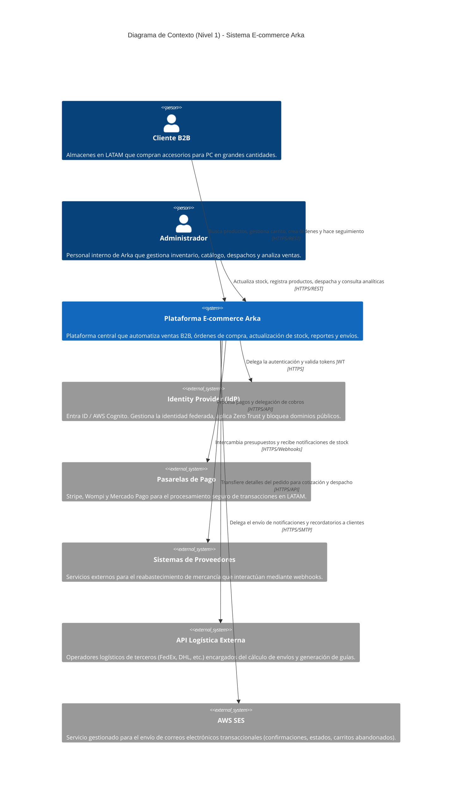

# Definición de Contexto de Negocio - Sistema E-commerce Arka

## Acuerdos de Integración y Sistemas Externos

Con el fin de establecer la fuente de verdad definitiva para el diseño, desarrollo y despliegue de la arquitectura de Arka, integrando los requerimientos B2B y la Revisión Arquitectónica Final, se han establecido las siguientes definiciones estratégicas:

1. **Sistema de Pagos y Capa Anticorrupción (ACL):** Se integran pasarelas de pago como **Stripe, Wompi y Mercado Pago**. El microservicio `ms-payment` actuará estrictamente como una **Capa Anti-Corrupción (ACL)** para aislar el núcleo del sistema de la latencia y posibles caídas de las pasarelas bancarias externas.
2. **Integración de Abastecimiento:** Se consumirá una **API de terceros** mediante el microservicio `ms-provider`, el cual funcionará como una barrera de seguridad (ACL) comunicándose con los supuestos proveedores externos para el reabastecimiento, mediante notificaciones (correo electrónico).
3. **Logística y Envíos (Shipping):** Se consumirá una **API de terceros** para el cálculo de envíos y despacho. A nivel arquitectónico, el `ms-shipping` actuará como **Capa Anti-Corrupción (ACL)** que se integra con operadores logísticos externos (DHL, FedEx) y con el monolito legacy de envíos, de forma análoga a como `ms-payment` aísla las pasarelas de pago.
4. **Gestión de Identidad, Autenticación y "Zero Trust":** La autenticación se delega de forma absoluta a proveedores de identidad administrados como **Microsoft Entra ID (Federated Identities)** o **AWS Cognito**. El **API Gateway** será el único componente expuesto a internet encargado de validar los tokens JWT y propagar la identidad (inyectando el header `X-User-Email`) hacia la red privada. Los microservicios internos serán 100% _stateless_. Adicionalmente, se aplicarán **Tenant Restrictions** en el IdP para bloquear correos de dominios públicos (ej. `@gmail.com`), garantizando que la plataforma mantenga su enfoque B2B.
5. **Interfaz de Usuario y Eliminación del Patrón BFF:** El patrón **Backend for Frontend (BFF)** queda oficialmente **descartado** de la arquitectura para este alcance. Las interfaces cliente (Aplicación Web y Móvil) consumirán los servicios interactuando directamente de forma unificada con el **API Gateway** mediante HTTPS/REST, simplificando la topología de red y reduciendo la duplicación de lógica.
6. **Reglas de Comunicación Interna (Síncrona vs Asíncrona):** El sistema híbrido se rige por reglas estrictas. Toda **comunicación síncrona** interna obligatoria en la red privada (ej. el carrito consultando el precio actual en el catálogo) utilizará **gRPC** para garantizar alto rendimiento. Por otro lado, el flujo core del negocio funcionará mediante comunicación asíncrona usando **Sagas Secuenciales** sobre **Apache Kafka** para evitar bloqueos y prevenir la sobreventa.
7. **Manejo de Reseñas y Recomendaciones:** **No se implementará** un microservicio dedicado e independiente para gestionar recomendaciones o reseñas de productos. Para optimizar la infraestructura y aprovechar la flexibilidad del modelo documental, las reseñas se almacenarán como **subdocumentos anidados** nativamente dentro de los documentos principales del producto en la base de datos MongoDB del `ms-catalog`.
8. **Analítica y Almacenamiento de Reportes Pesados:** La analítica pesada del negocio aplicará el patrón **CQRS** para proteger el core transaccional a través del microservicio `ms-reporter`. Los reportes semanales de ventas pueden generar archivos CSV o PDF de hasta 500MB, por lo que estos procesos se ejecutarán de manera asíncrona y se almacenarán como objetos inmutables en **AWS S3** para evitar problemas de agotamiento de memoria (_Out of Memory_).
9. **Estándar de Nombramiento de la Arquitectura:** Todos los repositorios, contenedores y proyectos del Scaffold de Clean Architecture deberán seguir rígidamente el estándar de nombramiento **kebab-case** utilizando el prefijo **`ms-`** para identificar el dominio (Ejemplos: `ms-catalog`, `ms-inventory`, `ms-order`, `ms-cart`, `ms-payment`, `ms-shipping`, `ms-provider`, `ms-notifications`, `ms-reporter`).

## Diagrama C1

## Diagrama C2

```mermaid
C4Container
title Diagrama de Contenedores (Nivel 2) - E-Commerce Arka (Arquitectura Final Refinada)

Person(cliente, "Cliente B2B", "Almacenes en LATAM que compran al por mayor.")
Person(admin, "Administrador", "Gestión de catálogo, inventario y análisis.")

System_Ext(idp, "Entra ID / Cognito", "Valida identidades y aplica Tenant Restrictions.")
System_Ext(pasarelas, "Pasarelas de Pago", "Stripe, Wompi, Mercado Pago (Integración externa).")
System_Ext(proveedores, "APIs de Proveedores", "Sistemas externos para reabastecimiento (Webhooks).")
System_Ext(shippingAPI, "API Logística Externa", "Sistemas legacy y proveedores (FedEx, DHL).")
System_Ext(ses, "AWS SES", "Servicio gestionado de correos transaccionales.")

System_Boundary(arka, "Plataforma E-commerce Arka (VPC Privada - Zero Trust)") {

    Container(apiGw, "API Gateway", "AWS API Gateway", "Punto único de entrada. Valida tokens JWT, bloquea dominios públicos y enruta a subredes privadas.")

    ContainerQueue(kafka, "Apache Kafka", "Message Broker", "Eje central de la Arquitectura Dirigida por Eventos. Soporta Sagas, Event Sourcing y Outbox Pattern.")

    Container(ms_catalog, "ms-catalog", "Java 21, WebFlux", "Dueño del producto. Almacena características dinámicas y reseñas anidadas.")
    ContainerDb(db_catalog, "Catalog DB & Cache", "MongoDB + Redis", "Reads masivos en submilisegundos (Cache-aside) y esquemas polimórficos.")

    Container(ms_inventory, "ms-inventory", "Java 21, WebFlux", "Maneja existencias físicas. Bloquea concurrencia mediante transacciones SQL ultra-cortas.")
    ContainerDb(db_inventory, "Inventory DB", "PostgreSQL 17", "Pessimistic Locking (SELECT FOR UPDATE) y Outbox Pattern.")

    Container(ms_cart, "ms-cart", "Java 21, WebFlux", "Sesiones temporales y motor de detección de abandono mediante CronJobs.")
    ContainerDb(db_cart, "Cart DB", "MongoDB", "Mutaciones atómicas en arrays de items ($push/$pull).")

    Container(ms_order, "ms-order", "Java 21, WebFlux", "Máquina de estados de pedidos. Orquestador central del Patrón Saga.")
    ContainerDb(db_order, "Order DB", "PostgreSQL 17", "Transaccional ACID. Outbox Pattern.")

    Container(ms_payment, "ms-payment", "Java 21, WebFlux", "Capa Anti-Corrupción (ACL) financiera. Llamadas bloqueantes a SDKs bancarios se aíslan con Schedulers.boundedElastic().")
    ContainerDb(db_payment, "Payment DB", "PostgreSQL 17", "Idempotencia rigurosa con Unique Constraints para evitar cobros dobles.")

    Container(ms_shipping, "ms-shipping", "Java 21, WebFlux", "ACL logística. Se integra con operadores de envío (DHL, FedEx) y monolito legacy. Llamadas bloqueantes con Schedulers.boundedElastic().")
    ContainerDb(db_shipping, "Shipping DB", "PostgreSQL 17", "Historial de guías y estados logísticos.")

    Container(ms_provider, "ms-provider", "Java 21, WebFlux", "Barrera ACL. Consume StockDepleted y genera automáticamente órdenes de compra a proveedores.")
    ContainerDb(db_provider, "Provider DB", "PostgreSQL 17", "Registro de órdenes de compra a proveedores.")

    Container(ms_notifications, "ms-notifications", "Java 21, WebFlux", "Motor pasivo de notificaciones. Mapea eventos a plantillas.")
    ContainerDb(db_notifications, "Notification DB", "MongoDB", "Almacena plantillas JSON e historial de correos enviados.")

    Container(ms_reporter, "ms-reporter", "Java 21, Spring MVC (Virtual Threads)", "Generación CPU-bound de analítica pesada. Patrón CQRS.")
    ContainerDb(db_reporter, "Reporter DB", "PostgreSQL 17", "Almacena payloads crudos (Event Sourcing) en formato JSONB e índices GIN.")
    ContainerDb(s3_reports, "Report Storage", "AWS S3", "Almacena de forma inmutable reportes exportados de hasta 500MB (PDF/CSV).")
}

%% --- Interacciones Borde (Edge) ---
Rel(cliente, apiGw, "Consulta y gestiona compras", "HTTPS/REST")
Rel(admin, apiGw, "Administra plataforma", "HTTPS/REST")
Rel(apiGw, idp, "Delega auth, valida sesión JWT y bloquea @gmail.com", "HTTPS")

%% --- Enrutamiento API GW ---
Rel(apiGw, ms_catalog, "Enruta tráfico", "REST interno")
Rel(apiGw, ms_cart, "Enruta tráfico", "REST interno")
Rel(apiGw, ms_order, "Enruta tráfico", "REST interno")
Rel(apiGw, ms_inventory, "Actualiza stock (Admin)", "REST interno")
Rel(apiGw, ms_reporter, "Consulta Data Lake", "REST interno")

%% --- COMUNICACIÓN SÍNCRONA INTERNA (gRPC) ---
Rel(ms_order, ms_inventory, "Bloquea y reserva stock inmediato (Fase 1 Saga)", "gRPC")
Rel(ms_cart, ms_catalog, "Obtiene precio actualizado antes del checkout", "gRPC")

%% --- COMUNICACIÓN ASÍNCRONA (EDA / Kafka) ---
Rel(ms_catalog, kafka, "Publica (ProductCreated, ProductUpdated)", "TCP")
Rel(ms_inventory, kafka, "Publica (StockReserved, StockReleased, StockDepleted)", "TCP")
Rel(ms_order, kafka, "Publica comandos/eventos (OrderCreated, OrderConfirmed)", "TCP")
Rel(ms_cart, kafka, "Publica (CartAbandoned)", "TCP")
Rel(ms_payment, kafka, "Consume Saga y Publica (PaymentProcessed, PaymentFailed)", "TCP")
Rel(ms_shipping, kafka, "Consume OrderStatusChanged y Publica (ShippingDispatched)", "TCP")
Rel(ms_provider, kafka, "Consume StockDepleted y Publica (PurchaseOrderCreated)", "TCP")
Rel(ms_notifications, kafka, "Consume eventos para notificar (Catch-All)", "TCP")
Rel(ms_reporter, kafka, "Consume TODOS los eventos (Sincroniza Read Model)", "TCP")

%% --- Persistencia ---
Rel(ms_catalog, db_catalog, "Lee/Escribe", "Driver Reactivo")
Rel(ms_inventory, db_inventory, "Lee/Escribe (Outbox)", "R2DBC")
Rel(ms_cart, db_cart, "Lee/Escribe", "Driver Reactivo")
Rel(ms_order, db_order, "Lee/Escribe (Outbox)", "R2DBC")
Rel(ms_payment, db_payment, "Lee/Escribe", "JDBC")
Rel(ms_shipping, db_shipping, "Lee/Escribe", "JDBC")
Rel(ms_provider, db_provider, "Lee/Escribe", "JDBC")
Rel(ms_notifications, db_notifications, "Lee/Escribe", "Driver Reactivo")
Rel(ms_reporter, db_reporter, "Escribe JSONB", "JDBC")
Rel(ms_reporter, s3_reports, "Sube documentos pesados", "AWS SDK")

%% --- Integraciones Externas ---
Rel(ms_payment, pasarelas, "Procesa transacción bancaria", "HTTPS")
Rel(ms_shipping, shippingAPI, "Cotiza envíos / ACL logística", "HTTPS")
Rel(ms_provider, proveedores, "Notifica órdenes de compra (vía email por ms-notifications)", "Email")
Rel(ms_notifications, ses, "Dispara email al cliente B2B", "HTTPS/API")

UpdateLayoutConfig($c4ShapeInRow="4", $c4BoundaryInRow="1")
```

