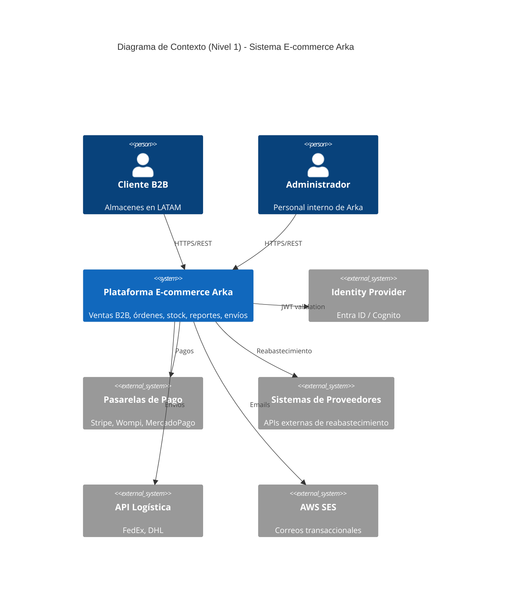

# Diagramas de Arquitectura

Esta carpeta contiene los diagramas del sistema Arka.

## Diagramas C4

Los diagramas C1 (Contexto) y C2 (Contenedores) están definidos como código Mermaid en los documentos fuente originales (`tarea-original/` y archivos legacy). Las imágenes renderizadas de estos diagramas se encuentran referenciadas en los documentos de arquitectura del proyecto.

## Diagrama C1 — Contexto

## Diagrama C2 — Contenedores

Ver [01-arquitectura.md](../01-arquitectura.md) para la descripción de todos los contenedores y sus relaciones.
